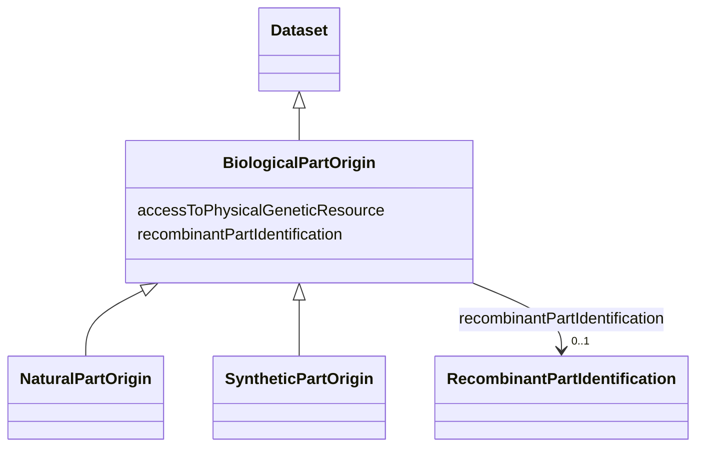

# Class: BiologicalPartOrigin


_Information on the origin of a unitary, cohesive part that is part of, or constitutes the biological material. It can be multiple parts in case of a recombinant biological material_


* __NOTE__: this is an abstract class and should not be instantiated directly


URI: [EVORA:BiologicalPartOrigin](https://evora-project.eu/BiologicalPartOrigin)





## Inheritance
* [Dataset](Dataset.md)
    * **BiologicalPartOrigin**
        * [NaturalPartOrigin](NaturalPartOrigin.md)
        * [SyntheticPartOrigin](SyntheticPartOrigin.md)


## Slots

| Name | Cardinality and Range | Description | Inheritance |
| ---  | --- | --- | --- |
| [recombinantPartIdentification](recombinantPartIdentification.md) | 0..1 <br/> [RecombinantPartIdentification](RecombinantPartIdentification.md) | Identification of a recombinant part | direct |
| [accessToPhysicalGeneticResource](accessToPhysicalGeneticResource.md) | 1 <br/> [Boolean](Boolean.md) | Reference of the permit identifiers for access to the genetic resource, appli... | direct |


## Usages

| used by | used in | type | used |
| ---  | --- | --- | --- |
| [BiologicalMaterialOrigin](BiologicalMaterialOrigin.md) | [biologicalPartOrigin](biologicalPartOrigin.md) | range | [BiologicalPartOrigin](BiologicalPartOrigin.md) |


## Aliases


* Biological part origin


## Identifier and Mapping Information


### Schema Source


* from schema: https://evora-project.eu/


## Mappings

| Mapping Type | Mapped Value |
| ---  | ---  |
| self | EVORA:BiologicalPartOrigin |
| native | EVORA:BiologicalPartOrigin |


## LinkML Source

<!-- TODO: investigate https://stackoverflow.com/questions/37606292/how-to-create-tabbed-code-blocks-in-mkdocs-or-sphinx -->

### Direct

<details>
```yaml
name: BiologicalPartOrigin
description: Information on the origin of a unitary, cohesive part that is part of,
  or constitutes the biological material. It can be multiple parts in case of a recombinant
  biological material
from_schema: https://evora-project.eu/
aliases:
- Biological part origin
is_a: Dataset
abstract: true
slots:
- recombinantPartIdentification
- accessToPhysicalGeneticResource
slot_usage:
  recombinantPartIdentification:
    name: recombinantPartIdentification
    description: Identification of a recombinant part
    comments:
    - Information not required if the current biological part constitutes the complete
      biological material
    aliases:
    - recombinant part identification
    range: RecombinantPartIdentification
    required: false
    multivalued: false
  accessToPhysicalGeneticResource:
    name: accessToPhysicalGeneticResource
    description: Reference of the permit identifiers for access to the genetic resource,
      applicable if the genetic resource falls under Access and Benefit-Sharing (ABS)
      regulations
    aliases:
    - access to physical genetic resource
    range: boolean
    required: true
    multivalued: false

```
</details>

### Induced

<details>
```yaml
name: BiologicalPartOrigin
description: Information on the origin of a unitary, cohesive part that is part of,
  or constitutes the biological material. It can be multiple parts in case of a recombinant
  biological material
from_schema: https://evora-project.eu/
aliases:
- Biological part origin
is_a: Dataset
abstract: true
slot_usage:
  recombinantPartIdentification:
    name: recombinantPartIdentification
    description: Identification of a recombinant part
    comments:
    - Information not required if the current biological part constitutes the complete
      biological material
    aliases:
    - recombinant part identification
    range: RecombinantPartIdentification
    required: false
    multivalued: false
  accessToPhysicalGeneticResource:
    name: accessToPhysicalGeneticResource
    description: Reference of the permit identifiers for access to the genetic resource,
      applicable if the genetic resource falls under Access and Benefit-Sharing (ABS)
      regulations
    aliases:
    - access to physical genetic resource
    range: boolean
    required: true
    multivalued: false
attributes:
  recombinantPartIdentification:
    name: recombinantPartIdentification
    description: Identification of a recombinant part
    comments:
    - Information not required if the current biological part constitutes the complete
      biological material
    from_schema: https://evora-project.eu/
    aliases:
    - recombinant part identification
    rank: 1000
    alias: recombinantPartIdentification
    owner: BiologicalPartOrigin
    domain_of:
    - BiologicalPartOrigin
    range: RecombinantPartIdentification
    required: false
    multivalued: false
  accessToPhysicalGeneticResource:
    name: accessToPhysicalGeneticResource
    description: Reference of the permit identifiers for access to the genetic resource,
      applicable if the genetic resource falls under Access and Benefit-Sharing (ABS)
      regulations
    from_schema: https://evora-project.eu/
    aliases:
    - access to physical genetic resource
    rank: 1000
    alias: accessToPhysicalGeneticResource
    owner: BiologicalPartOrigin
    domain_of:
    - BiologicalPartOrigin
    range: boolean
    required: true
    multivalued: false

```
</details>