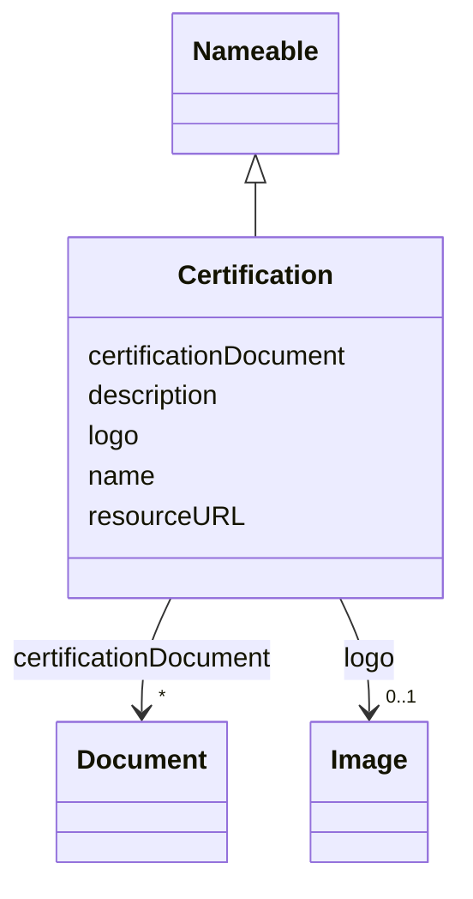

# Class: Certification


_Assurance given by an independent certification body that a product, service or system meets the requirements of a standard_


URI: [EVORA:Certification](https://evora-project.eu/Certification)





## Inheritance
* [Nameable](Nameable.md)
    * **Certification**


## Slots

| Name | Cardinality and Range | Description | Inheritance |
| ---  | --- | --- | --- |
| [logo](logo.md) | 0..1 <br/> [Image](Image.md) | A path or URL to the related logo | direct |
| [certificationDocument](certificationDocument.md) | * <br/> [Document](Document.md) | The document(s) issued by an authority certifying the conformity of the subje... | direct |
| [resourceURL](resourceURL.md) | 0..1 <br/> [Uri](Uri.md) | The web address or location where the details or content is stored and can be... | direct |
| [name](name.md) | 1 <br/> [String](String.md) | The label that allows humans to identify the current item | [Nameable](Nameable.md) |
| [description](description.md) | 0..1 <br/> [String](String.md) | A short explanation of the characteristics, features, or nature of the curren... | [Nameable](Nameable.md) |


## Usages

| used by | used in | type | used |
| ---  | --- | --- | --- |
| [ProductOrService](ProductOrService.md) | [certification](certification.md) | range | [Certification](Certification.md) |
| [Service](Service.md) | [certification](certification.md) | range | [Certification](Certification.md) |
| [Product](Product.md) | [certification](certification.md) | range | [Certification](Certification.md) |
| [Antibody](Antibody.md) | [certification](certification.md) | range | [Certification](Certification.md) |
| [Hybridoma](Hybridoma.md) | [certification](certification.md) | range | [Certification](Certification.md) |
| [Protein](Protein.md) | [certification](certification.md) | range | [Certification](Certification.md) |
| [NucleicAcid](NucleicAcid.md) | [certification](certification.md) | range | [Certification](Certification.md) |
| [DetectionKit](DetectionKit.md) | [certification](certification.md) | range | [Certification](Certification.md) |
| [Bundle](Bundle.md) | [certification](certification.md) | range | [Certification](Certification.md) |
| [Pathogen](Pathogen.md) | [certification](certification.md) | range | [Certification](Certification.md) |
| [Virus](Virus.md) | [certification](certification.md) | range | [Certification](Certification.md) |
| [Bacterium](Bacterium.md) | [certification](certification.md) | range | [Certification](Certification.md) |
| [Fungus](Fungus.md) | [certification](certification.md) | range | [Certification](Certification.md) |
| [Protozoan](Protozoan.md) | [certification](certification.md) | range | [Certification](Certification.md) |
| [Viroid](Viroid.md) | [certification](certification.md) | range | [Certification](Certification.md) |
| [Prion](Prion.md) | [certification](certification.md) | range | [Certification](Certification.md) |


## Aliases


* Certification


## Identifier and Mapping Information


### Schema Source


* from schema: https://evora-project.eu/


## Mappings

| Mapping Type | Mapped Value |
| ---  | ---  |
| self | EVORA:Certification |
| native | EVORA:Certification |
| close | wd:Q374814, schema:Certification |


## LinkML Source

<!-- TODO: investigate https://stackoverflow.com/questions/37606292/how-to-create-tabbed-code-blocks-in-mkdocs-or-sphinx -->

### Direct

<details>
```yaml
name: Certification
description: Assurance given by an independent certification body that a product,
  service or system meets the requirements of a standard
from_schema: https://evora-project.eu/
aliases:
- Certification
close_mappings:
- wd:Q374814
- schema:Certification
is_a: Nameable
slots:
- logo
- certificationDocument
- resourceURL
slot_usage:
  logo:
    name: logo
    description: A path or URL to the related logo
    aliases:
    - logo
    range: Image
    required: false
    multivalued: false
  certificationDocument:
    name: certificationDocument
    description: The document(s) issued by an authority certifying the conformity
      of the subject to the applicable scheme, including, as the case may be, the
      documents attesting the equivalence to another certification scheme.
    aliases:
    - certification document
    range: Document
    required: false
    multivalued: true
  resourceURL:
    name: resourceURL
    description: The web address or location where the details or content is stored
      and can be accessed or downloaded.
    aliases:
    - resource URL
    close_mappings:
    - schema:url
    range: uri
    required: false
    multivalued: false

```
</details>

### Induced

<details>
```yaml
name: Certification
description: Assurance given by an independent certification body that a product,
  service or system meets the requirements of a standard
from_schema: https://evora-project.eu/
aliases:
- Certification
close_mappings:
- wd:Q374814
- schema:Certification
is_a: Nameable
slot_usage:
  logo:
    name: logo
    description: A path or URL to the related logo
    aliases:
    - logo
    range: Image
    required: false
    multivalued: false
  certificationDocument:
    name: certificationDocument
    description: The document(s) issued by an authority certifying the conformity
      of the subject to the applicable scheme, including, as the case may be, the
      documents attesting the equivalence to another certification scheme.
    aliases:
    - certification document
    range: Document
    required: false
    multivalued: true
  resourceURL:
    name: resourceURL
    description: The web address or location where the details or content is stored
      and can be accessed or downloaded.
    aliases:
    - resource URL
    close_mappings:
    - schema:url
    range: uri
    required: false
    multivalued: false
attributes:
  logo:
    name: logo
    description: A path or URL to the related logo
    from_schema: https://evora-project.eu/
    aliases:
    - logo
    rank: 1000
    alias: logo
    owner: Certification
    domain_of:
    - PersonOrOrganization
    - License
    - Certification
    range: Image
    required: false
    multivalued: false
  certificationDocument:
    name: certificationDocument
    description: The document(s) issued by an authority certifying the conformity
      of the subject to the applicable scheme, including, as the case may be, the
      documents attesting the equivalence to another certification scheme.
    from_schema: https://evora-project.eu/
    aliases:
    - certification document
    rank: 1000
    alias: certificationDocument
    owner: Certification
    domain_of:
    - Certification
    range: Document
    required: false
    multivalued: true
  resourceURL:
    name: resourceURL
    description: The web address or location where the details or content is stored
      and can be accessed or downloaded.
    from_schema: https://evora-project.eu/
    aliases:
    - resource URL
    close_mappings:
    - schema:url
    rank: 1000
    alias: resourceURL
    owner: Certification
    domain_of:
    - License
    - Certification
    range: uri
    required: false
    multivalued: false
  name:
    name: name
    description: The label that allows humans to identify the current item
    comments:
    - 'The title of the item should be as short and descriptive as possible. E.g.
      for virus products it should basically be based on the following Pattern:

      "Virus name", "virus host type", "collection year", "country of collection"
      ex "suspected epidemiological origin", "genotype", "strain", "variant name or
      specific feature"'
    from_schema: https://evora-project.eu/
    aliases:
    - name
    exact_mappings:
    - dct:title
    close_mappings:
    - rdfs:label
    rank: 1000
    alias: name
    owner: Certification
    domain_of:
    - Nameable
    range: string
    required: true
    multivalued: false
  description:
    name: description
    description: A short explanation of the characteristics, features, or nature of
      the current item
    comments:
    - 'Describe this item in few lines. This description will serve as a summary to
      present the item.

      '
    from_schema: https://evora-project.eu/
    aliases:
    - description
    exact_mappings:
    - dct:description
    rank: 1000
    alias: description
    owner: Certification
    domain_of:
    - Nameable
    range: string
    required: false
    multivalued: false

```
</details>