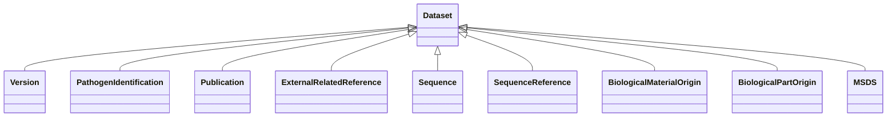

# Class: Dataset


_A collection of data, published or curated by a single agent, and available for access_


* __NOTE__: this is an abstract class and should not be instantiated directly


URI: [EVORA:Dataset](https://evora-project.eu/Dataset)





## Inheritance
* **Dataset**
    * [Version](Version.md)
    * [PathogenIdentification](PathogenIdentification.md)
    * [Publication](Publication.md)
    * [ExternalRelatedReference](ExternalRelatedReference.md)
    * [Sequence](Sequence.md)
    * [SequenceReference](SequenceReference.md)
    * [BiologicalMaterialOrigin](BiologicalMaterialOrigin.md)
    * [BiologicalPartOrigin](BiologicalPartOrigin.md)
    * [MSDS](MSDS.md)


## Slots

| Name | Cardinality and Range | Description | Inheritance |
| ---  | --- | --- | --- |


## Aliases


* Dataset


## Identifier and Mapping Information


### Schema Source


* from schema: https://evora-project.eu/


## Mappings

| Mapping Type | Mapped Value |
| ---  | ---  |
| self | EVORA:Dataset |
| native | EVORA:Dataset |
| exact | dcat:Dataset |
| close | wd:Q1172284, schema:DataCatalog |


## LinkML Source

<!-- TODO: investigate https://stackoverflow.com/questions/37606292/how-to-create-tabbed-code-blocks-in-mkdocs-or-sphinx -->

### Direct

<details>
```yaml
name: Dataset
description: A collection of data, published or curated by a single agent, and available
  for access
from_schema: https://evora-project.eu/
aliases:
- Dataset
exact_mappings:
- dcat:Dataset
close_mappings:
- wd:Q1172284
- schema:DataCatalog
abstract: true

```
</details>

### Induced

<details>
```yaml
name: Dataset
description: A collection of data, published or curated by a single agent, and available
  for access
from_schema: https://evora-project.eu/
aliases:
- Dataset
exact_mappings:
- dcat:Dataset
close_mappings:
- wd:Q1172284
- schema:DataCatalog
abstract: true

```
</details>