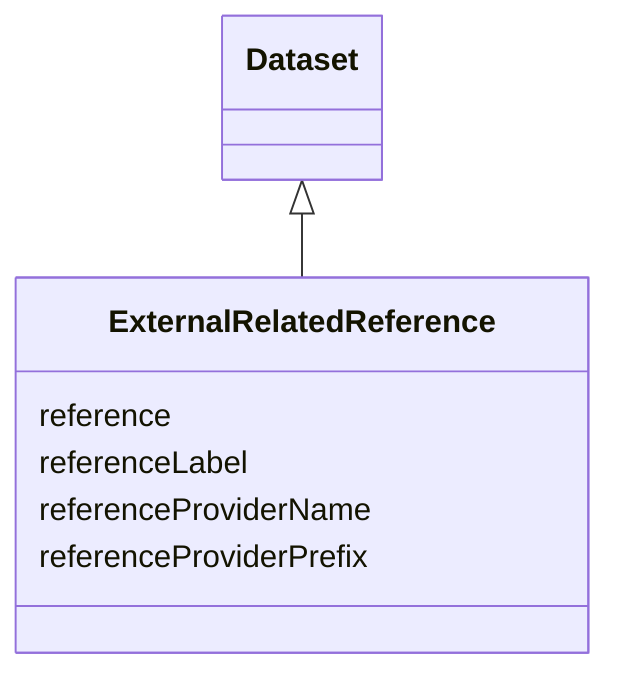

# Class: ExternalRelatedReference


_A reference that permits to retrieve an item from an external provider_


URI: [EVORA:ExternalRelatedReference](https://evora-project.eu/ExternalRelatedReference)





## Inheritance
* [Dataset](Dataset.md)
    * **ExternalRelatedReference**


## Slots

| Name | Cardinality and Range | Description | Inheritance |
| ---  | --- | --- | --- |
| [reference](reference.md) | 1 <br/> [String](String.md) | The identifier reference of the connected external item | direct |
| [referenceLabel](referenceLabel.md) | 1 <br/> [String](String.md) | The label informing what this reference is about | direct |
| [referenceProviderPrefix](referenceProviderPrefix.md) | 1 <br/> [String](String.md) | The url prefix that once completed with the reference will lead to the linked... | direct |
| [referenceProviderName](referenceProviderName.md) | 1 <br/> [String](String.md) | The name for the reference provider | direct |


## Usages

| used by | used in | type | used |
| ---  | --- | --- | --- |
| [ProductOrService](ProductOrService.md) | [externalRelatedReference](externalRelatedReference.md) | range | [ExternalRelatedReference](ExternalRelatedReference.md) |
| [Service](Service.md) | [externalRelatedReference](externalRelatedReference.md) | range | [ExternalRelatedReference](ExternalRelatedReference.md) |
| [Product](Product.md) | [externalRelatedReference](externalRelatedReference.md) | range | [ExternalRelatedReference](ExternalRelatedReference.md) |
| [Antibody](Antibody.md) | [externalRelatedReference](externalRelatedReference.md) | range | [ExternalRelatedReference](ExternalRelatedReference.md) |
| [Hybridoma](Hybridoma.md) | [externalRelatedReference](externalRelatedReference.md) | range | [ExternalRelatedReference](ExternalRelatedReference.md) |
| [Protein](Protein.md) | [externalRelatedReference](externalRelatedReference.md) | range | [ExternalRelatedReference](ExternalRelatedReference.md) |
| [NucleicAcid](NucleicAcid.md) | [externalRelatedReference](externalRelatedReference.md) | range | [ExternalRelatedReference](ExternalRelatedReference.md) |
| [DetectionKit](DetectionKit.md) | [externalRelatedReference](externalRelatedReference.md) | range | [ExternalRelatedReference](ExternalRelatedReference.md) |
| [Bundle](Bundle.md) | [externalRelatedReference](externalRelatedReference.md) | range | [ExternalRelatedReference](ExternalRelatedReference.md) |
| [Pathogen](Pathogen.md) | [externalRelatedReference](externalRelatedReference.md) | range | [ExternalRelatedReference](ExternalRelatedReference.md) |
| [Virus](Virus.md) | [externalRelatedReference](externalRelatedReference.md) | range | [ExternalRelatedReference](ExternalRelatedReference.md) |
| [Bacterium](Bacterium.md) | [externalRelatedReference](externalRelatedReference.md) | range | [ExternalRelatedReference](ExternalRelatedReference.md) |
| [Fungus](Fungus.md) | [externalRelatedReference](externalRelatedReference.md) | range | [ExternalRelatedReference](ExternalRelatedReference.md) |
| [Protozoan](Protozoan.md) | [externalRelatedReference](externalRelatedReference.md) | range | [ExternalRelatedReference](ExternalRelatedReference.md) |
| [Viroid](Viroid.md) | [externalRelatedReference](externalRelatedReference.md) | range | [ExternalRelatedReference](ExternalRelatedReference.md) |
| [Prion](Prion.md) | [externalRelatedReference](externalRelatedReference.md) | range | [ExternalRelatedReference](ExternalRelatedReference.md) |


## Aliases


* External related reference


## Identifier and Mapping Information


### Schema Source


* from schema: https://evora-project.eu/


## Mappings

| Mapping Type | Mapped Value |
| ---  | ---  |
| self | EVORA:ExternalRelatedReference |
| native | EVORA:ExternalRelatedReference |


## LinkML Source

<!-- TODO: investigate https://stackoverflow.com/questions/37606292/how-to-create-tabbed-code-blocks-in-mkdocs-or-sphinx -->

### Direct

<details>
```yaml
name: ExternalRelatedReference
description: A reference that permits to retrieve an item from an external provider
from_schema: https://evora-project.eu/
aliases:
- External related reference
is_a: Dataset
slots:
- reference
- referenceLabel
- referenceProviderPrefix
- referenceProviderName
slot_usage:
  reference:
    name: reference
    description: The identifier reference of the connected external item
    aliases:
    - reference
    close_mappings:
    - dct:identifier
    range: string
    required: true
    multivalued: false
  referenceLabel:
    name: referenceLabel
    description: The label informing what this reference is about
    comments:
    - e.g., 'Infravec2 related product'
    aliases:
    - reference label
    close_mappings:
    - dct:title
    range: string
    required: true
    multivalued: false
  referenceProviderPrefix:
    name: referenceProviderPrefix
    description: The url prefix that once completed with the reference will lead to
      the linked external resource
    aliases:
    - reference provider prefix
    close_mappings:
    - dcat:landingPage
    range: string
    required: true
    multivalued: false
  referenceProviderName:
    name: referenceProviderName
    description: The name for the reference provider
    aliases:
    - reference provider name
    close_mappings:
    - dct:publisher
    range: string
    required: true
    multivalued: false

```
</details>

### Induced

<details>
```yaml
name: ExternalRelatedReference
description: A reference that permits to retrieve an item from an external provider
from_schema: https://evora-project.eu/
aliases:
- External related reference
is_a: Dataset
slot_usage:
  reference:
    name: reference
    description: The identifier reference of the connected external item
    aliases:
    - reference
    close_mappings:
    - dct:identifier
    range: string
    required: true
    multivalued: false
  referenceLabel:
    name: referenceLabel
    description: The label informing what this reference is about
    comments:
    - e.g., 'Infravec2 related product'
    aliases:
    - reference label
    close_mappings:
    - dct:title
    range: string
    required: true
    multivalued: false
  referenceProviderPrefix:
    name: referenceProviderPrefix
    description: The url prefix that once completed with the reference will lead to
      the linked external resource
    aliases:
    - reference provider prefix
    close_mappings:
    - dcat:landingPage
    range: string
    required: true
    multivalued: false
  referenceProviderName:
    name: referenceProviderName
    description: The name for the reference provider
    aliases:
    - reference provider name
    close_mappings:
    - dct:publisher
    range: string
    required: true
    multivalued: false
attributes:
  reference:
    name: reference
    description: The identifier reference of the connected external item
    from_schema: https://evora-project.eu/
    aliases:
    - reference
    close_mappings:
    - dct:identifier
    rank: 1000
    alias: reference
    owner: ExternalRelatedReference
    domain_of:
    - ExternalRelatedReference
    range: string
    required: true
    multivalued: false
  referenceLabel:
    name: referenceLabel
    description: The label informing what this reference is about
    comments:
    - e.g., 'Infravec2 related product'
    from_schema: https://evora-project.eu/
    aliases:
    - reference label
    close_mappings:
    - dct:title
    rank: 1000
    alias: referenceLabel
    owner: ExternalRelatedReference
    domain_of:
    - ExternalRelatedReference
    range: string
    required: true
    multivalued: false
  referenceProviderPrefix:
    name: referenceProviderPrefix
    description: The url prefix that once completed with the reference will lead to
      the linked external resource
    from_schema: https://evora-project.eu/
    aliases:
    - reference provider prefix
    close_mappings:
    - dcat:landingPage
    rank: 1000
    alias: referenceProviderPrefix
    owner: ExternalRelatedReference
    domain_of:
    - ExternalRelatedReference
    range: string
    required: true
    multivalued: false
  referenceProviderName:
    name: referenceProviderName
    description: The name for the reference provider
    from_schema: https://evora-project.eu/
    aliases:
    - reference provider name
    close_mappings:
    - dct:publisher
    rank: 1000
    alias: referenceProviderName
    owner: ExternalRelatedReference
    domain_of:
    - ExternalRelatedReference
    range: string
    required: true
    multivalued: false

```
</details>