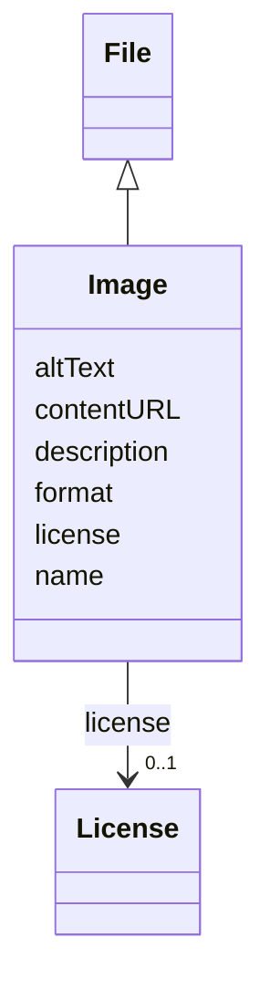

# Class: Image


_Subclass of File representing visual content such as pictures, diagrams, or illustrations_


URI: [EVORA:Image](https://evora-project.eu/Image)





## Inheritance
* [Nameable](Nameable.md)
    * [File](File.md)
        * **Image**


## Slots

| Name | Cardinality and Range | Description | Inheritance |
| ---  | --- | --- | --- |
| [altText](altText.md) | 0..1 <br/> [String](String.md) | An alternate text for the image, if the image cannot be displayed | direct |
| [contentURL](contentURL.md) | 1 <br/> [Uri](Uri.md) | The web address or location where the file content is stored and can be acces... | [File](File.md) |
| [format](format.md) | 1 <br/> [String](String.md) | The file type or format that indicates how the data within the file is struct... | [File](File.md) |
| [license](license.md) | 0..1 <br/> [License](License.md) | The legal terms and conditions under which the file can be used, shared, or d... | [File](File.md) |
| [name](name.md) | 1 <br/> [String](String.md) | The label that allows humans to identify the current item | [Nameable](Nameable.md) |
| [description](description.md) | 0..1 <br/> [String](String.md) | A short explanation of the characteristics, features, or nature of the curren... | [Nameable](Nameable.md) |


## Usages

| used by | used in | type | used |
| ---  | --- | --- | --- |
| [PersonOrOrganization](PersonOrOrganization.md) | [logo](logo.md) | range | [Image](Image.md) |
| [Person](Person.md) | [logo](logo.md) | range | [Image](Image.md) |
| [Organization](Organization.md) | [logo](logo.md) | range | [Image](Image.md) |
| [RI](RI.md) | [logo](logo.md) | range | [Image](Image.md) |
| [Provider](Provider.md) | [logo](logo.md) | range | [Image](Image.md) |
| [Originator](Originator.md) | [logo](logo.md) | range | [Image](Image.md) |
| [ProductOrService](ProductOrService.md) | [productPicture](productPicture.md) | range | [Image](Image.md) |
| [Service](Service.md) | [productPicture](productPicture.md) | range | [Image](Image.md) |
| [Product](Product.md) | [productPicture](productPicture.md) | range | [Image](Image.md) |
| [Antibody](Antibody.md) | [productPicture](productPicture.md) | range | [Image](Image.md) |
| [Hybridoma](Hybridoma.md) | [productPicture](productPicture.md) | range | [Image](Image.md) |
| [Protein](Protein.md) | [productPicture](productPicture.md) | range | [Image](Image.md) |
| [NucleicAcid](NucleicAcid.md) | [productPicture](productPicture.md) | range | [Image](Image.md) |
| [DetectionKit](DetectionKit.md) | [productPicture](productPicture.md) | range | [Image](Image.md) |
| [Bundle](Bundle.md) | [productPicture](productPicture.md) | range | [Image](Image.md) |
| [Pathogen](Pathogen.md) | [productPicture](productPicture.md) | range | [Image](Image.md) |
| [Virus](Virus.md) | [productPicture](productPicture.md) | range | [Image](Image.md) |
| [Bacterium](Bacterium.md) | [productPicture](productPicture.md) | range | [Image](Image.md) |
| [Fungus](Fungus.md) | [productPicture](productPicture.md) | range | [Image](Image.md) |
| [Protozoan](Protozoan.md) | [productPicture](productPicture.md) | range | [Image](Image.md) |
| [Viroid](Viroid.md) | [productPicture](productPicture.md) | range | [Image](Image.md) |
| [Prion](Prion.md) | [productPicture](productPicture.md) | range | [Image](Image.md) |
| [License](License.md) | [logo](logo.md) | range | [Image](Image.md) |
| [Certification](Certification.md) | [logo](logo.md) | range | [Image](Image.md) |


## Aliases


* Image


## Identifier and Mapping Information


### Schema Source


* from schema: https://evora-project.eu/


## Mappings

| Mapping Type | Mapped Value |
| ---  | ---  |
| self | EVORA:Image |
| native | EVORA:Image |
| close | wd:Q860625 |


## LinkML Source

<!-- TODO: investigate https://stackoverflow.com/questions/37606292/how-to-create-tabbed-code-blocks-in-mkdocs-or-sphinx -->

### Direct

<details>
```yaml
name: Image
description: Subclass of File representing visual content such as pictures, diagrams,
  or illustrations
from_schema: https://evora-project.eu/
aliases:
- Image
close_mappings:
- wd:Q860625
is_a: File
slots:
- altText
slot_usage:
  altText:
    name: altText
    description: An alternate text for the image, if the image cannot be displayed
    aliases:
    - alt text
    range: string
    required: false
    multivalued: false

```
</details>

### Induced

<details>
```yaml
name: Image
description: Subclass of File representing visual content such as pictures, diagrams,
  or illustrations
from_schema: https://evora-project.eu/
aliases:
- Image
close_mappings:
- wd:Q860625
is_a: File
slot_usage:
  altText:
    name: altText
    description: An alternate text for the image, if the image cannot be displayed
    aliases:
    - alt text
    range: string
    required: false
    multivalued: false
attributes:
  altText:
    name: altText
    description: An alternate text for the image, if the image cannot be displayed
    from_schema: https://evora-project.eu/
    aliases:
    - alt text
    rank: 1000
    alias: altText
    owner: Image
    domain_of:
    - Image
    range: string
    required: false
    multivalued: false
  contentURL:
    name: contentURL
    description: The web address or location where the file content is stored and
      can be accessed or downloaded.
    from_schema: https://evora-project.eu/
    aliases:
    - content URL
    rank: 1000
    alias: contentURL
    owner: Image
    domain_of:
    - File
    range: uri
    required: true
    multivalued: false
  format:
    name: format
    description: The file type or format that indicates how the data within the file
      is structured
    from_schema: https://evora-project.eu/
    aliases:
    - format
    rank: 1000
    alias: format
    owner: Image
    domain_of:
    - File
    range: string
    required: true
    multivalued: false
  license:
    name: license
    description: The legal terms and conditions under which the file can be used,
      shared, or distributed, indicating any restrictions or permissions.
    from_schema: https://evora-project.eu/
    aliases:
    - license
    rank: 1000
    alias: license
    owner: Image
    domain_of:
    - DataProvider
    - File
    range: License
    required: false
    multivalued: false
  name:
    name: name
    description: The label that allows humans to identify the current item
    comments:
    - 'The title of the item should be as short and descriptive as possible. E.g.
      for virus products it should basically be based on the following Pattern:

      "Virus name", "virus host type", "collection year", "country of collection"
      ex "suspected epidemiological origin", "genotype", "strain", "variant name or
      specific feature"'
    from_schema: https://evora-project.eu/
    aliases:
    - name
    exact_mappings:
    - dct:title
    close_mappings:
    - rdfs:label
    rank: 1000
    alias: name
    owner: Image
    domain_of:
    - Nameable
    range: string
    required: true
    multivalued: false
  description:
    name: description
    description: A short explanation of the characteristics, features, or nature of
      the current item
    comments:
    - 'Describe this item in few lines. This description will serve as a summary to
      present the item.

      '
    from_schema: https://evora-project.eu/
    aliases:
    - description
    exact_mappings:
    - dct:description
    rank: 1000
    alias: description
    owner: Image
    domain_of:
    - Nameable
    range: string
    required: false
    multivalued: false

```
</details>