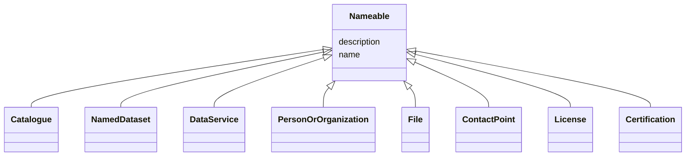

# Class: Nameable


_Any entity that has a name and can have a textual description_


* __NOTE__: this is an abstract class and should not be instantiated directly


URI: [EVORA:Nameable](https://evora-project.eu/Nameable)





## Inheritance
* **Nameable**
    * [Catalogue](Catalogue.md)
    * [NamedDataset](NamedDataset.md)
    * [DataService](DataService.md)
    * [PersonOrOrganization](PersonOrOrganization.md)
    * [File](File.md)
    * [ContactPoint](ContactPoint.md)
    * [License](License.md)
    * [Certification](Certification.md)


## Slots

| Name | Cardinality and Range | Description | Inheritance |
| ---  | --- | --- | --- |
| [name](name.md) | 1 <br/> [String](String.md) | The label that allows humans to identify the current item | direct |
| [description](description.md) | 0..1 <br/> [String](String.md) | A short explanation of the characteristics, features, or nature of the curren... | direct |


## Aliases


* Nameable


## Identifier and Mapping Information


### Schema Source


* from schema: https://evora-project.eu/


## Mappings

| Mapping Type | Mapped Value |
| ---  | ---  |
| self | EVORA:Nameable |
| native | EVORA:Nameable |


## LinkML Source

<!-- TODO: investigate https://stackoverflow.com/questions/37606292/how-to-create-tabbed-code-blocks-in-mkdocs-or-sphinx -->

### Direct

<details>
```yaml
name: Nameable
description: Any entity that has a name and can have a textual description
from_schema: https://evora-project.eu/
aliases:
- Nameable
abstract: true
slots:
- name
- description
slot_usage:
  name:
    name: name
    description: The label that allows humans to identify the current item
    comments:
    - 'The title of the item should be as short and descriptive as possible. E.g.
      for virus products it should basically be based on the following Pattern:

      "Virus name", "virus host type", "collection year", "country of collection"
      ex "suspected epidemiological origin", "genotype", "strain", "variant name or
      specific feature"'
    aliases:
    - name
    exact_mappings:
    - dct:title
    close_mappings:
    - rdfs:label
    range: string
    required: true
    multivalued: false
  description:
    name: description
    description: A short explanation of the characteristics, features, or nature of
      the current item
    comments:
    - 'Describe this item in few lines. This description will serve as a summary to
      present the item.

      '
    aliases:
    - description
    exact_mappings:
    - dct:description
    range: string
    required: false
    multivalued: false

```
</details>

### Induced

<details>
```yaml
name: Nameable
description: Any entity that has a name and can have a textual description
from_schema: https://evora-project.eu/
aliases:
- Nameable
abstract: true
slot_usage:
  name:
    name: name
    description: The label that allows humans to identify the current item
    comments:
    - 'The title of the item should be as short and descriptive as possible. E.g.
      for virus products it should basically be based on the following Pattern:

      "Virus name", "virus host type", "collection year", "country of collection"
      ex "suspected epidemiological origin", "genotype", "strain", "variant name or
      specific feature"'
    aliases:
    - name
    exact_mappings:
    - dct:title
    close_mappings:
    - rdfs:label
    range: string
    required: true
    multivalued: false
  description:
    name: description
    description: A short explanation of the characteristics, features, or nature of
      the current item
    comments:
    - 'Describe this item in few lines. This description will serve as a summary to
      present the item.

      '
    aliases:
    - description
    exact_mappings:
    - dct:description
    range: string
    required: false
    multivalued: false
attributes:
  name:
    name: name
    description: The label that allows humans to identify the current item
    comments:
    - 'The title of the item should be as short and descriptive as possible. E.g.
      for virus products it should basically be based on the following Pattern:

      "Virus name", "virus host type", "collection year", "country of collection"
      ex "suspected epidemiological origin", "genotype", "strain", "variant name or
      specific feature"'
    from_schema: https://evora-project.eu/
    aliases:
    - name
    exact_mappings:
    - dct:title
    close_mappings:
    - rdfs:label
    rank: 1000
    alias: name
    owner: Nameable
    domain_of:
    - Nameable
    range: string
    required: true
    multivalued: false
  description:
    name: description
    description: A short explanation of the characteristics, features, or nature of
      the current item
    comments:
    - 'Describe this item in few lines. This description will serve as a summary to
      present the item.

      '
    from_schema: https://evora-project.eu/
    aliases:
    - description
    exact_mappings:
    - dct:description
    rank: 1000
    alias: description
    owner: Nameable
    domain_of:
    - Nameable
    range: string
    required: false
    multivalued: false

```
</details>