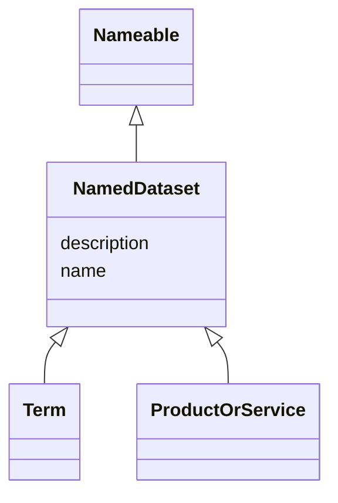

# Class: NamedDataset


_A collection of data, that has a name and can have a description, published or curated by a single agent, and available for access_


* __NOTE__: this is an abstract class and should not be instantiated directly


URI: [EVORA:NamedDataset](https://evora-project.eu/NamedDataset)





## Inheritance
* [Nameable](Nameable.md)
    * **NamedDataset**
        * [Term](Term.md)
        * [ProductOrService](ProductOrService.md)


## Slots

| Name | Cardinality and Range | Description | Inheritance |
| ---  | --- | --- | --- |
| [name](name.md) | 1 <br/> [String](String.md) | The label that allows humans to identify the current item | [Nameable](Nameable.md) |
| [description](description.md) | 0..1 <br/> [String](String.md) | A short explanation of the characteristics, features, or nature of the curren... | [Nameable](Nameable.md) |


## Aliases


* Named Dataset


## Identifier and Mapping Information


### Schema Source


* from schema: https://evora-project.eu/


## Mappings

| Mapping Type | Mapped Value |
| ---  | ---  |
| self | EVORA:NamedDataset |
| native | EVORA:NamedDataset |
| exact | dcat:Dataset |
| close | wd:Q1172284, schema:DataCatalog |


## LinkML Source

<!-- TODO: investigate https://stackoverflow.com/questions/37606292/how-to-create-tabbed-code-blocks-in-mkdocs-or-sphinx -->

### Direct

<details>
```yaml
name: NamedDataset
description: A collection of data, that has a name and can have a description, published
  or curated by a single agent, and available for access
from_schema: https://evora-project.eu/
aliases:
- Named Dataset
exact_mappings:
- dcat:Dataset
close_mappings:
- wd:Q1172284
- schema:DataCatalog
is_a: Nameable
abstract: true

```
</details>

### Induced

<details>
```yaml
name: NamedDataset
description: A collection of data, that has a name and can have a description, published
  or curated by a single agent, and available for access
from_schema: https://evora-project.eu/
aliases:
- Named Dataset
exact_mappings:
- dcat:Dataset
close_mappings:
- wd:Q1172284
- schema:DataCatalog
is_a: Nameable
abstract: true
attributes:
  name:
    name: name
    description: The label that allows humans to identify the current item
    comments:
    - 'The title of the item should be as short and descriptive as possible. E.g.
      for virus products it should basically be based on the following Pattern:

      "Virus name", "virus host type", "collection year", "country of collection"
      ex "suspected epidemiological origin", "genotype", "strain", "variant name or
      specific feature"'
    from_schema: https://evora-project.eu/
    aliases:
    - name
    exact_mappings:
    - dct:title
    close_mappings:
    - rdfs:label
    rank: 1000
    alias: name
    owner: NamedDataset
    domain_of:
    - Nameable
    range: string
    required: true
    multivalued: false
  description:
    name: description
    description: A short explanation of the characteristics, features, or nature of
      the current item
    comments:
    - 'Describe this item in few lines. This description will serve as a summary to
      present the item.

      '
    from_schema: https://evora-project.eu/
    aliases:
    - description
    exact_mappings:
    - dct:description
    rank: 1000
    alias: description
    owner: NamedDataset
    domain_of:
    - Nameable
    range: string
    required: false
    multivalued: false

```
</details>