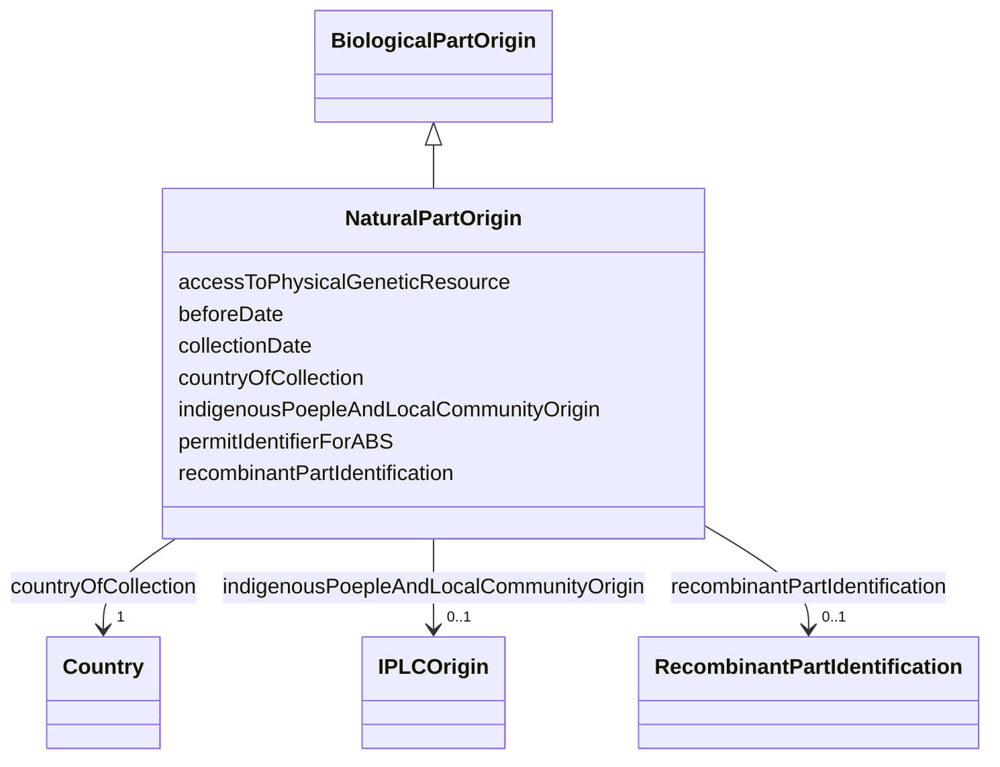

# Class: NaturalPartOrigin


_Information on the origin of a natural part that composes the biological material_


URI: [EVORA:NaturalPartOrigin](https://evora-project.eu/NaturalPartOrigin)





## Inheritance
* [Dataset](Dataset.md)
    * [BiologicalPartOrigin](BiologicalPartOrigin.md)
        * **NaturalPartOrigin**


## Slots

| Name | Cardinality and Range | Description | Inheritance |
| ---  | --- | --- | --- |
| [countryOfCollection](countryOfCollection.md) | 1 <br/> [Country](Country.md) | The geographical location where the sample was collected in situ | direct |
| [indigenousPoepleAndLocalCommunityOrigin](indigenousPoepleAndLocalCommunityOrigin.md) | 0..1 <br/> [IPLCOrigin](IPLCOrigin.md) | The specific IPLC area (Indigenous People and Local Communities) from which t... | direct |
| [collectionDate](collectionDate.md) | 1 <br/> [Datetime](Datetime.md) | The date when the sample was collected in situ | direct |
| [beforeDate](beforeDate.md) | 1 <br/> [Boolean](Boolean.md) | Set to TRUE if a proxy date for the collection date is used | direct |
| [permitIdentifierForABS](permitIdentifierForABS.md) | 0..1 <br/> [String](String.md) | Reference of the permit identifiers for access to the genetic resource, appli... | direct |
| [recombinantPartIdentification](recombinantPartIdentification.md) | 0..1 <br/> [RecombinantPartIdentification](RecombinantPartIdentification.md) | Identification of a recombinant part | [BiologicalPartOrigin](BiologicalPartOrigin.md) |
| [accessToPhysicalGeneticResource](accessToPhysicalGeneticResource.md) | 1 <br/> [Boolean](Boolean.md) | Reference of the permit identifiers for access to the genetic resource, appli... | [BiologicalPartOrigin](BiologicalPartOrigin.md) |


## Aliases


* Natural part origin


## Identifier and Mapping Information


### Schema Source


* from schema: https://evora-project.eu/


## Mappings

| Mapping Type | Mapped Value |
| ---  | ---  |
| self | EVORA:NaturalPartOrigin |
| native | EVORA:NaturalPartOrigin |


## LinkML Source

<!-- TODO: investigate https://stackoverflow.com/questions/37606292/how-to-create-tabbed-code-blocks-in-mkdocs-or-sphinx -->

### Direct

<details>
```yaml
name: NaturalPartOrigin
description: Information on the origin of a natural part that composes the biological
  material
from_schema: https://evora-project.eu/
aliases:
- Natural part origin
is_a: BiologicalPartOrigin
slots:
- countryOfCollection
- indigenousPoepleAndLocalCommunityOrigin
- collectionDate
- beforeDate
- permitIdentifierForABS
slot_usage:
  countryOfCollection:
    name: countryOfCollection
    description: The geographical location where the sample was collected in situ.
      Used for Nagoya/CBD; equivalent to "country of origin".
    aliases:
    - country of collection
    close_mappings:
    - dct:spatial
    - dwc:country
    range: Country
    required: true
    multivalued: false
  indigenousPoepleAndLocalCommunityOrigin:
    name: indigenousPoepleAndLocalCommunityOrigin
    description: The specific IPLC area (Indigenous People and Local Communities)
      from which this sample/element was sampled, if relevant
    aliases:
    - indigenous people and local community origin
    range: IPLCOrigin
    required: false
    multivalued: false
  collectionDate:
    name: collectionDate
    description: The date when the sample was collected in situ. If unknown/private,
      use a proxy date such as "date received" and indicate this by setting to true
      the before date property
    aliases:
    - collection date
    range: datetime
    required: true
    multivalued: false
  beforeDate:
    name: beforeDate
    description: Set to TRUE if a proxy date for the collection date is used
    aliases:
    - before date
    ifabsent: 'false'
    range: boolean
    required: true
    multivalued: false
  permitIdentifierForABS:
    name: permitIdentifierForABS
    description: Reference of the permit identifiers for access to the genetic resource,
      applicable if the genetic resource falls under Access and Benefit-Sharing (ABS)
      regulations
    aliases:
    - permit identifier for ABS
    required: false
    multivalued: false

```
</details>

### Induced

<details>
```yaml
name: NaturalPartOrigin
description: Information on the origin of a natural part that composes the biological
  material
from_schema: https://evora-project.eu/
aliases:
- Natural part origin
is_a: BiologicalPartOrigin
slot_usage:
  countryOfCollection:
    name: countryOfCollection
    description: The geographical location where the sample was collected in situ.
      Used for Nagoya/CBD; equivalent to "country of origin".
    aliases:
    - country of collection
    close_mappings:
    - dct:spatial
    - dwc:country
    range: Country
    required: true
    multivalued: false
  indigenousPoepleAndLocalCommunityOrigin:
    name: indigenousPoepleAndLocalCommunityOrigin
    description: The specific IPLC area (Indigenous People and Local Communities)
      from which this sample/element was sampled, if relevant
    aliases:
    - indigenous people and local community origin
    range: IPLCOrigin
    required: false
    multivalued: false
  collectionDate:
    name: collectionDate
    description: The date when the sample was collected in situ. If unknown/private,
      use a proxy date such as "date received" and indicate this by setting to true
      the before date property
    aliases:
    - collection date
    range: datetime
    required: true
    multivalued: false
  beforeDate:
    name: beforeDate
    description: Set to TRUE if a proxy date for the collection date is used
    aliases:
    - before date
    ifabsent: 'false'
    range: boolean
    required: true
    multivalued: false
  permitIdentifierForABS:
    name: permitIdentifierForABS
    description: Reference of the permit identifiers for access to the genetic resource,
      applicable if the genetic resource falls under Access and Benefit-Sharing (ABS)
      regulations
    aliases:
    - permit identifier for ABS
    required: false
    multivalued: false
attributes:
  countryOfCollection:
    name: countryOfCollection
    description: The geographical location where the sample was collected in situ.
      Used for Nagoya/CBD; equivalent to "country of origin".
    from_schema: https://evora-project.eu/
    aliases:
    - country of collection
    close_mappings:
    - dct:spatial
    - dwc:country
    rank: 1000
    alias: countryOfCollection
    owner: NaturalPartOrigin
    domain_of:
    - NaturalPartOrigin
    range: Country
    required: true
    multivalued: false
  indigenousPoepleAndLocalCommunityOrigin:
    name: indigenousPoepleAndLocalCommunityOrigin
    description: The specific IPLC area (Indigenous People and Local Communities)
      from which this sample/element was sampled, if relevant
    from_schema: https://evora-project.eu/
    aliases:
    - indigenous people and local community origin
    rank: 1000
    alias: indigenousPoepleAndLocalCommunityOrigin
    owner: NaturalPartOrigin
    domain_of:
    - NaturalPartOrigin
    range: IPLCOrigin
    required: false
    multivalued: false
  collectionDate:
    name: collectionDate
    description: The date when the sample was collected in situ. If unknown/private,
      use a proxy date such as "date received" and indicate this by setting to true
      the before date property
    from_schema: https://evora-project.eu/
    aliases:
    - collection date
    rank: 1000
    alias: collectionDate
    owner: NaturalPartOrigin
    domain_of:
    - NaturalPartOrigin
    range: datetime
    required: true
    multivalued: false
  beforeDate:
    name: beforeDate
    description: Set to TRUE if a proxy date for the collection date is used
    from_schema: https://evora-project.eu/
    aliases:
    - before date
    rank: 1000
    ifabsent: 'false'
    alias: beforeDate
    owner: NaturalPartOrigin
    domain_of:
    - NaturalPartOrigin
    range: boolean
    required: true
    multivalued: false
  permitIdentifierForABS:
    name: permitIdentifierForABS
    description: Reference of the permit identifiers for access to the genetic resource,
      applicable if the genetic resource falls under Access and Benefit-Sharing (ABS)
      regulations
    from_schema: https://evora-project.eu/
    aliases:
    - permit identifier for ABS
    rank: 1000
    alias: permitIdentifierForABS
    owner: NaturalPartOrigin
    domain_of:
    - NaturalPartOrigin
    range: string
    required: false
    multivalued: false
  recombinantPartIdentification:
    name: recombinantPartIdentification
    description: Identification of a recombinant part
    comments:
    - Information not required if the current biological part constitutes the complete
      biological material
    from_schema: https://evora-project.eu/
    aliases:
    - recombinant part identification
    rank: 1000
    alias: recombinantPartIdentification
    owner: NaturalPartOrigin
    domain_of:
    - BiologicalPartOrigin
    range: RecombinantPartIdentification
    required: false
    multivalued: false
  accessToPhysicalGeneticResource:
    name: accessToPhysicalGeneticResource
    description: Reference of the permit identifiers for access to the genetic resource,
      applicable if the genetic resource falls under Access and Benefit-Sharing (ABS)
      regulations
    from_schema: https://evora-project.eu/
    aliases:
    - access to physical genetic resource
    rank: 1000
    alias: accessToPhysicalGeneticResource
    owner: NaturalPartOrigin
    domain_of:
    - BiologicalPartOrigin
    range: boolean
    required: true
    multivalued: false

```
</details>