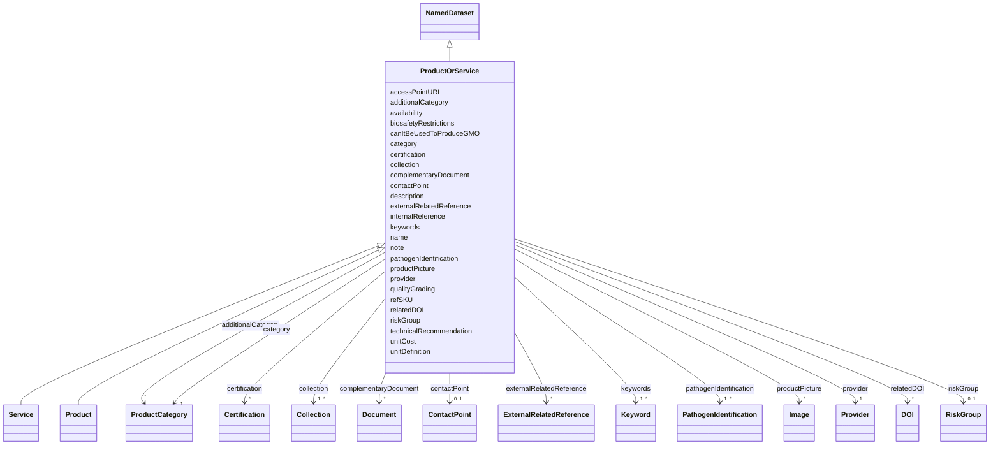

# Class: ProductOrService


_A product or a service_


* __NOTE__: this is an abstract class and should not be instantiated directly


URI: [EVORA:ProductOrService](https://evora-project.eu/ProductOrService)





## Inheritance
* [Nameable](Nameable.md)
    * [NamedDataset](NamedDataset.md)
        * **ProductOrService**
            * [Service](Service.md)
            * [Product](Product.md)


## Slots

| Name | Cardinality and Range | Description | Inheritance |
| ---  | --- | --- | --- |
| [accessPointURL](accessPointURL.md) | 1 <br/> [Uri](Uri.md) | The URL that permits to access to the product/service detailed description pa... | direct |
| [refSKU](refSKU.md) | 1 <br/> [String](String.md) | The reference or the stock keeping unit of the service or item provided in th... | direct |
| [unitDefinition](unitDefinition.md) | 0..1 <br/> [String](String.md) | A short description of what will be delivered by ordering one unit of this it... | direct |
| [category](category.md) | 1 <br/> [ProductCategory](ProductCategory.md) | The main category of the service or product | direct |
| [additionalCategory](additionalCategory.md) | * <br/> [ProductCategory](ProductCategory.md) | Any category apart from its main category in which this product or service ca... | direct |
| [unitCost](unitCost.md) | 1 <br/> [String](String.md) | The cost per access for one unit as defined by the unit definition | direct |
| [qualityGrading](qualityGrading.md) | 0..1 <br/> [String](String.md) | Information that permits to assess the quality level of what will be provided | direct |
| [pathogenIdentification](pathogenIdentification.md) | 1..* <br/> [PathogenIdentification](PathogenIdentification.md) | The identification of the pathogen or group of pathogens (e | direct |
| [relatedDOI](relatedDOI.md) | * <br/> [DOI](DOI.md) | Any DOI that can be related | direct |
| [riskGroup](riskGroup.md) | 0..1 <br/> [RiskGroup](RiskGroup.md) | The highest risk group related to this resource | direct |
| [biosafetyRestrictions](biosafetyRestrictions.md) | 0..1 <br/> [String](String.md) | Information about guidelines and regulations designed to prevent the exposure... | direct |
| [canItBeUsedToProduceGMO](canItBeUsedToProduceGMO.md) | 0..1 <br/> [Boolean](Boolean.md) | Indicates if the current service or product can be used to produce GMO | direct |
| [provider](provider.md) | 1 <br/> [Provider](Provider.md) | A provider of this product or service, as a specific organization | direct |
| [collection](collection.md) | 1..* <br/> [Collection](Collection.md) | The collection(s) to which belongs this item | direct |
| [keywords](keywords.md) | 1..* <br/> [Keyword](Keyword.md) | List of terms used to tag and categorize this Item | direct |
| [availability](availability.md) | 1 <br/> [String](String.md) | The state or condition in which this item is accessible and ready for use or ... | direct |
| [complementaryDocument](complementaryDocument.md) | * <br/> [Document](Document.md) | Any complementary document that can be related to this Item | direct |
| [technicalRecommendation](technicalRecommendation.md) | 0..1 <br/> [String](String.md) | Expert advice or guidelines provided to ensure the optimal use, performance, ... | direct |
| [productPicture](productPicture.md) | * <br/> [Image](Image.md) | A picture that can represent the item | direct |
| [externalRelatedReference](externalRelatedReference.md) | * <br/> [ExternalRelatedReference](ExternalRelatedReference.md) | A reference that permits to retrieve another related item from an external pr... | direct |
| [certification](certification.md) | * <br/> [Certification](Certification.md) | Any certification related to the current product or service; e | direct |
| [internalReference](internalReference.md) | 0..1 <br/> [String](String.md) | Any reference or indication to be used for local retrieval purpose | direct |
| [note](note.md) | 0..1 <br/> [String](String.md) | An aditional information as a textual comment | direct |
| [contactPoint](contactPoint.md) | 0..1 <br/> [ContactPoint](ContactPoint.md) | An information that allows someone to establish communication | direct |
| [name](name.md) | 1 <br/> [String](String.md) | The label that allows humans to identify the current item | [Nameable](Nameable.md) |
| [description](description.md) | 0..1 <br/> [String](String.md) | A short explanation of the characteristics, features, or nature of the curren... | [Nameable](Nameable.md) |


## Usages

| used by | used in | type | used |
| ---  | --- | --- | --- |
| [Collection](Collection.md) | [collectionItem](collectionItem.md) | range | [ProductOrService](ProductOrService.md) |


## Aliases


* Product or service


## Comments

* part of  wd:Q2897903 (goods and services )

## Identifier and Mapping Information


### Schema Source


* from schema: https://evora-project.eu/


## Mappings

| Mapping Type | Mapped Value |
| ---  | ---  |
| self | EVORA:ProductOrService |
| native | EVORA:ProductOrService |


## LinkML Source

<!-- TODO: investigate https://stackoverflow.com/questions/37606292/how-to-create-tabbed-code-blocks-in-mkdocs-or-sphinx -->

### Direct

<details>
```yaml
name: ProductOrService
description: A product or a service
comments:
- part of  wd:Q2897903 (goods and services )
from_schema: https://evora-project.eu/
aliases:
- Product or service
is_a: NamedDataset
abstract: true
slots:
- accessPointURL
- refSKU
- unitDefinition
- category
- additionalCategory
- unitCost
- qualityGrading
- pathogenIdentification
- relatedDOI
- riskGroup
- biosafetyRestrictions
- canItBeUsedToProduceGMO
- provider
- collection
- keywords
- availability
- complementaryDocument
- technicalRecommendation
- productPicture
- externalRelatedReference
- certification
- internalReference
- note
- contactPoint
slot_usage:
  accessPointURL:
    name: accessPointURL
    description: The URL that permits to access to the product/service detailed description
      page on the provider's website and/or allows to place an order about it or at
      least describe the process to place an order/enquiry
    aliases:
    - access point URL
    exact_mappings:
    - dcat:landingPage
    range: uri
    required: true
    multivalued: false
  refSKU:
    name: refSKU
    description: The reference or the stock keeping unit of the service or item provided
      in the provider's catalogue
    aliases:
    - ref-SKU
    exact_mappings:
    - dct:identifier
    range: string
    required: true
    multivalued: false
  unitDefinition:
    name: unitDefinition
    description: A short description of what will be delivered by ordering one unit
      of this item
    comments:
    - 'The description of what will be delivered to the end-user (e.g.: packaging,
      quantity...)'
    aliases:
    - unit definition
    range: string
    required: false
    multivalued: false
  category:
    name: category
    description: The main category of the service or product
    aliases:
    - category
    exact_mappings:
    - dcat:theme
    range: ProductCategory
    required: true
    multivalued: false
  additionalCategory:
    name: additionalCategory
    description: Any category apart from its main category in which this product or
      service can fit
    aliases:
    - additional category
    exact_mappings:
    - dcat:theme
    range: ProductCategory
    required: false
    multivalued: true
  unitCost:
    name: unitCost
    description: The cost per access for one unit as defined by the unit definition
    comments:
    - The cost per access may not be defined or be specific to a request, so it has
      to be a xsd:string instead of an xsd:float as initialy suggested to permit description
      of cost as conditional to what is requested
    aliases:
    - unit cost
    ifabsent: string(on request)
    range: string
    required: true
    multivalued: false
  qualityGrading:
    name: qualityGrading
    description: Information that permits to assess the quality level of what will
      be provided
    aliases:
    - quality grading
    range: string
    required: false
    multivalued: false
  pathogenIdentification:
    name: pathogenIdentification
    description: The identification of the pathogen or group of pathogens (e.g; name,
      taxon identification, etc.) related to the current item.
    comments:
    - 'The pathogen identification contains information about name and taxon but in
      some cases(e.g: FAIRSHARING) there may have no direct pathogen related but simply
      a taxonomic information .... the default value should be the root of virology:
      Viruses'
    aliases:
    - pathogen identification
    range: PathogenIdentification
    required: true
    multivalued: true
  relatedDOI:
    name: relatedDOI
    description: Any DOI that can be related
    aliases:
    - DOI
    close_mappings:
    - wdp:P356
    range: DOI
    required: false
    multivalued: true
  riskGroup:
    name: riskGroup
    description: The highest risk group related to this resource. The risk group of
      a biological agent guiding its initial handling in labs according to the risk
      group classification defined by the WHO laboratory biosafety manual
    aliases:
    - risk group
    close_mappings:
    - wdp:P12663
    range: RiskGroup
    required: false
    multivalued: false
  biosafetyRestrictions:
    name: biosafetyRestrictions
    description: Information about guidelines and regulations designed to prevent
      the exposure to or release of potentially harmful biological agents. It thereby
      contributes to protecting people and the environment from biohazards while accessing
      this product or service
    aliases:
    - biosafety restrictions
    range: string
    required: false
    multivalued: false
  canItBeUsedToProduceGMO:
    name: canItBeUsedToProduceGMO
    description: Indicates if the current service or product can be used to produce
      GMO
    comments:
    - Set to TRUE if it can produce GMO
    aliases:
    - can it be used to produce GMO
    range: boolean
    required: false
    multivalued: false
  provider:
    name: provider
    description: A provider of this product or service, as a specific organization
    aliases:
    - provider
    range: Provider
    required: true
    multivalued: false
  collection:
    name: collection
    description: The collection(s) to which belongs this item
    aliases:
    - collection
    range: Collection
    required: true
    multivalued: true
  keywords:
    name: keywords
    description: List of terms used to tag and categorize this Item
    aliases:
    - keywords
    exact_mappings:
    - dcat:keyword
    range: Keyword
    required: true
    multivalued: true
  availability:
    name: availability
    description: The state or condition in which this item is accessible and ready
      for use or can be obtained
    comments:
    - Possible availabilities may differ from a project to another
    aliases:
    - availability
    ifabsent: string(on request)
    range: string
    required: true
    multivalued: false
  complementaryDocument:
    name: complementaryDocument
    description: Any complementary document that can be related to this Item
    aliases:
    - complementary document
    range: Document
    required: false
    multivalued: true
  technicalRecommendation:
    name: technicalRecommendation
    description: Expert advice or guidelines provided to ensure the optimal use, performance,
      and maintenance of what is provided, including best practices, troubleshooting
      tips, and procedural instructions
    aliases:
    - technical recommendation
    range: string
    required: false
    multivalued: false
  productPicture:
    name: productPicture
    description: A picture that can represent the item
    aliases:
    - product picture
    range: Image
    required: false
    multivalued: true
  externalRelatedReference:
    name: externalRelatedReference
    description: A reference that permits to retrieve another related item from an
      external provider
    aliases:
    - external related reference
    range: ExternalRelatedReference
    required: false
    multivalued: true
  certification:
    name: certification
    description: Any certification related to the current product or service; e.g.,
      ISO certification
    aliases:
    - certification
    close_mappings:
    - dct:conformsTo
    range: Certification
    required: false
    multivalued: true
  internalReference:
    name: internalReference
    description: Any reference or indication to be used for local retrieval purpose
    aliases:
    - internal reference
    range: string
    required: false
    multivalued: false
  note:
    name: note
    description: An aditional information as a textual comment
    aliases:
    - note
    range: string
    required: false
    multivalued: false
  contactPoint:
    name: contactPoint
    description: An information that allows someone to establish communication
    aliases:
    - contact point
    exact_mappings:
    - dcat:contactPoint
    range: ContactPoint
    required: false
    multivalued: false

```
</details>

### Induced

<details>
```yaml
name: ProductOrService
description: A product or a service
comments:
- part of  wd:Q2897903 (goods and services )
from_schema: https://evora-project.eu/
aliases:
- Product or service
is_a: NamedDataset
abstract: true
slot_usage:
  accessPointURL:
    name: accessPointURL
    description: The URL that permits to access to the product/service detailed description
      page on the provider's website and/or allows to place an order about it or at
      least describe the process to place an order/enquiry
    aliases:
    - access point URL
    exact_mappings:
    - dcat:landingPage
    range: uri
    required: true
    multivalued: false
  refSKU:
    name: refSKU
    description: The reference or the stock keeping unit of the service or item provided
      in the provider's catalogue
    aliases:
    - ref-SKU
    exact_mappings:
    - dct:identifier
    range: string
    required: true
    multivalued: false
  unitDefinition:
    name: unitDefinition
    description: A short description of what will be delivered by ordering one unit
      of this item
    comments:
    - 'The description of what will be delivered to the end-user (e.g.: packaging,
      quantity...)'
    aliases:
    - unit definition
    range: string
    required: false
    multivalued: false
  category:
    name: category
    description: The main category of the service or product
    aliases:
    - category
    exact_mappings:
    - dcat:theme
    range: ProductCategory
    required: true
    multivalued: false
  additionalCategory:
    name: additionalCategory
    description: Any category apart from its main category in which this product or
      service can fit
    aliases:
    - additional category
    exact_mappings:
    - dcat:theme
    range: ProductCategory
    required: false
    multivalued: true
  unitCost:
    name: unitCost
    description: The cost per access for one unit as defined by the unit definition
    comments:
    - The cost per access may not be defined or be specific to a request, so it has
      to be a xsd:string instead of an xsd:float as initialy suggested to permit description
      of cost as conditional to what is requested
    aliases:
    - unit cost
    ifabsent: string(on request)
    range: string
    required: true
    multivalued: false
  qualityGrading:
    name: qualityGrading
    description: Information that permits to assess the quality level of what will
      be provided
    aliases:
    - quality grading
    range: string
    required: false
    multivalued: false
  pathogenIdentification:
    name: pathogenIdentification
    description: The identification of the pathogen or group of pathogens (e.g; name,
      taxon identification, etc.) related to the current item.
    comments:
    - 'The pathogen identification contains information about name and taxon but in
      some cases(e.g: FAIRSHARING) there may have no direct pathogen related but simply
      a taxonomic information .... the default value should be the root of virology:
      Viruses'
    aliases:
    - pathogen identification
    range: PathogenIdentification
    required: true
    multivalued: true
  relatedDOI:
    name: relatedDOI
    description: Any DOI that can be related
    aliases:
    - DOI
    close_mappings:
    - wdp:P356
    range: DOI
    required: false
    multivalued: true
  riskGroup:
    name: riskGroup
    description: The highest risk group related to this resource. The risk group of
      a biological agent guiding its initial handling in labs according to the risk
      group classification defined by the WHO laboratory biosafety manual
    aliases:
    - risk group
    close_mappings:
    - wdp:P12663
    range: RiskGroup
    required: false
    multivalued: false
  biosafetyRestrictions:
    name: biosafetyRestrictions
    description: Information about guidelines and regulations designed to prevent
      the exposure to or release of potentially harmful biological agents. It thereby
      contributes to protecting people and the environment from biohazards while accessing
      this product or service
    aliases:
    - biosafety restrictions
    range: string
    required: false
    multivalued: false
  canItBeUsedToProduceGMO:
    name: canItBeUsedToProduceGMO
    description: Indicates if the current service or product can be used to produce
      GMO
    comments:
    - Set to TRUE if it can produce GMO
    aliases:
    - can it be used to produce GMO
    range: boolean
    required: false
    multivalued: false
  provider:
    name: provider
    description: A provider of this product or service, as a specific organization
    aliases:
    - provider
    range: Provider
    required: true
    multivalued: false
  collection:
    name: collection
    description: The collection(s) to which belongs this item
    aliases:
    - collection
    range: Collection
    required: true
    multivalued: true
  keywords:
    name: keywords
    description: List of terms used to tag and categorize this Item
    aliases:
    - keywords
    exact_mappings:
    - dcat:keyword
    range: Keyword
    required: true
    multivalued: true
  availability:
    name: availability
    description: The state or condition in which this item is accessible and ready
      for use or can be obtained
    comments:
    - Possible availabilities may differ from a project to another
    aliases:
    - availability
    ifabsent: string(on request)
    range: string
    required: true
    multivalued: false
  complementaryDocument:
    name: complementaryDocument
    description: Any complementary document that can be related to this Item
    aliases:
    - complementary document
    range: Document
    required: false
    multivalued: true
  technicalRecommendation:
    name: technicalRecommendation
    description: Expert advice or guidelines provided to ensure the optimal use, performance,
      and maintenance of what is provided, including best practices, troubleshooting
      tips, and procedural instructions
    aliases:
    - technical recommendation
    range: string
    required: false
    multivalued: false
  productPicture:
    name: productPicture
    description: A picture that can represent the item
    aliases:
    - product picture
    range: Image
    required: false
    multivalued: true
  externalRelatedReference:
    name: externalRelatedReference
    description: A reference that permits to retrieve another related item from an
      external provider
    aliases:
    - external related reference
    range: ExternalRelatedReference
    required: false
    multivalued: true
  certification:
    name: certification
    description: Any certification related to the current product or service; e.g.,
      ISO certification
    aliases:
    - certification
    close_mappings:
    - dct:conformsTo
    range: Certification
    required: false
    multivalued: true
  internalReference:
    name: internalReference
    description: Any reference or indication to be used for local retrieval purpose
    aliases:
    - internal reference
    range: string
    required: false
    multivalued: false
  note:
    name: note
    description: An aditional information as a textual comment
    aliases:
    - note
    range: string
    required: false
    multivalued: false
  contactPoint:
    name: contactPoint
    description: An information that allows someone to establish communication
    aliases:
    - contact point
    exact_mappings:
    - dcat:contactPoint
    range: ContactPoint
    required: false
    multivalued: false
attributes:
  accessPointURL:
    name: accessPointURL
    description: The URL that permits to access to the product/service detailed description
      page on the provider's website and/or allows to place an order about it or at
      least describe the process to place an order/enquiry
    from_schema: https://evora-project.eu/
    aliases:
    - access point URL
    exact_mappings:
    - dcat:landingPage
    rank: 1000
    alias: accessPointURL
    owner: ProductOrService
    domain_of:
    - ProductOrService
    range: uri
    required: true
    multivalued: false
  refSKU:
    name: refSKU
    description: The reference or the stock keeping unit of the service or item provided
      in the provider's catalogue
    from_schema: https://evora-project.eu/
    aliases:
    - ref-SKU
    exact_mappings:
    - dct:identifier
    rank: 1000
    alias: refSKU
    owner: ProductOrService
    domain_of:
    - ProductOrService
    range: string
    required: true
    multivalued: false
  unitDefinition:
    name: unitDefinition
    description: A short description of what will be delivered by ordering one unit
      of this item
    comments:
    - 'The description of what will be delivered to the end-user (e.g.: packaging,
      quantity...)'
    from_schema: https://evora-project.eu/
    aliases:
    - unit definition
    rank: 1000
    alias: unitDefinition
    owner: ProductOrService
    domain_of:
    - ProductOrService
    range: string
    required: false
    multivalued: false
  category:
    name: category
    description: The main category of the service or product
    from_schema: https://evora-project.eu/
    aliases:
    - category
    exact_mappings:
    - dcat:theme
    rank: 1000
    alias: category
    owner: ProductOrService
    domain_of:
    - ProductOrService
    range: ProductCategory
    required: true
    multivalued: false
  additionalCategory:
    name: additionalCategory
    description: Any category apart from its main category in which this product or
      service can fit
    from_schema: https://evora-project.eu/
    aliases:
    - additional category
    exact_mappings:
    - dcat:theme
    rank: 1000
    alias: additionalCategory
    owner: ProductOrService
    domain_of:
    - ProductOrService
    range: ProductCategory
    required: false
    multivalued: true
  unitCost:
    name: unitCost
    description: The cost per access for one unit as defined by the unit definition
    comments:
    - The cost per access may not be defined or be specific to a request, so it has
      to be a xsd:string instead of an xsd:float as initialy suggested to permit description
      of cost as conditional to what is requested
    from_schema: https://evora-project.eu/
    aliases:
    - unit cost
    rank: 1000
    ifabsent: string(on request)
    alias: unitCost
    owner: ProductOrService
    domain_of:
    - ProductOrService
    range: string
    required: true
    multivalued: false
  qualityGrading:
    name: qualityGrading
    description: Information that permits to assess the quality level of what will
      be provided
    from_schema: https://evora-project.eu/
    aliases:
    - quality grading
    rank: 1000
    alias: qualityGrading
    owner: ProductOrService
    domain_of:
    - ProductOrService
    range: string
    required: false
    multivalued: false
  pathogenIdentification:
    name: pathogenIdentification
    description: The identification of the pathogen or group of pathogens (e.g; name,
      taxon identification, etc.) related to the current item.
    comments:
    - 'The pathogen identification contains information about name and taxon but in
      some cases(e.g: FAIRSHARING) there may have no direct pathogen related but simply
      a taxonomic information .... the default value should be the root of virology:
      Viruses'
    from_schema: https://evora-project.eu/
    aliases:
    - pathogen identification
    rank: 1000
    alias: pathogenIdentification
    owner: ProductOrService
    domain_of:
    - ProductOrService
    range: PathogenIdentification
    required: true
    multivalued: true
  relatedDOI:
    name: relatedDOI
    description: Any DOI that can be related
    from_schema: https://evora-project.eu/
    aliases:
    - DOI
    close_mappings:
    - wdp:P356
    rank: 1000
    alias: relatedDOI
    owner: ProductOrService
    domain_of:
    - Publication
    - ProductOrService
    range: DOI
    required: false
    multivalued: true
  riskGroup:
    name: riskGroup
    description: The highest risk group related to this resource. The risk group of
      a biological agent guiding its initial handling in labs according to the risk
      group classification defined by the WHO laboratory biosafety manual
    from_schema: https://evora-project.eu/
    aliases:
    - risk group
    close_mappings:
    - wdp:P12663
    rank: 1000
    alias: riskGroup
    owner: ProductOrService
    domain_of:
    - ProductOrService
    range: RiskGroup
    required: false
    multivalued: false
  biosafetyRestrictions:
    name: biosafetyRestrictions
    description: Information about guidelines and regulations designed to prevent
      the exposure to or release of potentially harmful biological agents. It thereby
      contributes to protecting people and the environment from biohazards while accessing
      this product or service
    from_schema: https://evora-project.eu/
    aliases:
    - biosafety restrictions
    rank: 1000
    alias: biosafetyRestrictions
    owner: ProductOrService
    domain_of:
    - ProductOrService
    range: string
    required: false
    multivalued: false
  canItBeUsedToProduceGMO:
    name: canItBeUsedToProduceGMO
    description: Indicates if the current service or product can be used to produce
      GMO
    comments:
    - Set to TRUE if it can produce GMO
    from_schema: https://evora-project.eu/
    aliases:
    - can it be used to produce GMO
    rank: 1000
    alias: canItBeUsedToProduceGMO
    owner: ProductOrService
    domain_of:
    - ProductOrService
    range: boolean
    required: false
    multivalued: false
  provider:
    name: provider
    description: A provider of this product or service, as a specific organization
    from_schema: https://evora-project.eu/
    aliases:
    - provider
    rank: 1000
    alias: provider
    owner: ProductOrService
    domain_of:
    - ProductOrService
    range: Provider
    required: true
    multivalued: false
  collection:
    name: collection
    description: The collection(s) to which belongs this item
    from_schema: https://evora-project.eu/
    aliases:
    - collection
    rank: 1000
    alias: collection
    owner: ProductOrService
    domain_of:
    - ProductOrService
    range: Collection
    required: true
    multivalued: true
  keywords:
    name: keywords
    description: List of terms used to tag and categorize this Item
    from_schema: https://evora-project.eu/
    aliases:
    - keywords
    exact_mappings:
    - dcat:keyword
    rank: 1000
    alias: keywords
    owner: ProductOrService
    domain_of:
    - ProductOrService
    range: Keyword
    required: true
    multivalued: true
  availability:
    name: availability
    description: The state or condition in which this item is accessible and ready
      for use or can be obtained
    comments:
    - Possible availabilities may differ from a project to another
    from_schema: https://evora-project.eu/
    aliases:
    - availability
    rank: 1000
    ifabsent: string(on request)
    alias: availability
    owner: ProductOrService
    domain_of:
    - ProductOrService
    range: string
    required: true
    multivalued: false
  complementaryDocument:
    name: complementaryDocument
    description: Any complementary document that can be related to this Item
    from_schema: https://evora-project.eu/
    aliases:
    - complementary document
    rank: 1000
    alias: complementaryDocument
    owner: ProductOrService
    domain_of:
    - ProductOrService
    - Bundle
    range: Document
    required: false
    multivalued: true
  technicalRecommendation:
    name: technicalRecommendation
    description: Expert advice or guidelines provided to ensure the optimal use, performance,
      and maintenance of what is provided, including best practices, troubleshooting
      tips, and procedural instructions
    from_schema: https://evora-project.eu/
    aliases:
    - technical recommendation
    rank: 1000
    alias: technicalRecommendation
    owner: ProductOrService
    domain_of:
    - ProductOrService
    range: string
    required: false
    multivalued: false
  productPicture:
    name: productPicture
    description: A picture that can represent the item
    from_schema: https://evora-project.eu/
    aliases:
    - product picture
    rank: 1000
    alias: productPicture
    owner: ProductOrService
    domain_of:
    - ProductOrService
    range: Image
    required: false
    multivalued: true
  externalRelatedReference:
    name: externalRelatedReference
    description: A reference that permits to retrieve another related item from an
      external provider
    from_schema: https://evora-project.eu/
    aliases:
    - external related reference
    rank: 1000
    alias: externalRelatedReference
    owner: ProductOrService
    domain_of:
    - ProductOrService
    range: ExternalRelatedReference
    required: false
    multivalued: true
  certification:
    name: certification
    description: Any certification related to the current product or service; e.g.,
      ISO certification
    from_schema: https://evora-project.eu/
    aliases:
    - certification
    close_mappings:
    - dct:conformsTo
    rank: 1000
    alias: certification
    owner: ProductOrService
    domain_of:
    - ProductOrService
    range: Certification
    required: false
    multivalued: true
  internalReference:
    name: internalReference
    description: Any reference or indication to be used for local retrieval purpose
    from_schema: https://evora-project.eu/
    aliases:
    - internal reference
    rank: 1000
    alias: internalReference
    owner: ProductOrService
    domain_of:
    - ProductOrService
    range: string
    required: false
    multivalued: false
  note:
    name: note
    description: An aditional information as a textual comment
    from_schema: https://evora-project.eu/
    aliases:
    - note
    rank: 1000
    alias: note
    owner: ProductOrService
    domain_of:
    - ProductOrService
    range: string
    required: false
    multivalued: false
  contactPoint:
    name: contactPoint
    description: An information that allows someone to establish communication
    from_schema: https://evora-project.eu/
    aliases:
    - contact point
    exact_mappings:
    - dcat:contactPoint
    rank: 1000
    alias: contactPoint
    owner: ProductOrService
    domain_of:
    - PersonOrOrganization
    - ProductOrService
    range: ContactPoint
    required: false
    multivalued: false
  name:
    name: name
    description: The label that allows humans to identify the current item
    comments:
    - 'The title of the item should be as short and descriptive as possible. E.g.
      for virus products it should basically be based on the following Pattern:

      "Virus name", "virus host type", "collection year", "country of collection"
      ex "suspected epidemiological origin", "genotype", "strain", "variant name or
      specific feature"'
    from_schema: https://evora-project.eu/
    aliases:
    - name
    exact_mappings:
    - dct:title
    close_mappings:
    - rdfs:label
    rank: 1000
    alias: name
    owner: ProductOrService
    domain_of:
    - Nameable
    range: string
    required: true
    multivalued: false
  description:
    name: description
    description: A short explanation of the characteristics, features, or nature of
      the current item
    comments:
    - 'Describe this item in few lines. This description will serve as a summary to
      present the item.

      '
    from_schema: https://evora-project.eu/
    aliases:
    - description
    exact_mappings:
    - dct:description
    rank: 1000
    alias: description
    owner: ProductOrService
    domain_of:
    - Nameable
    range: string
    required: false
    multivalued: false

```
</details>