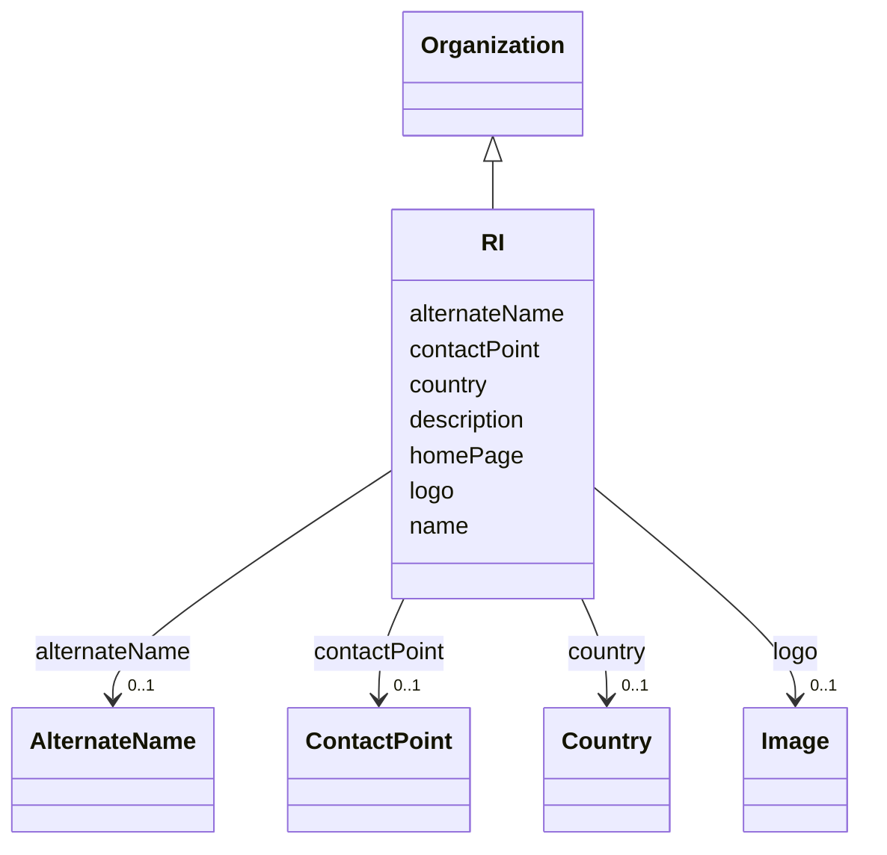

# Class: RI


_A research infrastructure_


URI: [EVORA:RI](https://evora-project.eu/RI)





## Inheritance
* [Nameable](Nameable.md)
    * [PersonOrOrganization](PersonOrOrganization.md)
        * [Organization](Organization.md)
            * **RI**


## Slots

| Name | Cardinality and Range | Description | Inheritance |
| ---  | --- | --- | --- |
| [alternateName](alternateName.md) | 0..1 <br/> [AlternateName](AlternateName.md) | An alternate name or acronym | [Organization](Organization.md) |
| [country](country.md) | 0..1 <br/> [Country](Country.md) | The country of the organization | [Organization](Organization.md) |
| [homePage](homePage.md) | 0..1 <br/> [String](String.md) | Refers to the degree of purity achieved for a protein sample | [PersonOrOrganization](PersonOrOrganization.md) |
| [contactPoint](contactPoint.md) | 0..1 <br/> [ContactPoint](ContactPoint.md) | An information that allows someone to establish communication | [PersonOrOrganization](PersonOrOrganization.md) |
| [logo](logo.md) | 0..1 <br/> [Image](Image.md) | A path or URL to the related logo | [PersonOrOrganization](PersonOrOrganization.md) |
| [name](name.md) | 1 <br/> [String](String.md) | The label that allows humans to identify the current item | [Nameable](Nameable.md) |
| [description](description.md) | 0..1 <br/> [String](String.md) | A short explanation of the characteristics, features, or nature of the curren... | [Nameable](Nameable.md) |


## Usages

| used by | used in | type | used |
| ---  | --- | --- | --- |
| [Provider](Provider.md) | [memberOfRI](memberOfRI.md) | range | [RI](RI.md) |


## Aliases


* RI


## Identifier and Mapping Information


### Schema Source


* from schema: https://evora-project.eu/


## Mappings

| Mapping Type | Mapped Value |
| ---  | ---  |
| self | EVORA:RI |
| native | EVORA:RI |
| close | wd:Q1438053 |


## LinkML Source

<!-- TODO: investigate https://stackoverflow.com/questions/37606292/how-to-create-tabbed-code-blocks-in-mkdocs-or-sphinx -->

### Direct

<details>
```yaml
name: RI
description: A research infrastructure
from_schema: https://evora-project.eu/
aliases:
- RI
close_mappings:
- wd:Q1438053
is_a: Organization

```
</details>

### Induced

<details>
```yaml
name: RI
description: A research infrastructure
from_schema: https://evora-project.eu/
aliases:
- RI
close_mappings:
- wd:Q1438053
is_a: Organization
attributes:
  alternateName:
    name: alternateName
    description: An alternate name or acronym
    from_schema: https://evora-project.eu/
    aliases:
    - alternate name
    close_mappings:
    - dwc:institutionCode
    rank: 1000
    alias: alternateName
    owner: RI
    domain_of:
    - CommonName
    - AlternateName
    - Organization
    range: AlternateName
    required: false
    multivalued: false
  country:
    name: country
    description: The country of the organization
    from_schema: https://evora-project.eu/
    aliases:
    - country
    rank: 1000
    alias: country
    owner: RI
    domain_of:
    - Organization
    range: Country
    required: false
    multivalued: false
  homePage:
    name: homePage
    description: Refers to the degree of purity achieved for a protein sample. Possible
      values include ">95%" (the protein is highly purified, with more than 95% purity)
      and "Unpurified expression host lysate or partly purified protein" (the protein
      is either unpurified and present in the host cell lysate or only partially purified).
    from_schema: https://evora-project.eu/
    aliases:
    - home page
    rank: 1000
    alias: homePage
    owner: RI
    domain_of:
    - PersonOrOrganization
    range: string
    required: false
    multivalued: false
  contactPoint:
    name: contactPoint
    description: An information that allows someone to establish communication
    from_schema: https://evora-project.eu/
    aliases:
    - contact point
    exact_mappings:
    - dcat:contactPoint
    rank: 1000
    alias: contactPoint
    owner: RI
    domain_of:
    - PersonOrOrganization
    - ProductOrService
    range: ContactPoint
    required: false
    multivalued: false
  logo:
    name: logo
    description: A path or URL to the related logo
    from_schema: https://evora-project.eu/
    aliases:
    - logo
    rank: 1000
    alias: logo
    owner: RI
    domain_of:
    - PersonOrOrganization
    - License
    - Certification
    range: Image
    required: false
    multivalued: false
  name:
    name: name
    description: The label that allows humans to identify the current item
    comments:
    - 'The title of the item should be as short and descriptive as possible. E.g.
      for virus products it should basically be based on the following Pattern:

      "Virus name", "virus host type", "collection year", "country of collection"
      ex "suspected epidemiological origin", "genotype", "strain", "variant name or
      specific feature"'
    from_schema: https://evora-project.eu/
    aliases:
    - name
    exact_mappings:
    - dct:title
    close_mappings:
    - rdfs:label
    rank: 1000
    alias: name
    owner: RI
    domain_of:
    - Nameable
    range: string
    required: true
    multivalued: false
  description:
    name: description
    description: A short explanation of the characteristics, features, or nature of
      the current item
    comments:
    - 'Describe this item in few lines. This description will serve as a summary to
      present the item.

      '
    from_schema: https://evora-project.eu/
    aliases:
    - description
    exact_mappings:
    - dct:description
    rank: 1000
    alias: description
    owner: RI
    domain_of:
    - Nameable
    range: string
    required: false
    multivalued: false

```
</details>