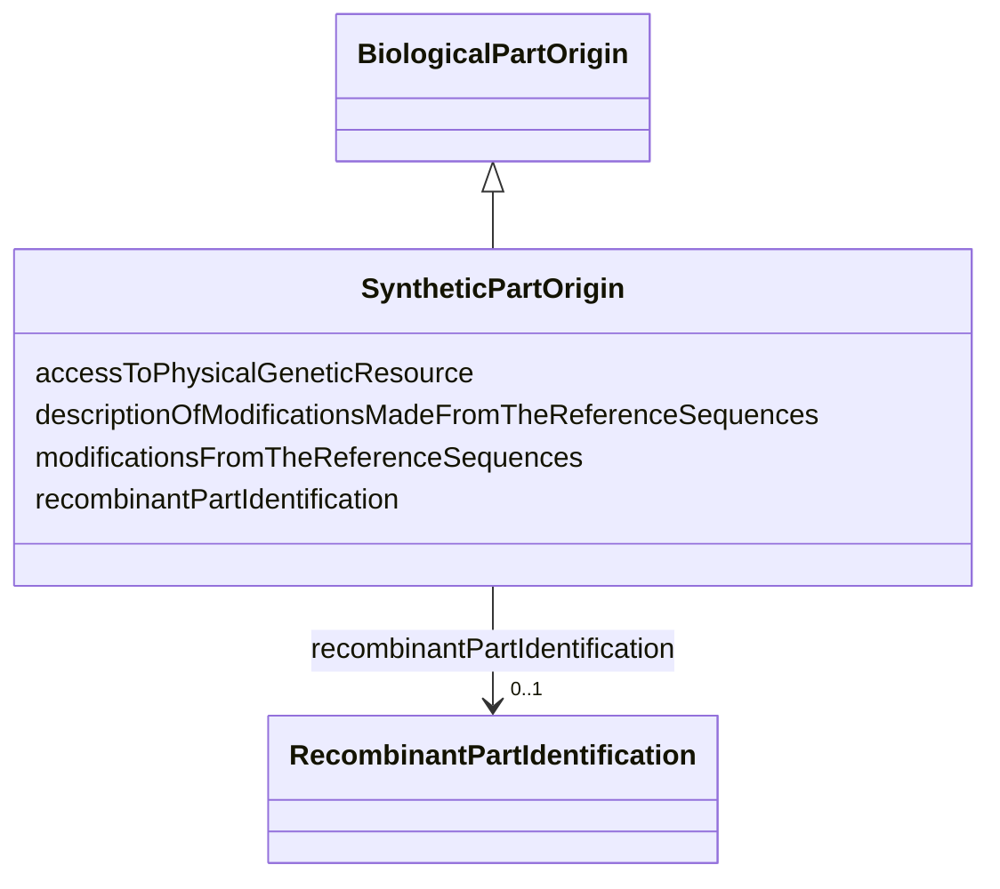

# Class: SyntheticPartOrigin


_Information on the origin of a synthetic part that composes the biological material_


URI: [EVORA:SyntheticPartOrigin](https://evora-project.eu/SyntheticPartOrigin)





## Inheritance
* [Dataset](Dataset.md)
    * [BiologicalPartOrigin](BiologicalPartOrigin.md)
        * **SyntheticPartOrigin**


## Slots

| Name | Cardinality and Range | Description | Inheritance |
| ---  | --- | --- | --- |
| [modificationsFromTheReferenceSequences](modificationsFromTheReferenceSequences.md) | 1 <br/> [Boolean](Boolean.md) | Set to TRUE if there was is any modification made from the reference sequence | direct |
| [descriptionOfModificationsMadeFromTheReferenceSequences](descriptionOfModificationsMadeFromTheReferenceSequences.md) | 0..1 <br/> [String](String.md) | List the modifications mades from the reference sequence if any | direct |
| [recombinantPartIdentification](recombinantPartIdentification.md) | 0..1 <br/> [RecombinantPartIdentification](RecombinantPartIdentification.md) | Identification of a recombinant part | [BiologicalPartOrigin](BiologicalPartOrigin.md) |
| [accessToPhysicalGeneticResource](accessToPhysicalGeneticResource.md) | 1 <br/> [Boolean](Boolean.md) | Reference of the permit identifiers for access to the genetic resource, appli... | [BiologicalPartOrigin](BiologicalPartOrigin.md) |


## Aliases


* Synthetic part origin


## Identifier and Mapping Information


### Schema Source


* from schema: https://evora-project.eu/


## Mappings

| Mapping Type | Mapped Value |
| ---  | ---  |
| self | EVORA:SyntheticPartOrigin |
| native | EVORA:SyntheticPartOrigin |


## LinkML Source

<!-- TODO: investigate https://stackoverflow.com/questions/37606292/how-to-create-tabbed-code-blocks-in-mkdocs-or-sphinx -->

### Direct

<details>
```yaml
name: SyntheticPartOrigin
description: Information on the origin of a synthetic part that composes the biological
  material
from_schema: https://evora-project.eu/
aliases:
- Synthetic part origin
is_a: BiologicalPartOrigin
slots:
- modificationsFromTheReferenceSequences
- descriptionOfModificationsMadeFromTheReferenceSequences
slot_usage:
  modificationsFromTheReferenceSequences:
    name: modificationsFromTheReferenceSequences
    description: Set to TRUE if there was is any modification made from the reference
      sequence
    aliases:
    - modifications from the reference sequence(s)
    range: boolean
    required: true
    multivalued: false
  descriptionOfModificationsMadeFromTheReferenceSequences:
    name: descriptionOfModificationsMadeFromTheReferenceSequences
    description: List the modifications mades from the reference sequence if any
    aliases:
    - description of modification(s) made from the reference sequence(s)
    range: string
    required: false
    multivalued: false

```
</details>

### Induced

<details>
```yaml
name: SyntheticPartOrigin
description: Information on the origin of a synthetic part that composes the biological
  material
from_schema: https://evora-project.eu/
aliases:
- Synthetic part origin
is_a: BiologicalPartOrigin
slot_usage:
  modificationsFromTheReferenceSequences:
    name: modificationsFromTheReferenceSequences
    description: Set to TRUE if there was is any modification made from the reference
      sequence
    aliases:
    - modifications from the reference sequence(s)
    range: boolean
    required: true
    multivalued: false
  descriptionOfModificationsMadeFromTheReferenceSequences:
    name: descriptionOfModificationsMadeFromTheReferenceSequences
    description: List the modifications mades from the reference sequence if any
    aliases:
    - description of modification(s) made from the reference sequence(s)
    range: string
    required: false
    multivalued: false
attributes:
  modificationsFromTheReferenceSequences:
    name: modificationsFromTheReferenceSequences
    description: Set to TRUE if there was is any modification made from the reference
      sequence
    from_schema: https://evora-project.eu/
    aliases:
    - modifications from the reference sequence(s)
    rank: 1000
    alias: modificationsFromTheReferenceSequences
    owner: SyntheticPartOrigin
    domain_of:
    - SyntheticPartOrigin
    range: boolean
    required: true
    multivalued: false
  descriptionOfModificationsMadeFromTheReferenceSequences:
    name: descriptionOfModificationsMadeFromTheReferenceSequences
    description: List the modifications mades from the reference sequence if any
    from_schema: https://evora-project.eu/
    aliases:
    - description of modification(s) made from the reference sequence(s)
    rank: 1000
    alias: descriptionOfModificationsMadeFromTheReferenceSequences
    owner: SyntheticPartOrigin
    domain_of:
    - SyntheticPartOrigin
    range: string
    required: false
    multivalued: false
  recombinantPartIdentification:
    name: recombinantPartIdentification
    description: Identification of a recombinant part
    comments:
    - Information not required if the current biological part constitutes the complete
      biological material
    from_schema: https://evora-project.eu/
    aliases:
    - recombinant part identification
    rank: 1000
    alias: recombinantPartIdentification
    owner: SyntheticPartOrigin
    domain_of:
    - BiologicalPartOrigin
    range: RecombinantPartIdentification
    required: false
    multivalued: false
  accessToPhysicalGeneticResource:
    name: accessToPhysicalGeneticResource
    description: Reference of the permit identifiers for access to the genetic resource,
      applicable if the genetic resource falls under Access and Benefit-Sharing (ABS)
      regulations
    from_schema: https://evora-project.eu/
    aliases:
    - access to physical genetic resource
    rank: 1000
    alias: accessToPhysicalGeneticResource
    owner: SyntheticPartOrigin
    domain_of:
    - BiologicalPartOrigin
    range: boolean
    required: true
    multivalued: false

```
</details>