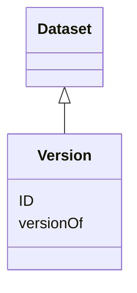

# Class: Version


_Numeric code assigned to identify a particular historical version of a work (e.g. software or technical standards)_


URI: [EVORA:Version](https://evora-project.eu/Version)





## Inheritance
* [Dataset](Dataset.md)
    * **Version**


## Slots

| Name | Cardinality and Range | Description | Inheritance |
| ---  | --- | --- | --- |
| [ID](ID.md) | 1 <br/> [String](String.md) | The version identifier | direct |
| [versionOf](versionOf.md) | 1 <br/> [Uri](Uri.md) | Identifier of what the version qualifies | direct |


## Usages

| used by | used in | type | used |
| ---  | --- | --- | --- |
| [Taxonomy](Taxonomy.md) | [version](version.md) | range | [Version](Version.md) |


## Aliases


* Version


## Identifier and Mapping Information


### Schema Source


* from schema: https://evora-project.eu/


## Mappings

| Mapping Type | Mapped Value |
| ---  | ---  |
| self | EVORA:Version |
| native | EVORA:Version |
| close | wd:Q114469879 |


## LinkML Source

<!-- TODO: investigate https://stackoverflow.com/questions/37606292/how-to-create-tabbed-code-blocks-in-mkdocs-or-sphinx -->

### Direct

<details>
```yaml
name: Version
description: Numeric code assigned to identify a particular historical version of
  a work (e.g. software or technical standards)
from_schema: https://evora-project.eu/
aliases:
- Version
close_mappings:
- wd:Q114469879
is_a: Dataset
slots:
- ID
- versionOf
slot_usage:
  ID:
    name: ID
    description: The version identifier
    aliases:
    - ID
    close_mappings:
    - wdp:P393
    - schema:version
    range: string
    required: true
    multivalued: false
  versionOf:
    name: versionOf
    description: Identifier of what the version qualifies
    aliases:
    - version Of
    range: uri
    required: true
    multivalued: false

```
</details>

### Induced

<details>
```yaml
name: Version
description: Numeric code assigned to identify a particular historical version of
  a work (e.g. software or technical standards)
from_schema: https://evora-project.eu/
aliases:
- Version
close_mappings:
- wd:Q114469879
is_a: Dataset
slot_usage:
  ID:
    name: ID
    description: The version identifier
    aliases:
    - ID
    close_mappings:
    - wdp:P393
    - schema:version
    range: string
    required: true
    multivalued: false
  versionOf:
    name: versionOf
    description: Identifier of what the version qualifies
    aliases:
    - version Of
    range: uri
    required: true
    multivalued: false
attributes:
  ID:
    name: ID
    description: The version identifier
    from_schema: https://evora-project.eu/
    aliases:
    - ID
    close_mappings:
    - wdp:P393
    - schema:version
    rank: 1000
    alias: ID
    owner: Version
    domain_of:
    - Version
    range: string
    required: true
    multivalued: false
  versionOf:
    name: versionOf
    description: Identifier of what the version qualifies
    from_schema: https://evora-project.eu/
    aliases:
    - version Of
    rank: 1000
    alias: versionOf
    owner: Version
    domain_of:
    - Version
    range: uri
    required: true
    multivalued: false

```
</details>