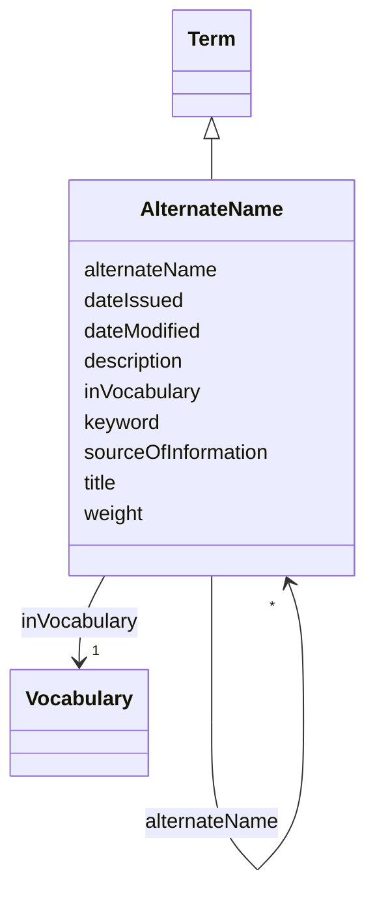

# Class: Alternate name (AlternateName) 


_List of other names for things_


URI: [EVORAO:AlternateName](https://w3id.org/evorao/AlternateName)





## Inheritance
* [Resource](Resource.md)
    * [Term](Term.md)
        * **AlternateName**


## Slots

| Name | Cardinality and Range | Description | Inheritance |
| ---  | --- | --- | --- |
| [alternateName](alternateName.md) | * <br/> [AlternateName](AlternateName.md) | Any other name under which the entity can be known | direct |
| [sourceOfInformation](sourceOfInformation.md) | * <br/> [String](String.md) | The name of the origin from which knowledge is obtained | direct |
| [title](title.md) | 1 <br/> [String](String.md) | A name given to the resource | [Term](Term.md) |
| [description](description.md) | 0..1 _recommended_ <br/> [String](String.md) | A short explanation of the characteristics, features, or nature of the curren... | [Term](Term.md) |
| [weight](weight.md) | 1 <br/> [Integer](Integer.md) | A numerical value indicating relative importance or priority, generally proce... | [Term](Term.md) |
| [inVocabulary](inVocabulary.md) | 1 <br/> [Vocabulary](Vocabulary.md) | Terms belong to a specific vocabulary | [Term](Term.md) |
| [keyword](keyword.md) | * <br/> [String](String.md) | A keyword or tag describing the resource | [Resource](Resource.md) |
| [dateIssued](dateIssued.md) | 0..1 <br/> [Datetime](Datetime.md) | Date of formal issuance (e | [Resource](Resource.md) |
| [dateModified](dateModified.md) | 0..1 <br/> [Datetime](Datetime.md) | Most recent date on which the resource was changed, updated or modified | [Resource](Resource.md) |


## Usages

| used by | used in | type | used |
| ---  | --- | --- | --- |
| [CommonName](CommonName.md) | [alternateName](alternateName.md) | range | [AlternateName](AlternateName.md) |
| [VirusName](VirusName.md) | [alternateName](alternateName.md) | range | [AlternateName](AlternateName.md) |
| [AlternateName](AlternateName.md) | [alternateName](alternateName.md) | range | [AlternateName](AlternateName.md) |
| [Variant](Variant.md) | [alternateName](alternateName.md) | range | [AlternateName](AlternateName.md) |
| [Organization](Organization.md) | [alternateName](alternateName.md) | range | [AlternateName](AlternateName.md) |
| [ReasearchInfrastructure](ReasearchInfrastructure.md) | [alternateName](alternateName.md) | range | [AlternateName](AlternateName.md) |
| [Provider](Provider.md) | [alternateName](alternateName.md) | range | [AlternateName](AlternateName.md) |


## Identifier and Mapping Information


### Schema Source


* from schema: https://w3id.org/evorao/


## Mappings

| Mapping Type | Mapped Value |
| ---  | ---  |
| self | EVORAO:AlternateName |
| native | EVORAO:AlternateName |
| exact | ncit:C52469, sio:000122, ncit:C52469, sio:000122 |
| close | wd:Q7662595, mi:1041, wd:Q7662595, mi:1041 |


## LinkML Source

<!-- TODO: investigate https://stackoverflow.com/questions/37606292/how-to-create-tabbed-code-blocks-in-mkdocs-or-sphinx -->

### Direct

<details>
```yaml
name: AlternateName
description: List of other names for things
title: Alternate name
from_schema: https://w3id.org/evorao/
exact_mappings:
- ncit:C52469
- sio:000122
- ncit:C52469
- sio:000122
close_mappings:
- wd:Q7662595
- mi:1041
- wd:Q7662595
- mi:1041
is_a: Term
slots:
- alternateName
- sourceOfInformation
slot_usage:
  alternateName:
    name: alternateName
    description: Any other name under which the entity can be known
    title: alternate name
    comments:
    - This includes previous names, acronyms, former taxonomic terms, and other variations.
      This information can serve as keywords for search purposes and as a bridge with
      other projects that use different naming systems or taxonomies
    exact_mappings:
    - schema:alternateName
    - dct:alternative
    - iao:0000118
    close_mappings:
    - wdp:P4970
    domain_of:
    - AlternateName
    - CommonName
    - Organization
    range: AlternateName
    required: false
    multivalued: true
  sourceOfInformation:
    name: sourceOfInformation
    description: The name of the origin from which knowledge is obtained. This can
      include any entity that provides information
    title: source of information
    close_mappings:
    - wdp:P248
    related_mappings:
    - sio:000253
    domain_of:
    - AlternateName
    - CommonName
    range: string
    required: false
    multivalued: true

```
</details>

### Induced

<details>
```yaml
name: AlternateName
description: List of other names for things
title: Alternate name
from_schema: https://w3id.org/evorao/
exact_mappings:
- ncit:C52469
- sio:000122
- ncit:C52469
- sio:000122
close_mappings:
- wd:Q7662595
- mi:1041
- wd:Q7662595
- mi:1041
is_a: Term
slot_usage:
  alternateName:
    name: alternateName
    description: Any other name under which the entity can be known
    title: alternate name
    comments:
    - This includes previous names, acronyms, former taxonomic terms, and other variations.
      This information can serve as keywords for search purposes and as a bridge with
      other projects that use different naming systems or taxonomies
    exact_mappings:
    - schema:alternateName
    - dct:alternative
    - iao:0000118
    close_mappings:
    - wdp:P4970
    domain_of:
    - AlternateName
    - CommonName
    - Organization
    range: AlternateName
    required: false
    multivalued: true
  sourceOfInformation:
    name: sourceOfInformation
    description: The name of the origin from which knowledge is obtained. This can
      include any entity that provides information
    title: source of information
    close_mappings:
    - wdp:P248
    related_mappings:
    - sio:000253
    domain_of:
    - AlternateName
    - CommonName
    range: string
    required: false
    multivalued: true
attributes:
  alternateName:
    name: alternateName
    description: Any other name under which the entity can be known
    title: alternate name
    comments:
    - This includes previous names, acronyms, former taxonomic terms, and other variations.
      This information can serve as keywords for search purposes and as a bridge with
      other projects that use different naming systems or taxonomies
    from_schema: https://w3id.org/evorao/
    exact_mappings:
    - schema:alternateName
    - dct:alternative
    - iao:0000118
    close_mappings:
    - wdp:P4970
    rank: 1000
    alias: alternateName
    owner: AlternateName
    domain_of:
    - AlternateName
    - CommonName
    - Organization
    range: AlternateName
    required: false
    multivalued: true
  sourceOfInformation:
    name: sourceOfInformation
    description: The name of the origin from which knowledge is obtained. This can
      include any entity that provides information
    title: source of information
    from_schema: https://w3id.org/evorao/
    close_mappings:
    - wdp:P248
    related_mappings:
    - sio:000253
    rank: 1000
    alias: sourceOfInformation
    owner: AlternateName
    domain_of:
    - AlternateName
    - CommonName
    range: string
    required: false
    multivalued: true
  title:
    name: title
    description: A name given to the resource
    title: title
    comments:
    - 'The title of the item should be as short and descriptive as possible. E.g.
      for virus products it should basically be based on the following Pattern: ''Virus
      name'', ''virus host type'', ''collection year'', ''country of collection''
      ex ''suspected epidemiological origin'', ''genotype'', ''strain'', ''variant
      name or specific feature'
    from_schema: https://w3id.org/evorao/
    exact_mappings:
    - schema:name
    - rdfs:label
    rank: 1000
    slot_uri: dct:title
    alias: title
    owner: AlternateName
    domain_of:
    - Term
    - Dataset
    - DataService
    - Publication
    - License
    - Certification
    range: string
    required: true
    multivalued: false
  description:
    name: description
    description: A short explanation of the characteristics, features, or nature of
      the current item
    title: description
    comments:
    - Describe this item in few lines. This description will serve as a summary to
      present the resource.
    from_schema: https://w3id.org/evorao/
    exact_mappings:
    - schema:description
    close_mappings:
    - schema:description
    rank: 1000
    slot_uri: dct:description
    alias: description
    owner: AlternateName
    domain_of:
    - Term
    - Dataset
    - DataService
    - PersonOrOrganization
    - File
    - ContactPoint
    - License
    - Certification
    range: string
    required: false
    recommended: true
    multivalued: false
  weight:
    name: weight
    description: A numerical value indicating relative importance or priority, generally
      processed in ascending order. This weight helps prioritize content when organizing
      or processing data. Its value can be negative, with a default set to 0
    title: weight
    comments:
    - The lowest weighted Data providers are triggered first, this may be usefull
      to populate at first entities that are referenced by others (e.g. Version ahead
      of Rank ahead of Taxon)
    from_schema: https://w3id.org/evorao/
    close_mappings:
    - adms:status
    rank: 1000
    ifabsent: int(0)
    alias: weight
    owner: AlternateName
    domain_of:
    - Term
    - DataProvider
    range: integer
    required: true
    multivalued: false
  inVocabulary:
    name: inVocabulary
    description: Terms belong to a specific vocabulary
    title: in Vocabulary
    from_schema: https://w3id.org/evorao/
    close_mappings:
    - wdp:P972
    related_mappings:
    - dct:isReferencedBy
    broad_mappings:
    - dct:isPartOf
    rank: 1000
    alias: inVocabulary
    owner: AlternateName
    domain_of:
    - Term
    range: Vocabulary
    required: true
    multivalued: false
  keyword:
    name: keyword
    description: A keyword or tag describing the resource
    title: keyword
    from_schema: https://w3id.org/evorao/
    rank: 1000
    slot_uri: dcat:keyword
    alias: keyword
    owner: AlternateName
    domain_of:
    - Resource
    range: string
    required: false
    multivalued: true
  dateIssued:
    name: dateIssued
    description: Date of formal issuance (e.g., publication) of the resource
    title: date issued
    comments:
    - encoded using the relevant ISO 8601 Date and Time compliant string [DATETIME]
    from_schema: https://w3id.org/evorao/
    exact_mappings:
    - sepio:0000051
    close_mappings:
    - schema:datePublished
    - schema:dateCreated
    rank: 1000
    slot_uri: dct:issued
    alias: dateIssued
    owner: AlternateName
    domain_of:
    - Resource
    range: datetime
    required: false
    multivalued: false
  dateModified:
    name: dateModified
    description: Most recent date on which the resource was changed, updated or modified
    title: date modified
    comments:
    - encoded using the relevant ISO 8601 Date and Time compliant string [DATETIME]
    from_schema: https://w3id.org/evorao/
    exact_mappings:
    - sepio:0000036
    close_mappings:
    - schema:dateModified
    rank: 1000
    slot_uri: dct:modified
    alias: dateModified
    owner: AlternateName
    domain_of:
    - Resource
    range: datetime
    required: false
    multivalued: false

```
</details>