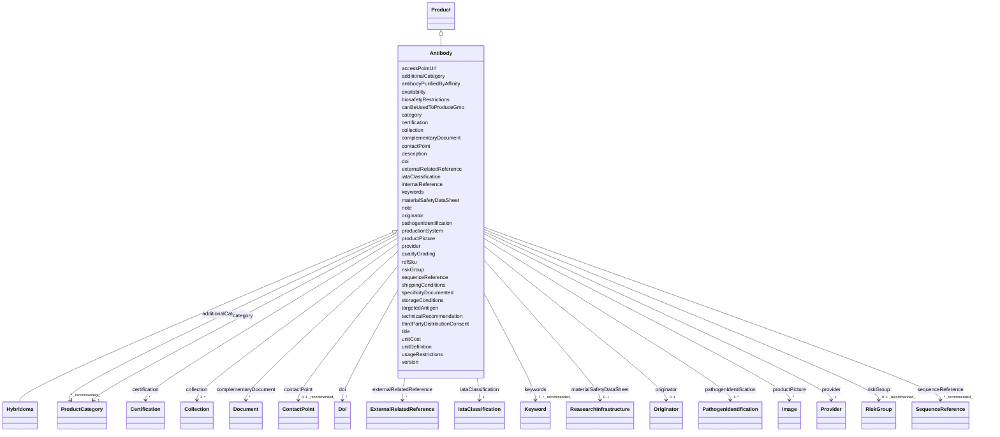

# Class: Antibody (Antibody) 


_Protein that can bind to certain types of foreign bodies, such as pathogens_


URI: [EVORAO:Antibody](https://w3id.org/evorao/Antibody)





## Inheritance
* [Resource](Resource.md)
    * [Dataset](Dataset.md)
        * [ProductOrService](ProductOrService.md)
            * [Product](Product.md)
                * **Antibody**
                    * [Hybridoma](Hybridoma.md)


## Slots

| Name | Cardinality and Range | Description | Inheritance |
| ---  | --- | --- | --- |
| [productionSystem](productionSystem.md) | 0..1 _recommended_ <br/> [String](String.md) | The biological and technological methods and processes used to produce the an... | direct |
| [antibodyPurifiedByAffinity](antibodyPurifiedByAffinity.md) | 1 <br/> [Boolean](Boolean.md) | Indicates whether or not if the antibody was purified by affinity | direct |
| [specificityDocumented](specificityDocumented.md) | 1 <br/> [Boolean](Boolean.md) | Boolean value indicating whether the specificity of the product has been form... | direct |
| [targetedAntigen](targetedAntigen.md) | 1 <br/> [String](String.md) | Specific molecular structure or epitope recognized and bound by an antibody | direct |
| [sequenceReference](sequenceReference.md) | * _recommended_ <br/> [SequenceReference](SequenceReference.md) | A reference that permits to retrieve the sequence information from a sequence... | direct |
| [iataClassification](iataClassification.md) | 1 <br/> [IataClassification](IataClassification.md) | The corresponding International Air Transport Association (IATA)'s category f... | [Product](Product.md) |
| [shippingConditions](shippingConditions.md) | 1 <br/> [String](String.md) | Specification of the terms and parameters for transporting | [Product](Product.md) |
| [materialSafetyDataSheet](materialSafetyDataSheet.md) | 0..1 <br/> [ReasearchInfrastructure](ReasearchInfrastructure.md) | A Material Safety Data Sheet (MSDS) or Safety Data Sheet (SDS) is a standardi... | [Product](Product.md) |
| [originator](originator.md) | 0..1 <br/> [Originator](Originator.md) | The individual or organization responsible for the original discovery, isolat... | [Product](Product.md) |
| [storageConditions](storageConditions.md) | 1 <br/> [String](String.md) | Specifies the conditions under which the product has to be stored to maintain... | [Product](Product.md) |
| [thirdPartyDistributionConsent](thirdPartyDistributionConsent.md) | 0..1 <br/> [Boolean](Boolean.md) | Indicates whether the biological material can be distributed without restrict... | [Product](Product.md) |
| [usageRestrictions](usageRestrictions.md) | 0..1 <br/> [String](String.md) | Specifies any limitations or conditions on the use of the biological material... | [Product](Product.md) |
| [accessPointUrl](accessPointUrl.md) | 1 <br/> [Uri](Uri.md) | The URL that permits to access to the product/service detailed description pa... | [ProductOrService](ProductOrService.md) |
| [refSku](refSku.md) | 1 <br/> [String](String.md) | The reference or the stock keeping unit of the service or item provided in th... | [ProductOrService](ProductOrService.md) |
| [unitDefinition](unitDefinition.md) | 0..1 _recommended_ <br/> [String](String.md) | A short description of what will be delivered by ordering one unit of this it... | [ProductOrService](ProductOrService.md) |
| [category](category.md) | 1 <br/> [ProductCategory](ProductCategory.md) | The main category of the service or product | [ProductOrService](ProductOrService.md) |
| [additionalCategory](additionalCategory.md) | * _recommended_ <br/> [ProductCategory](ProductCategory.md) | Any category apart from its main category in which this product or service ca... | [ProductOrService](ProductOrService.md) |
| [unitCost](unitCost.md) | 1 _recommended_ <br/> [String](String.md) | The cost per access for one unit as defined by the unit definition | [ProductOrService](ProductOrService.md) |
| [qualityGrading](qualityGrading.md) | 0..1 <br/> [String](String.md) | Information that permits to assess the quality level of what will be provided | [ProductOrService](ProductOrService.md) |
| [pathogenIdentification](pathogenIdentification.md) | 1..* <br/> [PathogenIdentification](PathogenIdentification.md) | The identification of the pathogen or group of pathogens (e | [ProductOrService](ProductOrService.md) |
| [doi](doi.md) | * <br/> [Doi](Doi.md) | A Digital Object Identifier (DOI) that can be related | [ProductOrService](ProductOrService.md) |
| [riskGroup](riskGroup.md) | 0..1 _recommended_ <br/> [RiskGroup](RiskGroup.md) | The highest risk group related to this resource | [ProductOrService](ProductOrService.md) |
| [biosafetyRestrictions](biosafetyRestrictions.md) | 0..1 <br/> [String](String.md) | Information about guidelines and regulations designed to prevent the exposure... | [ProductOrService](ProductOrService.md) |
| [canBeUsedToProduceGmo](canBeUsedToProduceGmo.md) | 1 _recommended_ <br/> [Boolean](Boolean.md) | Indicates if the current service or product can be used to produce GMO | [ProductOrService](ProductOrService.md) |
| [provider](provider.md) | 1 <br/> [Provider](Provider.md) | A provider of this product or service, as a specific organization | [ProductOrService](ProductOrService.md) |
| [collection](collection.md) | 1..* <br/> [Collection](Collection.md) | The collection(s) to which belongs this item | [ProductOrService](ProductOrService.md) |
| [keywords](keywords.md) | 1..* _recommended_ <br/> [Keyword](Keyword.md) | List of terms used to tag and categorize this Item | [ProductOrService](ProductOrService.md) |
| [availability](availability.md) | 1 <br/> [String](String.md) | The state or condition in which this item is accessible and ready for use or ... | [ProductOrService](ProductOrService.md) |
| [complementaryDocument](complementaryDocument.md) | * <br/> [Document](Document.md) | Any additional documents that provide supplementary information, instructions... | [ProductOrService](ProductOrService.md) |
| [technicalRecommendation](technicalRecommendation.md) | 0..1 <br/> [String](String.md) | Expert advice or guidelines provided to ensure the optimal use, performance, ... | [ProductOrService](ProductOrService.md) |
| [productPicture](productPicture.md) | * <br/> [Image](Image.md) | A picture that can represent the item | [ProductOrService](ProductOrService.md) |
| [externalRelatedReference](externalRelatedReference.md) | * <br/> [ExternalRelatedReference](ExternalRelatedReference.md) | A reference that permits to retrieve another related item from an external pr... | [ProductOrService](ProductOrService.md) |
| [certification](certification.md) | * <br/> [Certification](Certification.md) | Any certification related to the current product or service; e | [ProductOrService](ProductOrService.md) |
| [internalReference](internalReference.md) | 0..1 <br/> [String](String.md) | Any reference or indication to be used for local retrieval purpose | [ProductOrService](ProductOrService.md) |
| [note](note.md) | 0..1 <br/> [String](String.md) | An aditional information as a textual comment | [ProductOrService](ProductOrService.md) |
| [contactPoint](contactPoint.md) | 0..1 _recommended_ <br/> [ContactPoint](ContactPoint.md) | An information that allows someone to establish communication | [ProductOrService](ProductOrService.md) |
| [title](title.md) | 1 <br/> [String](String.md) | A name given to the resource | [Dataset](Dataset.md) |
| [description](description.md) | 1 _recommended_ <br/> [String](String.md) | A short explanation of the characteristics, features, or nature of the curren... | [Dataset](Dataset.md) |
| [version](version.md) | 0..1 _recommended_ <br/> [String](String.md) | The version indicator (name or identifier) of a resource | [Dataset](Dataset.md) |


## Identifier and Mapping Information


### Schema Source


* from schema: https://w3id.org/evorao/


## Mappings

| Mapping Type | Mapped Value |
| ---  | ---  |
| self | EVORAO:Antibody |
| native | EVORAO:Antibody |
| close | wd:Q79460, wd:Q79460 |


## LinkML Source

<!-- TODO: investigate https://stackoverflow.com/questions/37606292/how-to-create-tabbed-code-blocks-in-mkdocs-or-sphinx -->

### Direct

<details>
```yaml
name: Antibody
description: Protein that can bind to certain types of foreign bodies, such as pathogens
title: Antibody
from_schema: https://w3id.org/evorao/
close_mappings:
- wd:Q79460
- wd:Q79460
is_a: Product
slots:
- productionSystem
- antibodyPurifiedByAffinity
- specificityDocumented
- targetedAntigen
- sequenceReference
slot_usage:
  productionSystem:
    name: productionSystem
    description: The biological and technological methods and processes used to produce
      the antibody
    title: production system
    domain_of:
    - Antibody
    range: string
    required: false
    recommended: true
    multivalued: false
  antibodyPurifiedByAffinity:
    name: antibodyPurifiedByAffinity
    description: Indicates whether or not if the antibody was purified by affinity
    title: antibody purified by affinity
    domain_of:
    - Antibody
    range: boolean
    required: true
    multivalued: false
  specificityDocumented:
    name: specificityDocumented
    description: Boolean value indicating whether the specificity of the product has
      been formally documented
    title: specificity documented
    domain_of:
    - Antibody
    - DetectionKit
    range: boolean
    required: true
    multivalued: false
  targetedAntigen:
    name: targetedAntigen
    description: Specific molecular structure or epitope recognized and bound by an
      antibody
    title: targeted antigen
    domain_of:
    - Antibody
    range: string
    required: true
    multivalued: false
  sequenceReference:
    name: sequenceReference
    description: A reference that permits to retrieve the sequence information from
      a sequence provider
    title: sequence reference
    domain_of:
    - Antibody
    - Sequence
    range: SequenceReference
    required: false
    recommended: true
    multivalued: true

```
</details>

### Induced

<details>
```yaml
name: Antibody
description: Protein that can bind to certain types of foreign bodies, such as pathogens
title: Antibody
from_schema: https://w3id.org/evorao/
close_mappings:
- wd:Q79460
- wd:Q79460
is_a: Product
slot_usage:
  productionSystem:
    name: productionSystem
    description: The biological and technological methods and processes used to produce
      the antibody
    title: production system
    domain_of:
    - Antibody
    range: string
    required: false
    recommended: true
    multivalued: false
  antibodyPurifiedByAffinity:
    name: antibodyPurifiedByAffinity
    description: Indicates whether or not if the antibody was purified by affinity
    title: antibody purified by affinity
    domain_of:
    - Antibody
    range: boolean
    required: true
    multivalued: false
  specificityDocumented:
    name: specificityDocumented
    description: Boolean value indicating whether the specificity of the product has
      been formally documented
    title: specificity documented
    domain_of:
    - Antibody
    - DetectionKit
    range: boolean
    required: true
    multivalued: false
  targetedAntigen:
    name: targetedAntigen
    description: Specific molecular structure or epitope recognized and bound by an
      antibody
    title: targeted antigen
    domain_of:
    - Antibody
    range: string
    required: true
    multivalued: false
  sequenceReference:
    name: sequenceReference
    description: A reference that permits to retrieve the sequence information from
      a sequence provider
    title: sequence reference
    domain_of:
    - Antibody
    - Sequence
    range: SequenceReference
    required: false
    recommended: true
    multivalued: true
attributes:
  productionSystem:
    name: productionSystem
    description: The biological and technological methods and processes used to produce
      the antibody
    title: production system
    from_schema: https://w3id.org/evorao/
    rank: 1000
    alias: productionSystem
    owner: Antibody
    domain_of:
    - Antibody
    range: string
    required: false
    recommended: true
    multivalued: false
  antibodyPurifiedByAffinity:
    name: antibodyPurifiedByAffinity
    description: Indicates whether or not if the antibody was purified by affinity
    title: antibody purified by affinity
    from_schema: https://w3id.org/evorao/
    rank: 1000
    alias: antibodyPurifiedByAffinity
    owner: Antibody
    domain_of:
    - Antibody
    range: boolean
    required: true
    multivalued: false
  specificityDocumented:
    name: specificityDocumented
    description: Boolean value indicating whether the specificity of the product has
      been formally documented
    title: specificity documented
    from_schema: https://w3id.org/evorao/
    rank: 1000
    alias: specificityDocumented
    owner: Antibody
    domain_of:
    - Antibody
    - DetectionKit
    range: boolean
    required: true
    multivalued: false
  targetedAntigen:
    name: targetedAntigen
    description: Specific molecular structure or epitope recognized and bound by an
      antibody
    title: targeted antigen
    from_schema: https://w3id.org/evorao/
    rank: 1000
    alias: targetedAntigen
    owner: Antibody
    domain_of:
    - Antibody
    range: string
    required: true
    multivalued: false
  sequenceReference:
    name: sequenceReference
    description: A reference that permits to retrieve the sequence information from
      a sequence provider
    title: sequence reference
    from_schema: https://w3id.org/evorao/
    rank: 1000
    alias: sequenceReference
    owner: Antibody
    domain_of:
    - Antibody
    - Sequence
    range: SequenceReference
    required: false
    recommended: true
    multivalued: true
  iataClassification:
    name: iataClassification
    description: The corresponding International Air Transport Association (IATA)'s
      category for this Product
    title: IATA classification
    from_schema: https://w3id.org/evorao/
    rank: 1000
    alias: iataClassification
    owner: Antibody
    domain_of:
    - Product
    range: IataClassification
    required: true
    multivalued: false
  shippingConditions:
    name: shippingConditions
    description: 'Specification of the terms and parameters for transporting

      '
    title: shipping conditions
    from_schema: https://w3id.org/evorao/
    rank: 1000
    alias: shippingConditions
    owner: Antibody
    domain_of:
    - Product
    range: string
    required: true
    multivalued: false
  materialSafetyDataSheet:
    name: materialSafetyDataSheet
    description: A Material Safety Data Sheet (MSDS) or Safety Data Sheet (SDS) is
      a standardized document that contains crucial occupational safety and health
      information related to the product
    title: material safety data sheet
    comments:
    - The MSD  is a document that provides detailed information about the properties,
      hazards, handling, storage, and emergency procedures related to the use of a
      chemical or substance
    from_schema: https://w3id.org/evorao/
    rank: 1000
    alias: materialSafetyDataSheet
    owner: Antibody
    domain_of:
    - Product
    range: ReasearchInfrastructure
    required: false
    multivalued: false
  originator:
    name: originator
    description: The individual or organization responsible for the original discovery,
      isolation, or creation of an item, providing information about the source or
      origin of the sample
    title: originator
    from_schema: https://w3id.org/evorao/
    rank: 1000
    alias: originator
    owner: Antibody
    domain_of:
    - Product
    range: Originator
    required: false
    multivalued: false
  storageConditions:
    name: storageConditions
    description: Specifies the conditions under which the product has to be stored
      to maintain stability and integrity, such as temperature, buffer, and other
      environmental factors.
    title: storage conditions
    comments:
    - e.g, could be a xsd:string in enumeration ('Freeze Dried', 'Liquid Nitrogen',
      'Viral Storage Medium -20C', 'Viral Storage Medium -80C', 'Living plant material
      (>= +4°C)', 'Gas Phase', 'Ethanol -20C', 'Ethanol -80C', 'Dried')
    from_schema: https://w3id.org/evorao/
    rank: 1000
    alias: storageConditions
    owner: Antibody
    domain_of:
    - Product
    range: string
    required: true
    multivalued: false
  thirdPartyDistributionConsent:
    name: thirdPartyDistributionConsent
    description: Indicates whether the biological material can be distributed without
      restriction to third parties, as indicated by the ABS permit, in case an ABS
      permit is required
    title: third party distribution consent
    from_schema: https://w3id.org/evorao/
    rank: 1000
    alias: thirdPartyDistributionConsent
    owner: Antibody
    domain_of:
    - Product
    range: boolean
    required: false
    multivalued: false
  usageRestrictions:
    name: usageRestrictions
    description: Specifies any limitations or conditions on the use of the biological
      material, including restrictions on research, commercial use, or distribution,
      considering any potential concerns about the related genetic material
    title: usage restrictions
    from_schema: https://w3id.org/evorao/
    rank: 1000
    alias: usageRestrictions
    owner: Antibody
    domain_of:
    - Product
    range: string
    required: false
    multivalued: false
  accessPointUrl:
    name: accessPointUrl
    description: The URL that permits to access to the product/service detailed description
      page on the provider's website and/or allows to place an order about it or at
      least describe the process to place an order/enquiry
    title: access point URL
    from_schema: https://w3id.org/evorao/
    exact_mappings:
    - dcat:landingPage
    rank: 1000
    alias: accessPointUrl
    owner: Antibody
    domain_of:
    - ProductOrService
    range: uri
    required: true
    multivalued: false
  refSku:
    name: refSku
    description: The reference or the stock keeping unit of the service or item provided
      in the provider's catalogue
    title: ref SKU
    from_schema: https://w3id.org/evorao/
    exact_mappings:
    - dct:identifier
    rank: 1000
    alias: refSku
    owner: Antibody
    domain_of:
    - ProductOrService
    range: string
    required: true
    multivalued: false
  unitDefinition:
    name: unitDefinition
    description: A short description of what will be delivered by ordering one unit
      of this item
    title: unit definition
    comments:
    - 'The description of what will be delivered to the end-user (e.g.: packaging,
      quantity...)'
    from_schema: https://w3id.org/evorao/
    rank: 1000
    alias: unitDefinition
    owner: Antibody
    domain_of:
    - ProductOrService
    range: string
    required: false
    recommended: true
    multivalued: false
  category:
    name: category
    description: The main category of the service or product
    title: category
    from_schema: https://w3id.org/evorao/
    exact_mappings:
    - dcat:theme
    rank: 1000
    alias: category
    owner: Antibody
    domain_of:
    - ProductOrService
    range: ProductCategory
    required: true
    multivalued: false
  additionalCategory:
    name: additionalCategory
    description: Any category apart from its main category in which this product or
      service can fit
    title: additional category
    from_schema: https://w3id.org/evorao/
    close_mappings:
    - dcat:theme
    rank: 1000
    alias: additionalCategory
    owner: Antibody
    domain_of:
    - ProductOrService
    range: ProductCategory
    required: false
    recommended: true
    multivalued: true
  unitCost:
    name: unitCost
    description: The cost per access for one unit as defined by the unit definition
    title: unit cost
    comments:
    - The cost per access may not be defined or be specific to a request, so it has
      to be a xsd:string instead of an xsd:float as initialy suggested to permit description
      of cost as conditional to what is requested
    from_schema: https://w3id.org/evorao/
    rank: 1000
    ifabsent: string(on request)
    alias: unitCost
    owner: Antibody
    domain_of:
    - ProductOrService
    range: string
    required: true
    recommended: true
    multivalued: false
  qualityGrading:
    name: qualityGrading
    description: Information that permits to assess the quality level of what will
      be provided
    title: quality grading
    from_schema: https://w3id.org/evorao/
    rank: 1000
    alias: qualityGrading
    owner: Antibody
    domain_of:
    - ProductOrService
    range: string
    required: false
    multivalued: false
  pathogenIdentification:
    name: pathogenIdentification
    description: The identification of the pathogen or group of pathogens (e.g; name,
      taxon identification, etc.) related to the current item.
    title: pathogen identification
    comments:
    - 'The pathogen identification contains information about name and taxon but in
      some cases(e.g: FAIRSHARING) there may have no direct pathogen related but simply
      a taxonomic information .... the default value should be the root of virology:
      Viruses'
    from_schema: https://w3id.org/evorao/
    rank: 1000
    alias: pathogenIdentification
    owner: Antibody
    domain_of:
    - ProductOrService
    range: PathogenIdentification
    required: true
    multivalued: true
  doi:
    name: doi
    description: A Digital Object Identifier (DOI) that can be related
    title: DOI
    from_schema: https://w3id.org/evorao/
    close_mappings:
    - wdp:P356
    rank: 1000
    alias: doi
    owner: Antibody
    domain_of:
    - ProductOrService
    - Publication
    range: Doi
    required: false
    multivalued: true
  riskGroup:
    name: riskGroup
    description: The highest risk group related to this resource. The risk group of
      a biological agent guiding its initial handling in labs according to the risk
      group classification defined by the WHO laboratory biosafety manual
    title: risk group
    from_schema: https://w3id.org/evorao/
    close_mappings:
    - wdp:P12663
    rank: 1000
    alias: riskGroup
    owner: Antibody
    domain_of:
    - ProductOrService
    range: RiskGroup
    required: false
    recommended: true
    multivalued: false
  biosafetyRestrictions:
    name: biosafetyRestrictions
    description: Information about guidelines and regulations designed to prevent
      the exposure to or release of potentially harmful biological agents. It thereby
      contributes to protecting people and the environment from biohazards while accessing
      this product or service
    title: biosafety restrictions
    from_schema: https://w3id.org/evorao/
    rank: 1000
    alias: biosafetyRestrictions
    owner: Antibody
    domain_of:
    - ProductOrService
    range: string
    required: false
    multivalued: false
  canBeUsedToProduceGmo:
    name: canBeUsedToProduceGmo
    description: Indicates if the current service or product can be used to produce
      GMO
    title: can be used to produce GMO
    comments:
    - Set to TRUE if it can produce GMO. It is recommended to have a value for this
      field, no value will be understood as unknown
    from_schema: https://w3id.org/evorao/
    rank: 1000
    alias: canBeUsedToProduceGmo
    owner: Antibody
    domain_of:
    - ProductOrService
    range: boolean
    required: true
    recommended: true
    multivalued: false
  provider:
    name: provider
    description: A provider of this product or service, as a specific organization
    title: provider
    from_schema: https://w3id.org/evorao/
    rank: 1000
    alias: provider
    owner: Antibody
    domain_of:
    - ProductOrService
    range: Provider
    required: true
    multivalued: false
  collection:
    name: collection
    description: The collection(s) to which belongs this item
    title: collection
    from_schema: https://w3id.org/evorao/
    rank: 1000
    alias: collection
    owner: Antibody
    domain_of:
    - ProductOrService
    range: Collection
    required: true
    multivalued: true
  keywords:
    name: keywords
    description: List of terms used to tag and categorize this Item
    title: keywords
    from_schema: https://w3id.org/evorao/
    exact_mappings:
    - dcat:keyword
    rank: 1000
    alias: keywords
    owner: Antibody
    domain_of:
    - ProductOrService
    range: Keyword
    required: true
    recommended: true
    multivalued: true
  availability:
    name: availability
    description: The state or condition in which this item is accessible and ready
      for use or can be obtained
    title: availability
    comments:
    - Possible availabilities may differ from a project to another
    from_schema: https://w3id.org/evorao/
    rank: 1000
    ifabsent: string(on request)
    alias: availability
    owner: Antibody
    domain_of:
    - ProductOrService
    range: string
    required: true
    multivalued: false
  complementaryDocument:
    name: complementaryDocument
    description: Any additional documents that provide supplementary information,
      instructions, or guidelines relevant to the use of this item
    title: complementary document
    from_schema: https://w3id.org/evorao/
    rank: 1000
    alias: complementaryDocument
    owner: Antibody
    domain_of:
    - ProductOrService
    range: Document
    required: false
    multivalued: true
  technicalRecommendation:
    name: technicalRecommendation
    description: Expert advice or guidelines provided to ensure the optimal use, performance,
      and maintenance of what is provided, including best practices, troubleshooting
      tips, and procedural instructions
    title: technical recommendation
    from_schema: https://w3id.org/evorao/
    rank: 1000
    alias: technicalRecommendation
    owner: Antibody
    domain_of:
    - ProductOrService
    range: string
    required: false
    multivalued: false
  productPicture:
    name: productPicture
    description: A picture that can represent the item
    title: product picture
    from_schema: https://w3id.org/evorao/
    rank: 1000
    alias: productPicture
    owner: Antibody
    domain_of:
    - ProductOrService
    range: Image
    required: false
    multivalued: true
  externalRelatedReference:
    name: externalRelatedReference
    description: A reference that permits to retrieve another related item from an
      external provider
    title: external related reference
    from_schema: https://w3id.org/evorao/
    rank: 1000
    alias: externalRelatedReference
    owner: Antibody
    domain_of:
    - ProductOrService
    range: ExternalRelatedReference
    required: false
    multivalued: true
  certification:
    name: certification
    description: Any certification related to the current product or service; e.g.,
      ISO certification
    title: certification
    from_schema: https://w3id.org/evorao/
    close_mappings:
    - dct:conformsTo
    rank: 1000
    alias: certification
    owner: Antibody
    domain_of:
    - ProductOrService
    range: Certification
    required: false
    multivalued: true
  internalReference:
    name: internalReference
    description: Any reference or indication to be used for local retrieval purpose
    title: internal reference
    from_schema: https://w3id.org/evorao/
    rank: 1000
    alias: internalReference
    owner: Antibody
    domain_of:
    - ProductOrService
    range: string
    required: false
    multivalued: false
  note:
    name: note
    description: An aditional information as a textual comment
    title: note
    from_schema: https://w3id.org/evorao/
    rank: 1000
    slot_uri: skos:note
    alias: note
    owner: Antibody
    domain_of:
    - ProductOrService
    range: string
    required: false
    multivalued: false
  contactPoint:
    name: contactPoint
    description: An information that allows someone to establish communication
    title: contact point
    from_schema: https://w3id.org/evorao/
    rank: 1000
    slot_uri: dcat:contactPoint
    alias: contactPoint
    owner: Antibody
    domain_of:
    - ProductOrService
    - PersonOrOrganization
    range: ContactPoint
    required: false
    recommended: true
    multivalued: false
  title:
    name: title
    description: A name given to the resource
    title: title
    comments:
    - 'The title of the item should be as short and descriptive as possible. E.g.
      for virus products it should basically be based on the following Pattern:

      ''Virus name'', ''virus host type'', ''collection year'', ''country of collection''
      ex ''suspected epidemiological origin'', ''genotype'', ''strain'', ''variant
      name or specific feature'
    from_schema: https://w3id.org/evorao/
    exact_mappings:
    - schema:name
    - rdfs:label
    rank: 1000
    slot_uri: dct:title
    alias: title
    owner: Antibody
    domain_of:
    - Dataset
    - DataService
    - Publication
    - Term
    - License
    - Certification
    range: string
    required: true
    multivalued: false
  description:
    name: description
    description: A short explanation of the characteristics, features, or nature of
      the current item
    title: description
    comments:
    - 'Describe this item in few lines. This description will serve as a summary to
      present the resource.

      '
    from_schema: https://w3id.org/evorao/
    exact_mappings:
    - schema:description
    close_mappings:
    - schema:description
    rank: 1000
    slot_uri: dct:description
    alias: description
    owner: Antibody
    domain_of:
    - Dataset
    - DataService
    - Term
    - PersonOrOrganization
    - File
    - ContactPoint
    - License
    - Certification
    range: string
    required: true
    recommended: true
    multivalued: false
  version:
    name: version
    description: The version indicator (name or identifier) of a resource
    title: version
    from_schema: https://w3id.org/evorao/
    exact_mappings:
    - pav:version
    close_mappings:
    - wdp:P393
    - schema:version
    related_mappings:
    - schema:identifier
    rank: 1000
    slot_uri: dcat:version
    alias: version
    owner: Antibody
    domain_of:
    - Dataset
    - Version
    - Taxonomy
    range: string
    required: false
    recommended: true
    multivalued: false

```
</details>