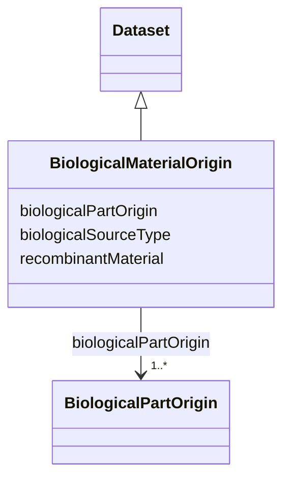

# Class: Biological material origin (BiologicalMaterialOrigin)


_Information about the origin of the biological material, compulsory for access, utilization, and benefit-sharing of genetic resources in compliance with the Nagoya Protocol_


URI: [EVORA:BiologicalMaterialOrigin](https://evora-project.eu/BiologicalMaterialOrigin)





## Inheritance
* [Dataset](Dataset.md)
    * **BiologicalMaterialOrigin**


## Slots

| Name | Cardinality and Range | Description | Inheritance |
| ---  | --- | --- | --- |
| [recombinantMaterial](recombinantMaterial.md) | 1 <br/> [Boolean](Boolean.md) | Indicates if this biological material is a recombinant biological material | direct |
| [biologicalSourceType](biologicalSourceType.md) | 1 <br/> [Boolean](Boolean.md) | Defines if the current biological material is natural and was collected or if... | direct |
| [biologicalPartOrigin](biologicalPartOrigin.md) | 1..* <br/> [BiologicalPartOrigin](BiologicalPartOrigin.md) | Details the origin of one or more unitary parts that make up the biological m... | direct |


## Usages

| used by | used in | type | used |
| ---  | --- | --- | --- |
| [Protein](Protein.md) | [biologicalMaterialOrigin](biologicalMaterialOrigin.md) | range | [BiologicalMaterialOrigin](BiologicalMaterialOrigin.md) |
| [NucleicAcid](NucleicAcid.md) | [biologicalMaterialOrigin](biologicalMaterialOrigin.md) | range | [BiologicalMaterialOrigin](BiologicalMaterialOrigin.md) |
| [Pathogen](Pathogen.md) | [biologicalMaterialOrigin](biologicalMaterialOrigin.md) | range | [BiologicalMaterialOrigin](BiologicalMaterialOrigin.md) |
| [Virus](Virus.md) | [biologicalMaterialOrigin](biologicalMaterialOrigin.md) | range | [BiologicalMaterialOrigin](BiologicalMaterialOrigin.md) |
| [Bacterium](Bacterium.md) | [biologicalMaterialOrigin](biologicalMaterialOrigin.md) | range | [BiologicalMaterialOrigin](BiologicalMaterialOrigin.md) |
| [Fungus](Fungus.md) | [biologicalMaterialOrigin](biologicalMaterialOrigin.md) | range | [BiologicalMaterialOrigin](BiologicalMaterialOrigin.md) |
| [Protozoan](Protozoan.md) | [biologicalMaterialOrigin](biologicalMaterialOrigin.md) | range | [BiologicalMaterialOrigin](BiologicalMaterialOrigin.md) |
| [Viroid](Viroid.md) | [biologicalMaterialOrigin](biologicalMaterialOrigin.md) | range | [BiologicalMaterialOrigin](BiologicalMaterialOrigin.md) |
| [Prion](Prion.md) | [biologicalMaterialOrigin](biologicalMaterialOrigin.md) | range | [BiologicalMaterialOrigin](BiologicalMaterialOrigin.md) |


## Identifier and Mapping Information


### Schema Source


* from schema: https://evora-project.eu/


## Mappings

| Mapping Type | Mapped Value |
| ---  | ---  |
| self | EVORA:BiologicalMaterialOrigin |
| native | EVORA:BiologicalMaterialOrigin |


## LinkML Source

<!-- TODO: investigate https://stackoverflow.com/questions/37606292/how-to-create-tabbed-code-blocks-in-mkdocs-or-sphinx -->

### Direct

<details>
```yaml
name: BiologicalMaterialOrigin
description: Information about the origin of the biological material, compulsory for
  access, utilization, and benefit-sharing of genetic resources in compliance with
  the Nagoya Protocol
title: Biological material origin
from_schema: https://evora-project.eu/
is_a: Dataset
slots:
- recombinantMaterial
- biologicalSourceType
- biologicalPartOrigin
slot_usage:
  recombinantMaterial:
    name: recombinantMaterial
    description: Indicates if this biological material is a recombinant biological
      material.
    title: recombinant material
    ifabsent: 'false'
    range: boolean
    required: true
    multivalued: false
  biologicalSourceType:
    name: biologicalSourceType
    description: Defines if the current biological material is natural and was collected
      or if it is a synthetic biological material. It makes sense that only recombinant
      biological materials can have a mixed material origin!
    title: biological source type
    comments:
    - It makes sense that only recombinant biological materials can have a mixed material
      origin!
    range: boolean
    required: true
    multivalued: false
  biologicalPartOrigin:
    name: biologicalPartOrigin
    description: Details the origin of one or more unitary parts that make up the
      biological material. In the case of recombinant biological material, multiple
      parts may be involved.
    title: biological part origin
    comments:
    - It can be multiple parts in case of a recombinant biological material.
    range: BiologicalPartOrigin
    required: true
    multivalued: true

```
</details>

### Induced

<details>
```yaml
name: BiologicalMaterialOrigin
description: Information about the origin of the biological material, compulsory for
  access, utilization, and benefit-sharing of genetic resources in compliance with
  the Nagoya Protocol
title: Biological material origin
from_schema: https://evora-project.eu/
is_a: Dataset
slot_usage:
  recombinantMaterial:
    name: recombinantMaterial
    description: Indicates if this biological material is a recombinant biological
      material.
    title: recombinant material
    ifabsent: 'false'
    range: boolean
    required: true
    multivalued: false
  biologicalSourceType:
    name: biologicalSourceType
    description: Defines if the current biological material is natural and was collected
      or if it is a synthetic biological material. It makes sense that only recombinant
      biological materials can have a mixed material origin!
    title: biological source type
    comments:
    - It makes sense that only recombinant biological materials can have a mixed material
      origin!
    range: boolean
    required: true
    multivalued: false
  biologicalPartOrigin:
    name: biologicalPartOrigin
    description: Details the origin of one or more unitary parts that make up the
      biological material. In the case of recombinant biological material, multiple
      parts may be involved.
    title: biological part origin
    comments:
    - It can be multiple parts in case of a recombinant biological material.
    range: BiologicalPartOrigin
    required: true
    multivalued: true
attributes:
  recombinantMaterial:
    name: recombinantMaterial
    description: Indicates if this biological material is a recombinant biological
      material.
    title: recombinant material
    from_schema: https://evora-project.eu/
    rank: 1000
    ifabsent: 'false'
    alias: recombinantMaterial
    owner: BiologicalMaterialOrigin
    domain_of:
    - BiologicalMaterialOrigin
    range: boolean
    required: true
    multivalued: false
  biologicalSourceType:
    name: biologicalSourceType
    description: Defines if the current biological material is natural and was collected
      or if it is a synthetic biological material. It makes sense that only recombinant
      biological materials can have a mixed material origin!
    title: biological source type
    comments:
    - It makes sense that only recombinant biological materials can have a mixed material
      origin!
    from_schema: https://evora-project.eu/
    rank: 1000
    alias: biologicalSourceType
    owner: BiologicalMaterialOrigin
    domain_of:
    - BiologicalMaterialOrigin
    range: boolean
    required: true
    multivalued: false
  biologicalPartOrigin:
    name: biologicalPartOrigin
    description: Details the origin of one or more unitary parts that make up the
      biological material. In the case of recombinant biological material, multiple
      parts may be involved.
    title: biological part origin
    comments:
    - It can be multiple parts in case of a recombinant biological material.
    from_schema: https://evora-project.eu/
    rank: 1000
    alias: biologicalPartOrigin
    owner: BiologicalMaterialOrigin
    domain_of:
    - BiologicalMaterialOrigin
    range: BiologicalPartOrigin
    required: true
    multivalued: true

```
</details>