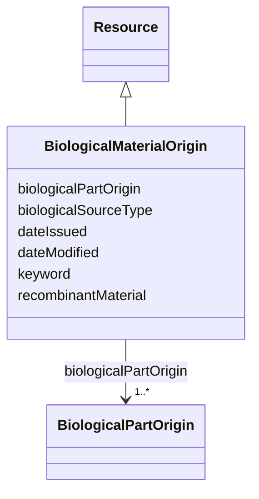

# Class: Biological material origin (BiologicalMaterialOrigin) 


_Information about the origin of the biological material, compulsory for access, utilization, and benefit-sharing of genetic resources in compliance with the Nagoya Protocol_


URI: [EVORAO:BiologicalMaterialOrigin](https://w3id.org/evorao/BiologicalMaterialOrigin)





## Inheritance
* [Resource](Resource.md)
    * **BiologicalMaterialOrigin**


## Slots

| Name | Cardinality and Range | Description | Inheritance |
| ---  | --- | --- | --- |
| [recombinantMaterial](recombinantMaterial.md) | 1 <br/> [Boolean](Boolean.md) | Indicates if this biological material is a recombinant biological material | direct |
| [biologicalSourceType](biologicalSourceType.md) | 1 <br/> [Boolean](Boolean.md) | Defines if the current biological material is natural and was collected or if... | direct |
| [biologicalPartOrigin](biologicalPartOrigin.md) | 1..* <br/> [BiologicalPartOrigin](BiologicalPartOrigin.md) | Details the origin of one or more unitary parts that make up the biological m... | direct |
| [keyword](keyword.md) | * <br/> [String](String.md) | A keyword or tag describing the resource | [Resource](Resource.md) |
| [dateIssued](dateIssued.md) | 0..1 <br/> [Datetime](Datetime.md) | Date of formal issuance (e | [Resource](Resource.md) |
| [dateModified](dateModified.md) | 0..1 <br/> [Datetime](Datetime.md) | Most recent date on which the resource was changed, updated or modified | [Resource](Resource.md) |


## Usages

| used by | used in | type | used |
| ---  | --- | --- | --- |
| [Protein](Protein.md) | [biologicalMaterialOrigin](biologicalMaterialOrigin.md) | range | [BiologicalMaterialOrigin](BiologicalMaterialOrigin.md) |
| [NucleicAcid](NucleicAcid.md) | [biologicalMaterialOrigin](biologicalMaterialOrigin.md) | range | [BiologicalMaterialOrigin](BiologicalMaterialOrigin.md) |
| [Pathogen](Pathogen.md) | [biologicalMaterialOrigin](biologicalMaterialOrigin.md) | range | [BiologicalMaterialOrigin](BiologicalMaterialOrigin.md) |
| [Virus](Virus.md) | [biologicalMaterialOrigin](biologicalMaterialOrigin.md) | range | [BiologicalMaterialOrigin](BiologicalMaterialOrigin.md) |
| [Bacterium](Bacterium.md) | [biologicalMaterialOrigin](biologicalMaterialOrigin.md) | range | [BiologicalMaterialOrigin](BiologicalMaterialOrigin.md) |
| [Fungus](Fungus.md) | [biologicalMaterialOrigin](biologicalMaterialOrigin.md) | range | [BiologicalMaterialOrigin](BiologicalMaterialOrigin.md) |
| [Protozoan](Protozoan.md) | [biologicalMaterialOrigin](biologicalMaterialOrigin.md) | range | [BiologicalMaterialOrigin](BiologicalMaterialOrigin.md) |
| [Viroid](Viroid.md) | [biologicalMaterialOrigin](biologicalMaterialOrigin.md) | range | [BiologicalMaterialOrigin](BiologicalMaterialOrigin.md) |
| [Prion](Prion.md) | [biologicalMaterialOrigin](biologicalMaterialOrigin.md) | range | [BiologicalMaterialOrigin](BiologicalMaterialOrigin.md) |


## Identifier and Mapping Information


### Schema Source


* from schema: https://w3id.org/evorao/


## Mappings

| Mapping Type | Mapped Value |
| ---  | ---  |
| self | EVORAO:BiologicalMaterialOrigin |
| native | EVORAO:BiologicalMaterialOrigin |
| related | snomed:115668003, snomed:115668003 |
| close | sepio:0000058, sepio:0000058 |


## LinkML Source

<!-- TODO: investigate https://stackoverflow.com/questions/37606292/how-to-create-tabbed-code-blocks-in-mkdocs-or-sphinx -->

### Direct

<details>
```yaml
name: BiologicalMaterialOrigin
description: Information about the origin of the biological material, compulsory for
  access, utilization, and benefit-sharing of genetic resources in compliance with
  the Nagoya Protocol
title: Biological material origin
from_schema: https://w3id.org/evorao/
close_mappings:
- sepio:0000058
- sepio:0000058
related_mappings:
- snomed:115668003
- snomed:115668003
is_a: Resource
slots:
- recombinantMaterial
- biologicalSourceType
- biologicalPartOrigin
slot_usage:
  recombinantMaterial:
    name: recombinantMaterial
    description: Indicates if this biological material is a recombinant biological
      material.
    title: recombinant material
    ifabsent: 'false'
    domain_of:
    - BiologicalMaterialOrigin
    range: boolean
    required: true
    multivalued: false
  biologicalSourceType:
    name: biologicalSourceType
    description: Defines if the current biological material is natural and was collected
      or if it is a synthetic biological material. It makes sense that only recombinant
      biological materials can have a mixed material origin!
    title: biological source type
    comments:
    - It makes sense that only recombinant biological materials can have a mixed material
      origin!
    domain_of:
    - BiologicalMaterialOrigin
    range: boolean
    required: true
    multivalued: false
  biologicalPartOrigin:
    name: biologicalPartOrigin
    description: Details the origin of one or more unitary parts that make up the
      biological material. In the case of recombinant biological material, multiple
      parts may be involved.
    title: biological part origin
    comments:
    - It can be multiple parts in case of a recombinant biological material.
    related_mappings:
    - schema:hasBioChemEntityPart
    domain_of:
    - BiologicalMaterialOrigin
    range: BiologicalPartOrigin
    required: true
    multivalued: true

```
</details>

### Induced

<details>
```yaml
name: BiologicalMaterialOrigin
description: Information about the origin of the biological material, compulsory for
  access, utilization, and benefit-sharing of genetic resources in compliance with
  the Nagoya Protocol
title: Biological material origin
from_schema: https://w3id.org/evorao/
close_mappings:
- sepio:0000058
- sepio:0000058
related_mappings:
- snomed:115668003
- snomed:115668003
is_a: Resource
slot_usage:
  recombinantMaterial:
    name: recombinantMaterial
    description: Indicates if this biological material is a recombinant biological
      material.
    title: recombinant material
    ifabsent: 'false'
    domain_of:
    - BiologicalMaterialOrigin
    range: boolean
    required: true
    multivalued: false
  biologicalSourceType:
    name: biologicalSourceType
    description: Defines if the current biological material is natural and was collected
      or if it is a synthetic biological material. It makes sense that only recombinant
      biological materials can have a mixed material origin!
    title: biological source type
    comments:
    - It makes sense that only recombinant biological materials can have a mixed material
      origin!
    domain_of:
    - BiologicalMaterialOrigin
    range: boolean
    required: true
    multivalued: false
  biologicalPartOrigin:
    name: biologicalPartOrigin
    description: Details the origin of one or more unitary parts that make up the
      biological material. In the case of recombinant biological material, multiple
      parts may be involved.
    title: biological part origin
    comments:
    - It can be multiple parts in case of a recombinant biological material.
    related_mappings:
    - schema:hasBioChemEntityPart
    domain_of:
    - BiologicalMaterialOrigin
    range: BiologicalPartOrigin
    required: true
    multivalued: true
attributes:
  recombinantMaterial:
    name: recombinantMaterial
    description: Indicates if this biological material is a recombinant biological
      material.
    title: recombinant material
    from_schema: https://w3id.org/evorao/
    rank: 1000
    ifabsent: 'false'
    alias: recombinantMaterial
    owner: BiologicalMaterialOrigin
    domain_of:
    - BiologicalMaterialOrigin
    range: boolean
    required: true
    multivalued: false
  biologicalSourceType:
    name: biologicalSourceType
    description: Defines if the current biological material is natural and was collected
      or if it is a synthetic biological material. It makes sense that only recombinant
      biological materials can have a mixed material origin!
    title: biological source type
    comments:
    - It makes sense that only recombinant biological materials can have a mixed material
      origin!
    from_schema: https://w3id.org/evorao/
    rank: 1000
    alias: biologicalSourceType
    owner: BiologicalMaterialOrigin
    domain_of:
    - BiologicalMaterialOrigin
    range: boolean
    required: true
    multivalued: false
  biologicalPartOrigin:
    name: biologicalPartOrigin
    description: Details the origin of one or more unitary parts that make up the
      biological material. In the case of recombinant biological material, multiple
      parts may be involved.
    title: biological part origin
    comments:
    - It can be multiple parts in case of a recombinant biological material.
    from_schema: https://w3id.org/evorao/
    related_mappings:
    - schema:hasBioChemEntityPart
    rank: 1000
    alias: biologicalPartOrigin
    owner: BiologicalMaterialOrigin
    domain_of:
    - BiologicalMaterialOrigin
    range: BiologicalPartOrigin
    required: true
    multivalued: true
  keyword:
    name: keyword
    description: A keyword or tag describing the resource
    title: keyword
    from_schema: https://w3id.org/evorao/
    rank: 1000
    slot_uri: dcat:keyword
    alias: keyword
    owner: BiologicalMaterialOrigin
    domain_of:
    - Resource
    range: string
    required: false
    multivalued: true
  dateIssued:
    name: dateIssued
    description: Date of formal issuance (e.g., publication) of the resource
    title: date issued
    comments:
    - encoded using the relevant ISO 8601 Date and Time compliant string [DATETIME]
    from_schema: https://w3id.org/evorao/
    exact_mappings:
    - sepio:0000051
    close_mappings:
    - schema:datePublished
    - schema:dateCreated
    rank: 1000
    slot_uri: dct:issued
    alias: dateIssued
    owner: BiologicalMaterialOrigin
    domain_of:
    - Resource
    range: datetime
    required: false
    multivalued: false
  dateModified:
    name: dateModified
    description: Most recent date on which the resource was changed, updated or modified
    title: date modified
    comments:
    - encoded using the relevant ISO 8601 Date and Time compliant string [DATETIME]
    from_schema: https://w3id.org/evorao/
    exact_mappings:
    - sepio:0000036
    close_mappings:
    - schema:dateModified
    rank: 1000
    slot_uri: dct:modified
    alias: dateModified
    owner: BiologicalMaterialOrigin
    domain_of:
    - Resource
    range: datetime
    required: false
    multivalued: false

```
</details>