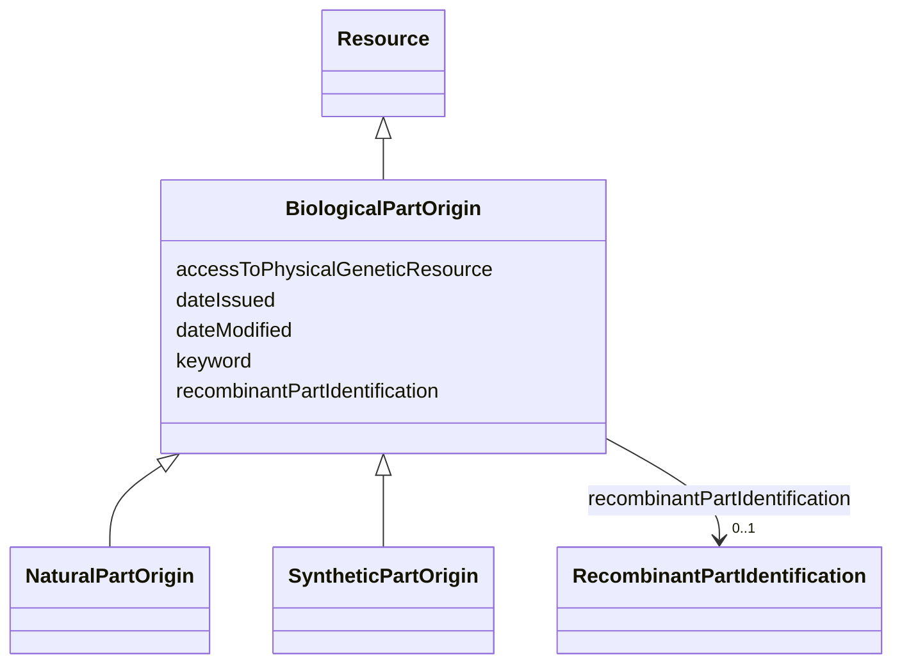

# Class: Biological part origin (BiologicalPartOrigin) 


_Information on the origin of a unitary, cohesive part that is part of, or constitutes the biological material. It can be multiple parts in case of a recombinant biological material_


* __NOTE__: this is an abstract class and should not be instantiated directly


URI: [EVORAO:BiologicalPartOrigin](https://w3id.org/evorao/BiologicalPartOrigin)





## Inheritance
* [Resource](Resource.md)
    * **BiologicalPartOrigin**
        * [NaturalPartOrigin](NaturalPartOrigin.md)
        * [SyntheticPartOrigin](SyntheticPartOrigin.md)


## Slots

| Name | Cardinality and Range | Description | Inheritance |
| ---  | --- | --- | --- |
| [recombinantPartIdentification](recombinantPartIdentification.md) | 0..1 <br/> [RecombinantPartIdentification](RecombinantPartIdentification.md) | Identification of a recombinant part | direct |
| [accessToPhysicalGeneticResource](accessToPhysicalGeneticResource.md) | 1 <br/> [Boolean](Boolean.md) | Indicate if the biological part was produced with access to a physical geneti... | direct |
| [keyword](keyword.md) | * <br/> [String](String.md) | A keyword or tag describing the resource | [Resource](Resource.md) |
| [dateIssued](dateIssued.md) | 0..1 <br/> [Datetime](Datetime.md) | Date of formal issuance (e | [Resource](Resource.md) |
| [dateModified](dateModified.md) | 0..1 <br/> [Datetime](Datetime.md) | Most recent date on which the resource was changed, updated or modified | [Resource](Resource.md) |


## Usages

| used by | used in | type | used |
| ---  | --- | --- | --- |
| [BiologicalMaterialOrigin](BiologicalMaterialOrigin.md) | [biologicalPartOrigin](biologicalPartOrigin.md) | range | [BiologicalPartOrigin](BiologicalPartOrigin.md) |


## Identifier and Mapping Information


### Schema Source


* from schema: https://w3id.org/evorao/


## Mappings

| Mapping Type | Mapped Value |
| ---  | ---  |
| self | EVORAO:BiologicalPartOrigin |
| native | EVORAO:BiologicalPartOrigin |
| broad | sepio:0000058, sepio:0000058 |


## LinkML Source

<!-- TODO: investigate https://stackoverflow.com/questions/37606292/how-to-create-tabbed-code-blocks-in-mkdocs-or-sphinx -->

### Direct

<details>
```yaml
name: BiologicalPartOrigin
description: Information on the origin of a unitary, cohesive part that is part of,
  or constitutes the biological material. It can be multiple parts in case of a recombinant
  biological material
title: Biological part origin
from_schema: https://w3id.org/evorao/
broad_mappings:
- sepio:0000058
- sepio:0000058
is_a: Resource
abstract: true
slots:
- recombinantPartIdentification
- accessToPhysicalGeneticResource
slot_usage:
  recombinantPartIdentification:
    name: recombinantPartIdentification
    description: Identification of a recombinant part
    title: recombinant part identification
    comments:
    - Information not required if the current biological part constitutes the complete
      biological material
    domain_of:
    - BiologicalPartOrigin
    range: RecombinantPartIdentification
    required: false
    multivalued: false
  accessToPhysicalGeneticResource:
    name: accessToPhysicalGeneticResource
    description: Indicate if the biological part was produced with access to a physical
      genetic resource
    title: access to physical genetic resource
    domain_of:
    - BiologicalPartOrigin
    range: boolean
    required: true
    multivalued: false

```
</details>

### Induced

<details>
```yaml
name: BiologicalPartOrigin
description: Information on the origin of a unitary, cohesive part that is part of,
  or constitutes the biological material. It can be multiple parts in case of a recombinant
  biological material
title: Biological part origin
from_schema: https://w3id.org/evorao/
broad_mappings:
- sepio:0000058
- sepio:0000058
is_a: Resource
abstract: true
slot_usage:
  recombinantPartIdentification:
    name: recombinantPartIdentification
    description: Identification of a recombinant part
    title: recombinant part identification
    comments:
    - Information not required if the current biological part constitutes the complete
      biological material
    domain_of:
    - BiologicalPartOrigin
    range: RecombinantPartIdentification
    required: false
    multivalued: false
  accessToPhysicalGeneticResource:
    name: accessToPhysicalGeneticResource
    description: Indicate if the biological part was produced with access to a physical
      genetic resource
    title: access to physical genetic resource
    domain_of:
    - BiologicalPartOrigin
    range: boolean
    required: true
    multivalued: false
attributes:
  recombinantPartIdentification:
    name: recombinantPartIdentification
    description: Identification of a recombinant part
    title: recombinant part identification
    comments:
    - Information not required if the current biological part constitutes the complete
      biological material
    from_schema: https://w3id.org/evorao/
    rank: 1000
    alias: recombinantPartIdentification
    owner: BiologicalPartOrigin
    domain_of:
    - BiologicalPartOrigin
    range: RecombinantPartIdentification
    required: false
    multivalued: false
  accessToPhysicalGeneticResource:
    name: accessToPhysicalGeneticResource
    description: Indicate if the biological part was produced with access to a physical
      genetic resource
    title: access to physical genetic resource
    from_schema: https://w3id.org/evorao/
    rank: 1000
    alias: accessToPhysicalGeneticResource
    owner: BiologicalPartOrigin
    domain_of:
    - BiologicalPartOrigin
    range: boolean
    required: true
    multivalued: false
  keyword:
    name: keyword
    description: A keyword or tag describing the resource
    title: keyword
    from_schema: https://w3id.org/evorao/
    rank: 1000
    slot_uri: dcat:keyword
    alias: keyword
    owner: BiologicalPartOrigin
    domain_of:
    - Resource
    range: string
    required: false
    multivalued: true
  dateIssued:
    name: dateIssued
    description: Date of formal issuance (e.g., publication) of the resource
    title: date issued
    comments:
    - encoded using the relevant ISO 8601 Date and Time compliant string [DATETIME]
    from_schema: https://w3id.org/evorao/
    exact_mappings:
    - sepio:0000051
    close_mappings:
    - schema:datePublished
    - schema:dateCreated
    rank: 1000
    slot_uri: dct:issued
    alias: dateIssued
    owner: BiologicalPartOrigin
    domain_of:
    - Resource
    range: datetime
    required: false
    multivalued: false
  dateModified:
    name: dateModified
    description: Most recent date on which the resource was changed, updated or modified
    title: date modified
    comments:
    - encoded using the relevant ISO 8601 Date and Time compliant string [DATETIME]
    from_schema: https://w3id.org/evorao/
    exact_mappings:
    - sepio:0000036
    close_mappings:
    - schema:dateModified
    rank: 1000
    slot_uri: dct:modified
    alias: dateModified
    owner: BiologicalPartOrigin
    domain_of:
    - Resource
    range: datetime
    required: false
    multivalued: false

```
</details>