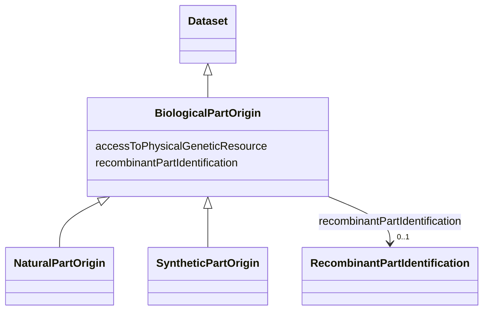

# Class: Biological part origin (BiologicalPartOrigin)


_Information on the origin of a unitary, cohesive part that is part of, or constitutes the biological material. It can be multiple parts in case of a recombinant biological material_


* __NOTE__: this is an abstract class and should not be instantiated directly


URI: [EVORAO:BiologicalPartOrigin](https://raw.githubusercontent.com/EVORA-project/evora-ontology/refs/heads/main/models/owl/evora_ontology.owl.ttl#BiologicalPartOrigin)





## Inheritance
* [Dataset](Dataset.md)
    * **BiologicalPartOrigin**
        * [NaturalPartOrigin](NaturalPartOrigin.md)
        * [SyntheticPartOrigin](SyntheticPartOrigin.md)


## Slots

| Name | Cardinality and Range | Description | Inheritance |
| ---  | --- | --- | --- |
| [recombinantPartIdentification](recombinantPartIdentification.md) | 0..1 <br/> [RecombinantPartIdentification](RecombinantPartIdentification.md) | Identification of a recombinant part | direct |
| [accessToPhysicalGeneticResource](accessToPhysicalGeneticResource.md) | 1 <br/> [Boolean](Boolean.md) | Reference of the permit identifiers for access to the genetic resource, appli... | direct |


## Usages

| used by | used in | type | used |
| ---  | --- | --- | --- |
| [BiologicalMaterialOrigin](BiologicalMaterialOrigin.md) | [biologicalPartOrigin](biologicalPartOrigin.md) | range | [BiologicalPartOrigin](BiologicalPartOrigin.md) |


## Identifier and Mapping Information


### Schema Source


* from schema: https://raw.githubusercontent.com/EVORA-project/evora-ontology/refs/heads/main/models/owl/evora_ontology.owl.ttl#


## Mappings

| Mapping Type | Mapped Value |
| ---  | ---  |
| self | EVORAO:BiologicalPartOrigin |
| native | EVORAO:BiologicalPartOrigin |


## LinkML Source

<!-- TODO: investigate https://stackoverflow.com/questions/37606292/how-to-create-tabbed-code-blocks-in-mkdocs-or-sphinx -->

### Direct

<details>
```yaml
name: BiologicalPartOrigin
description: Information on the origin of a unitary, cohesive part that is part of,
  or constitutes the biological material. It can be multiple parts in case of a recombinant
  biological material
title: Biological part origin
from_schema: https://raw.githubusercontent.com/EVORA-project/evora-ontology/refs/heads/main/models/owl/evora_ontology.owl.ttl#
is_a: Dataset
abstract: true
slots:
- recombinantPartIdentification
- accessToPhysicalGeneticResource
slot_usage:
  recombinantPartIdentification:
    name: recombinantPartIdentification
    description: Identification of a recombinant part
    title: recombinant part identification
    comments:
    - Information not required if the current biological part constitutes the complete
      biological material
    range: RecombinantPartIdentification
    required: false
    multivalued: false
  accessToPhysicalGeneticResource:
    name: accessToPhysicalGeneticResource
    description: Reference of the permit identifiers for access to the genetic resource,
      applicable if the genetic resource falls under Access and Benefit-Sharing (ABS)
      regulations
    title: access to physical genetic resource
    range: boolean
    required: true
    multivalued: false

```
</details>

### Induced

<details>
```yaml
name: BiologicalPartOrigin
description: Information on the origin of a unitary, cohesive part that is part of,
  or constitutes the biological material. It can be multiple parts in case of a recombinant
  biological material
title: Biological part origin
from_schema: https://raw.githubusercontent.com/EVORA-project/evora-ontology/refs/heads/main/models/owl/evora_ontology.owl.ttl#
is_a: Dataset
abstract: true
slot_usage:
  recombinantPartIdentification:
    name: recombinantPartIdentification
    description: Identification of a recombinant part
    title: recombinant part identification
    comments:
    - Information not required if the current biological part constitutes the complete
      biological material
    range: RecombinantPartIdentification
    required: false
    multivalued: false
  accessToPhysicalGeneticResource:
    name: accessToPhysicalGeneticResource
    description: Reference of the permit identifiers for access to the genetic resource,
      applicable if the genetic resource falls under Access and Benefit-Sharing (ABS)
      regulations
    title: access to physical genetic resource
    range: boolean
    required: true
    multivalued: false
attributes:
  recombinantPartIdentification:
    name: recombinantPartIdentification
    description: Identification of a recombinant part
    title: recombinant part identification
    comments:
    - Information not required if the current biological part constitutes the complete
      biological material
    from_schema: https://raw.githubusercontent.com/EVORA-project/evora-ontology/refs/heads/main/models/owl/evora_ontology.owl.ttl#
    rank: 1000
    alias: recombinantPartIdentification
    owner: BiologicalPartOrigin
    domain_of:
    - BiologicalPartOrigin
    range: RecombinantPartIdentification
    required: false
    multivalued: false
  accessToPhysicalGeneticResource:
    name: accessToPhysicalGeneticResource
    description: Reference of the permit identifiers for access to the genetic resource,
      applicable if the genetic resource falls under Access and Benefit-Sharing (ABS)
      regulations
    title: access to physical genetic resource
    from_schema: https://raw.githubusercontent.com/EVORA-project/evora-ontology/refs/heads/main/models/owl/evora_ontology.owl.ttl#
    rank: 1000
    alias: accessToPhysicalGeneticResource
    owner: BiologicalPartOrigin
    domain_of:
    - BiologicalPartOrigin
    range: boolean
    required: true
    multivalued: false

```
</details>