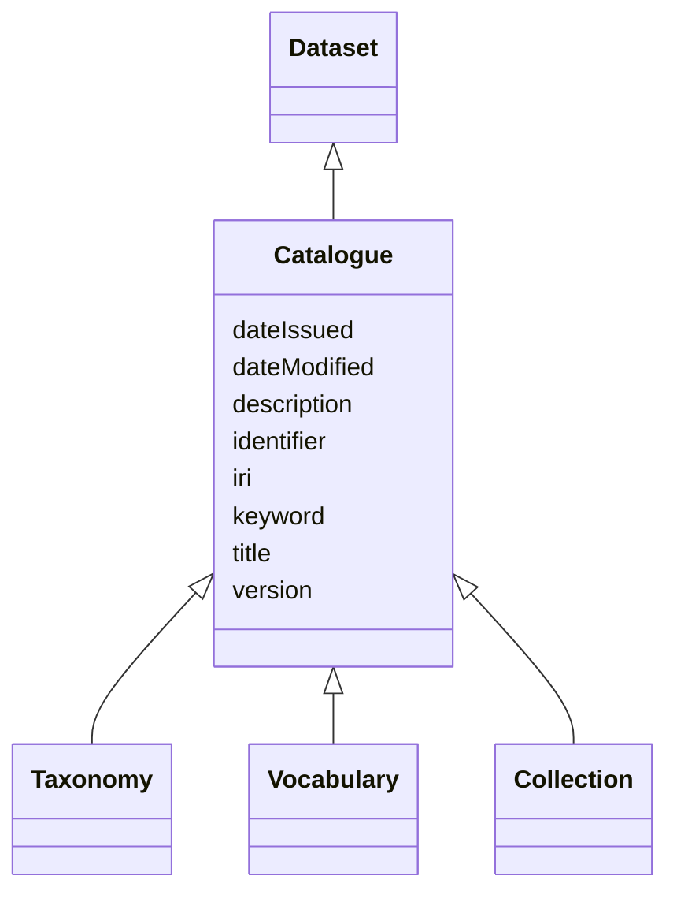

# Class: Catalogue (Catalogue) 


_A curated collection of metadata about resources_


* __NOTE__: this is an abstract class and should not be instantiated directly


URI: [dcat:Catalog](http://www.w3.org/ns/dcat#Catalog)





## Inheritance
* [Resource](Resource.md)
    * [Dataset](Dataset.md)
        * **Catalogue**
            * [Taxonomy](Taxonomy.md)
            * [Vocabulary](Vocabulary.md)
            * [Collection](Collection.md)


## Slots

| Name | Cardinality and Range | Description | Inheritance |
| ---  | --- | --- | --- |
| [title](title.md) | 1 <br/> [String](String.md) | A name given to the resource | [Dataset](Dataset.md) |
| [description](description.md) | 1 _recommended_ <br/> [String](String.md) | A short explanation of the characteristics, features, or nature of the curren... | [Dataset](Dataset.md) |
| [version](version.md) | 0..1 _recommended_ <br/> [String](String.md) | The version indicator (name or identifier) of a resource | [Dataset](Dataset.md) |
| [keyword](keyword.md) | * <br/> [String](String.md) | A keyword or tag describing the resource | [Resource](Resource.md) |
| [dateIssued](dateIssued.md) | 0..1 <br/> [Datetime](Datetime.md) | Date of formal issuance (e | [Resource](Resource.md) |
| [dateModified](dateModified.md) | 0..1 <br/> [Datetime](Datetime.md) | Most recent date on which the resource was changed, updated or modified | [Resource](Resource.md) |
| [identifier](identifier.md) | * <br/> [String](String.md) | A unique identifier of the resource being described or cataloged | [Resource](Resource.md) |
| [iri](iri.md) | * <br/> [Uri](Uri.md) | International Resource Identifier (IRI) that uniquely identifies or refers to... | [Resource](Resource.md) |


## Identifier and Mapping Information


### Schema Source


* from schema: https://w3id.org/evorao/


## Mappings

| Mapping Type | Mapped Value |
| ---  | ---  |
| self | dcat:Catalog |
| native | EVORAO:Catalogue |
| exact | schema:DataCatalog, schema:DataCatalog |
| close | wd:Q2352616, skos:Collection, wd:Q2352616, skos:Collection |


## LinkML Source

<!-- TODO: investigate https://stackoverflow.com/questions/37606292/how-to-create-tabbed-code-blocks-in-mkdocs-or-sphinx -->

### Direct

<details>
```yaml
name: Catalogue
description: A curated collection of metadata about resources
title: Catalogue
from_schema: https://w3id.org/evorao/
exact_mappings:
- schema:DataCatalog
- schema:DataCatalog
close_mappings:
- wd:Q2352616
- skos:Collection
- wd:Q2352616
- skos:Collection
is_a: Dataset
abstract: true
class_uri: dcat:Catalog

```
</details>

### Induced

<details>
```yaml
name: Catalogue
description: A curated collection of metadata about resources
title: Catalogue
from_schema: https://w3id.org/evorao/
exact_mappings:
- schema:DataCatalog
- schema:DataCatalog
close_mappings:
- wd:Q2352616
- skos:Collection
- wd:Q2352616
- skos:Collection
is_a: Dataset
abstract: true
attributes:
  title:
    name: title
    description: A name given to the resource
    title: title
    comments:
    - 'The title of the item should be as short and descriptive as possible. E.g.
      for virus products it should basically be based on the following Pattern: ''Virus
      name'', ''virus host type'', ''collection year'', ''country of collection''
      ex ''suspected epidemiological origin'', ''genotype'', ''strain'', ''variant
      name or specific feature'
    from_schema: https://w3id.org/evorao/
    exact_mappings:
    - schema:name
    - rdfs:label
    rank: 1000
    slot_uri: dct:title
    alias: title
    owner: Catalogue
    domain_of:
    - Dataset
    - DataService
    - Publication
    - Term
    - License
    - Certification
    range: string
    required: true
    multivalued: false
  description:
    name: description
    description: A short explanation of the characteristics, features, or nature of
      the current item
    title: description
    comments:
    - Describe this item in few lines. This description will serve as a summary to
      present the resource.
    from_schema: https://w3id.org/evorao/
    exact_mappings:
    - schema:description
    close_mappings:
    - schema:description
    rank: 1000
    slot_uri: dct:description
    alias: description
    owner: Catalogue
    domain_of:
    - Dataset
    - DataService
    - Term
    - PersonOrOrganization
    - File
    - ContactPoint
    - License
    - Certification
    range: string
    required: true
    recommended: true
    multivalued: false
  version:
    name: version
    description: The version indicator (name or identifier) of a resource
    title: version
    from_schema: https://w3id.org/evorao/
    exact_mappings:
    - pav:version
    close_mappings:
    - wdp:P393
    - schema:version
    related_mappings:
    - schema:identifier
    rank: 1000
    slot_uri: dcat:version
    alias: version
    owner: Catalogue
    domain_of:
    - Dataset
    - Version
    - Taxonomy
    range: string
    required: false
    recommended: true
    multivalued: false
  keyword:
    name: keyword
    description: A keyword or tag describing the resource
    title: keyword
    from_schema: https://w3id.org/evorao/
    rank: 1000
    slot_uri: dcat:keyword
    alias: keyword
    owner: Catalogue
    domain_of:
    - Resource
    range: string
    required: false
    multivalued: true
  dateIssued:
    name: dateIssued
    description: Date of formal issuance (e.g., publication) of the resource
    title: date issued
    comments:
    - encoded using the relevant ISO 8601 Date and Time compliant string [DATETIME]
    from_schema: https://w3id.org/evorao/
    exact_mappings:
    - sepio:0000051
    close_mappings:
    - schema:datePublished
    - schema:dateCreated
    rank: 1000
    slot_uri: dct:issued
    alias: dateIssued
    owner: Catalogue
    domain_of:
    - Resource
    range: datetime
    required: false
    multivalued: false
  dateModified:
    name: dateModified
    description: Most recent date on which the resource was changed, updated or modified
    title: date modified
    comments:
    - encoded using the relevant ISO 8601 Date and Time compliant string [DATETIME]
    from_schema: https://w3id.org/evorao/
    exact_mappings:
    - sepio:0000036
    close_mappings:
    - schema:dateModified
    rank: 1000
    slot_uri: dct:modified
    alias: dateModified
    owner: Catalogue
    domain_of:
    - Resource
    range: datetime
    required: false
    multivalued: false
  identifier:
    name: identifier
    description: A unique identifier of the resource being described or cataloged
    title: identifier
    comments:
    - The identifier is a text string which is assigned to the resource to provide
      an unambiguous reference within a particular context. Persistent identifiers
      should be provided as HTTP URIs
    from_schema: https://w3id.org/evorao/
    exact_mappings:
    - schema:identifier
    rank: 1000
    slot_uri: dct:identifier
    alias: identifier
    owner: Catalogue
    domain_of:
    - Resource
    range: string
    required: false
    multivalued: true
  iri:
    name: iri
    description: International Resource Identifier (IRI) that uniquely identifies
      or refers to the resource. IRIs include URIs, and URIs include URLs
    title: IRI
    comments:
    - An IRI is a global identifier standardized by IETF RFC 3987. It may or may not
      be resolvable on the web. IRIs include URIs, and URIs include URLs
    from_schema: https://w3id.org/evorao/
    close_mappings:
    - biolink:iri
    related_mappings:
    - mi:url
    narrow_mappings:
    - schema:url
    rank: 1000
    is_a: identifier
    alias: iri
    owner: Catalogue
    domain_of:
    - Resource
    range: uri
    required: false
    multivalued: true
class_uri: dcat:Catalog

```
</details>