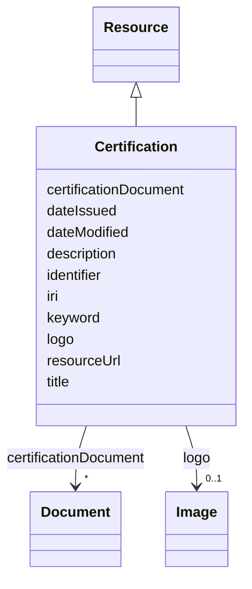

# Class: Certification (Certification) 


_Assurance given by an independent certification body that a product, service or system meets the requirements of a standard_


URI: [EVORAO:Certification](https://w3id.org/evorao/Certification)





## Inheritance
* [Resource](Resource.md)
    * **Certification**


## Slots

| Name | Cardinality and Range | Description | Inheritance |
| ---  | --- | --- | --- |
| [title](title.md) | 1 <br/> [String](String.md) | A name given to the resource | direct |
| [description](description.md) | 0..1 _recommended_ <br/> [String](String.md) | A short explanation of the characteristics, features, or nature of the curren... | direct |
| [logo](logo.md) | 0..1 <br/> [Image](Image.md) | A path or URL to the related logo | direct |
| [certificationDocument](certificationDocument.md) | * <br/> [Document](Document.md) | The document(s) issued by an authority certifying the conformity of the subje... | direct |
| [resourceUrl](resourceUrl.md) | 0..1 <br/> [Uri](Uri.md) | The web address or location where the details or content is stored and can be... | direct |
| [keyword](keyword.md) | * <br/> [String](String.md) | A keyword or tag describing the resource | [Resource](Resource.md) |
| [dateIssued](dateIssued.md) | 0..1 <br/> [Datetime](Datetime.md) | Date of formal issuance (e | [Resource](Resource.md) |
| [dateModified](dateModified.md) | 0..1 <br/> [Datetime](Datetime.md) | Most recent date on which the resource was changed, updated or modified | [Resource](Resource.md) |
| [identifier](identifier.md) | * <br/> [String](String.md) | A unique identifier of the resource being described or cataloged | [Resource](Resource.md) |
| [iri](iri.md) | * <br/> [Uri](Uri.md) | International Resource Identifier (IRI) that uniquely identifies or refers to... | [Resource](Resource.md) |


## Usages

| used by | used in | type | used |
| ---  | --- | --- | --- |
| [ProductOrService](ProductOrService.md) | [certification](certification.md) | range | [Certification](Certification.md) |
| [Service](Service.md) | [certification](certification.md) | range | [Certification](Certification.md) |
| [Product](Product.md) | [certification](certification.md) | range | [Certification](Certification.md) |
| [Antibody](Antibody.md) | [certification](certification.md) | range | [Certification](Certification.md) |
| [Hybridoma](Hybridoma.md) | [certification](certification.md) | range | [Certification](Certification.md) |
| [Protein](Protein.md) | [certification](certification.md) | range | [Certification](Certification.md) |
| [NucleicAcid](NucleicAcid.md) | [certification](certification.md) | range | [Certification](Certification.md) |
| [DetectionKit](DetectionKit.md) | [certification](certification.md) | range | [Certification](Certification.md) |
| [Bundle](Bundle.md) | [certification](certification.md) | range | [Certification](Certification.md) |
| [Pathogen](Pathogen.md) | [certification](certification.md) | range | [Certification](Certification.md) |
| [Virus](Virus.md) | [certification](certification.md) | range | [Certification](Certification.md) |
| [Bacterium](Bacterium.md) | [certification](certification.md) | range | [Certification](Certification.md) |
| [Fungus](Fungus.md) | [certification](certification.md) | range | [Certification](Certification.md) |
| [Protozoan](Protozoan.md) | [certification](certification.md) | range | [Certification](Certification.md) |
| [Viroid](Viroid.md) | [certification](certification.md) | range | [Certification](Certification.md) |
| [Prion](Prion.md) | [certification](certification.md) | range | [Certification](Certification.md) |


## Identifier and Mapping Information


### Schema Source


* from schema: https://w3id.org/evorao/


## Mappings

| Mapping Type | Mapped Value |
| ---  | ---  |
| self | EVORAO:Certification |
| native | EVORAO:Certification |
| exact | schema:Certification, schema:Certification |
| related | ncit:C43610, ncit:C43610 |
| close | wd:Q374814, wd:Q374814 |


## LinkML Source

<!-- TODO: investigate https://stackoverflow.com/questions/37606292/how-to-create-tabbed-code-blocks-in-mkdocs-or-sphinx -->

### Direct

<details>
```yaml
name: Certification
description: Assurance given by an independent certification body that a product,
  service or system meets the requirements of a standard
title: Certification
from_schema: https://w3id.org/evorao/
exact_mappings:
- schema:Certification
- schema:Certification
close_mappings:
- wd:Q374814
- wd:Q374814
related_mappings:
- ncit:C43610
- ncit:C43610
is_a: Resource
slots:
- title
- description
- logo
- certificationDocument
- resourceUrl
slot_usage:
  title:
    name: title
    description: A name given to the resource
    title: title
    comments:
    - 'The title of the item should be as short and descriptive as possible. E.g.
      for virus products it should basically be based on the following Pattern: ''Virus
      name'', ''virus host type'', ''collection year'', ''country of collection''
      ex ''suspected epidemiological origin'', ''genotype'', ''strain'', ''variant
      name or specific feature'
    exact_mappings:
    - schema:name
    - rdfs:label
    slot_uri: dct:title
    domain_of:
    - Certification
    - Dataset
    - DataService
    - Publication
    - Term
    - License
    - FundingSource
    range: string
    required: true
    multivalued: false
  description:
    name: description
    description: A short explanation of the characteristics, features, or nature of
      the current item
    title: description
    comments:
    - Describe this item in few lines. This description will serve as a summary to
      present the resource.
    exact_mappings:
    - schema:description
    slot_uri: dct:description
    domain_of:
    - Certification
    - Dataset
    - DataService
    - Term
    - PersonOrOrganization
    - File
    - ContactPoint
    - License
    - FundingSource
    range: string
    required: false
    recommended: true
    multivalued: false
  logo:
    name: logo
    description: A path or URL to the related logo
    title: logo
    exact_mappings:
    - schema:logo
    domain_of:
    - Certification
    - PersonOrOrganization
    - License
    range: Image
    required: false
    multivalued: false
  certificationDocument:
    name: certificationDocument
    description: The document(s) issued by an authority certifying the conformity
      of the subject to the applicable scheme, including, as the case may be, the
      documents attesting the equivalence to another certification scheme.
    title: certification document
    exact_mappings:
    - schema:associatedMedia
    domain_of:
    - Certification
    range: Document
    required: false
    multivalued: true
  resourceUrl:
    name: resourceUrl
    description: The web address or location where the details or content is stored
      and can be accessed or downloaded.
    title: resource URL
    exact_mappings:
    - schema:archivedAt
    broad_mappings:
    - schema:url
    domain_of:
    - Certification
    - License
    range: uri
    required: false
    multivalued: false

```
</details>

### Induced

<details>
```yaml
name: Certification
description: Assurance given by an independent certification body that a product,
  service or system meets the requirements of a standard
title: Certification
from_schema: https://w3id.org/evorao/
exact_mappings:
- schema:Certification
- schema:Certification
close_mappings:
- wd:Q374814
- wd:Q374814
related_mappings:
- ncit:C43610
- ncit:C43610
is_a: Resource
slot_usage:
  title:
    name: title
    description: A name given to the resource
    title: title
    comments:
    - 'The title of the item should be as short and descriptive as possible. E.g.
      for virus products it should basically be based on the following Pattern: ''Virus
      name'', ''virus host type'', ''collection year'', ''country of collection''
      ex ''suspected epidemiological origin'', ''genotype'', ''strain'', ''variant
      name or specific feature'
    exact_mappings:
    - schema:name
    - rdfs:label
    slot_uri: dct:title
    domain_of:
    - Certification
    - Dataset
    - DataService
    - Publication
    - Term
    - License
    - FundingSource
    range: string
    required: true
    multivalued: false
  description:
    name: description
    description: A short explanation of the characteristics, features, or nature of
      the current item
    title: description
    comments:
    - Describe this item in few lines. This description will serve as a summary to
      present the resource.
    exact_mappings:
    - schema:description
    slot_uri: dct:description
    domain_of:
    - Certification
    - Dataset
    - DataService
    - Term
    - PersonOrOrganization
    - File
    - ContactPoint
    - License
    - FundingSource
    range: string
    required: false
    recommended: true
    multivalued: false
  logo:
    name: logo
    description: A path or URL to the related logo
    title: logo
    exact_mappings:
    - schema:logo
    domain_of:
    - Certification
    - PersonOrOrganization
    - License
    range: Image
    required: false
    multivalued: false
  certificationDocument:
    name: certificationDocument
    description: The document(s) issued by an authority certifying the conformity
      of the subject to the applicable scheme, including, as the case may be, the
      documents attesting the equivalence to another certification scheme.
    title: certification document
    exact_mappings:
    - schema:associatedMedia
    domain_of:
    - Certification
    range: Document
    required: false
    multivalued: true
  resourceUrl:
    name: resourceUrl
    description: The web address or location where the details or content is stored
      and can be accessed or downloaded.
    title: resource URL
    exact_mappings:
    - schema:archivedAt
    broad_mappings:
    - schema:url
    domain_of:
    - Certification
    - License
    range: uri
    required: false
    multivalued: false
attributes:
  title:
    name: title
    description: A name given to the resource
    title: title
    comments:
    - 'The title of the item should be as short and descriptive as possible. E.g.
      for virus products it should basically be based on the following Pattern: ''Virus
      name'', ''virus host type'', ''collection year'', ''country of collection''
      ex ''suspected epidemiological origin'', ''genotype'', ''strain'', ''variant
      name or specific feature'
    from_schema: https://w3id.org/evorao/
    exact_mappings:
    - schema:name
    - rdfs:label
    rank: 1000
    slot_uri: dct:title
    alias: title
    owner: Certification
    domain_of:
    - Certification
    - Dataset
    - DataService
    - Publication
    - Term
    - License
    - FundingSource
    range: string
    required: true
    multivalued: false
  description:
    name: description
    description: A short explanation of the characteristics, features, or nature of
      the current item
    title: description
    comments:
    - Describe this item in few lines. This description will serve as a summary to
      present the resource.
    from_schema: https://w3id.org/evorao/
    exact_mappings:
    - schema:description
    close_mappings:
    - schema:description
    rank: 1000
    slot_uri: dct:description
    alias: description
    owner: Certification
    domain_of:
    - Certification
    - Dataset
    - DataService
    - Term
    - PersonOrOrganization
    - File
    - ContactPoint
    - License
    - FundingSource
    range: string
    required: false
    recommended: true
    multivalued: false
  logo:
    name: logo
    description: A path or URL to the related logo
    title: logo
    from_schema: https://w3id.org/evorao/
    exact_mappings:
    - schema:logo
    rank: 1000
    alias: logo
    owner: Certification
    domain_of:
    - Certification
    - PersonOrOrganization
    - License
    range: Image
    required: false
    multivalued: false
  certificationDocument:
    name: certificationDocument
    description: The document(s) issued by an authority certifying the conformity
      of the subject to the applicable scheme, including, as the case may be, the
      documents attesting the equivalence to another certification scheme.
    title: certification document
    from_schema: https://w3id.org/evorao/
    exact_mappings:
    - schema:associatedMedia
    rank: 1000
    alias: certificationDocument
    owner: Certification
    domain_of:
    - Certification
    range: Document
    required: false
    multivalued: true
  resourceUrl:
    name: resourceUrl
    description: The web address or location where the details or content is stored
      and can be accessed or downloaded.
    title: resource URL
    from_schema: https://w3id.org/evorao/
    exact_mappings:
    - schema:archivedAt
    broad_mappings:
    - schema:url
    rank: 1000
    alias: resourceUrl
    owner: Certification
    domain_of:
    - Certification
    - License
    range: uri
    required: false
    multivalued: false
  keyword:
    name: keyword
    description: A keyword or tag describing the resource
    title: keyword
    from_schema: https://w3id.org/evorao/
    rank: 1000
    slot_uri: dcat:keyword
    alias: keyword
    owner: Certification
    domain_of:
    - Resource
    range: string
    required: false
    multivalued: true
  dateIssued:
    name: dateIssued
    description: Date of formal issuance (e.g., publication) of the resource
    title: date issued
    comments:
    - encoded using the relevant ISO 8601 Date and Time compliant string [DATETIME]
    from_schema: https://w3id.org/evorao/
    exact_mappings:
    - sepio:0000051
    close_mappings:
    - schema:datePublished
    - schema:dateCreated
    rank: 1000
    slot_uri: dct:issued
    alias: dateIssued
    owner: Certification
    domain_of:
    - Resource
    range: datetime
    required: false
    multivalued: false
  dateModified:
    name: dateModified
    description: Most recent date on which the resource was changed, updated or modified
    title: date modified
    comments:
    - encoded using the relevant ISO 8601 Date and Time compliant string [DATETIME]
    from_schema: https://w3id.org/evorao/
    exact_mappings:
    - sepio:0000036
    close_mappings:
    - schema:dateModified
    rank: 1000
    slot_uri: dct:modified
    alias: dateModified
    owner: Certification
    domain_of:
    - Resource
    range: datetime
    required: false
    multivalued: false
  identifier:
    name: identifier
    description: A unique identifier of the resource being described or cataloged
    title: identifier
    comments:
    - The identifier is a text string which is assigned to the resource to provide
      an unambiguous reference within a particular context. Persistent identifiers
      should be provided as HTTP URIs
    from_schema: https://w3id.org/evorao/
    exact_mappings:
    - schema:identifier
    rank: 1000
    slot_uri: dct:identifier
    alias: identifier
    owner: Certification
    domain_of:
    - Resource
    range: string
    required: false
    multivalued: true
  iri:
    name: iri
    description: International Resource Identifier (IRI) that uniquely identifies
      or refers to the resource. IRIs include URIs, and URIs include URLs
    title: IRI
    comments:
    - An IRI is a global identifier standardized by IETF RFC 3987. It may or may not
      be resolvable on the web. IRIs include URIs, and URIs include URLs
    from_schema: https://w3id.org/evorao/
    close_mappings:
    - biolink:iri
    related_mappings:
    - mi:url
    narrow_mappings:
    - schema:url
    rank: 1000
    is_a: identifier
    alias: iri
    owner: Certification
    domain_of:
    - Resource
    range: uri
    required: false
    multivalued: true

```
</details>