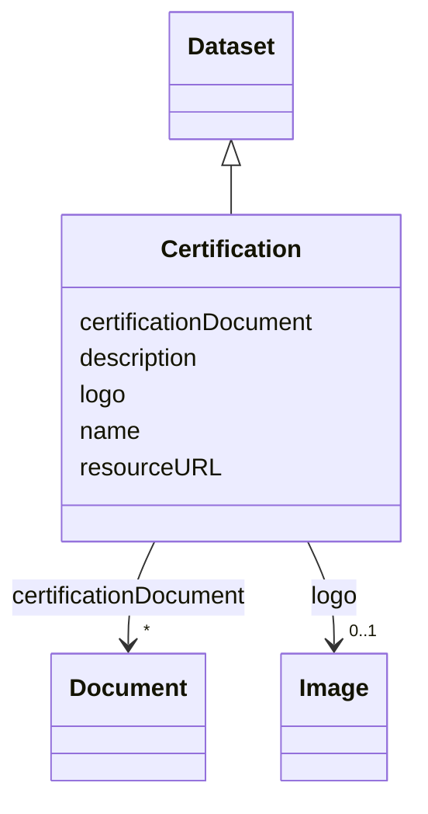

# Class: Certification (Certification)


_Assurance given by an independent certification body that a product, service or system meets the requirements of a standard_


URI: [EVORAO:Certification](https://raw.githubusercontent.com/EVORA-project/evora-ontology/refs/heads/main/models/owl/evora_ontology.owl.ttl#Certification)





## Inheritance
* [Resource](Resource.md)
    * [Dataset](Dataset.md)
        * **Certification**


## Slots

| Name | Cardinality and Range | Description | Inheritance |
| ---  | --- | --- | --- |
| [name](name.md) | 1 <br/> [String](String.md) | The label that allows humans to identify the current item | direct |
| [description](description.md) | 0..1 _recommended_ <br/> [String](String.md) | A short explanation of the characteristics, features, or nature of the curren... | direct |
| [logo](logo.md) | 0..1 <br/> [Image](Image.md) | A path or URL to the related logo | direct |
| [certificationDocument](certificationDocument.md) | * <br/> [Document](Document.md) | The document(s) issued by an authority certifying the conformity of the subje... | direct |
| [resourceURL](resourceURL.md) | 0..1 <br/> [Uri](Uri.md) | The web address or location where the details or content is stored and can be... | direct |


## Usages

| used by | used in | type | used |
| ---  | --- | --- | --- |
| [ProductOrService](ProductOrService.md) | [certification](certification.md) | range | [Certification](Certification.md) |
| [Service](Service.md) | [certification](certification.md) | range | [Certification](Certification.md) |
| [Product](Product.md) | [certification](certification.md) | range | [Certification](Certification.md) |
| [Antibody](Antibody.md) | [certification](certification.md) | range | [Certification](Certification.md) |
| [Hybridoma](Hybridoma.md) | [certification](certification.md) | range | [Certification](Certification.md) |
| [Protein](Protein.md) | [certification](certification.md) | range | [Certification](Certification.md) |
| [NucleicAcid](NucleicAcid.md) | [certification](certification.md) | range | [Certification](Certification.md) |
| [DetectionKit](DetectionKit.md) | [certification](certification.md) | range | [Certification](Certification.md) |
| [Bundle](Bundle.md) | [certification](certification.md) | range | [Certification](Certification.md) |
| [Pathogen](Pathogen.md) | [certification](certification.md) | range | [Certification](Certification.md) |
| [Virus](Virus.md) | [certification](certification.md) | range | [Certification](Certification.md) |
| [Bacterium](Bacterium.md) | [certification](certification.md) | range | [Certification](Certification.md) |
| [Fungus](Fungus.md) | [certification](certification.md) | range | [Certification](Certification.md) |
| [Protozoan](Protozoan.md) | [certification](certification.md) | range | [Certification](Certification.md) |
| [Viroid](Viroid.md) | [certification](certification.md) | range | [Certification](Certification.md) |
| [Prion](Prion.md) | [certification](certification.md) | range | [Certification](Certification.md) |


## Identifier and Mapping Information


### Schema Source


* from schema: https://raw.githubusercontent.com/EVORA-project/evora-ontology/refs/heads/main/models/owl/evora_ontology.owl.ttl#


## Mappings

| Mapping Type | Mapped Value |
| ---  | ---  |
| self | EVORAO:Certification |
| native | EVORAO:Certification |
| close | wd:Q374814, schema:Certification |


## LinkML Source

<!-- TODO: investigate https://stackoverflow.com/questions/37606292/how-to-create-tabbed-code-blocks-in-mkdocs-or-sphinx -->

### Direct

<details>
```yaml
name: Certification
description: Assurance given by an independent certification body that a product,
  service or system meets the requirements of a standard
title: Certification
from_schema: https://raw.githubusercontent.com/EVORA-project/evora-ontology/refs/heads/main/models/owl/evora_ontology.owl.ttl#
close_mappings:
- wd:Q374814
- schema:Certification
is_a: Dataset
slots:
- name
- description
- logo
- certificationDocument
- resourceURL
slot_usage:
  name:
    name: name
    description: The label that allows humans to identify the current item
    title: name
    comments:
    - 'The title of the item should be as short and descriptive as possible. E.g.
      for virus products it should basically be based on the following Pattern:

      "Virus name", "virus host type", "collection year", "country of collection"
      ex "suspected epidemiological origin", "genotype", "strain", "variant name or
      specific feature"'
    exact_mappings:
    - dct:title
    close_mappings:
    - rdfs:label
    domain_of:
    - Certification
    - DataService
    - Catalogue
    - Term
    - PersonOrOrganization
    - ProductOrService
    - File
    - ContactPoint
    - License
    range: string
    required: true
    multivalued: false
  description:
    name: description
    description: A short explanation of the characteristics, features, or nature of
      the current item
    title: description
    comments:
    - 'Describe this item in few lines. This description will serve as a summary to
      present the item.

      '
    exact_mappings:
    - dct:description
    domain_of:
    - Certification
    - DataService
    - Catalogue
    - Term
    - PersonOrOrganization
    - ProductOrService
    - File
    - ContactPoint
    - License
    range: string
    required: false
    recommended: true
    multivalued: false
  logo:
    name: logo
    description: A path or URL to the related logo
    title: logo
    domain_of:
    - Certification
    - PersonOrOrganization
    - License
    range: Image
    required: false
    multivalued: false
  certificationDocument:
    name: certificationDocument
    description: The document(s) issued by an authority certifying the conformity
      of the subject to the applicable scheme, including, as the case may be, the
      documents attesting the equivalence to another certification scheme.
    title: certification document
    domain_of:
    - Certification
    range: Document
    required: false
    multivalued: true
  resourceURL:
    name: resourceURL
    description: The web address or location where the details or content is stored
      and can be accessed or downloaded.
    title: resource URL
    close_mappings:
    - schema:url
    domain_of:
    - Certification
    - License
    range: uri
    required: false
    multivalued: false

```
</details>

### Induced

<details>
```yaml
name: Certification
description: Assurance given by an independent certification body that a product,
  service or system meets the requirements of a standard
title: Certification
from_schema: https://raw.githubusercontent.com/EVORA-project/evora-ontology/refs/heads/main/models/owl/evora_ontology.owl.ttl#
close_mappings:
- wd:Q374814
- schema:Certification
is_a: Dataset
slot_usage:
  name:
    name: name
    description: The label that allows humans to identify the current item
    title: name
    comments:
    - 'The title of the item should be as short and descriptive as possible. E.g.
      for virus products it should basically be based on the following Pattern:

      "Virus name", "virus host type", "collection year", "country of collection"
      ex "suspected epidemiological origin", "genotype", "strain", "variant name or
      specific feature"'
    exact_mappings:
    - dct:title
    close_mappings:
    - rdfs:label
    domain_of:
    - Certification
    - DataService
    - Catalogue
    - Term
    - PersonOrOrganization
    - ProductOrService
    - File
    - ContactPoint
    - License
    range: string
    required: true
    multivalued: false
  description:
    name: description
    description: A short explanation of the characteristics, features, or nature of
      the current item
    title: description
    comments:
    - 'Describe this item in few lines. This description will serve as a summary to
      present the item.

      '
    exact_mappings:
    - dct:description
    domain_of:
    - Certification
    - DataService
    - Catalogue
    - Term
    - PersonOrOrganization
    - ProductOrService
    - File
    - ContactPoint
    - License
    range: string
    required: false
    recommended: true
    multivalued: false
  logo:
    name: logo
    description: A path or URL to the related logo
    title: logo
    domain_of:
    - Certification
    - PersonOrOrganization
    - License
    range: Image
    required: false
    multivalued: false
  certificationDocument:
    name: certificationDocument
    description: The document(s) issued by an authority certifying the conformity
      of the subject to the applicable scheme, including, as the case may be, the
      documents attesting the equivalence to another certification scheme.
    title: certification document
    domain_of:
    - Certification
    range: Document
    required: false
    multivalued: true
  resourceURL:
    name: resourceURL
    description: The web address or location where the details or content is stored
      and can be accessed or downloaded.
    title: resource URL
    close_mappings:
    - schema:url
    domain_of:
    - Certification
    - License
    range: uri
    required: false
    multivalued: false
attributes:
  name:
    name: name
    description: The label that allows humans to identify the current item
    title: name
    comments:
    - 'The title of the item should be as short and descriptive as possible. E.g.
      for virus products it should basically be based on the following Pattern:

      "Virus name", "virus host type", "collection year", "country of collection"
      ex "suspected epidemiological origin", "genotype", "strain", "variant name or
      specific feature"'
    from_schema: https://raw.githubusercontent.com/EVORA-project/evora-ontology/refs/heads/main/models/owl/evora_ontology.owl.ttl#
    exact_mappings:
    - dct:title
    close_mappings:
    - rdfs:label
    rank: 1000
    alias: name
    owner: Certification
    domain_of:
    - Certification
    - DataService
    - Catalogue
    - Term
    - PersonOrOrganization
    - ProductOrService
    - File
    - ContactPoint
    - License
    range: string
    required: true
    multivalued: false
  description:
    name: description
    description: A short explanation of the characteristics, features, or nature of
      the current item
    title: description
    comments:
    - 'Describe this item in few lines. This description will serve as a summary to
      present the item.

      '
    from_schema: https://raw.githubusercontent.com/EVORA-project/evora-ontology/refs/heads/main/models/owl/evora_ontology.owl.ttl#
    exact_mappings:
    - dct:description
    rank: 1000
    alias: description
    owner: Certification
    domain_of:
    - Certification
    - DataService
    - Catalogue
    - Term
    - PersonOrOrganization
    - ProductOrService
    - File
    - ContactPoint
    - License
    range: string
    required: false
    recommended: true
    multivalued: false
  logo:
    name: logo
    description: A path or URL to the related logo
    title: logo
    from_schema: https://raw.githubusercontent.com/EVORA-project/evora-ontology/refs/heads/main/models/owl/evora_ontology.owl.ttl#
    rank: 1000
    alias: logo
    owner: Certification
    domain_of:
    - Certification
    - PersonOrOrganization
    - License
    range: Image
    required: false
    multivalued: false
  certificationDocument:
    name: certificationDocument
    description: The document(s) issued by an authority certifying the conformity
      of the subject to the applicable scheme, including, as the case may be, the
      documents attesting the equivalence to another certification scheme.
    title: certification document
    from_schema: https://raw.githubusercontent.com/EVORA-project/evora-ontology/refs/heads/main/models/owl/evora_ontology.owl.ttl#
    rank: 1000
    alias: certificationDocument
    owner: Certification
    domain_of:
    - Certification
    range: Document
    required: false
    multivalued: true
  resourceURL:
    name: resourceURL
    description: The web address or location where the details or content is stored
      and can be accessed or downloaded.
    title: resource URL
    from_schema: https://raw.githubusercontent.com/EVORA-project/evora-ontology/refs/heads/main/models/owl/evora_ontology.owl.ttl#
    close_mappings:
    - schema:url
    rank: 1000
    alias: resourceURL
    owner: Certification
    domain_of:
    - Certification
    - License
    range: uri
    required: false
    multivalued: false

```
</details>