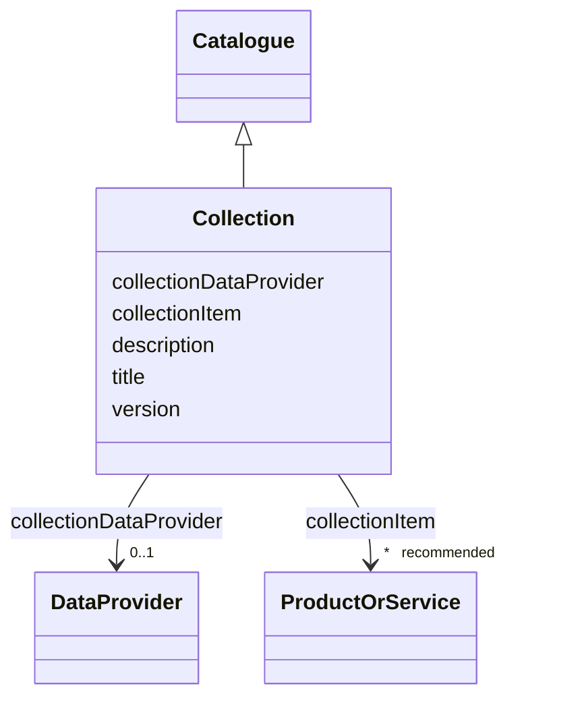

# Class: Collection (Collection) 


_Set of products and services with some common characteristics_


URI: [EVORAO:Collection](https://w3id.org/evorao/Collection)





## Inheritance
* [Resource](Resource.md)
    * [Dataset](Dataset.md)
        * [Catalogue](Catalogue.md)
            * **Collection**


## Slots

| Name | Cardinality and Range | Description | Inheritance |
| ---  | --- | --- | --- |
| [collectionItem](collectionItem.md) | * _recommended_ <br/> [ProductOrService](ProductOrService.md) | An item of the collection | direct |
| [collectionDataProvider](collectionDataProvider.md) | 0..1 <br/> [DataProvider](DataProvider.md) | The provider of the data of the collection | direct |
| [title](title.md) | 1 <br/> [String](String.md) | A name given to the resource | [Dataset](Dataset.md) |
| [description](description.md) | 1 _recommended_ <br/> [String](String.md) | A short explanation of the characteristics, features, or nature of the curren... | [Dataset](Dataset.md) |
| [version](version.md) | 0..1 _recommended_ <br/> [String](String.md) | The version indicator (name or identifier) of a resource | [Dataset](Dataset.md) |


## Usages

| used by | used in | type | used |
| ---  | --- | --- | --- |
| [ProductOrService](ProductOrService.md) | [collection](collection.md) | range | [Collection](Collection.md) |
| [Service](Service.md) | [collection](collection.md) | range | [Collection](Collection.md) |
| [Product](Product.md) | [collection](collection.md) | range | [Collection](Collection.md) |
| [Antibody](Antibody.md) | [collection](collection.md) | range | [Collection](Collection.md) |
| [Hybridoma](Hybridoma.md) | [collection](collection.md) | range | [Collection](Collection.md) |
| [Protein](Protein.md) | [collection](collection.md) | range | [Collection](Collection.md) |
| [NucleicAcid](NucleicAcid.md) | [collection](collection.md) | range | [Collection](Collection.md) |
| [DetectionKit](DetectionKit.md) | [collection](collection.md) | range | [Collection](Collection.md) |
| [Bundle](Bundle.md) | [collection](collection.md) | range | [Collection](Collection.md) |
| [Pathogen](Pathogen.md) | [collection](collection.md) | range | [Collection](Collection.md) |
| [Virus](Virus.md) | [collection](collection.md) | range | [Collection](Collection.md) |
| [Bacterium](Bacterium.md) | [collection](collection.md) | range | [Collection](Collection.md) |
| [Fungus](Fungus.md) | [collection](collection.md) | range | [Collection](Collection.md) |
| [Protozoan](Protozoan.md) | [collection](collection.md) | range | [Collection](Collection.md) |
| [Viroid](Viroid.md) | [collection](collection.md) | range | [Collection](Collection.md) |
| [Prion](Prion.md) | [collection](collection.md) | range | [Collection](Collection.md) |


## Identifier and Mapping Information


### Schema Source


* from schema: https://w3id.org/evorao/


## Mappings

| Mapping Type | Mapped Value |
| ---  | ---  |
| self | EVORAO:Collection |
| native | EVORAO:Collection |
| close | wd:Q2668072, wd:Q2668072 |


## LinkML Source

<!-- TODO: investigate https://stackoverflow.com/questions/37606292/how-to-create-tabbed-code-blocks-in-mkdocs-or-sphinx -->

### Direct

<details>
```yaml
name: Collection
description: Set of products and services with some common characteristics
title: Collection
from_schema: https://w3id.org/evorao/
close_mappings:
- wd:Q2668072
- wd:Q2668072
is_a: Catalogue
slots:
- collectionItem
- collectionDataProvider
slot_usage:
  collectionItem:
    name: collectionItem
    description: An item of the collection
    title: collection item
    close_mappings:
    - dcat:resource
    domain_of:
    - Collection
    range: ProductOrService
    required: false
    recommended: true
    multivalued: true
  collectionDataProvider:
    name: collectionDataProvider
    description: The provider of the data of the collection
    title: collection data provider
    close_mappings:
    - dct:isReferencedBy
    domain_of:
    - Collection
    range: DataProvider
    required: false
    multivalued: false

```
</details>

### Induced

<details>
```yaml
name: Collection
description: Set of products and services with some common characteristics
title: Collection
from_schema: https://w3id.org/evorao/
close_mappings:
- wd:Q2668072
- wd:Q2668072
is_a: Catalogue
slot_usage:
  collectionItem:
    name: collectionItem
    description: An item of the collection
    title: collection item
    close_mappings:
    - dcat:resource
    domain_of:
    - Collection
    range: ProductOrService
    required: false
    recommended: true
    multivalued: true
  collectionDataProvider:
    name: collectionDataProvider
    description: The provider of the data of the collection
    title: collection data provider
    close_mappings:
    - dct:isReferencedBy
    domain_of:
    - Collection
    range: DataProvider
    required: false
    multivalued: false
attributes:
  collectionItem:
    name: collectionItem
    description: An item of the collection
    title: collection item
    from_schema: https://w3id.org/evorao/
    close_mappings:
    - dcat:resource
    rank: 1000
    alias: collectionItem
    owner: Collection
    domain_of:
    - Collection
    range: ProductOrService
    required: false
    recommended: true
    multivalued: true
  collectionDataProvider:
    name: collectionDataProvider
    description: The provider of the data of the collection
    title: collection data provider
    from_schema: https://w3id.org/evorao/
    close_mappings:
    - dct:isReferencedBy
    rank: 1000
    alias: collectionDataProvider
    owner: Collection
    domain_of:
    - Collection
    range: DataProvider
    required: false
    multivalued: false
  title:
    name: title
    description: A name given to the resource
    title: title
    comments:
    - 'The title of the item should be as short and descriptive as possible. E.g.
      for virus products it should basically be based on the following Pattern:

      ''Virus name'', ''virus host type'', ''collection year'', ''country of collection''
      ex ''suspected epidemiological origin'', ''genotype'', ''strain'', ''variant
      name or specific feature'
    from_schema: https://w3id.org/evorao/
    exact_mappings:
    - schema:name
    - rdfs:label
    rank: 1000
    slot_uri: dct:title
    alias: title
    owner: Collection
    domain_of:
    - Dataset
    - DataService
    - Publication
    - Term
    - License
    - Certification
    range: string
    required: true
    multivalued: false
  description:
    name: description
    description: A short explanation of the characteristics, features, or nature of
      the current item
    title: description
    comments:
    - 'Describe this item in few lines. This description will serve as a summary to
      present the resource.

      '
    from_schema: https://w3id.org/evorao/
    exact_mappings:
    - schema:description
    close_mappings:
    - schema:description
    rank: 1000
    slot_uri: dct:description
    alias: description
    owner: Collection
    domain_of:
    - Dataset
    - DataService
    - Term
    - PersonOrOrganization
    - File
    - ContactPoint
    - License
    - Certification
    range: string
    required: true
    recommended: true
    multivalued: false
  version:
    name: version
    description: The version indicator (name or identifier) of a resource
    title: version
    from_schema: https://w3id.org/evorao/
    exact_mappings:
    - pav:version
    close_mappings:
    - wdp:P393
    - schema:version
    related_mappings:
    - schema:identifier
    rank: 1000
    slot_uri: dcat:version
    alias: version
    owner: Collection
    domain_of:
    - Dataset
    - Version
    - Taxonomy
    range: string
    required: false
    recommended: true
    multivalued: false

```
</details>