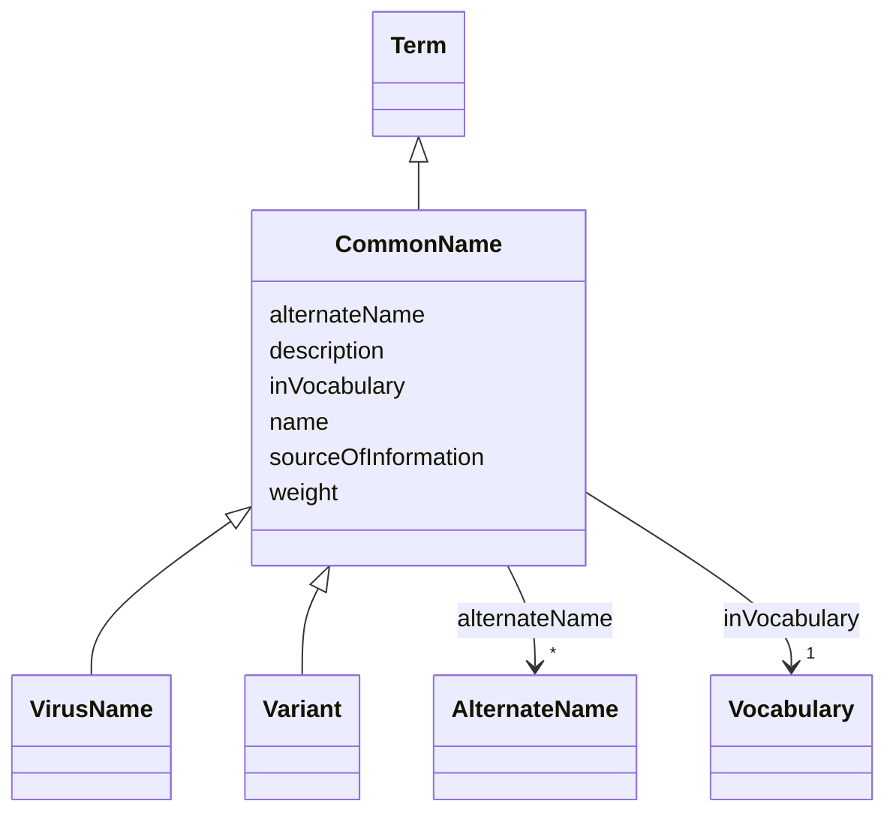

# Class: Common Name (CommonName)


_Vernacular name that is the name used in everyday language to refer to an organism or group of organisms. This name is typically easier to remember and pronounce compared to the scientific name_


URI: [EVORA:CommonName](https://raw.githubusercontent.com/EVORA-project/evora-ontology/refs/heads/main/models/owl/evora_ontology.owl.ttl#CommonName)





## Inheritance
* [Nameable](Nameable.md)
    * [NamedDataset](NamedDataset.md)
        * [Term](Term.md)
            * **CommonName**
                * [VirusName](VirusName.md)
                * [Variant](Variant.md)


## Slots

| Name | Cardinality and Range | Description | Inheritance |
| ---  | --- | --- | --- |
| [alternateName](alternateName.md) | * <br/> [AlternateName](AlternateName.md) | Any known alternate name related to this name | direct |
| [sourceOfInformation](sourceOfInformation.md) | * <br/> [String](String.md) | The name of the origin from which knowledge is obtained | direct |
| [weight](weight.md) | 1 <br/> [Integer](Integer.md) | A numerical value indicating relative importance or priority, generally proce... | [Term](Term.md) |
| [inVocabulary](inVocabulary.md) | 1 <br/> [Vocabulary](Vocabulary.md) | Terms belong to a specific vocabulary | [Term](Term.md) |
| [name](name.md) | 1 <br/> [String](String.md) | The label that allows humans to identify the current item | [Nameable](Nameable.md) |
| [description](description.md) | 0..1 <br/> [String](String.md) | A short explanation of the characteristics, features, or nature of the curren... | [Nameable](Nameable.md) |


## Usages

| used by | used in | type | used |
| ---  | --- | --- | --- |
| [PathogenIdentification](PathogenIdentification.md) | [pathogenName](pathogenName.md) | range | [CommonName](CommonName.md) |


## Aliases


* common name


## Identifier and Mapping Information


### Schema Source


* from schema: https://raw.githubusercontent.com/EVORA-project/evora-ontology/refs/heads/main/models/owl/evora_ontology.owl.ttl#


## Mappings

| Mapping Type | Mapped Value |
| ---  | ---  |
| self | EVORA:CommonName |
| native | EVORA:CommonName |
| exact | dwc:vernacularName |
| close | wd:Q502895 |


## LinkML Source

<!-- TODO: investigate https://stackoverflow.com/questions/37606292/how-to-create-tabbed-code-blocks-in-mkdocs-or-sphinx -->

### Direct

<details>
```yaml
name: CommonName
description: Vernacular name that is the name used in everyday language to refer to
  an organism or group of organisms. This name is typically easier to remember and
  pronounce compared to the scientific name
title: Common Name
from_schema: https://raw.githubusercontent.com/EVORA-project/evora-ontology/refs/heads/main/models/owl/evora_ontology.owl.ttl#
aliases:
- common name
exact_mappings:
- dwc:vernacularName
close_mappings:
- wd:Q502895
is_a: Term
slots:
- alternateName
- sourceOfInformation
slot_usage:
  alternateName:
    name: alternateName
    description: Any known alternate name related to this name
    title: alternate name
    comments:
    - including previous names and former taxonomic terms, this information can also
      serve as keywords arround the pathogen name for search and as a bridge with
      other projects that are still using other naming systems or taxonomies e.g.
      the NCBI taxonomy
    aliases:
    - alternative name
    close_mappings:
    - wdp:P4970
    range: AlternateName
    required: false
    multivalued: true
  sourceOfInformation:
    name: sourceOfInformation
    description: The name of the origin from which knowledge is obtained. This can
      include any entity that provides information
    title: source of information
    aliases:
    - stated in
    close_mappings:
    - wdp:P248
    range: string
    required: false
    multivalued: true

```
</details>

### Induced

<details>
```yaml
name: CommonName
description: Vernacular name that is the name used in everyday language to refer to
  an organism or group of organisms. This name is typically easier to remember and
  pronounce compared to the scientific name
title: Common Name
from_schema: https://raw.githubusercontent.com/EVORA-project/evora-ontology/refs/heads/main/models/owl/evora_ontology.owl.ttl#
aliases:
- common name
exact_mappings:
- dwc:vernacularName
close_mappings:
- wd:Q502895
is_a: Term
slot_usage:
  alternateName:
    name: alternateName
    description: Any known alternate name related to this name
    title: alternate name
    comments:
    - including previous names and former taxonomic terms, this information can also
      serve as keywords arround the pathogen name for search and as a bridge with
      other projects that are still using other naming systems or taxonomies e.g.
      the NCBI taxonomy
    aliases:
    - alternative name
    close_mappings:
    - wdp:P4970
    range: AlternateName
    required: false
    multivalued: true
  sourceOfInformation:
    name: sourceOfInformation
    description: The name of the origin from which knowledge is obtained. This can
      include any entity that provides information
    title: source of information
    aliases:
    - stated in
    close_mappings:
    - wdp:P248
    range: string
    required: false
    multivalued: true
attributes:
  alternateName:
    name: alternateName
    description: Any known alternate name related to this name
    title: alternate name
    comments:
    - including previous names and former taxonomic terms, this information can also
      serve as keywords arround the pathogen name for search and as a bridge with
      other projects that are still using other naming systems or taxonomies e.g.
      the NCBI taxonomy
    from_schema: https://raw.githubusercontent.com/EVORA-project/evora-ontology/refs/heads/main/models/owl/evora_ontology.owl.ttl#
    aliases:
    - alternative name
    close_mappings:
    - wdp:P4970
    rank: 1000
    alias: alternateName
    owner: CommonName
    domain_of:
    - CommonName
    - AlternateName
    - Organization
    range: AlternateName
    required: false
    multivalued: true
  sourceOfInformation:
    name: sourceOfInformation
    description: The name of the origin from which knowledge is obtained. This can
      include any entity that provides information
    title: source of information
    from_schema: https://raw.githubusercontent.com/EVORA-project/evora-ontology/refs/heads/main/models/owl/evora_ontology.owl.ttl#
    aliases:
    - stated in
    close_mappings:
    - wdp:P248
    rank: 1000
    alias: sourceOfInformation
    owner: CommonName
    domain_of:
    - CommonName
    - AlternateName
    range: string
    required: false
    multivalued: true
  weight:
    name: weight
    description: A numerical value indicating relative importance or priority, generally
      processed in ascending order. This weight helps prioritize content when organizing
      or processing data. Its value can be negative, with a default set to 0
    title: weight
    from_schema: https://raw.githubusercontent.com/EVORA-project/evora-ontology/refs/heads/main/models/owl/evora_ontology.owl.ttl#
    close_mappings:
    - adms:status
    rank: 1000
    ifabsent: int(0)
    alias: weight
    owner: CommonName
    domain_of:
    - DataProvider
    - Term
    range: integer
    required: true
    multivalued: false
  inVocabulary:
    name: inVocabulary
    description: Terms belong to a specific vocabulary
    title: in Vocabulary
    from_schema: https://raw.githubusercontent.com/EVORA-project/evora-ontology/refs/heads/main/models/owl/evora_ontology.owl.ttl#
    aliases:
    - catalog
    close_mappings:
    - wdp:P972
    rank: 1000
    alias: inVocabulary
    owner: CommonName
    domain_of:
    - Term
    range: Vocabulary
    required: true
    multivalued: false
  name:
    name: name
    description: The label that allows humans to identify the current item
    title: name
    comments:
    - 'The title of the item should be as short and descriptive as possible. E.g.
      for virus products it should basically be based on the following Pattern:

      "Virus name", "virus host type", "collection year", "country of collection"
      ex "suspected epidemiological origin", "genotype", "strain", "variant name or
      specific feature"'
    from_schema: https://raw.githubusercontent.com/EVORA-project/evora-ontology/refs/heads/main/models/owl/evora_ontology.owl.ttl#
    exact_mappings:
    - dct:title
    close_mappings:
    - rdfs:label
    rank: 1000
    alias: name
    owner: CommonName
    domain_of:
    - Nameable
    range: string
    required: true
    multivalued: false
  description:
    name: description
    description: A short explanation of the characteristics, features, or nature of
      the current item
    title: description
    comments:
    - 'Describe this item in few lines. This description will serve as a summary to
      present the item.

      '
    from_schema: https://raw.githubusercontent.com/EVORA-project/evora-ontology/refs/heads/main/models/owl/evora_ontology.owl.ttl#
    exact_mappings:
    - dct:description
    rank: 1000
    alias: description
    owner: CommonName
    domain_of:
    - Nameable
    range: string
    required: false
    multivalued: false

```
</details>