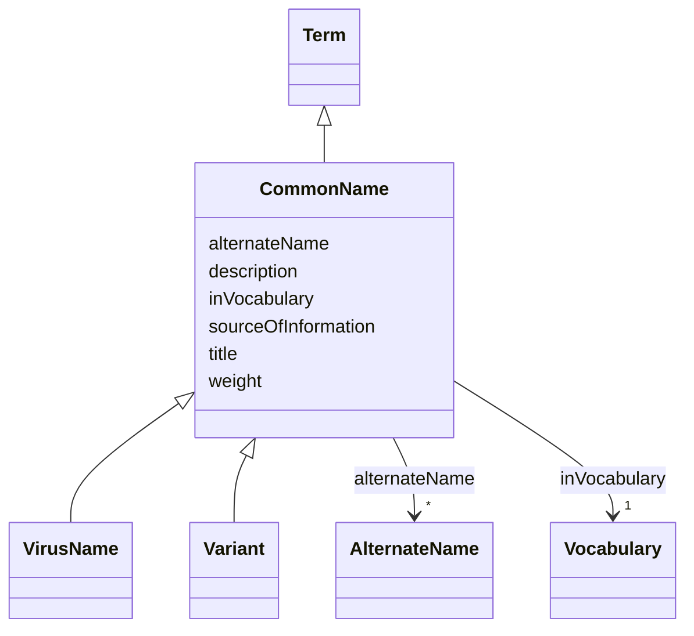

# Class: Common Name (CommonName) 


_Vernacular name that is the name used in everyday language to refer to an organism or group of organisms. This name is typically easier to remember and pronounce compared to the scientific name_


URI: [EVORAO:CommonName](https://w3id.org/evorao/CommonName)





## Inheritance
* [Resource](Resource.md)
    * [Term](Term.md)
        * **CommonName**
            * [VirusName](VirusName.md)
            * [Variant](Variant.md)


## Slots

| Name | Cardinality and Range | Description | Inheritance |
| ---  | --- | --- | --- |
| [alternateName](alternateName.md) | * <br/> [AlternateName](AlternateName.md) | Any other name under which the entity can be known | direct |
| [sourceOfInformation](sourceOfInformation.md) | * <br/> [String](String.md) | The name of the origin from which knowledge is obtained | direct |
| [title](title.md) | 1 <br/> [String](String.md) | A name given to the resource | [Term](Term.md) |
| [description](description.md) | 0..1 _recommended_ <br/> [String](String.md) | A short explanation of the characteristics, features, or nature of the curren... | [Term](Term.md) |
| [weight](weight.md) | 1 <br/> [Integer](Integer.md) | A numerical value indicating relative importance or priority, generally proce... | [Term](Term.md) |
| [inVocabulary](inVocabulary.md) | 1 <br/> [Vocabulary](Vocabulary.md) | Terms belong to a specific vocabulary | [Term](Term.md) |


## Usages

| used by | used in | type | used |
| ---  | --- | --- | --- |
| [PathogenIdentification](PathogenIdentification.md) | [pathogenName](pathogenName.md) | range | [CommonName](CommonName.md) |


## Identifier and Mapping Information


### Schema Source


* from schema: https://w3id.org/evorao/


## Mappings

| Mapping Type | Mapped Value |
| ---  | ---  |
| self | EVORAO:CommonName |
| native | EVORAO:CommonName |
| exact | dwc:vernacularName, dwc:vernacularName |
| close | wd:Q502895, wd:Q502895 |


## LinkML Source

<!-- TODO: investigate https://stackoverflow.com/questions/37606292/how-to-create-tabbed-code-blocks-in-mkdocs-or-sphinx -->

### Direct

<details>
```yaml
name: CommonName
description: Vernacular name that is the name used in everyday language to refer to
  an organism or group of organisms. This name is typically easier to remember and
  pronounce compared to the scientific name
title: Common Name
from_schema: https://w3id.org/evorao/
exact_mappings:
- dwc:vernacularName
- dwc:vernacularName
close_mappings:
- wd:Q502895
- wd:Q502895
is_a: Term
slots:
- alternateName
- sourceOfInformation
slot_usage:
  alternateName:
    name: alternateName
    description: Any other name under which the entity can be known
    title: alternate name
    comments:
    - This includes previous names, acronyms, former taxonomic terms, and other variations.
      This information can serve as keywords for search purposes and as a bridge with
      other projects that use different naming systems or taxonomies
    close_mappings:
    - wdp:P4970
    domain_of:
    - CommonName
    - AlternateName
    - Organization
    range: AlternateName
    required: false
    multivalued: true
  sourceOfInformation:
    name: sourceOfInformation
    description: The name of the origin from which knowledge is obtained. This can
      include any entity that provides information
    title: source of information
    close_mappings:
    - wdp:P248
    domain_of:
    - CommonName
    - AlternateName
    range: string
    required: false
    multivalued: true

```
</details>

### Induced

<details>
```yaml
name: CommonName
description: Vernacular name that is the name used in everyday language to refer to
  an organism or group of organisms. This name is typically easier to remember and
  pronounce compared to the scientific name
title: Common Name
from_schema: https://w3id.org/evorao/
exact_mappings:
- dwc:vernacularName
- dwc:vernacularName
close_mappings:
- wd:Q502895
- wd:Q502895
is_a: Term
slot_usage:
  alternateName:
    name: alternateName
    description: Any other name under which the entity can be known
    title: alternate name
    comments:
    - This includes previous names, acronyms, former taxonomic terms, and other variations.
      This information can serve as keywords for search purposes and as a bridge with
      other projects that use different naming systems or taxonomies
    close_mappings:
    - wdp:P4970
    domain_of:
    - CommonName
    - AlternateName
    - Organization
    range: AlternateName
    required: false
    multivalued: true
  sourceOfInformation:
    name: sourceOfInformation
    description: The name of the origin from which knowledge is obtained. This can
      include any entity that provides information
    title: source of information
    close_mappings:
    - wdp:P248
    domain_of:
    - CommonName
    - AlternateName
    range: string
    required: false
    multivalued: true
attributes:
  alternateName:
    name: alternateName
    description: Any other name under which the entity can be known
    title: alternate name
    comments:
    - This includes previous names, acronyms, former taxonomic terms, and other variations.
      This information can serve as keywords for search purposes and as a bridge with
      other projects that use different naming systems or taxonomies
    from_schema: https://w3id.org/evorao/
    close_mappings:
    - wdp:P4970
    rank: 1000
    alias: alternateName
    owner: CommonName
    domain_of:
    - CommonName
    - AlternateName
    - Organization
    range: AlternateName
    required: false
    multivalued: true
  sourceOfInformation:
    name: sourceOfInformation
    description: The name of the origin from which knowledge is obtained. This can
      include any entity that provides information
    title: source of information
    from_schema: https://w3id.org/evorao/
    close_mappings:
    - wdp:P248
    rank: 1000
    alias: sourceOfInformation
    owner: CommonName
    domain_of:
    - CommonName
    - AlternateName
    range: string
    required: false
    multivalued: true
  title:
    name: title
    description: A name given to the resource
    title: title
    comments:
    - 'The title of the item should be as short and descriptive as possible. E.g.
      for virus products it should basically be based on the following Pattern:

      ''Virus name'', ''virus host type'', ''collection year'', ''country of collection''
      ex ''suspected epidemiological origin'', ''genotype'', ''strain'', ''variant
      name or specific feature'
    from_schema: https://w3id.org/evorao/
    close_mappings:
    - rdfs:label
    rank: 1000
    slot_uri: dct:title
    alias: title
    owner: CommonName
    domain_of:
    - Term
    - Dataset
    - DataService
    - Publication
    - License
    - Certification
    range: string
    required: true
    multivalued: false
  description:
    name: description
    description: A short explanation of the characteristics, features, or nature of
      the current item
    title: description
    comments:
    - 'Describe this item in few lines. This description will serve as a summary to
      present the resource.

      '
    from_schema: https://w3id.org/evorao/
    rank: 1000
    slot_uri: dct:description
    alias: description
    owner: CommonName
    domain_of:
    - Term
    - Dataset
    - DataService
    - PersonOrOrganization
    - File
    - ContactPoint
    - License
    - Certification
    range: string
    required: false
    recommended: true
    multivalued: false
  weight:
    name: weight
    description: A numerical value indicating relative importance or priority, generally
      processed in ascending order. This weight helps prioritize content when organizing
      or processing data. Its value can be negative, with a default set to 0
    title: weight
    comments:
    - The lowest weighted Data providers are triggered first, this may be usefull
      to populate at first entities that are referenced by others (e.g. Version ahead
      of Rank ahead of Taxon)
    from_schema: https://w3id.org/evorao/
    close_mappings:
    - adms:status
    rank: 1000
    ifabsent: int(0)
    alias: weight
    owner: CommonName
    domain_of:
    - Term
    - DataProvider
    range: integer
    required: true
    multivalued: false
  inVocabulary:
    name: inVocabulary
    description: Terms belong to a specific vocabulary
    title: in Vocabulary
    from_schema: https://w3id.org/evorao/
    close_mappings:
    - wdp:P972
    rank: 1000
    alias: inVocabulary
    owner: CommonName
    domain_of:
    - Term
    range: Vocabulary
    required: true
    multivalued: false

```
</details>