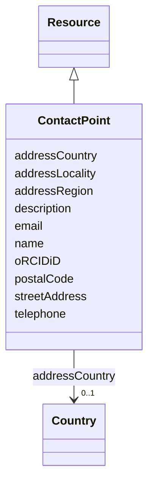

# Class: Contact Point (ContactPoint)


_Entity serving as focal point of information_


URI: [EVORAO:ContactPoint](https://raw.githubusercontent.com/EVORA-project/evora-ontology/refs/heads/main/models/owl/evora_ontology.owl.ttl#ContactPoint)





## Inheritance
* [Resource](Resource.md)
    * **ContactPoint**


## Slots

| Name | Cardinality and Range | Description | Inheritance |
| ---  | --- | --- | --- |
| [name](name.md) | 1 <br/> [String](String.md) | The label that allows humans to identify the current item | direct |
| [description](description.md) | 0..1 _recommended_ <br/> [String](String.md) | A short explanation of the characteristics, features, or nature of the curren... | direct |
| [email](email.md) | 0..1 _recommended_ <br/> [String](String.md) | Email address | direct |
| [telephone](telephone.md) | 0..1 _recommended_ <br/> [String](String.md) | The telephone number | direct |
| [streetAddress](streetAddress.md) | 0..1 <br/> [String](String.md) | The building/apartment number and the street name | direct |
| [addressLocality](addressLocality.md) | 0..1 <br/> [String](String.md) | The locality in which the street address is, and which is in the region | direct |
| [addressRegion](addressRegion.md) | 0..1 <br/> [String](String.md) | The region in which the locality is, and which is in the country | direct |
| [postalCode](postalCode.md) | 0..1 <br/> [String](String.md) | The postal code | direct |
| [addressCountry](addressCountry.md) | 0..1 <br/> [Country](Country.md) | The country as of  ISO 3166 | direct |
| [oRCIDiD](oRCIDiD.md) | 0..1 _recommended_ <br/> [String](String.md) | Unique persistent identifier for a person, provided by the Open Researcher an... | direct |


## Usages

| used by | used in | type | used |
| ---  | --- | --- | --- |
| [PersonOrOrganization](PersonOrOrganization.md) | [contactPoint](contactPoint.md) | range | [ContactPoint](ContactPoint.md) |
| [Person](Person.md) | [contactPoint](contactPoint.md) | range | [ContactPoint](ContactPoint.md) |
| [Organization](Organization.md) | [contactPoint](contactPoint.md) | range | [ContactPoint](ContactPoint.md) |
| [RI](RI.md) | [contactPoint](contactPoint.md) | range | [ContactPoint](ContactPoint.md) |
| [Provider](Provider.md) | [contactPoint](contactPoint.md) | range | [ContactPoint](ContactPoint.md) |
| [Originator](Originator.md) | [contactPoint](contactPoint.md) | range | [ContactPoint](ContactPoint.md) |
| [ProductOrService](ProductOrService.md) | [contactPoint](contactPoint.md) | range | [ContactPoint](ContactPoint.md) |
| [Service](Service.md) | [contactPoint](contactPoint.md) | range | [ContactPoint](ContactPoint.md) |
| [Product](Product.md) | [contactPoint](contactPoint.md) | range | [ContactPoint](ContactPoint.md) |
| [Antibody](Antibody.md) | [contactPoint](contactPoint.md) | range | [ContactPoint](ContactPoint.md) |
| [Hybridoma](Hybridoma.md) | [contactPoint](contactPoint.md) | range | [ContactPoint](ContactPoint.md) |
| [Protein](Protein.md) | [contactPoint](contactPoint.md) | range | [ContactPoint](ContactPoint.md) |
| [NucleicAcid](NucleicAcid.md) | [contactPoint](contactPoint.md) | range | [ContactPoint](ContactPoint.md) |
| [DetectionKit](DetectionKit.md) | [contactPoint](contactPoint.md) | range | [ContactPoint](ContactPoint.md) |
| [Bundle](Bundle.md) | [contactPoint](contactPoint.md) | range | [ContactPoint](ContactPoint.md) |
| [Pathogen](Pathogen.md) | [contactPoint](contactPoint.md) | range | [ContactPoint](ContactPoint.md) |
| [Virus](Virus.md) | [contactPoint](contactPoint.md) | range | [ContactPoint](ContactPoint.md) |
| [Bacterium](Bacterium.md) | [contactPoint](contactPoint.md) | range | [ContactPoint](ContactPoint.md) |
| [Fungus](Fungus.md) | [contactPoint](contactPoint.md) | range | [ContactPoint](ContactPoint.md) |
| [Protozoan](Protozoan.md) | [contactPoint](contactPoint.md) | range | [ContactPoint](ContactPoint.md) |
| [Viroid](Viroid.md) | [contactPoint](contactPoint.md) | range | [ContactPoint](ContactPoint.md) |
| [Prion](Prion.md) | [contactPoint](contactPoint.md) | range | [ContactPoint](ContactPoint.md) |
| [MSDS](MSDS.md) | [msdsContact](msdsContact.md) | range | [ContactPoint](ContactPoint.md) |


## Identifier and Mapping Information


### Schema Source


* from schema: https://raw.githubusercontent.com/EVORA-project/evora-ontology/refs/heads/main/models/owl/evora_ontology.owl.ttl#


## Mappings

| Mapping Type | Mapped Value |
| ---  | ---  |
| self | EVORAO:ContactPoint |
| native | EVORAO:ContactPoint |
| close | wd:Q30322502, vcard:Contact, wd:Q30322502, vcard:Contact |


## LinkML Source

<!-- TODO: investigate https://stackoverflow.com/questions/37606292/how-to-create-tabbed-code-blocks-in-mkdocs-or-sphinx -->

### Direct

<details>
```yaml
name: ContactPoint
description: Entity serving as focal point of information
title: Contact Point
from_schema: https://raw.githubusercontent.com/EVORA-project/evora-ontology/refs/heads/main/models/owl/evora_ontology.owl.ttl#
close_mappings:
- wd:Q30322502
- vcard:Contact
- wd:Q30322502
- vcard:Contact
is_a: Resource
slots:
- name
- description
- email
- telephone
- streetAddress
- addressLocality
- addressRegion
- postalCode
- addressCountry
- oRCIDiD
slot_usage:
  name:
    name: name
    description: The label that allows humans to identify the current item
    title: name
    comments:
    - 'The title of the item should be as short and descriptive as possible. E.g.
      for virus products it should basically be based on the following Pattern:

      ''Virus name'', ''virus host type'', ''collection year'', ''country of collection''
      ex ''suspected epidemiological origin'', ''genotype'', ''strain'', ''variant
      name or specific feature'
    exact_mappings:
    - dct:title
    close_mappings:
    - rdfs:label
    domain_of:
    - ContactPoint
    - DataService
    - Catalogue
    - Term
    - PersonOrOrganization
    - ProductOrService
    - File
    - License
    - Certification
    range: string
    required: true
    multivalued: false
  description:
    name: description
    description: A short explanation of the characteristics, features, or nature of
      the current item
    title: description
    comments:
    - 'Describe this item in few lines. This description will serve as a summary to
      present the item.

      '
    exact_mappings:
    - dct:description
    domain_of:
    - ContactPoint
    - DataService
    - Catalogue
    - Term
    - PersonOrOrganization
    - ProductOrService
    - File
    - License
    - Certification
    range: string
    required: false
    recommended: true
    multivalued: false
  email:
    name: email
    description: Email address
    title: email
    close_mappings:
    - schema:email
    - vcard:email
    domain_of:
    - ContactPoint
    range: string
    required: false
    recommended: true
    multivalued: false
  telephone:
    name: telephone
    description: The telephone number
    title: telephone
    close_mappings:
    - schema:telephone
    - vcard:telephone
    domain_of:
    - ContactPoint
    range: string
    required: false
    recommended: true
    multivalued: false
  streetAddress:
    name: streetAddress
    description: The building/apartment number and the street name
    title: street address
    close_mappings:
    - schema:streetAddress
    - vcard:hasStreetAddress
    domain_of:
    - ContactPoint
    range: string
    required: false
    multivalued: false
  addressLocality:
    name: addressLocality
    description: The locality in which the street address is, and which is in the
      region. e.g, the city
    title: locality/city
    close_mappings:
    - schema:addressLocality
    - vcard:hasLocality
    domain_of:
    - ContactPoint
    range: string
    required: false
    multivalued: false
  addressRegion:
    name: addressRegion
    description: The region in which the locality is, and which is in the country.
      For example, California or another appropriate first-level Administrative division
    title: region
    close_mappings:
    - schema:addressRegion
    - vcard:hasRegion
    domain_of:
    - ContactPoint
    range: string
    required: false
    multivalued: false
  postalCode:
    name: postalCode
    description: The postal code
    title: postal code
    close_mappings:
    - schema:postalCode
    - vcard:hasPostalCode
    domain_of:
    - ContactPoint
    range: string
    required: false
    multivalued: false
  addressCountry:
    name: addressCountry
    description: The country as of  ISO 3166
    title: address Country
    close_mappings:
    - schema:addressCountry
    - vcard:hasCountryName
    domain_of:
    - ContactPoint
    range: Country
    required: false
    multivalued: false
  oRCIDiD:
    name: oRCIDiD
    description: Unique persistent identifier for a person, provided by the Open Researcher
      and Contributor ID (ORCID) organisation
    title: ORCID iD
    exact_mappings:
    - IAO:0000708
    domain_of:
    - ContactPoint
    - Person
    range: string
    required: false
    recommended: true
    multivalued: false

```
</details>

### Induced

<details>
```yaml
name: ContactPoint
description: Entity serving as focal point of information
title: Contact Point
from_schema: https://raw.githubusercontent.com/EVORA-project/evora-ontology/refs/heads/main/models/owl/evora_ontology.owl.ttl#
close_mappings:
- wd:Q30322502
- vcard:Contact
- wd:Q30322502
- vcard:Contact
is_a: Resource
slot_usage:
  name:
    name: name
    description: The label that allows humans to identify the current item
    title: name
    comments:
    - 'The title of the item should be as short and descriptive as possible. E.g.
      for virus products it should basically be based on the following Pattern:

      ''Virus name'', ''virus host type'', ''collection year'', ''country of collection''
      ex ''suspected epidemiological origin'', ''genotype'', ''strain'', ''variant
      name or specific feature'
    exact_mappings:
    - dct:title
    close_mappings:
    - rdfs:label
    domain_of:
    - ContactPoint
    - DataService
    - Catalogue
    - Term
    - PersonOrOrganization
    - ProductOrService
    - File
    - License
    - Certification
    range: string
    required: true
    multivalued: false
  description:
    name: description
    description: A short explanation of the characteristics, features, or nature of
      the current item
    title: description
    comments:
    - 'Describe this item in few lines. This description will serve as a summary to
      present the item.

      '
    exact_mappings:
    - dct:description
    domain_of:
    - ContactPoint
    - DataService
    - Catalogue
    - Term
    - PersonOrOrganization
    - ProductOrService
    - File
    - License
    - Certification
    range: string
    required: false
    recommended: true
    multivalued: false
  email:
    name: email
    description: Email address
    title: email
    close_mappings:
    - schema:email
    - vcard:email
    domain_of:
    - ContactPoint
    range: string
    required: false
    recommended: true
    multivalued: false
  telephone:
    name: telephone
    description: The telephone number
    title: telephone
    close_mappings:
    - schema:telephone
    - vcard:telephone
    domain_of:
    - ContactPoint
    range: string
    required: false
    recommended: true
    multivalued: false
  streetAddress:
    name: streetAddress
    description: The building/apartment number and the street name
    title: street address
    close_mappings:
    - schema:streetAddress
    - vcard:hasStreetAddress
    domain_of:
    - ContactPoint
    range: string
    required: false
    multivalued: false
  addressLocality:
    name: addressLocality
    description: The locality in which the street address is, and which is in the
      region. e.g, the city
    title: locality/city
    close_mappings:
    - schema:addressLocality
    - vcard:hasLocality
    domain_of:
    - ContactPoint
    range: string
    required: false
    multivalued: false
  addressRegion:
    name: addressRegion
    description: The region in which the locality is, and which is in the country.
      For example, California or another appropriate first-level Administrative division
    title: region
    close_mappings:
    - schema:addressRegion
    - vcard:hasRegion
    domain_of:
    - ContactPoint
    range: string
    required: false
    multivalued: false
  postalCode:
    name: postalCode
    description: The postal code
    title: postal code
    close_mappings:
    - schema:postalCode
    - vcard:hasPostalCode
    domain_of:
    - ContactPoint
    range: string
    required: false
    multivalued: false
  addressCountry:
    name: addressCountry
    description: The country as of  ISO 3166
    title: address Country
    close_mappings:
    - schema:addressCountry
    - vcard:hasCountryName
    domain_of:
    - ContactPoint
    range: Country
    required: false
    multivalued: false
  oRCIDiD:
    name: oRCIDiD
    description: Unique persistent identifier for a person, provided by the Open Researcher
      and Contributor ID (ORCID) organisation
    title: ORCID iD
    exact_mappings:
    - IAO:0000708
    domain_of:
    - ContactPoint
    - Person
    range: string
    required: false
    recommended: true
    multivalued: false
attributes:
  name:
    name: name
    description: The label that allows humans to identify the current item
    title: name
    comments:
    - 'The title of the item should be as short and descriptive as possible. E.g.
      for virus products it should basically be based on the following Pattern:

      ''Virus name'', ''virus host type'', ''collection year'', ''country of collection''
      ex ''suspected epidemiological origin'', ''genotype'', ''strain'', ''variant
      name or specific feature'
    from_schema: https://raw.githubusercontent.com/EVORA-project/evora-ontology/refs/heads/main/models/owl/evora_ontology.owl.ttl#
    exact_mappings:
    - dct:title
    close_mappings:
    - rdfs:label
    rank: 1000
    alias: name
    owner: ContactPoint
    domain_of:
    - ContactPoint
    - DataService
    - Catalogue
    - Term
    - PersonOrOrganization
    - ProductOrService
    - File
    - License
    - Certification
    range: string
    required: true
    multivalued: false
  description:
    name: description
    description: A short explanation of the characteristics, features, or nature of
      the current item
    title: description
    comments:
    - 'Describe this item in few lines. This description will serve as a summary to
      present the item.

      '
    from_schema: https://raw.githubusercontent.com/EVORA-project/evora-ontology/refs/heads/main/models/owl/evora_ontology.owl.ttl#
    exact_mappings:
    - dct:description
    rank: 1000
    alias: description
    owner: ContactPoint
    domain_of:
    - ContactPoint
    - DataService
    - Catalogue
    - Term
    - PersonOrOrganization
    - ProductOrService
    - File
    - License
    - Certification
    range: string
    required: false
    recommended: true
    multivalued: false
  email:
    name: email
    description: Email address
    title: email
    from_schema: https://raw.githubusercontent.com/EVORA-project/evora-ontology/refs/heads/main/models/owl/evora_ontology.owl.ttl#
    close_mappings:
    - schema:email
    - vcard:email
    rank: 1000
    alias: email
    owner: ContactPoint
    domain_of:
    - ContactPoint
    range: string
    required: false
    recommended: true
    multivalued: false
  telephone:
    name: telephone
    description: The telephone number
    title: telephone
    from_schema: https://raw.githubusercontent.com/EVORA-project/evora-ontology/refs/heads/main/models/owl/evora_ontology.owl.ttl#
    close_mappings:
    - schema:telephone
    - vcard:telephone
    rank: 1000
    alias: telephone
    owner: ContactPoint
    domain_of:
    - ContactPoint
    range: string
    required: false
    recommended: true
    multivalued: false
  streetAddress:
    name: streetAddress
    description: The building/apartment number and the street name
    title: street address
    from_schema: https://raw.githubusercontent.com/EVORA-project/evora-ontology/refs/heads/main/models/owl/evora_ontology.owl.ttl#
    close_mappings:
    - schema:streetAddress
    - vcard:hasStreetAddress
    rank: 1000
    alias: streetAddress
    owner: ContactPoint
    domain_of:
    - ContactPoint
    range: string
    required: false
    multivalued: false
  addressLocality:
    name: addressLocality
    description: The locality in which the street address is, and which is in the
      region. e.g, the city
    title: locality/city
    from_schema: https://raw.githubusercontent.com/EVORA-project/evora-ontology/refs/heads/main/models/owl/evora_ontology.owl.ttl#
    close_mappings:
    - schema:addressLocality
    - vcard:hasLocality
    rank: 1000
    alias: addressLocality
    owner: ContactPoint
    domain_of:
    - ContactPoint
    range: string
    required: false
    multivalued: false
  addressRegion:
    name: addressRegion
    description: The region in which the locality is, and which is in the country.
      For example, California or another appropriate first-level Administrative division
    title: region
    from_schema: https://raw.githubusercontent.com/EVORA-project/evora-ontology/refs/heads/main/models/owl/evora_ontology.owl.ttl#
    close_mappings:
    - schema:addressRegion
    - vcard:hasRegion
    rank: 1000
    alias: addressRegion
    owner: ContactPoint
    domain_of:
    - ContactPoint
    range: string
    required: false
    multivalued: false
  postalCode:
    name: postalCode
    description: The postal code
    title: postal code
    from_schema: https://raw.githubusercontent.com/EVORA-project/evora-ontology/refs/heads/main/models/owl/evora_ontology.owl.ttl#
    close_mappings:
    - schema:postalCode
    - vcard:hasPostalCode
    rank: 1000
    alias: postalCode
    owner: ContactPoint
    domain_of:
    - ContactPoint
    range: string
    required: false
    multivalued: false
  addressCountry:
    name: addressCountry
    description: The country as of  ISO 3166
    title: address Country
    from_schema: https://raw.githubusercontent.com/EVORA-project/evora-ontology/refs/heads/main/models/owl/evora_ontology.owl.ttl#
    close_mappings:
    - schema:addressCountry
    - vcard:hasCountryName
    rank: 1000
    alias: addressCountry
    owner: ContactPoint
    domain_of:
    - ContactPoint
    range: Country
    required: false
    multivalued: false
  oRCIDiD:
    name: oRCIDiD
    description: Unique persistent identifier for a person, provided by the Open Researcher
      and Contributor ID (ORCID) organisation
    title: ORCID iD
    from_schema: https://raw.githubusercontent.com/EVORA-project/evora-ontology/refs/heads/main/models/owl/evora_ontology.owl.ttl#
    exact_mappings:
    - IAO:0000708
    rank: 1000
    alias: oRCIDiD
    owner: ContactPoint
    domain_of:
    - ContactPoint
    - Person
    range: string
    required: false
    recommended: true
    multivalued: false

```
</details>