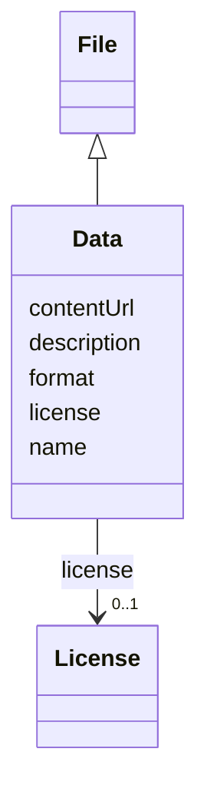

# Class: Data (Data) 


_Subclass of File representing structured or unstructured datasets, often used for analysis, storage, or transfer of information_


URI: [EVORAO:Data](https://w3id.org/evorao/Data)





## Inheritance
* [Resource](Resource.md)
    * [File](File.md)
        * **Data**


## Slots

| Name | Cardinality and Range | Description | Inheritance |
| ---  | --- | --- | --- |
| [name](name.md) | 1 <br/> [String](String.md) | A word or set of words used to identify and refer to an entity | [File](File.md) |
| [description](description.md) | 0..1 _recommended_ <br/> [String](String.md) | A short explanation of the characteristics, features, or nature of the curren... | [File](File.md) |
| [contentUrl](contentUrl.md) | 1 <br/> [Uri](Uri.md) | The web address or location where the file content is stored and can be acces... | [File](File.md) |
| [format](format.md) | 1 <br/> [String](String.md) | The file type or format that indicates how the data within the file is struct... | [File](File.md) |
| [license](license.md) | 0..1 <br/> [License](License.md) | Information about terms and conditions under which the subject can be used, s... | [File](File.md) |


## Usages

| used by | used in | type | used |
| ---  | --- | --- | --- |
| [NucleicAcid](NucleicAcid.md) | [genBankFileOfTheConstruct](genBankFileOfTheConstruct.md) | range | [Data](Data.md) |


## Identifier and Mapping Information


### Schema Source


* from schema: https://w3id.org/evorao/


## Mappings

| Mapping Type | Mapped Value |
| ---  | ---  |
| self | EVORAO:Data |
| native | EVORAO:Data |
| close | wd:Q42848, wd:Q42848 |


## LinkML Source

<!-- TODO: investigate https://stackoverflow.com/questions/37606292/how-to-create-tabbed-code-blocks-in-mkdocs-or-sphinx -->

### Direct

<details>
```yaml
name: Data
description: Subclass of File representing structured or unstructured datasets, often
  used for analysis, storage, or transfer of information
title: Data
from_schema: https://w3id.org/evorao/
close_mappings:
- wd:Q42848
- wd:Q42848
is_a: File

```
</details>

### Induced

<details>
```yaml
name: Data
description: Subclass of File representing structured or unstructured datasets, often
  used for analysis, storage, or transfer of information
title: Data
from_schema: https://w3id.org/evorao/
close_mappings:
- wd:Q42848
- wd:Q42848
is_a: File
attributes:
  name:
    name: name
    description: A word or set of words used to identify and refer to an entity
    title: name
    from_schema: https://w3id.org/evorao/
    exact_mappings:
    - schema:name
    close_mappings:
    - dct:title
    rank: 1000
    slot_uri: foaf:name
    alias: name
    owner: Data
    domain_of:
    - File
    - PersonOrOrganization
    - ContactPoint
    range: string
    required: true
    multivalued: false
  description:
    name: description
    description: A short explanation of the characteristics, features, or nature of
      the current item
    title: description
    comments:
    - 'Describe this item in few lines. This description will serve as a summary to
      present the resource.

      '
    from_schema: https://w3id.org/evorao/
    exact_mappings:
    - schema:description
    close_mappings:
    - schema:description
    rank: 1000
    slot_uri: dct:description
    alias: description
    owner: Data
    domain_of:
    - File
    - Dataset
    - DataService
    - Term
    - PersonOrOrganization
    - ContactPoint
    - License
    - Certification
    range: string
    required: false
    recommended: true
    multivalued: false
  contentUrl:
    name: contentUrl
    description: The web address or location where the file content is stored and
      can be accessed or downloaded.
    title: content URL
    from_schema: https://w3id.org/evorao/
    rank: 1000
    alias: contentUrl
    owner: Data
    domain_of:
    - File
    range: uri
    required: true
    multivalued: false
  format:
    name: format
    description: The file type or format that indicates how the data within the file
      is structured
    title: format
    from_schema: https://w3id.org/evorao/
    rank: 1000
    alias: format
    owner: Data
    domain_of:
    - File
    range: string
    required: true
    multivalued: false
  license:
    name: license
    description: Information about terms and conditions under which the subject can
      be used, shared, or distributed, indicating any restrictions or permissions
    title: license
    from_schema: https://w3id.org/evorao/
    exact_mappings:
    - dct:license
    close_mappings:
    - wdp:P275
    rank: 1000
    slot_uri: dct:license
    alias: license
    owner: Data
    domain_of:
    - File
    - DataProvider
    range: License
    required: false
    multivalued: false

```
</details>