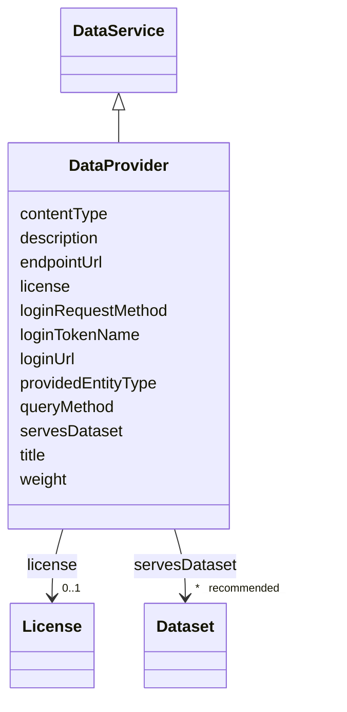

# Class: Data provider (DataProvider) 


_An external API (Application Programming Interface) or Endpoint that permits to retrieve data from other sources_


URI: [EVORAO:DataProvider](https://w3id.org/evorao/DataProvider)





## Inheritance
* [Resource](Resource.md)
    * [DataService](DataService.md)
        * **DataProvider**


## Slots

| Name | Cardinality and Range | Description | Inheritance |
| ---  | --- | --- | --- |
| [license](license.md) | 0..1 <br/> [License](License.md) | Information about terms and conditions under which the subject can be used, s... | direct |
| [loginRequestMethod](loginRequestMethod.md) | 0..1 <br/> [String](String.md) | The http request method used to acces the login request url | direct |
| [loginUrl](loginUrl.md) | 0..1 <br/> [Uri](Uri.md) | The URL template that allows to log in if required | direct |
| [loginTokenName](loginTokenName.md) | 0..1 <br/> [String](String.md) | The name of the token, unique identifier of an interaction session, that will... | direct |
| [queryMethod](queryMethod.md) | 1 <br/> [String](String.md) | The http request method used to access the requested query url | direct |
| [contentType](contentType.md) | 1 <br/> [String](String.md) | The content type of the response to the queries | direct |
| [providedEntityType](providedEntityType.md) | 1..* <br/> [String](String.md) | The identification of the entity type (Class) described by the response to th... | direct |
| [weight](weight.md) | 1 <br/> [Integer](Integer.md) | A numerical value indicating relative importance or priority, generally proce... | direct |
| [title](title.md) | 1 <br/> [String](String.md) | A name given to the resource | [DataService](DataService.md) |
| [description](description.md) | 0..1 _recommended_ <br/> [String](String.md) | A short explanation of the characteristics, features, or nature of the curren... | [DataService](DataService.md) |
| [endpointUrl](endpointUrl.md) | 1 <br/> [Uri](Uri.md) | The URL template that allows to get the content | [DataService](DataService.md) |
| [servesDataset](servesDataset.md) | * _recommended_ <br/> [Dataset](Dataset.md) | A collection of data that this data service can distribute | [DataService](DataService.md) |


## Usages

| used by | used in | type | used |
| ---  | --- | --- | --- |
| [Taxonomy](Taxonomy.md) | [taxonDataProvider](taxonDataProvider.md) | range | [DataProvider](DataProvider.md) |
| [Taxonomy](Taxonomy.md) | [versionDataProvider](versionDataProvider.md) | range | [DataProvider](DataProvider.md) |
| [Taxonomy](Taxonomy.md) | [rankDataProvider](rankDataProvider.md) | range | [DataProvider](DataProvider.md) |
| [Vocabulary](Vocabulary.md) | [termDataProvider](termDataProvider.md) | range | [DataProvider](DataProvider.md) |
| [Collection](Collection.md) | [collectionDataProvider](collectionDataProvider.md) | range | [DataProvider](DataProvider.md) |


## Identifier and Mapping Information


### Schema Source


* from schema: https://w3id.org/evorao/


## Mappings

| Mapping Type | Mapped Value |
| ---  | ---  |
| self | EVORAO:DataProvider |
| native | EVORAO:DataProvider |
| broad | schema:EntryPoint, schema:EntryPoint |
| close | wd:Q122625839, ncit:C205367, wd:Q122625839, ncit:C205367 |


## LinkML Source

<!-- TODO: investigate https://stackoverflow.com/questions/37606292/how-to-create-tabbed-code-blocks-in-mkdocs-or-sphinx -->

### Direct

<details>
```yaml
name: DataProvider
description: An external API (Application Programming Interface) or Endpoint that
  permits to retrieve data from other sources
title: Data provider
from_schema: https://w3id.org/evorao/
close_mappings:
- wd:Q122625839
- ncit:C205367
- wd:Q122625839
- ncit:C205367
broad_mappings:
- schema:EntryPoint
- schema:EntryPoint
is_a: DataService
slots:
- license
- loginRequestMethod
- loginUrl
- loginTokenName
- queryMethod
- contentType
- providedEntityType
- weight
slot_usage:
  license:
    name: license
    description: Information about terms and conditions under which the subject can
      be used, shared, or distributed, indicating any restrictions or permissions
    title: license
    exact_mappings:
    - schema:license
    close_mappings:
    - wdp:P275
    slot_uri: dct:license
    domain_of:
    - DataProvider
    - File
    range: License
    required: false
    multivalued: false
  loginRequestMethod:
    name: loginRequestMethod
    description: The http request method used to acces the login request url
    title: login request method
    close_mappings:
    - dcat:endpointDescription
    broad_mappings:
    - schema:httpMethod
    ifabsent: string(GET)
    domain_of:
    - DataProvider
    range: string
    required: false
    multivalued: false
  loginUrl:
    name: loginUrl
    description: The URL template that allows to log in if required
    title: login URL
    close_mappings:
    - wdp:P1630
    - dcat:endpointDescription
    broad_mappings:
    - schema:urlTemplate
    domain_of:
    - DataProvider
    range: uri
    required: false
    multivalued: false
  loginTokenName:
    name: loginTokenName
    description: The name of the token, unique identifier of an interaction session,
      that will have to be reused as credential in the query
    title: login token name
    close_mappings:
    - dcat:endpointDescription
    domain_of:
    - DataProvider
    range: string
    required: false
    multivalued: false
  queryMethod:
    name: queryMethod
    description: The http request method used to access the requested query url
    title: query method
    close_mappings:
    - dcat:endpointDescription
    broad_mappings:
    - schema:httpMethod
    domain_of:
    - DataProvider
    range: string
    required: true
    multivalued: false
  contentType:
    name: contentType
    description: The content type of the response to the queries
    title: content type
    close_mappings:
    - dct:format
    broad_mappings:
    - schema:contentType
    ifabsent: string(JSON)
    domain_of:
    - DataProvider
    range: string
    required: true
    multivalued: false
  providedEntityType:
    name: providedEntityType
    description: The identification of the entity type (Class) described by the response
      to the query
    title: provided entity type
    related_mappings:
    - dcat:servesDataset
    domain_of:
    - DataProvider
    range: string
    required: true
    multivalued: true
  weight:
    name: weight
    description: A numerical value indicating relative importance or priority, generally
      processed in ascending order. This weight helps prioritize content when organizing
      or processing data. Its value can be negative, with a default set to 0
    title: weight
    comments:
    - The lowest weighted Data providers are triggered first, this may be usefull
      to populate at first entities that are referenced by others (e.g. Version ahead
      of Rank ahead of Taxon)
    close_mappings:
    - adms:status
    domain_of:
    - DataProvider
    - Term
    range: integer
    required: true
    multivalued: false

```
</details>

### Induced

<details>
```yaml
name: DataProvider
description: An external API (Application Programming Interface) or Endpoint that
  permits to retrieve data from other sources
title: Data provider
from_schema: https://w3id.org/evorao/
close_mappings:
- wd:Q122625839
- ncit:C205367
- wd:Q122625839
- ncit:C205367
broad_mappings:
- schema:EntryPoint
- schema:EntryPoint
is_a: DataService
slot_usage:
  license:
    name: license
    description: Information about terms and conditions under which the subject can
      be used, shared, or distributed, indicating any restrictions or permissions
    title: license
    exact_mappings:
    - schema:license
    close_mappings:
    - wdp:P275
    slot_uri: dct:license
    domain_of:
    - DataProvider
    - File
    range: License
    required: false
    multivalued: false
  loginRequestMethod:
    name: loginRequestMethod
    description: The http request method used to acces the login request url
    title: login request method
    close_mappings:
    - dcat:endpointDescription
    broad_mappings:
    - schema:httpMethod
    ifabsent: string(GET)
    domain_of:
    - DataProvider
    range: string
    required: false
    multivalued: false
  loginUrl:
    name: loginUrl
    description: The URL template that allows to log in if required
    title: login URL
    close_mappings:
    - wdp:P1630
    - dcat:endpointDescription
    broad_mappings:
    - schema:urlTemplate
    domain_of:
    - DataProvider
    range: uri
    required: false
    multivalued: false
  loginTokenName:
    name: loginTokenName
    description: The name of the token, unique identifier of an interaction session,
      that will have to be reused as credential in the query
    title: login token name
    close_mappings:
    - dcat:endpointDescription
    domain_of:
    - DataProvider
    range: string
    required: false
    multivalued: false
  queryMethod:
    name: queryMethod
    description: The http request method used to access the requested query url
    title: query method
    close_mappings:
    - dcat:endpointDescription
    broad_mappings:
    - schema:httpMethod
    domain_of:
    - DataProvider
    range: string
    required: true
    multivalued: false
  contentType:
    name: contentType
    description: The content type of the response to the queries
    title: content type
    close_mappings:
    - dct:format
    broad_mappings:
    - schema:contentType
    ifabsent: string(JSON)
    domain_of:
    - DataProvider
    range: string
    required: true
    multivalued: false
  providedEntityType:
    name: providedEntityType
    description: The identification of the entity type (Class) described by the response
      to the query
    title: provided entity type
    related_mappings:
    - dcat:servesDataset
    domain_of:
    - DataProvider
    range: string
    required: true
    multivalued: true
  weight:
    name: weight
    description: A numerical value indicating relative importance or priority, generally
      processed in ascending order. This weight helps prioritize content when organizing
      or processing data. Its value can be negative, with a default set to 0
    title: weight
    comments:
    - The lowest weighted Data providers are triggered first, this may be usefull
      to populate at first entities that are referenced by others (e.g. Version ahead
      of Rank ahead of Taxon)
    close_mappings:
    - adms:status
    domain_of:
    - DataProvider
    - Term
    range: integer
    required: true
    multivalued: false
attributes:
  license:
    name: license
    description: Information about terms and conditions under which the subject can
      be used, shared, or distributed, indicating any restrictions or permissions
    title: license
    from_schema: https://w3id.org/evorao/
    exact_mappings:
    - schema:license
    close_mappings:
    - wdp:P275
    rank: 1000
    slot_uri: dct:license
    alias: license
    owner: DataProvider
    domain_of:
    - DataProvider
    - File
    range: License
    required: false
    multivalued: false
  loginRequestMethod:
    name: loginRequestMethod
    description: The http request method used to acces the login request url
    title: login request method
    from_schema: https://w3id.org/evorao/
    close_mappings:
    - dcat:endpointDescription
    broad_mappings:
    - schema:httpMethod
    rank: 1000
    ifabsent: string(GET)
    alias: loginRequestMethod
    owner: DataProvider
    domain_of:
    - DataProvider
    range: string
    required: false
    multivalued: false
    equals_string_in:
    - GET
    - POST
  loginUrl:
    name: loginUrl
    description: The URL template that allows to log in if required
    title: login URL
    from_schema: https://w3id.org/evorao/
    close_mappings:
    - wdp:P1630
    - dcat:endpointDescription
    broad_mappings:
    - schema:urlTemplate
    rank: 1000
    alias: loginUrl
    owner: DataProvider
    domain_of:
    - DataProvider
    range: uri
    required: false
    multivalued: false
  loginTokenName:
    name: loginTokenName
    description: The name of the token, unique identifier of an interaction session,
      that will have to be reused as credential in the query
    title: login token name
    from_schema: https://w3id.org/evorao/
    close_mappings:
    - dcat:endpointDescription
    rank: 1000
    alias: loginTokenName
    owner: DataProvider
    domain_of:
    - DataProvider
    range: string
    required: false
    multivalued: false
  queryMethod:
    name: queryMethod
    description: The http request method used to access the requested query url
    title: query method
    from_schema: https://w3id.org/evorao/
    close_mappings:
    - dcat:endpointDescription
    broad_mappings:
    - schema:httpMethod
    rank: 1000
    alias: queryMethod
    owner: DataProvider
    domain_of:
    - DataProvider
    range: string
    required: true
    multivalued: false
    equals_string_in:
    - GET
    - POST
  contentType:
    name: contentType
    description: The content type of the response to the queries
    title: content type
    from_schema: https://w3id.org/evorao/
    close_mappings:
    - dct:format
    broad_mappings:
    - schema:contentType
    rank: 1000
    ifabsent: string(JSON)
    alias: contentType
    owner: DataProvider
    domain_of:
    - DataProvider
    range: string
    required: true
    multivalued: false
  providedEntityType:
    name: providedEntityType
    description: The identification of the entity type (Class) described by the response
      to the query
    title: provided entity type
    from_schema: https://w3id.org/evorao/
    related_mappings:
    - dcat:servesDataset
    rank: 1000
    alias: providedEntityType
    owner: DataProvider
    domain_of:
    - DataProvider
    range: string
    required: true
    multivalued: true
  weight:
    name: weight
    description: A numerical value indicating relative importance or priority, generally
      processed in ascending order. This weight helps prioritize content when organizing
      or processing data. Its value can be negative, with a default set to 0
    title: weight
    comments:
    - The lowest weighted Data providers are triggered first, this may be usefull
      to populate at first entities that are referenced by others (e.g. Version ahead
      of Rank ahead of Taxon)
    from_schema: https://w3id.org/evorao/
    close_mappings:
    - adms:status
    rank: 1000
    ifabsent: int(0)
    alias: weight
    owner: DataProvider
    domain_of:
    - DataProvider
    - Term
    range: integer
    required: true
    multivalued: false
  title:
    name: title
    description: A name given to the resource
    title: title
    comments:
    - 'The title of the item should be as short and descriptive as possible. E.g.
      for virus products it should basically be based on the following Pattern:

      ''Virus name'', ''virus host type'', ''collection year'', ''country of collection''
      ex ''suspected epidemiological origin'', ''genotype'', ''strain'', ''variant
      name or specific feature'
    from_schema: https://w3id.org/evorao/
    exact_mappings:
    - schema:name
    - rdfs:label
    rank: 1000
    slot_uri: dct:title
    alias: title
    owner: DataProvider
    domain_of:
    - DataService
    - Dataset
    - Publication
    - Term
    - License
    - Certification
    range: string
    required: true
    multivalued: false
  description:
    name: description
    description: A short explanation of the characteristics, features, or nature of
      the current item
    title: description
    comments:
    - 'Describe this item in few lines. This description will serve as a summary to
      present the resource.

      '
    from_schema: https://w3id.org/evorao/
    exact_mappings:
    - schema:description
    close_mappings:
    - schema:description
    rank: 1000
    slot_uri: dct:description
    alias: description
    owner: DataProvider
    domain_of:
    - DataService
    - Dataset
    - Term
    - PersonOrOrganization
    - File
    - ContactPoint
    - License
    - Certification
    range: string
    required: false
    recommended: true
    multivalued: false
  endpointUrl:
    name: endpointUrl
    description: The URL template that allows to get the content
    title: endpoint URL
    from_schema: https://w3id.org/evorao/
    exact_mappings:
    - schema:urlTemplate
    close_mappings:
    - wdp:P1630
    rank: 1000
    slot_uri: dcat:endpointURL
    alias: endpointUrl
    owner: DataProvider
    domain_of:
    - DataService
    range: uri
    required: true
    multivalued: false
  servesDataset:
    name: servesDataset
    description: A collection of data that this data service can distribute
    title: serves dataset
    comments:
    - This property rather intends to point towards Catalogues as collections of Datasets
    from_schema: https://w3id.org/evorao/
    rank: 1000
    slot_uri: dcat:servesDataset
    alias: servesDataset
    owner: DataProvider
    domain_of:
    - DataService
    range: Dataset
    required: false
    recommended: true
    multivalued: true

```
</details>