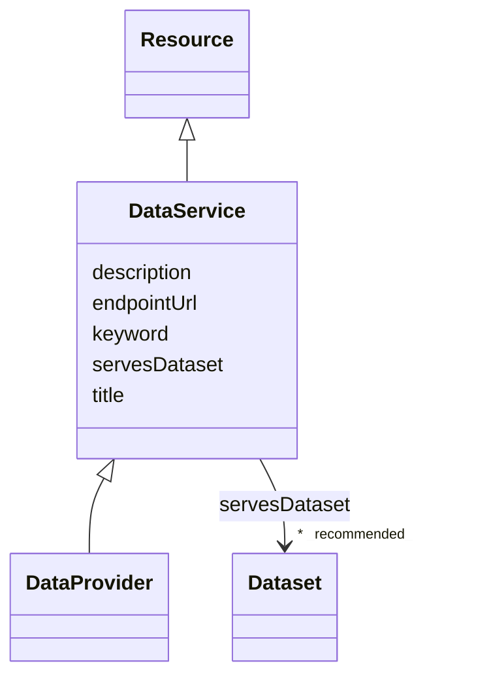

# Class: Data Service (DataService) 


_A collection of operations that provides access to one or more datasets or data processing functions_


* __NOTE__: this is an abstract class and should not be instantiated directly


URI: [dcat:DataService](http://www.w3.org/ns/dcat#DataService)





## Inheritance
* [Resource](Resource.md)
    * **DataService**
        * [DataProvider](DataProvider.md)


## Slots

| Name | Cardinality and Range | Description | Inheritance |
| ---  | --- | --- | --- |
| [title](title.md) | 1 <br/> [String](String.md) | A name given to the resource | direct |
| [description](description.md) | 0..1 _recommended_ <br/> [String](String.md) | A short explanation of the characteristics, features, or nature of the curren... | direct |
| [endpointUrl](endpointUrl.md) | 1 <br/> [Uri](Uri.md) | The URL template that allows to get the content | direct |
| [servesDataset](servesDataset.md) | * _recommended_ <br/> [Dataset](Dataset.md) | A collection of data that this data service can distribute | direct |
| [keyword](keyword.md) | * <br/> [String](String.md) | A keyword or tag describing the resource | [Resource](Resource.md) |


## Identifier and Mapping Information


### Schema Source


* from schema: https://w3id.org/evorao/


## Mappings

| Mapping Type | Mapped Value |
| ---  | ---  |
| self | dcat:DataService |
| native | EVORAO:DataService |
| exact | schema:EntryPoint, schema:EntryPoint |
| close | wd:Q193424, schema:WebAPI, wd:Q193424, schema:WebAPI |


## LinkML Source

<!-- TODO: investigate https://stackoverflow.com/questions/37606292/how-to-create-tabbed-code-blocks-in-mkdocs-or-sphinx -->

### Direct

<details>
```yaml
name: DataService
description: A collection of operations that provides access to one or more datasets
  or data processing functions
title: Data Service
from_schema: https://w3id.org/evorao/
exact_mappings:
- schema:EntryPoint
- schema:EntryPoint
close_mappings:
- wd:Q193424
- schema:WebAPI
- wd:Q193424
- schema:WebAPI
is_a: Resource
abstract: true
slots:
- title
- description
- endpointUrl
- servesDataset
slot_usage:
  title:
    name: title
    description: A name given to the resource
    title: title
    comments:
    - 'The title of the item should be as short and descriptive as possible. E.g.
      for virus products it should basically be based on the following Pattern: ''Virus
      name'', ''virus host type'', ''collection year'', ''country of collection''
      ex ''suspected epidemiological origin'', ''genotype'', ''strain'', ''variant
      name or specific feature'
    exact_mappings:
    - schema:name
    - rdfs:label
    slot_uri: dct:title
    domain_of:
    - DataService
    - Dataset
    - Publication
    - Term
    - License
    - Certification
    range: string
    required: true
    multivalued: false
  description:
    name: description
    description: A short explanation of the characteristics, features, or nature of
      the current item
    title: description
    comments:
    - Describe this item in few lines. This description will serve as a summary to
      present the resource.
    exact_mappings:
    - schema:description
    slot_uri: dct:description
    domain_of:
    - DataService
    - Dataset
    - Term
    - PersonOrOrganization
    - File
    - ContactPoint
    - License
    - Certification
    range: string
    required: false
    recommended: true
    multivalued: false
  endpointUrl:
    name: endpointUrl
    description: The URL template that allows to get the content
    title: endpoint URL
    exact_mappings:
    - schema:urlTemplate
    close_mappings:
    - wdp:P1630
    slot_uri: dcat:endpointURL
    domain_of:
    - DataService
    range: uri
    required: true
    multivalued: false
  servesDataset:
    name: servesDataset
    description: A collection of data that this data service can distribute
    title: serves dataset
    comments:
    - This property rather intends to point towards Catalogues as collections of Datasets
    slot_uri: dcat:servesDataset
    domain_of:
    - DataService
    range: Dataset
    required: false
    recommended: true
    multivalued: true
class_uri: dcat:DataService

```
</details>

### Induced

<details>
```yaml
name: DataService
description: A collection of operations that provides access to one or more datasets
  or data processing functions
title: Data Service
from_schema: https://w3id.org/evorao/
exact_mappings:
- schema:EntryPoint
- schema:EntryPoint
close_mappings:
- wd:Q193424
- schema:WebAPI
- wd:Q193424
- schema:WebAPI
is_a: Resource
abstract: true
slot_usage:
  title:
    name: title
    description: A name given to the resource
    title: title
    comments:
    - 'The title of the item should be as short and descriptive as possible. E.g.
      for virus products it should basically be based on the following Pattern: ''Virus
      name'', ''virus host type'', ''collection year'', ''country of collection''
      ex ''suspected epidemiological origin'', ''genotype'', ''strain'', ''variant
      name or specific feature'
    exact_mappings:
    - schema:name
    - rdfs:label
    slot_uri: dct:title
    domain_of:
    - DataService
    - Dataset
    - Publication
    - Term
    - License
    - Certification
    range: string
    required: true
    multivalued: false
  description:
    name: description
    description: A short explanation of the characteristics, features, or nature of
      the current item
    title: description
    comments:
    - Describe this item in few lines. This description will serve as a summary to
      present the resource.
    exact_mappings:
    - schema:description
    slot_uri: dct:description
    domain_of:
    - DataService
    - Dataset
    - Term
    - PersonOrOrganization
    - File
    - ContactPoint
    - License
    - Certification
    range: string
    required: false
    recommended: true
    multivalued: false
  endpointUrl:
    name: endpointUrl
    description: The URL template that allows to get the content
    title: endpoint URL
    exact_mappings:
    - schema:urlTemplate
    close_mappings:
    - wdp:P1630
    slot_uri: dcat:endpointURL
    domain_of:
    - DataService
    range: uri
    required: true
    multivalued: false
  servesDataset:
    name: servesDataset
    description: A collection of data that this data service can distribute
    title: serves dataset
    comments:
    - This property rather intends to point towards Catalogues as collections of Datasets
    slot_uri: dcat:servesDataset
    domain_of:
    - DataService
    range: Dataset
    required: false
    recommended: true
    multivalued: true
attributes:
  title:
    name: title
    description: A name given to the resource
    title: title
    comments:
    - 'The title of the item should be as short and descriptive as possible. E.g.
      for virus products it should basically be based on the following Pattern: ''Virus
      name'', ''virus host type'', ''collection year'', ''country of collection''
      ex ''suspected epidemiological origin'', ''genotype'', ''strain'', ''variant
      name or specific feature'
    from_schema: https://w3id.org/evorao/
    exact_mappings:
    - schema:name
    - rdfs:label
    rank: 1000
    slot_uri: dct:title
    alias: title
    owner: DataService
    domain_of:
    - DataService
    - Dataset
    - Publication
    - Term
    - License
    - Certification
    range: string
    required: true
    multivalued: false
  description:
    name: description
    description: A short explanation of the characteristics, features, or nature of
      the current item
    title: description
    comments:
    - Describe this item in few lines. This description will serve as a summary to
      present the resource.
    from_schema: https://w3id.org/evorao/
    exact_mappings:
    - schema:description
    close_mappings:
    - schema:description
    rank: 1000
    slot_uri: dct:description
    alias: description
    owner: DataService
    domain_of:
    - DataService
    - Dataset
    - Term
    - PersonOrOrganization
    - File
    - ContactPoint
    - License
    - Certification
    range: string
    required: false
    recommended: true
    multivalued: false
  endpointUrl:
    name: endpointUrl
    description: The URL template that allows to get the content
    title: endpoint URL
    from_schema: https://w3id.org/evorao/
    exact_mappings:
    - schema:urlTemplate
    close_mappings:
    - wdp:P1630
    rank: 1000
    slot_uri: dcat:endpointURL
    alias: endpointUrl
    owner: DataService
    domain_of:
    - DataService
    range: uri
    required: true
    multivalued: false
  servesDataset:
    name: servesDataset
    description: A collection of data that this data service can distribute
    title: serves dataset
    comments:
    - This property rather intends to point towards Catalogues as collections of Datasets
    from_schema: https://w3id.org/evorao/
    rank: 1000
    slot_uri: dcat:servesDataset
    alias: servesDataset
    owner: DataService
    domain_of:
    - DataService
    range: Dataset
    required: false
    recommended: true
    multivalued: true
  keyword:
    name: keyword
    description: A keyword or tag describing the resource
    title: keyword
    from_schema: https://w3id.org/evorao/
    rank: 1000
    slot_uri: dcat:keyword
    alias: keyword
    owner: DataService
    domain_of:
    - Resource
    range: string
    required: false
    multivalued: true
class_uri: dcat:DataService

```
</details>