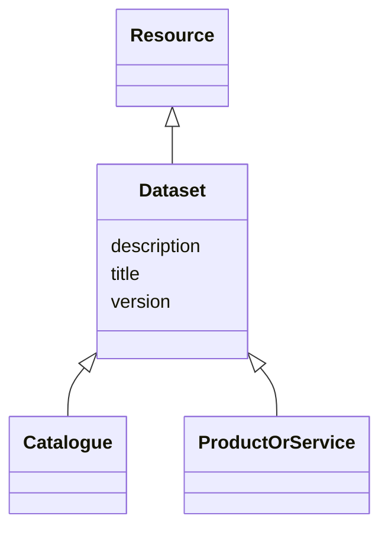

# Class: Dataset (Dataset) 


_A collection of data, published or curated by a single agent, and available for access_


* __NOTE__: this is an abstract class and should not be instantiated directly


URI: [dcat:Dataset](http://www.w3.org/ns/dcat#Dataset)





## Inheritance
* [Resource](Resource.md)
    * **Dataset**
        * [Catalogue](Catalogue.md)
        * [ProductOrService](ProductOrService.md)


## Slots

| Name | Cardinality and Range | Description | Inheritance |
| ---  | --- | --- | --- |
| [title](title.md) | 1 <br/> [String](String.md) | A name given to the resource | direct |
| [description](description.md) | 1 _recommended_ <br/> [String](String.md) | A short explanation of the characteristics, features, or nature of the curren... | direct |
| [version](version.md) | 0..1 _recommended_ <br/> [String](String.md) | The version indicator (name or identifier) of a resource | direct |


## Usages

| used by | used in | type | used |
| ---  | --- | --- | --- |
| [DataProvider](DataProvider.md) | [providedEntityType](providedEntityType.md) | range | [Dataset](Dataset.md) |


## Identifier and Mapping Information


### Schema Source


* from schema: https://w3id.org/evorao/


## Mappings

| Mapping Type | Mapped Value |
| ---  | ---  |
| self | dcat:Dataset |
| native | EVORAO:Dataset |
| exact | schema:Dataset, wd:Q1172284, schema:Dataset, wd:Q1172284 |


## LinkML Source

<!-- TODO: investigate https://stackoverflow.com/questions/37606292/how-to-create-tabbed-code-blocks-in-mkdocs-or-sphinx -->

### Direct

<details>
```yaml
name: Dataset
description: A collection of data, published or curated by a single agent, and available
  for access
title: Dataset
from_schema: https://w3id.org/evorao/
exact_mappings:
- schema:Dataset
- wd:Q1172284
- schema:Dataset
- wd:Q1172284
is_a: Resource
abstract: true
slots:
- title
- description
- version
slot_usage:
  title:
    name: title
    description: A name given to the resource
    title: title
    comments:
    - 'The title of the item should be as short and descriptive as possible. E.g.
      for virus products it should basically be based on the following Pattern:

      ''Virus name'', ''virus host type'', ''collection year'', ''country of collection''
      ex ''suspected epidemiological origin'', ''genotype'', ''strain'', ''variant
      name or specific feature'
    close_mappings:
    - rdfs:label
    - schema:name
    slot_uri: dct:title
    domain_of:
    - Dataset
    - DataService
    - Publication
    - Term
    - License
    - Certification
    range: string
    required: true
    multivalued: false
  description:
    name: description
    description: A short explanation of the characteristics, features, or nature of
      the current item
    title: description
    comments:
    - 'Describe this item in few lines. This description will serve as a summary to
      present the resource.

      '
    exact_mappings:
    - schema:description
    slot_uri: dct:description
    domain_of:
    - Dataset
    - DataService
    - Term
    - PersonOrOrganization
    - File
    - ContactPoint
    - License
    - Certification
    range: string
    required: true
    multivalued: false
  version:
    name: version
    description: The version indicator (name or identifier) of a resource
    title: version
    close_mappings:
    - wdp:P393
    - schema:version
    slot_uri: dcat:version
    domain_of:
    - Dataset
    - Version
    - Taxonomy
    range: string
    required: false
    recommended: true
    multivalued: false
class_uri: dcat:Dataset

```
</details>

### Induced

<details>
```yaml
name: Dataset
description: A collection of data, published or curated by a single agent, and available
  for access
title: Dataset
from_schema: https://w3id.org/evorao/
exact_mappings:
- schema:Dataset
- wd:Q1172284
- schema:Dataset
- wd:Q1172284
is_a: Resource
abstract: true
slot_usage:
  title:
    name: title
    description: A name given to the resource
    title: title
    comments:
    - 'The title of the item should be as short and descriptive as possible. E.g.
      for virus products it should basically be based on the following Pattern:

      ''Virus name'', ''virus host type'', ''collection year'', ''country of collection''
      ex ''suspected epidemiological origin'', ''genotype'', ''strain'', ''variant
      name or specific feature'
    close_mappings:
    - rdfs:label
    - schema:name
    slot_uri: dct:title
    domain_of:
    - Dataset
    - DataService
    - Publication
    - Term
    - License
    - Certification
    range: string
    required: true
    multivalued: false
  description:
    name: description
    description: A short explanation of the characteristics, features, or nature of
      the current item
    title: description
    comments:
    - 'Describe this item in few lines. This description will serve as a summary to
      present the resource.

      '
    exact_mappings:
    - schema:description
    slot_uri: dct:description
    domain_of:
    - Dataset
    - DataService
    - Term
    - PersonOrOrganization
    - File
    - ContactPoint
    - License
    - Certification
    range: string
    required: true
    multivalued: false
  version:
    name: version
    description: The version indicator (name or identifier) of a resource
    title: version
    close_mappings:
    - wdp:P393
    - schema:version
    slot_uri: dcat:version
    domain_of:
    - Dataset
    - Version
    - Taxonomy
    range: string
    required: false
    recommended: true
    multivalued: false
attributes:
  title:
    name: title
    description: A name given to the resource
    title: title
    comments:
    - 'The title of the item should be as short and descriptive as possible. E.g.
      for virus products it should basically be based on the following Pattern:

      ''Virus name'', ''virus host type'', ''collection year'', ''country of collection''
      ex ''suspected epidemiological origin'', ''genotype'', ''strain'', ''variant
      name or specific feature'
    from_schema: https://w3id.org/evorao/
    close_mappings:
    - rdfs:label
    - schema:name
    rank: 1000
    slot_uri: dct:title
    alias: title
    owner: Dataset
    domain_of:
    - Dataset
    - DataService
    - Publication
    - Term
    - License
    - Certification
    range: string
    required: true
    multivalued: false
  description:
    name: description
    description: A short explanation of the characteristics, features, or nature of
      the current item
    title: description
    comments:
    - 'Describe this item in few lines. This description will serve as a summary to
      present the resource.

      '
    from_schema: https://w3id.org/evorao/
    exact_mappings:
    - schema:description
    close_mappings:
    - schema:description
    rank: 1000
    slot_uri: dct:description
    alias: description
    owner: Dataset
    domain_of:
    - Dataset
    - DataService
    - Term
    - PersonOrOrganization
    - File
    - ContactPoint
    - License
    - Certification
    range: string
    required: true
    recommended: true
    multivalued: false
  version:
    name: version
    description: The version indicator (name or identifier) of a resource
    title: version
    from_schema: https://w3id.org/evorao/
    close_mappings:
    - wdp:P393
    - schema:version
    rank: 1000
    slot_uri: dcat:version
    alias: version
    owner: Dataset
    domain_of:
    - Dataset
    - Version
    - Taxonomy
    range: string
    required: false
    recommended: true
    multivalued: false
class_uri: dcat:Dataset

```
</details>