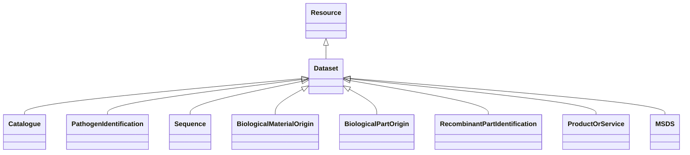

# Class: Dataset (Dataset)


_A collection of data, published or curated by a single agent, and available for access_


* __NOTE__: this is an abstract class and should not be instantiated directly


URI: [EVORAO:Dataset](https://raw.githubusercontent.com/EVORA-project/evora-ontology/refs/heads/main/models/owl/evora_ontology.owl.ttl#Dataset)





## Inheritance
* [Resource](Resource.md)
    * **Dataset**
        * [Catalogue](Catalogue.md)
        * [PathogenIdentification](PathogenIdentification.md)
        * [Sequence](Sequence.md)
        * [BiologicalMaterialOrigin](BiologicalMaterialOrigin.md)
        * [BiologicalPartOrigin](BiologicalPartOrigin.md)
        * [RecombinantPartIdentification](RecombinantPartIdentification.md)
        * [ProductOrService](ProductOrService.md)
        * [MSDS](MSDS.md)


## Slots

| Name | Cardinality and Range | Description | Inheritance |
| ---  | --- | --- | --- |


## Usages

| used by | used in | type | used |
| ---  | --- | --- | --- |
| [Version](Version.md) | [versionOf](versionOf.md) | range | [Dataset](Dataset.md) |
| [DataProvider](DataProvider.md) | [providedEntityType](providedEntityType.md) | range | [Dataset](Dataset.md) |


## Identifier and Mapping Information


### Schema Source


* from schema: https://raw.githubusercontent.com/EVORA-project/evora-ontology/refs/heads/main/models/owl/evora_ontology.owl.ttl#


## Mappings

| Mapping Type | Mapped Value |
| ---  | ---  |
| self | EVORAO:Dataset |
| native | EVORAO:Dataset |
| exact | dcat:Dataset |
| close | wd:Q1172284, schema:DataCatalog |


## LinkML Source

<!-- TODO: investigate https://stackoverflow.com/questions/37606292/how-to-create-tabbed-code-blocks-in-mkdocs-or-sphinx -->

### Direct

<details>
```yaml
name: Dataset
description: A collection of data, published or curated by a single agent, and available
  for access
title: Dataset
from_schema: https://raw.githubusercontent.com/EVORA-project/evora-ontology/refs/heads/main/models/owl/evora_ontology.owl.ttl#
exact_mappings:
- dcat:Dataset
close_mappings:
- wd:Q1172284
- schema:DataCatalog
is_a: Resource
abstract: true

```
</details>

### Induced

<details>
```yaml
name: Dataset
description: A collection of data, published or curated by a single agent, and available
  for access
title: Dataset
from_schema: https://raw.githubusercontent.com/EVORA-project/evora-ontology/refs/heads/main/models/owl/evora_ontology.owl.ttl#
exact_mappings:
- dcat:Dataset
close_mappings:
- wd:Q1172284
- schema:DataCatalog
is_a: Resource
abstract: true

```
</details>