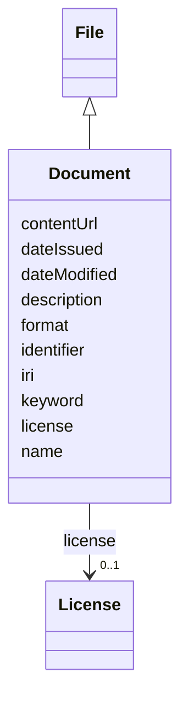

# Class: Document (Document) 


_Subclass of File representing textual or written files such as reports, manuals, or forms_


URI: [EVORAO:Document](https://w3id.org/evorao/Document)





## Inheritance
* [Resource](Resource.md)
    * [File](File.md)
        * **Document**


## Slots

| Name | Cardinality and Range | Description | Inheritance |
| ---  | --- | --- | --- |
| [name](name.md) | 1 <br/> [String](String.md) | A word or set of words used to identify and refer to an entity | [File](File.md) |
| [description](description.md) | 0..1 _recommended_ <br/> [String](String.md) | A short explanation of the characteristics, features, or nature of the curren... | [File](File.md) |
| [contentUrl](contentUrl.md) | 1 <br/> [Uri](Uri.md) | The web address or location where the file content is stored and can be acces... | [File](File.md) |
| [format](format.md) | 1 <br/> [String](String.md) | The file type or format that indicates how the data within the file is struct... | [File](File.md) |
| [license](license.md) | 0..1 <br/> [License](License.md) | Information about terms and conditions under which the subject can be used, s... | [File](File.md) |
| [keyword](keyword.md) | * <br/> [String](String.md) | A keyword or tag describing the resource | [Resource](Resource.md) |
| [dateIssued](dateIssued.md) | 0..1 <br/> [Datetime](Datetime.md) | Date of formal issuance (e | [Resource](Resource.md) |
| [dateModified](dateModified.md) | 0..1 <br/> [Datetime](Datetime.md) | Most recent date on which the resource was changed, updated or modified | [Resource](Resource.md) |
| [identifier](identifier.md) | * <br/> [String](String.md) | A unique identifier of the resource being described or cataloged | [Resource](Resource.md) |
| [iri](iri.md) | * <br/> [Uri](Uri.md) | International Resource Identifier (IRI) that uniquely identifies or refers to... | [Resource](Resource.md) |


## Usages

| used by | used in | type | used |
| ---  | --- | --- | --- |
| [ProductOrService](ProductOrService.md) | [complementaryDocument](complementaryDocument.md) | range | [Document](Document.md) |
| [Service](Service.md) | [complementaryDocument](complementaryDocument.md) | range | [Document](Document.md) |
| [Product](Product.md) | [complementaryDocument](complementaryDocument.md) | range | [Document](Document.md) |
| [Antibody](Antibody.md) | [complementaryDocument](complementaryDocument.md) | range | [Document](Document.md) |
| [Hybridoma](Hybridoma.md) | [complementaryDocument](complementaryDocument.md) | range | [Document](Document.md) |
| [Protein](Protein.md) | [complementaryDocument](complementaryDocument.md) | range | [Document](Document.md) |
| [NucleicAcid](NucleicAcid.md) | [complementaryDocument](complementaryDocument.md) | range | [Document](Document.md) |
| [DetectionKit](DetectionKit.md) | [complementaryDocument](complementaryDocument.md) | range | [Document](Document.md) |
| [Bundle](Bundle.md) | [complementaryDocument](complementaryDocument.md) | range | [Document](Document.md) |
| [Pathogen](Pathogen.md) | [complementaryDocument](complementaryDocument.md) | range | [Document](Document.md) |
| [Virus](Virus.md) | [complementaryDocument](complementaryDocument.md) | range | [Document](Document.md) |
| [Bacterium](Bacterium.md) | [complementaryDocument](complementaryDocument.md) | range | [Document](Document.md) |
| [Fungus](Fungus.md) | [complementaryDocument](complementaryDocument.md) | range | [Document](Document.md) |
| [Protozoan](Protozoan.md) | [complementaryDocument](complementaryDocument.md) | range | [Document](Document.md) |
| [Viroid](Viroid.md) | [complementaryDocument](complementaryDocument.md) | range | [Document](Document.md) |
| [Prion](Prion.md) | [complementaryDocument](complementaryDocument.md) | range | [Document](Document.md) |
| [Certification](Certification.md) | [certificationDocument](certificationDocument.md) | range | [Document](Document.md) |


## Identifier and Mapping Information


### Schema Source


* from schema: https://w3id.org/evorao/


## Mappings

| Mapping Type | Mapped Value |
| ---  | ---  |
| self | EVORAO:Document |
| native | EVORAO:Document |
| exact | schema:DigitalDocument, schema:DigitalDocument |
| broad | dct:MediaType, dct:MediaType |
| close | wd:Q49848, ncit:C19498, sio:000148, iao:0000310, wd:Q49848, ncit:C19498, sio:000148, iao:0000310 |


## LinkML Source

<!-- TODO: investigate https://stackoverflow.com/questions/37606292/how-to-create-tabbed-code-blocks-in-mkdocs-or-sphinx -->

### Direct

<details>
```yaml
name: Document
description: Subclass of File representing textual or written files such as reports,
  manuals, or forms
title: Document
from_schema: https://w3id.org/evorao/
exact_mappings:
- schema:DigitalDocument
- schema:DigitalDocument
close_mappings:
- wd:Q49848
- ncit:C19498
- sio:000148
- iao:0000310
- wd:Q49848
- ncit:C19498
- sio:000148
- iao:0000310
broad_mappings:
- dct:MediaType
- dct:MediaType
is_a: File

```
</details>

### Induced

<details>
```yaml
name: Document
description: Subclass of File representing textual or written files such as reports,
  manuals, or forms
title: Document
from_schema: https://w3id.org/evorao/
exact_mappings:
- schema:DigitalDocument
- schema:DigitalDocument
close_mappings:
- wd:Q49848
- ncit:C19498
- sio:000148
- iao:0000310
- wd:Q49848
- ncit:C19498
- sio:000148
- iao:0000310
broad_mappings:
- dct:MediaType
- dct:MediaType
is_a: File
attributes:
  name:
    name: name
    description: A word or set of words used to identify and refer to an entity
    title: name
    from_schema: https://w3id.org/evorao/
    exact_mappings:
    - schema:name
    - vcard:fn
    close_mappings:
    - rdfs:label
    - dct:title
    rank: 1000
    slot_uri: foaf:name
    alias: name
    owner: Document
    domain_of:
    - File
    - PersonOrOrganization
    - ContactPoint
    range: string
    required: true
    multivalued: false
  description:
    name: description
    description: A short explanation of the characteristics, features, or nature of
      the current item
    title: description
    comments:
    - Describe this item in few lines. This description will serve as a summary to
      present the resource
    from_schema: https://w3id.org/evorao/
    exact_mappings:
    - schema:description
    close_mappings:
    - schema:description
    rank: 1000
    slot_uri: dct:description
    alias: description
    owner: Document
    domain_of:
    - File
    - Dataset
    - DataService
    - Term
    - PersonOrOrganization
    - ContactPoint
    - License
    - Certification
    range: string
    required: false
    recommended: true
    multivalued: false
  contentUrl:
    name: contentUrl
    description: The web address or location where the file content is stored and
      can be accessed or downloaded.
    title: content URL
    from_schema: https://w3id.org/evorao/
    exact_mappings:
    - schema:contentUrl
    rank: 1000
    alias: contentUrl
    owner: Document
    domain_of:
    - File
    range: uri
    required: true
    multivalued: false
  format:
    name: format
    description: The file type or format that indicates how the data within the file
      is structured
    title: format
    from_schema: https://w3id.org/evorao/
    exact_mappings:
    - schema:fileFormat
    - dct:format
    close_mappings:
    - schema:encodingFormat
    rank: 1000
    alias: format
    owner: Document
    domain_of:
    - File
    range: string
    required: true
    multivalued: false
  license:
    name: license
    description: Information about terms and conditions under which the subject can
      be used, shared, or distributed, indicating any restrictions or permissions
    title: license
    from_schema: https://w3id.org/evorao/
    exact_mappings:
    - dct:license
    - schema:license
    close_mappings:
    - wdp:P275
    rank: 1000
    slot_uri: dct:license
    alias: license
    owner: Document
    domain_of:
    - File
    - DataProvider
    range: License
    required: false
    multivalued: false
  keyword:
    name: keyword
    description: A keyword or tag describing the resource
    title: keyword
    from_schema: https://w3id.org/evorao/
    rank: 1000
    slot_uri: dcat:keyword
    alias: keyword
    owner: Document
    domain_of:
    - Resource
    range: string
    required: false
    multivalued: true
  dateIssued:
    name: dateIssued
    description: Date of formal issuance (e.g., publication) of the resource
    title: date issued
    comments:
    - encoded using the relevant ISO 8601 Date and Time compliant string [DATETIME]
    from_schema: https://w3id.org/evorao/
    exact_mappings:
    - sepio:0000051
    close_mappings:
    - schema:datePublished
    - schema:dateCreated
    rank: 1000
    slot_uri: dct:issued
    alias: dateIssued
    owner: Document
    domain_of:
    - Resource
    range: datetime
    required: false
    multivalued: false
  dateModified:
    name: dateModified
    description: Most recent date on which the resource was changed, updated or modified
    title: date modified
    comments:
    - encoded using the relevant ISO 8601 Date and Time compliant string [DATETIME]
    from_schema: https://w3id.org/evorao/
    exact_mappings:
    - sepio:0000036
    close_mappings:
    - schema:dateModified
    rank: 1000
    slot_uri: dct:modified
    alias: dateModified
    owner: Document
    domain_of:
    - Resource
    range: datetime
    required: false
    multivalued: false
  identifier:
    name: identifier
    description: A unique identifier of the resource being described or cataloged
    title: identifier
    comments:
    - The identifier is a text string which is assigned to the resource to provide
      an unambiguous reference within a particular context. Persistent identifiers
      should be provided as HTTP URIs
    from_schema: https://w3id.org/evorao/
    exact_mappings:
    - schema:identifier
    rank: 1000
    slot_uri: dct:identifier
    alias: identifier
    owner: Document
    domain_of:
    - Resource
    range: string
    required: false
    multivalued: true
  iri:
    name: iri
    description: International Resource Identifier (IRI) that uniquely identifies
      or refers to the resource. IRIs include URIs, and URIs include URLs
    title: IRI
    comments:
    - An IRI is a global identifier standardized by IETF RFC 3987. It may or may not
      be resolvable on the web. IRIs include URIs, and URIs include URLs
    from_schema: https://w3id.org/evorao/
    close_mappings:
    - biolink:iri
    related_mappings:
    - mi:url
    narrow_mappings:
    - schema:url
    rank: 1000
    is_a: identifier
    alias: iri
    owner: Document
    domain_of:
    - Resource
    range: uri
    required: false
    multivalued: true

```
</details>