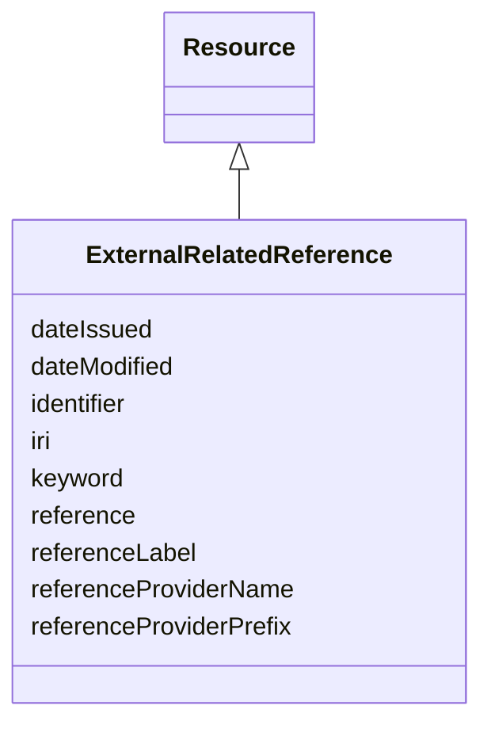

# Class: External related reference (ExternalRelatedReference) 


_A reference that permits to retrieve an item from an external provider._


URI: [EVORAO:ExternalRelatedReference](https://w3id.org/evorao/ExternalRelatedReference)





## Inheritance
* [Resource](Resource.md)
    * **ExternalRelatedReference**


## Slots

| Name | Cardinality and Range | Description | Inheritance |
| ---  | --- | --- | --- |
| [reference](reference.md) | 1 <br/> [String](String.md) | The identifier reference of the connected external item | direct |
| [referenceLabel](referenceLabel.md) | 1 <br/> [String](String.md) | The label informing what this reference is about | direct |
| [referenceProviderPrefix](referenceProviderPrefix.md) | 1 <br/> [String](String.md) | The url prefix that once completed with the reference will lead to the linked... | direct |
| [referenceProviderName](referenceProviderName.md) | 1 <br/> [String](String.md) | The name for the reference provider | direct |
| [keyword](keyword.md) | * <br/> [String](String.md) | A keyword or tag describing the resource | [Resource](Resource.md) |
| [dateIssued](dateIssued.md) | 0..1 <br/> [Datetime](Datetime.md) | Date of formal issuance (e | [Resource](Resource.md) |
| [dateModified](dateModified.md) | 0..1 <br/> [Datetime](Datetime.md) | Most recent date on which the resource was changed, updated or modified | [Resource](Resource.md) |
| [identifier](identifier.md) | * <br/> [String](String.md) | A unique identifier of the resource being described or cataloged | [Resource](Resource.md) |
| [iri](iri.md) | * <br/> [Uri](Uri.md) | International Resource Identifier (IRI) that uniquely identifies or refers to... | [Resource](Resource.md) |


## Usages

| used by | used in | type | used |
| ---  | --- | --- | --- |
| [ProductOrService](ProductOrService.md) | [externalRelatedReference](externalRelatedReference.md) | range | [ExternalRelatedReference](ExternalRelatedReference.md) |
| [Service](Service.md) | [externalRelatedReference](externalRelatedReference.md) | range | [ExternalRelatedReference](ExternalRelatedReference.md) |
| [Product](Product.md) | [externalRelatedReference](externalRelatedReference.md) | range | [ExternalRelatedReference](ExternalRelatedReference.md) |
| [Antibody](Antibody.md) | [externalRelatedReference](externalRelatedReference.md) | range | [ExternalRelatedReference](ExternalRelatedReference.md) |
| [Hybridoma](Hybridoma.md) | [externalRelatedReference](externalRelatedReference.md) | range | [ExternalRelatedReference](ExternalRelatedReference.md) |
| [Protein](Protein.md) | [externalRelatedReference](externalRelatedReference.md) | range | [ExternalRelatedReference](ExternalRelatedReference.md) |
| [NucleicAcid](NucleicAcid.md) | [externalRelatedReference](externalRelatedReference.md) | range | [ExternalRelatedReference](ExternalRelatedReference.md) |
| [DetectionKit](DetectionKit.md) | [externalRelatedReference](externalRelatedReference.md) | range | [ExternalRelatedReference](ExternalRelatedReference.md) |
| [Bundle](Bundle.md) | [externalRelatedReference](externalRelatedReference.md) | range | [ExternalRelatedReference](ExternalRelatedReference.md) |
| [Pathogen](Pathogen.md) | [externalRelatedReference](externalRelatedReference.md) | range | [ExternalRelatedReference](ExternalRelatedReference.md) |
| [Virus](Virus.md) | [externalRelatedReference](externalRelatedReference.md) | range | [ExternalRelatedReference](ExternalRelatedReference.md) |
| [Bacterium](Bacterium.md) | [externalRelatedReference](externalRelatedReference.md) | range | [ExternalRelatedReference](ExternalRelatedReference.md) |
| [Fungus](Fungus.md) | [externalRelatedReference](externalRelatedReference.md) | range | [ExternalRelatedReference](ExternalRelatedReference.md) |
| [Protozoan](Protozoan.md) | [externalRelatedReference](externalRelatedReference.md) | range | [ExternalRelatedReference](ExternalRelatedReference.md) |
| [Viroid](Viroid.md) | [externalRelatedReference](externalRelatedReference.md) | range | [ExternalRelatedReference](ExternalRelatedReference.md) |
| [Prion](Prion.md) | [externalRelatedReference](externalRelatedReference.md) | range | [ExternalRelatedReference](ExternalRelatedReference.md) |


## Identifier and Mapping Information


### Schema Source


* from schema: https://w3id.org/evorao/


## Mappings

| Mapping Type | Mapped Value |
| ---  | ---  |
| self | EVORAO:ExternalRelatedReference |
| native | EVORAO:ExternalRelatedReference |
| close | ms:1000878, ncit:C43621, ms:1000878, ncit:C43621 |


## LinkML Source

<!-- TODO: investigate https://stackoverflow.com/questions/37606292/how-to-create-tabbed-code-blocks-in-mkdocs-or-sphinx -->

### Direct

<details>
```yaml
name: ExternalRelatedReference
description: A reference that permits to retrieve an item from an external provider.
title: External related reference
from_schema: https://w3id.org/evorao/
close_mappings:
- ms:1000878
- ncit:C43621
- ms:1000878
- ncit:C43621
is_a: Resource
slots:
- reference
- referenceLabel
- referenceProviderPrefix
- referenceProviderName
slot_usage:
  reference:
    name: reference
    description: The identifier reference of the connected external item.
    title: reference
    close_mappings:
    - dct:identifier
    - dct:references
    is_a: identifier
    domain_of:
    - ExternalRelatedReference
    range: string
    required: true
    multivalued: false
  referenceLabel:
    name: referenceLabel
    description: The label informing what this reference is about.
    title: reference label
    comments:
    - e.g., 'Infravec2 related product'.
    close_mappings:
    - dct:title
    domain_of:
    - ExternalRelatedReference
    range: string
    required: true
    multivalued: false
  referenceProviderPrefix:
    name: referenceProviderPrefix
    description: The url prefix that once completed with the reference will lead to
      the linked external resource.
    title: reference provider prefix
    related_mappings:
    - dcat:landingPage
    - iao:0000599
    domain_of:
    - ExternalRelatedReference
    range: string
    required: true
    multivalued: false
  referenceProviderName:
    name: referenceProviderName
    description: The name for the reference provider.
    title: reference provider name
    close_mappings:
    - dct:publisher
    domain_of:
    - ExternalRelatedReference
    range: string
    required: true
    multivalued: false

```
</details>

### Induced

<details>
```yaml
name: ExternalRelatedReference
description: A reference that permits to retrieve an item from an external provider.
title: External related reference
from_schema: https://w3id.org/evorao/
close_mappings:
- ms:1000878
- ncit:C43621
- ms:1000878
- ncit:C43621
is_a: Resource
slot_usage:
  reference:
    name: reference
    description: The identifier reference of the connected external item.
    title: reference
    close_mappings:
    - dct:identifier
    - dct:references
    is_a: identifier
    domain_of:
    - ExternalRelatedReference
    range: string
    required: true
    multivalued: false
  referenceLabel:
    name: referenceLabel
    description: The label informing what this reference is about.
    title: reference label
    comments:
    - e.g., 'Infravec2 related product'.
    close_mappings:
    - dct:title
    domain_of:
    - ExternalRelatedReference
    range: string
    required: true
    multivalued: false
  referenceProviderPrefix:
    name: referenceProviderPrefix
    description: The url prefix that once completed with the reference will lead to
      the linked external resource.
    title: reference provider prefix
    related_mappings:
    - dcat:landingPage
    - iao:0000599
    domain_of:
    - ExternalRelatedReference
    range: string
    required: true
    multivalued: false
  referenceProviderName:
    name: referenceProviderName
    description: The name for the reference provider.
    title: reference provider name
    close_mappings:
    - dct:publisher
    domain_of:
    - ExternalRelatedReference
    range: string
    required: true
    multivalued: false
attributes:
  reference:
    name: reference
    description: The identifier reference of the connected external item.
    title: reference
    from_schema: https://w3id.org/evorao/
    close_mappings:
    - dct:identifier
    - dct:references
    rank: 1000
    is_a: identifier
    alias: reference
    owner: ExternalRelatedReference
    domain_of:
    - ExternalRelatedReference
    range: string
    required: true
    multivalued: false
  referenceLabel:
    name: referenceLabel
    description: The label informing what this reference is about.
    title: reference label
    comments:
    - e.g., 'Infravec2 related product'.
    from_schema: https://w3id.org/evorao/
    close_mappings:
    - dct:title
    rank: 1000
    alias: referenceLabel
    owner: ExternalRelatedReference
    domain_of:
    - ExternalRelatedReference
    range: string
    required: true
    multivalued: false
  referenceProviderPrefix:
    name: referenceProviderPrefix
    description: The url prefix that once completed with the reference will lead to
      the linked external resource.
    title: reference provider prefix
    from_schema: https://w3id.org/evorao/
    related_mappings:
    - dcat:landingPage
    - iao:0000599
    rank: 1000
    alias: referenceProviderPrefix
    owner: ExternalRelatedReference
    domain_of:
    - ExternalRelatedReference
    range: string
    required: true
    multivalued: false
  referenceProviderName:
    name: referenceProviderName
    description: The name for the reference provider.
    title: reference provider name
    from_schema: https://w3id.org/evorao/
    close_mappings:
    - dct:publisher
    rank: 1000
    alias: referenceProviderName
    owner: ExternalRelatedReference
    domain_of:
    - ExternalRelatedReference
    range: string
    required: true
    multivalued: false
  keyword:
    name: keyword
    description: A keyword or tag describing the resource.
    title: keyword
    from_schema: https://w3id.org/evorao/
    rank: 1000
    slot_uri: dcat:keyword
    alias: keyword
    owner: ExternalRelatedReference
    domain_of:
    - Resource
    range: string
    required: false
    multivalued: true
  dateIssued:
    name: dateIssued
    description: Date of formal issuance (e.g., publication) of the resource.
    title: date issued
    comments:
    - encoded using the relevant ISO 8601 Date and Time compliant string [DATETIME].
    from_schema: https://w3id.org/evorao/
    exact_mappings:
    - sepio:0000051
    close_mappings:
    - schema:datePublished
    - schema:dateCreated
    rank: 1000
    slot_uri: dct:issued
    alias: dateIssued
    owner: ExternalRelatedReference
    domain_of:
    - Resource
    range: datetime
    required: false
    multivalued: false
  dateModified:
    name: dateModified
    description: Most recent date on which the resource was changed, updated or modified.
    title: date modified
    comments:
    - encoded using the relevant ISO 8601 Date and Time compliant string [DATETIME].
    from_schema: https://w3id.org/evorao/
    exact_mappings:
    - sepio:0000036
    close_mappings:
    - schema:dateModified
    rank: 1000
    slot_uri: dct:modified
    alias: dateModified
    owner: ExternalRelatedReference
    domain_of:
    - Resource
    range: datetime
    required: false
    multivalued: false
  identifier:
    name: identifier
    description: A unique identifier of the resource being described or cataloged.
    title: identifier
    comments:
    - The identifier is a text string which is assigned to the resource to provide
      an unambiguous reference within a particular context. Persistent identifiers
      should be provided as HTTP URIs.
    from_schema: https://w3id.org/evorao/
    exact_mappings:
    - schema:identifier
    rank: 1000
    slot_uri: dct:identifier
    alias: identifier
    owner: ExternalRelatedReference
    domain_of:
    - Resource
    range: string
    required: false
    multivalued: true
  iri:
    name: iri
    description: International Resource Identifier (IRI) that uniquely identifies
      or refers to the resource. IRIs include URIs, and URIs include URLs.
    title: IRI
    comments:
    - An IRI is a global identifier standardized by IETF RFC 3987. It may or may not
      be resolvable on the web. IRIs include URIs, and URIs include URLs.
    from_schema: https://w3id.org/evorao/
    close_mappings:
    - biolink:iri
    related_mappings:
    - mi:url
    narrow_mappings:
    - schema:url
    rank: 1000
    is_a: identifier
    alias: iri
    owner: ExternalRelatedReference
    domain_of:
    - Resource
    range: uri
    required: false
    multivalued: true

```
</details>