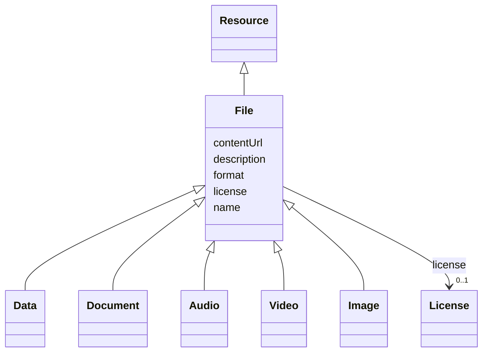

# Class: File (File) 


_Digital document or record stored in a specific format that contains data or information_


* __NOTE__: this is an abstract class and should not be instantiated directly


URI: [EVORAO:File](https://w3id.org/evorao/File)





## Inheritance
* [Resource](Resource.md)
    * **File**
        * [Data](Data.md)
        * [Document](Document.md)
        * [Audio](Audio.md)
        * [Video](Video.md)
        * [Image](Image.md)


## Slots

| Name | Cardinality and Range | Description | Inheritance |
| ---  | --- | --- | --- |
| [name](name.md) | 1 <br/> [String](String.md) | A word or set of words used to identify and refer to an entity | direct |
| [description](description.md) | 0..1 _recommended_ <br/> [String](String.md) | A short explanation of the characteristics, features, or nature of the curren... | direct |
| [contentUrl](contentUrl.md) | 1 <br/> [Uri](Uri.md) | The web address or location where the file content is stored and can be acces... | direct |
| [format](format.md) | 1 <br/> [String](String.md) | The file type or format that indicates how the data within the file is struct... | direct |
| [license](license.md) | 0..1 <br/> [License](License.md) | Information about terms and conditions under which the subject can be used, s... | direct |


## Usages

| used by | used in | type | used |
| ---  | --- | --- | --- |
| [DetectionKit](DetectionKit.md) | [standardOperatingProcedureFile](standardOperatingProcedureFile.md) | range | [File](File.md) |


## Identifier and Mapping Information


### Schema Source


* from schema: https://w3id.org/evorao/


## Mappings

| Mapping Type | Mapped Value |
| ---  | ---  |
| self | EVORAO:File |
| native | EVORAO:File |
| exact | dcat:mediaType, dcat:mediaType |
| close | wd:Q82753, wd:Q82753 |


## LinkML Source

<!-- TODO: investigate https://stackoverflow.com/questions/37606292/how-to-create-tabbed-code-blocks-in-mkdocs-or-sphinx -->

### Direct

<details>
```yaml
name: File
description: Digital document or record stored in a specific format that contains
  data or information
title: File
from_schema: https://w3id.org/evorao/
exact_mappings:
- dcat:mediaType
- dcat:mediaType
close_mappings:
- wd:Q82753
- wd:Q82753
is_a: Resource
abstract: true
slots:
- name
- description
- contentUrl
- format
- license
slot_usage:
  name:
    name: name
    description: A word or set of words used to identify and refer to an entity
    title: name
    exact_mappings:
    - schema:name
    close_mappings:
    - dct:title
    slot_uri: foaf:name
    domain_of:
    - File
    - PersonOrOrganization
    - ContactPoint
    range: string
    required: true
    multivalued: false
  description:
    name: description
    description: A short explanation of the characteristics, features, or nature of
      the current item
    title: description
    comments:
    - 'Describe this item in few lines. This description will serve as a summary to
      present the resource.

      '
    exact_mappings:
    - schema:description
    slot_uri: dct:description
    domain_of:
    - File
    - Dataset
    - DataService
    - Term
    - PersonOrOrganization
    - ContactPoint
    - License
    - Certification
    range: string
    required: false
    recommended: true
    multivalued: false
  contentUrl:
    name: contentUrl
    description: The web address or location where the file content is stored and
      can be accessed or downloaded.
    title: content URL
    domain_of:
    - File
    range: uri
    required: true
    multivalued: false
  format:
    name: format
    description: The file type or format that indicates how the data within the file
      is structured
    title: format
    domain_of:
    - File
    range: string
    required: true
    multivalued: false
  license:
    name: license
    description: Information about terms and conditions under which the subject can
      be used, shared, or distributed, indicating any restrictions or permissions
    title: license
    exact_mappings:
    - dct:license
    domain_of:
    - File
    - DataProvider
    range: License
    required: false
    multivalued: false

```
</details>

### Induced

<details>
```yaml
name: File
description: Digital document or record stored in a specific format that contains
  data or information
title: File
from_schema: https://w3id.org/evorao/
exact_mappings:
- dcat:mediaType
- dcat:mediaType
close_mappings:
- wd:Q82753
- wd:Q82753
is_a: Resource
abstract: true
slot_usage:
  name:
    name: name
    description: A word or set of words used to identify and refer to an entity
    title: name
    exact_mappings:
    - schema:name
    close_mappings:
    - dct:title
    slot_uri: foaf:name
    domain_of:
    - File
    - PersonOrOrganization
    - ContactPoint
    range: string
    required: true
    multivalued: false
  description:
    name: description
    description: A short explanation of the characteristics, features, or nature of
      the current item
    title: description
    comments:
    - 'Describe this item in few lines. This description will serve as a summary to
      present the resource.

      '
    exact_mappings:
    - schema:description
    slot_uri: dct:description
    domain_of:
    - File
    - Dataset
    - DataService
    - Term
    - PersonOrOrganization
    - ContactPoint
    - License
    - Certification
    range: string
    required: false
    recommended: true
    multivalued: false
  contentUrl:
    name: contentUrl
    description: The web address or location where the file content is stored and
      can be accessed or downloaded.
    title: content URL
    domain_of:
    - File
    range: uri
    required: true
    multivalued: false
  format:
    name: format
    description: The file type or format that indicates how the data within the file
      is structured
    title: format
    domain_of:
    - File
    range: string
    required: true
    multivalued: false
  license:
    name: license
    description: Information about terms and conditions under which the subject can
      be used, shared, or distributed, indicating any restrictions or permissions
    title: license
    exact_mappings:
    - dct:license
    domain_of:
    - File
    - DataProvider
    range: License
    required: false
    multivalued: false
attributes:
  name:
    name: name
    description: A word or set of words used to identify and refer to an entity
    title: name
    from_schema: https://w3id.org/evorao/
    exact_mappings:
    - schema:name
    close_mappings:
    - dct:title
    rank: 1000
    slot_uri: foaf:name
    alias: name
    owner: File
    domain_of:
    - File
    - PersonOrOrganization
    - ContactPoint
    range: string
    required: true
    multivalued: false
  description:
    name: description
    description: A short explanation of the characteristics, features, or nature of
      the current item
    title: description
    comments:
    - 'Describe this item in few lines. This description will serve as a summary to
      present the resource.

      '
    from_schema: https://w3id.org/evorao/
    exact_mappings:
    - schema:description
    close_mappings:
    - schema:description
    rank: 1000
    slot_uri: dct:description
    alias: description
    owner: File
    domain_of:
    - File
    - Dataset
    - DataService
    - Term
    - PersonOrOrganization
    - ContactPoint
    - License
    - Certification
    range: string
    required: false
    recommended: true
    multivalued: false
  contentUrl:
    name: contentUrl
    description: The web address or location where the file content is stored and
      can be accessed or downloaded.
    title: content URL
    from_schema: https://w3id.org/evorao/
    rank: 1000
    alias: contentUrl
    owner: File
    domain_of:
    - File
    range: uri
    required: true
    multivalued: false
  format:
    name: format
    description: The file type or format that indicates how the data within the file
      is structured
    title: format
    from_schema: https://w3id.org/evorao/
    rank: 1000
    alias: format
    owner: File
    domain_of:
    - File
    range: string
    required: true
    multivalued: false
  license:
    name: license
    description: Information about terms and conditions under which the subject can
      be used, shared, or distributed, indicating any restrictions or permissions
    title: license
    from_schema: https://w3id.org/evorao/
    exact_mappings:
    - dct:license
    close_mappings:
    - wdp:P275
    rank: 1000
    slot_uri: dct:license
    alias: license
    owner: File
    domain_of:
    - File
    - DataProvider
    range: License
    required: false
    multivalued: false

```
</details>