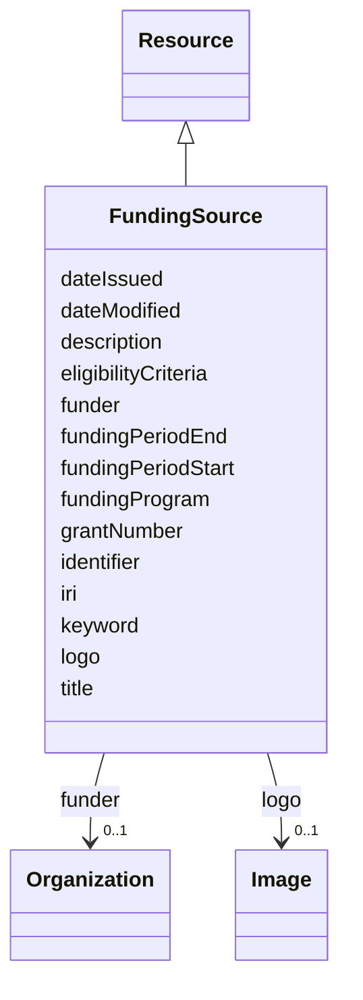

# Class: Funding source (FundingSource) 


_A program, grant, or project providing financial support for the access or use of a product or service, either fully or partially._


URI: [EVORAO:FundingSource](https://w3id.org/evorao/FundingSource)





## Inheritance
* [Resource](Resource.md)
    * **FundingSource**


## Slots

| Name | Cardinality and Range | Description | Inheritance |
| ---  | --- | --- | --- |
| [title](title.md) | 1 <br/> [String](String.md) | A name given to the resource | direct |
| [description](description.md) | 0..1 _recommended_ <br/> [String](String.md) | A short explanation of the characteristics, features, or nature of the curren... | direct |
| [fundingProgram](fundingProgram.md) | 0..1 <br/> [String](String.md) | Identifies the overarching financial framework, research initiative, or suppo... | direct |
| [grantNumber](grantNumber.md) | 0..1 <br/> [String](String.md) | A formal reference or agreement number assigned by the funding body | direct |
| [funder](funder.md) | 0..1 <br/> [Organization](Organization.md) | The organization providing the financial support | direct |
| [fundingPeriodStart](fundingPeriodStart.md) | 0..1 <br/> [Date](Date.md) | The date from which the financial mechanism is active or applicable to the su... | direct |
| [fundingPeriodEnd](fundingPeriodEnd.md) | 0..1 <br/> [Date](Date.md) | The date on which the financial mechanism ceases to apply to the supported pr... | direct |
| [eligibilityCriteria](eligibilityCriteria.md) | 0..1 <br/> [String](String.md) | Conditions under which individuals or organisations may benefit from the fina... | direct |
| [logo](logo.md) | 0..1 <br/> [Image](Image.md) | A path or URL to the related logo | direct |
| [keyword](keyword.md) | * <br/> [String](String.md) | A keyword or tag describing the resource | [Resource](Resource.md) |
| [dateIssued](dateIssued.md) | 0..1 <br/> [Datetime](Datetime.md) | Date of formal issuance (e | [Resource](Resource.md) |
| [dateModified](dateModified.md) | 0..1 <br/> [Datetime](Datetime.md) | Most recent date on which the resource was changed, updated or modified | [Resource](Resource.md) |
| [identifier](identifier.md) | * <br/> [String](String.md) | A unique identifier of the resource being described or cataloged | [Resource](Resource.md) |
| [iri](iri.md) | * <br/> [Uri](Uri.md) | International Resource Identifier (IRI) that uniquely identifies or refers to... | [Resource](Resource.md) |


## Usages

| used by | used in | type | used |
| ---  | --- | --- | --- |
| [ProductOrService](ProductOrService.md) | [fundingSource](fundingSource.md) | range | [FundingSource](FundingSource.md) |
| [Service](Service.md) | [fundingSource](fundingSource.md) | range | [FundingSource](FundingSource.md) |
| [Product](Product.md) | [fundingSource](fundingSource.md) | range | [FundingSource](FundingSource.md) |
| [Antibody](Antibody.md) | [fundingSource](fundingSource.md) | range | [FundingSource](FundingSource.md) |
| [Hybridoma](Hybridoma.md) | [fundingSource](fundingSource.md) | range | [FundingSource](FundingSource.md) |
| [Protein](Protein.md) | [fundingSource](fundingSource.md) | range | [FundingSource](FundingSource.md) |
| [NucleicAcid](NucleicAcid.md) | [fundingSource](fundingSource.md) | range | [FundingSource](FundingSource.md) |
| [DetectionKit](DetectionKit.md) | [fundingSource](fundingSource.md) | range | [FundingSource](FundingSource.md) |
| [Bundle](Bundle.md) | [fundingSource](fundingSource.md) | range | [FundingSource](FundingSource.md) |
| [Pathogen](Pathogen.md) | [fundingSource](fundingSource.md) | range | [FundingSource](FundingSource.md) |
| [Virus](Virus.md) | [fundingSource](fundingSource.md) | range | [FundingSource](FundingSource.md) |
| [Bacterium](Bacterium.md) | [fundingSource](fundingSource.md) | range | [FundingSource](FundingSource.md) |
| [Fungus](Fungus.md) | [fundingSource](fundingSource.md) | range | [FundingSource](FundingSource.md) |
| [Protozoan](Protozoan.md) | [fundingSource](fundingSource.md) | range | [FundingSource](FundingSource.md) |
| [Viroid](Viroid.md) | [fundingSource](fundingSource.md) | range | [FundingSource](FundingSource.md) |
| [Prion](Prion.md) | [fundingSource](fundingSource.md) | range | [FundingSource](FundingSource.md) |


## Identifier and Mapping Information


### Schema Source


* from schema: https://w3id.org/evorao/


## Mappings

| Mapping Type | Mapped Value |
| ---  | ---  |
| self | EVORAO:FundingSource |
| native | EVORAO:FundingSource |
| exact | schema:Grant, schema:Grant |
| close | ncit:C17769, ncit:C17769 |


## LinkML Source

<!-- TODO: investigate https://stackoverflow.com/questions/37606292/how-to-create-tabbed-code-blocks-in-mkdocs-or-sphinx -->

### Direct

<details>
```yaml
name: FundingSource
description: A program, grant, or project providing financial support for the access
  or use of a product or service, either fully or partially.
title: Funding source
from_schema: https://w3id.org/evorao/
exact_mappings:
- schema:Grant
- schema:Grant
close_mappings:
- ncit:C17769
- ncit:C17769
is_a: Resource
slots:
- title
- description
- fundingProgram
- grantNumber
- funder
- fundingPeriodStart
- fundingPeriodEnd
- eligibilityCriteria
- logo
slot_usage:
  title:
    name: title
    description: A name given to the resource.
    title: title
    comments:
    - The title of the item should be as short and descriptive as possible.
    - 'E.g. for virus products it should basically be based on the following Pattern:
      ''Virus name'', ''virus host type'', ''collection year'', ''country of collection''
      ex ''suspected epidemiological origin'', ''genotype'', ''strain'', ''variant
      name or specific feature.'
    exact_mappings:
    - schema:name
    - rdfs:label
    slot_uri: dct:title
    domain_of:
    - FundingSource
    - Dataset
    - DataService
    - Publication
    - Term
    - License
    - Certification
    range: string
    required: true
    multivalued: false
  description:
    name: description
    description: A short explanation of the characteristics, features, or nature of
      the current item.
    title: description
    comments:
    - Describe this item in few lines. This description will serve as a summary to
      present the resource.
    exact_mappings:
    - schema:description
    slot_uri: dct:description
    domain_of:
    - FundingSource
    - Dataset
    - DataService
    - Term
    - PersonOrOrganization
    - File
    - ContactPoint
    - License
    - Certification
    range: string
    required: false
    recommended: true
    multivalued: false
  fundingProgram:
    name: fundingProgram
    description: Identifies the overarching financial framework, research initiative,
      or support mechanism that enables or contributes to the provision of a product
      or service. The value may correspond to a European funding framework (e.g. Horizon
      Europe), a specific research initiative (e.g. an EU project), or another public
      or private funding mechanism.
    title: funding program
    domain_of:
    - FundingSource
    range: string
    required: false
    multivalued: false
  grantNumber:
    name: grantNumber
    description: A formal reference or agreement number assigned by the funding body.
    title: grant number
    is_a: identifier
    domain_of:
    - FundingSource
    range: string
    required: false
    multivalued: false
  funder:
    name: funder
    description: The organization providing the financial support.
    title: funder
    close_mappings:
    - schema:funder
    domain_of:
    - FundingSource
    range: Organization
    required: false
    multivalued: false
  fundingPeriodStart:
    name: fundingPeriodStart
    description: The date from which the financial mechanism is active or applicable
      to the supported product or service.
    title: funding period start
    domain_of:
    - FundingSource
    range: date
    required: false
    multivalued: false
  fundingPeriodEnd:
    name: fundingPeriodEnd
    description: The date on which the financial mechanism ceases to apply to the
      supported product or service.
    title: funding period end
    domain_of:
    - FundingSource
    range: date
    required: false
    multivalued: false
  eligibilityCriteria:
    name: eligibilityCriteria
    description: Conditions under which individuals or organisations may benefit from
      the financial mechanism, including access rules, eligibility requirements, or
      geographical/institutional restrictions. May be expressed as text or as a link
      to a formal eligibility statement.
    title: eligibility criteria
    comments:
    - Keep clear and user-friendly; provide a link if criteria are complex.
    domain_of:
    - FundingSource
    range: string
    required: false
    multivalued: false
  logo:
    name: logo
    description: A path or URL to the related logo.
    title: logo
    exact_mappings:
    - schema:logo
    domain_of:
    - FundingSource
    - PersonOrOrganization
    - License
    - Certification
    range: Image
    required: false
    multivalued: false

```
</details>

### Induced

<details>
```yaml
name: FundingSource
description: A program, grant, or project providing financial support for the access
  or use of a product or service, either fully or partially.
title: Funding source
from_schema: https://w3id.org/evorao/
exact_mappings:
- schema:Grant
- schema:Grant
close_mappings:
- ncit:C17769
- ncit:C17769
is_a: Resource
slot_usage:
  title:
    name: title
    description: A name given to the resource.
    title: title
    comments:
    - The title of the item should be as short and descriptive as possible.
    - 'E.g. for virus products it should basically be based on the following Pattern:
      ''Virus name'', ''virus host type'', ''collection year'', ''country of collection''
      ex ''suspected epidemiological origin'', ''genotype'', ''strain'', ''variant
      name or specific feature.'
    exact_mappings:
    - schema:name
    - rdfs:label
    slot_uri: dct:title
    domain_of:
    - FundingSource
    - Dataset
    - DataService
    - Publication
    - Term
    - License
    - Certification
    range: string
    required: true
    multivalued: false
  description:
    name: description
    description: A short explanation of the characteristics, features, or nature of
      the current item.
    title: description
    comments:
    - Describe this item in few lines. This description will serve as a summary to
      present the resource.
    exact_mappings:
    - schema:description
    slot_uri: dct:description
    domain_of:
    - FundingSource
    - Dataset
    - DataService
    - Term
    - PersonOrOrganization
    - File
    - ContactPoint
    - License
    - Certification
    range: string
    required: false
    recommended: true
    multivalued: false
  fundingProgram:
    name: fundingProgram
    description: Identifies the overarching financial framework, research initiative,
      or support mechanism that enables or contributes to the provision of a product
      or service. The value may correspond to a European funding framework (e.g. Horizon
      Europe), a specific research initiative (e.g. an EU project), or another public
      or private funding mechanism.
    title: funding program
    domain_of:
    - FundingSource
    range: string
    required: false
    multivalued: false
  grantNumber:
    name: grantNumber
    description: A formal reference or agreement number assigned by the funding body.
    title: grant number
    is_a: identifier
    domain_of:
    - FundingSource
    range: string
    required: false
    multivalued: false
  funder:
    name: funder
    description: The organization providing the financial support.
    title: funder
    close_mappings:
    - schema:funder
    domain_of:
    - FundingSource
    range: Organization
    required: false
    multivalued: false
  fundingPeriodStart:
    name: fundingPeriodStart
    description: The date from which the financial mechanism is active or applicable
      to the supported product or service.
    title: funding period start
    domain_of:
    - FundingSource
    range: date
    required: false
    multivalued: false
  fundingPeriodEnd:
    name: fundingPeriodEnd
    description: The date on which the financial mechanism ceases to apply to the
      supported product or service.
    title: funding period end
    domain_of:
    - FundingSource
    range: date
    required: false
    multivalued: false
  eligibilityCriteria:
    name: eligibilityCriteria
    description: Conditions under which individuals or organisations may benefit from
      the financial mechanism, including access rules, eligibility requirements, or
      geographical/institutional restrictions. May be expressed as text or as a link
      to a formal eligibility statement.
    title: eligibility criteria
    comments:
    - Keep clear and user-friendly; provide a link if criteria are complex.
    domain_of:
    - FundingSource
    range: string
    required: false
    multivalued: false
  logo:
    name: logo
    description: A path or URL to the related logo.
    title: logo
    exact_mappings:
    - schema:logo
    domain_of:
    - FundingSource
    - PersonOrOrganization
    - License
    - Certification
    range: Image
    required: false
    multivalued: false
attributes:
  title:
    name: title
    description: A name given to the resource.
    title: title
    comments:
    - The title of the item should be as short and descriptive as possible.
    - 'E.g. for virus products it should basically be based on the following Pattern:
      ''Virus name'', ''virus host type'', ''collection year'', ''country of collection''
      ex ''suspected epidemiological origin'', ''genotype'', ''strain'', ''variant
      name or specific feature.'
    from_schema: https://w3id.org/evorao/
    exact_mappings:
    - schema:name
    - rdfs:label
    rank: 1000
    slot_uri: dct:title
    alias: title
    owner: FundingSource
    domain_of:
    - FundingSource
    - Dataset
    - DataService
    - Publication
    - Term
    - License
    - Certification
    range: string
    required: true
    multivalued: false
  description:
    name: description
    description: A short explanation of the characteristics, features, or nature of
      the current item.
    title: description
    comments:
    - Describe this item in few lines. This description will serve as a summary to
      present the resource.
    from_schema: https://w3id.org/evorao/
    exact_mappings:
    - schema:description
    rank: 1000
    slot_uri: dct:description
    alias: description
    owner: FundingSource
    domain_of:
    - FundingSource
    - Dataset
    - DataService
    - Term
    - PersonOrOrganization
    - File
    - ContactPoint
    - License
    - Certification
    range: string
    required: false
    recommended: true
    multivalued: false
  fundingProgram:
    name: fundingProgram
    description: Identifies the overarching financial framework, research initiative,
      or support mechanism that enables or contributes to the provision of a product
      or service. The value may correspond to a European funding framework (e.g. Horizon
      Europe), a specific research initiative (e.g. an EU project), or another public
      or private funding mechanism.
    title: funding program
    from_schema: https://w3id.org/evorao/
    rank: 1000
    alias: fundingProgram
    owner: FundingSource
    domain_of:
    - FundingSource
    range: string
    required: false
    multivalued: false
  grantNumber:
    name: grantNumber
    description: A formal reference or agreement number assigned by the funding body.
    title: grant number
    from_schema: https://w3id.org/evorao/
    rank: 1000
    is_a: identifier
    alias: grantNumber
    owner: FundingSource
    domain_of:
    - FundingSource
    range: string
    required: false
    multivalued: false
  funder:
    name: funder
    description: The organization providing the financial support.
    title: funder
    from_schema: https://w3id.org/evorao/
    close_mappings:
    - schema:funder
    rank: 1000
    alias: funder
    owner: FundingSource
    domain_of:
    - FundingSource
    range: Organization
    required: false
    multivalued: false
  fundingPeriodStart:
    name: fundingPeriodStart
    description: The date from which the financial mechanism is active or applicable
      to the supported product or service.
    title: funding period start
    from_schema: https://w3id.org/evorao/
    rank: 1000
    alias: fundingPeriodStart
    owner: FundingSource
    domain_of:
    - FundingSource
    range: date
    required: false
    multivalued: false
  fundingPeriodEnd:
    name: fundingPeriodEnd
    description: The date on which the financial mechanism ceases to apply to the
      supported product or service.
    title: funding period end
    from_schema: https://w3id.org/evorao/
    rank: 1000
    alias: fundingPeriodEnd
    owner: FundingSource
    domain_of:
    - FundingSource
    range: date
    required: false
    multivalued: false
  eligibilityCriteria:
    name: eligibilityCriteria
    description: Conditions under which individuals or organisations may benefit from
      the financial mechanism, including access rules, eligibility requirements, or
      geographical/institutional restrictions. May be expressed as text or as a link
      to a formal eligibility statement.
    title: eligibility criteria
    comments:
    - Keep clear and user-friendly; provide a link if criteria are complex.
    from_schema: https://w3id.org/evorao/
    rank: 1000
    alias: eligibilityCriteria
    owner: FundingSource
    domain_of:
    - FundingSource
    range: string
    required: false
    multivalued: false
  logo:
    name: logo
    description: A path or URL to the related logo.
    title: logo
    from_schema: https://w3id.org/evorao/
    exact_mappings:
    - schema:logo
    rank: 1000
    alias: logo
    owner: FundingSource
    domain_of:
    - FundingSource
    - PersonOrOrganization
    - License
    - Certification
    range: Image
    required: false
    multivalued: false
  keyword:
    name: keyword
    description: A keyword or tag describing the resource.
    title: keyword
    from_schema: https://w3id.org/evorao/
    rank: 1000
    slot_uri: dcat:keyword
    alias: keyword
    owner: FundingSource
    domain_of:
    - Resource
    range: string
    required: false
    multivalued: true
  dateIssued:
    name: dateIssued
    description: Date of formal issuance (e.g., publication) of the resource.
    title: date issued
    comments:
    - encoded using the relevant ISO 8601 Date and Time compliant string [DATETIME].
    from_schema: https://w3id.org/evorao/
    exact_mappings:
    - sepio:0000051
    close_mappings:
    - schema:datePublished
    - schema:dateCreated
    rank: 1000
    slot_uri: dct:issued
    alias: dateIssued
    owner: FundingSource
    domain_of:
    - Resource
    range: datetime
    required: false
    multivalued: false
  dateModified:
    name: dateModified
    description: Most recent date on which the resource was changed, updated or modified.
    title: date modified
    comments:
    - encoded using the relevant ISO 8601 Date and Time compliant string [DATETIME].
    from_schema: https://w3id.org/evorao/
    exact_mappings:
    - sepio:0000036
    close_mappings:
    - schema:dateModified
    rank: 1000
    slot_uri: dct:modified
    alias: dateModified
    owner: FundingSource
    domain_of:
    - Resource
    range: datetime
    required: false
    multivalued: false
  identifier:
    name: identifier
    description: A unique identifier of the resource being described or cataloged.
    title: identifier
    comments:
    - The identifier is a text string which is assigned to the resource to provide
      an unambiguous reference within a particular context. Persistent identifiers
      should be provided as HTTP URIs.
    from_schema: https://w3id.org/evorao/
    exact_mappings:
    - schema:identifier
    rank: 1000
    slot_uri: dct:identifier
    alias: identifier
    owner: FundingSource
    domain_of:
    - Resource
    range: string
    required: false
    multivalued: true
  iri:
    name: iri
    description: International Resource Identifier (IRI) that uniquely identifies
      or refers to the resource. IRIs include URIs, and URIs include URLs.
    title: IRI
    comments:
    - An IRI is a global identifier standardized by IETF RFC 3987. It may or may not
      be resolvable on the web. IRIs include URIs, and URIs include URLs.
    from_schema: https://w3id.org/evorao/
    close_mappings:
    - biolink:iri
    related_mappings:
    - mi:url
    narrow_mappings:
    - schema:url
    rank: 1000
    is_a: identifier
    alias: iri
    owner: FundingSource
    domain_of:
    - Resource
    range: uri
    required: false
    multivalued: true

```
</details>