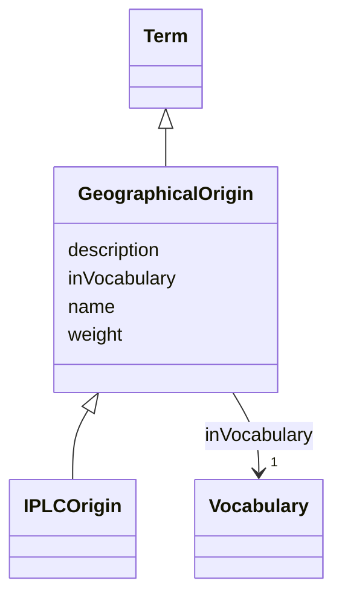

# Class: Geographical origin (GeographicalOrigin)


_The specific location or region where a physical item, originates or is naturally found_


URI: [EVORAO:GeographicalOrigin](https://raw.githubusercontent.com/EVORA-project/evora-ontology/refs/heads/main/models/owl/evora_ontology.owl.ttl#GeographicalOrigin)





## Inheritance
* [Resource](Resource.md)
    * [Dataset](Dataset.md)
        * [Term](Term.md)
            * **GeographicalOrigin**
                * [IPLCOrigin](IPLCOrigin.md)


## Slots

| Name | Cardinality and Range | Description | Inheritance |
| ---  | --- | --- | --- |
| [name](name.md) | 1 <br/> [String](String.md) | The label that allows humans to identify the current item | [Term](Term.md) |
| [description](description.md) | 0..1 _recommended_ <br/> [String](String.md) | A short explanation of the characteristics, features, or nature of the curren... | [Term](Term.md) |
| [weight](weight.md) | 1 <br/> [Integer](Integer.md) | A numerical value indicating relative importance or priority, generally proce... | [Term](Term.md) |
| [inVocabulary](inVocabulary.md) | 1 <br/> [Vocabulary](Vocabulary.md) | Terms belong to a specific vocabulary | [Term](Term.md) |


## Usages

| used by | used in | type | used |
| ---  | --- | --- | --- |
| [Pathogen](Pathogen.md) | [suspectedEpidemiologicalOrigin](suspectedEpidemiologicalOrigin.md) | range | [GeographicalOrigin](GeographicalOrigin.md) |
| [Virus](Virus.md) | [suspectedEpidemiologicalOrigin](suspectedEpidemiologicalOrigin.md) | range | [GeographicalOrigin](GeographicalOrigin.md) |
| [Bacterium](Bacterium.md) | [suspectedEpidemiologicalOrigin](suspectedEpidemiologicalOrigin.md) | range | [GeographicalOrigin](GeographicalOrigin.md) |
| [Fungus](Fungus.md) | [suspectedEpidemiologicalOrigin](suspectedEpidemiologicalOrigin.md) | range | [GeographicalOrigin](GeographicalOrigin.md) |
| [Protozoan](Protozoan.md) | [suspectedEpidemiologicalOrigin](suspectedEpidemiologicalOrigin.md) | range | [GeographicalOrigin](GeographicalOrigin.md) |
| [Viroid](Viroid.md) | [suspectedEpidemiologicalOrigin](suspectedEpidemiologicalOrigin.md) | range | [GeographicalOrigin](GeographicalOrigin.md) |
| [Prion](Prion.md) | [suspectedEpidemiologicalOrigin](suspectedEpidemiologicalOrigin.md) | range | [GeographicalOrigin](GeographicalOrigin.md) |


## Comments

* geonames.org API could be a good service data provider as suggested by DCAT-AP

## Identifier and Mapping Information


### Schema Source


* from schema: https://raw.githubusercontent.com/EVORA-project/evora-ontology/refs/heads/main/models/owl/evora_ontology.owl.ttl#


## Mappings

| Mapping Type | Mapped Value |
| ---  | ---  |
| self | EVORAO:GeographicalOrigin |
| native | EVORAO:GeographicalOrigin |
| exact | dct:Location |
| close | wd:Q3885844 |


## LinkML Source

<!-- TODO: investigate https://stackoverflow.com/questions/37606292/how-to-create-tabbed-code-blocks-in-mkdocs-or-sphinx -->

### Direct

<details>
```yaml
name: GeographicalOrigin
description: The specific location or region where a physical item, originates or
  is naturally found
title: Geographical origin
comments:
- geonames.org API could be a good service data provider as suggested by DCAT-AP
from_schema: https://raw.githubusercontent.com/EVORA-project/evora-ontology/refs/heads/main/models/owl/evora_ontology.owl.ttl#
exact_mappings:
- dct:Location
close_mappings:
- wd:Q3885844
is_a: Term

```
</details>

### Induced

<details>
```yaml
name: GeographicalOrigin
description: The specific location or region where a physical item, originates or
  is naturally found
title: Geographical origin
comments:
- geonames.org API could be a good service data provider as suggested by DCAT-AP
from_schema: https://raw.githubusercontent.com/EVORA-project/evora-ontology/refs/heads/main/models/owl/evora_ontology.owl.ttl#
exact_mappings:
- dct:Location
close_mappings:
- wd:Q3885844
is_a: Term
attributes:
  name:
    name: name
    description: The label that allows humans to identify the current item
    title: name
    comments:
    - 'The title of the item should be as short and descriptive as possible. E.g.
      for virus products it should basically be based on the following Pattern:

      "Virus name", "virus host type", "collection year", "country of collection"
      ex "suspected epidemiological origin", "genotype", "strain", "variant name or
      specific feature"'
    from_schema: https://raw.githubusercontent.com/EVORA-project/evora-ontology/refs/heads/main/models/owl/evora_ontology.owl.ttl#
    exact_mappings:
    - dct:title
    close_mappings:
    - rdfs:label
    rank: 1000
    alias: name
    owner: GeographicalOrigin
    domain_of:
    - Term
    - DataService
    - Catalogue
    - PersonOrOrganization
    - ProductOrService
    - File
    - ContactPoint
    - License
    - Certification
    range: string
    required: true
    multivalued: false
  description:
    name: description
    description: A short explanation of the characteristics, features, or nature of
      the current item
    title: description
    comments:
    - 'Describe this item in few lines. This description will serve as a summary to
      present the item.

      '
    from_schema: https://raw.githubusercontent.com/EVORA-project/evora-ontology/refs/heads/main/models/owl/evora_ontology.owl.ttl#
    exact_mappings:
    - dct:description
    rank: 1000
    alias: description
    owner: GeographicalOrigin
    domain_of:
    - Term
    - DataService
    - Catalogue
    - PersonOrOrganization
    - ProductOrService
    - File
    - ContactPoint
    - License
    - Certification
    range: string
    required: false
    recommended: true
    multivalued: false
  weight:
    name: weight
    description: A numerical value indicating relative importance or priority, generally
      processed in ascending order. This weight helps prioritize content when organizing
      or processing data. Its value can be negative, with a default set to 0
    title: weight
    from_schema: https://raw.githubusercontent.com/EVORA-project/evora-ontology/refs/heads/main/models/owl/evora_ontology.owl.ttl#
    close_mappings:
    - adms:status
    rank: 1000
    ifabsent: int(0)
    alias: weight
    owner: GeographicalOrigin
    domain_of:
    - Term
    - DataProvider
    range: integer
    required: true
    multivalued: false
  inVocabulary:
    name: inVocabulary
    description: Terms belong to a specific vocabulary
    title: in Vocabulary
    from_schema: https://raw.githubusercontent.com/EVORA-project/evora-ontology/refs/heads/main/models/owl/evora_ontology.owl.ttl#
    close_mappings:
    - wdp:P972
    rank: 1000
    alias: inVocabulary
    owner: GeographicalOrigin
    domain_of:
    - Term
    range: Vocabulary
    required: true
    multivalued: false

```
</details>