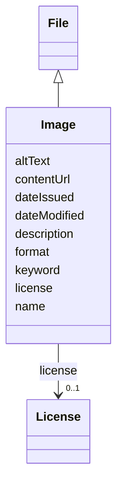

# Class: Image (Image) 


_Subclass of File representing visual content such as pictures, diagrams, or illustrations_


URI: [EVORAO:Image](https://w3id.org/evorao/Image)





## Inheritance
* [Resource](Resource.md)
    * [File](File.md)
        * **Image**


## Slots

| Name | Cardinality and Range | Description | Inheritance |
| ---  | --- | --- | --- |
| [altText](altText.md) | 0..1 _recommended_ <br/> [String](String.md) | An alternate text for the image, if the image cannot be displayed | direct |
| [name](name.md) | 1 <br/> [String](String.md) | A word or set of words used to identify and refer to an entity | [File](File.md) |
| [description](description.md) | 0..1 _recommended_ <br/> [String](String.md) | A short explanation of the characteristics, features, or nature of the curren... | [File](File.md) |
| [contentUrl](contentUrl.md) | 1 <br/> [Uri](Uri.md) | The web address or location where the file content is stored and can be acces... | [File](File.md) |
| [format](format.md) | 1 <br/> [String](String.md) | The file type or format that indicates how the data within the file is struct... | [File](File.md) |
| [license](license.md) | 0..1 <br/> [License](License.md) | Information about terms and conditions under which the subject can be used, s... | [File](File.md) |
| [keyword](keyword.md) | * <br/> [String](String.md) | A keyword or tag describing the resource | [Resource](Resource.md) |
| [dateIssued](dateIssued.md) | 0..1 <br/> [Datetime](Datetime.md) | Date of formal issuance (e | [Resource](Resource.md) |
| [dateModified](dateModified.md) | 0..1 <br/> [Datetime](Datetime.md) | Most recent date on which the resource was changed, updated or modified | [Resource](Resource.md) |


## Usages

| used by | used in | type | used |
| ---  | --- | --- | --- |
| [PersonOrOrganization](PersonOrOrganization.md) | [logo](logo.md) | range | [Image](Image.md) |
| [Person](Person.md) | [logo](logo.md) | range | [Image](Image.md) |
| [Organization](Organization.md) | [logo](logo.md) | range | [Image](Image.md) |
| [ReasearchInfrastructure](ReasearchInfrastructure.md) | [logo](logo.md) | range | [Image](Image.md) |
| [Provider](Provider.md) | [logo](logo.md) | range | [Image](Image.md) |
| [Originator](Originator.md) | [logo](logo.md) | range | [Image](Image.md) |
| [ProductOrService](ProductOrService.md) | [productPicture](productPicture.md) | range | [Image](Image.md) |
| [Service](Service.md) | [productPicture](productPicture.md) | range | [Image](Image.md) |
| [Product](Product.md) | [productPicture](productPicture.md) | range | [Image](Image.md) |
| [Antibody](Antibody.md) | [productPicture](productPicture.md) | range | [Image](Image.md) |
| [Hybridoma](Hybridoma.md) | [productPicture](productPicture.md) | range | [Image](Image.md) |
| [Protein](Protein.md) | [productPicture](productPicture.md) | range | [Image](Image.md) |
| [NucleicAcid](NucleicAcid.md) | [productPicture](productPicture.md) | range | [Image](Image.md) |
| [DetectionKit](DetectionKit.md) | [productPicture](productPicture.md) | range | [Image](Image.md) |
| [Bundle](Bundle.md) | [productPicture](productPicture.md) | range | [Image](Image.md) |
| [Pathogen](Pathogen.md) | [productPicture](productPicture.md) | range | [Image](Image.md) |
| [Virus](Virus.md) | [productPicture](productPicture.md) | range | [Image](Image.md) |
| [Bacterium](Bacterium.md) | [productPicture](productPicture.md) | range | [Image](Image.md) |
| [Fungus](Fungus.md) | [productPicture](productPicture.md) | range | [Image](Image.md) |
| [Protozoan](Protozoan.md) | [productPicture](productPicture.md) | range | [Image](Image.md) |
| [Viroid](Viroid.md) | [productPicture](productPicture.md) | range | [Image](Image.md) |
| [Prion](Prion.md) | [productPicture](productPicture.md) | range | [Image](Image.md) |
| [License](License.md) | [logo](logo.md) | range | [Image](Image.md) |
| [Certification](Certification.md) | [logo](logo.md) | range | [Image](Image.md) |


## Identifier and Mapping Information


### Schema Source


* from schema: https://w3id.org/evorao/


## Mappings

| Mapping Type | Mapped Value |
| ---  | ---  |
| self | EVORAO:Image |
| native | EVORAO:Image |
| exact | schema:ImageObject, schema:ImageObject |
| broad | dct:MediaType, dct:MediaType |
| close | wd:Q860625, dcmi:Image, edam:2968, reproduceme:Image, sio:000081, wd:Q860625, dcmi:Image, edam:2968, reproduceme:Image, sio:000081 |


## LinkML Source

<!-- TODO: investigate https://stackoverflow.com/questions/37606292/how-to-create-tabbed-code-blocks-in-mkdocs-or-sphinx -->

### Direct

<details>
```yaml
name: Image
description: Subclass of File representing visual content such as pictures, diagrams,
  or illustrations
title: Image
from_schema: https://w3id.org/evorao/
exact_mappings:
- schema:ImageObject
- schema:ImageObject
close_mappings:
- wd:Q860625
- dcmi:Image
- edam:2968
- reproduceme:Image
- sio:000081
- wd:Q860625
- dcmi:Image
- edam:2968
- reproduceme:Image
- sio:000081
broad_mappings:
- dct:MediaType
- dct:MediaType
is_a: File
slots:
- altText
slot_usage:
  altText:
    name: altText
    description: An alternate text for the image, if the image cannot be displayed
    title: alt text
    exact_mappings:
    - schema:caption
    domain_of:
    - Image
    range: string
    required: false
    recommended: true
    multivalued: false

```
</details>

### Induced

<details>
```yaml
name: Image
description: Subclass of File representing visual content such as pictures, diagrams,
  or illustrations
title: Image
from_schema: https://w3id.org/evorao/
exact_mappings:
- schema:ImageObject
- schema:ImageObject
close_mappings:
- wd:Q860625
- dcmi:Image
- edam:2968
- reproduceme:Image
- sio:000081
- wd:Q860625
- dcmi:Image
- edam:2968
- reproduceme:Image
- sio:000081
broad_mappings:
- dct:MediaType
- dct:MediaType
is_a: File
slot_usage:
  altText:
    name: altText
    description: An alternate text for the image, if the image cannot be displayed
    title: alt text
    exact_mappings:
    - schema:caption
    domain_of:
    - Image
    range: string
    required: false
    recommended: true
    multivalued: false
attributes:
  altText:
    name: altText
    description: An alternate text for the image, if the image cannot be displayed
    title: alt text
    from_schema: https://w3id.org/evorao/
    exact_mappings:
    - schema:caption
    rank: 1000
    alias: altText
    owner: Image
    domain_of:
    - Image
    range: string
    required: false
    recommended: true
    multivalued: false
  name:
    name: name
    description: A word or set of words used to identify and refer to an entity
    title: name
    from_schema: https://w3id.org/evorao/
    exact_mappings:
    - schema:name
    - vcard:fn
    close_mappings:
    - rdfs:label
    - dct:title
    rank: 1000
    slot_uri: foaf:name
    alias: name
    owner: Image
    domain_of:
    - File
    - PersonOrOrganization
    - ContactPoint
    range: string
    required: true
    multivalued: false
  description:
    name: description
    description: A short explanation of the characteristics, features, or nature of
      the current item
    title: description
    comments:
    - Describe this item in few lines. This description will serve as a summary to
      present the resource
    from_schema: https://w3id.org/evorao/
    exact_mappings:
    - schema:description
    close_mappings:
    - schema:description
    rank: 1000
    slot_uri: dct:description
    alias: description
    owner: Image
    domain_of:
    - File
    - Dataset
    - DataService
    - Term
    - PersonOrOrganization
    - ContactPoint
    - License
    - Certification
    range: string
    required: false
    recommended: true
    multivalued: false
  contentUrl:
    name: contentUrl
    description: The web address or location where the file content is stored and
      can be accessed or downloaded.
    title: content URL
    from_schema: https://w3id.org/evorao/
    exact_mappings:
    - schema:contentUrl
    rank: 1000
    alias: contentUrl
    owner: Image
    domain_of:
    - File
    range: uri
    required: true
    multivalued: false
  format:
    name: format
    description: The file type or format that indicates how the data within the file
      is structured
    title: format
    from_schema: https://w3id.org/evorao/
    exact_mappings:
    - schema:fileFormat
    - dct:format
    close_mappings:
    - schema:encodingFormat
    rank: 1000
    alias: format
    owner: Image
    domain_of:
    - File
    range: string
    required: true
    multivalued: false
  license:
    name: license
    description: Information about terms and conditions under which the subject can
      be used, shared, or distributed, indicating any restrictions or permissions
    title: license
    from_schema: https://w3id.org/evorao/
    exact_mappings:
    - dct:license
    - schema:license
    close_mappings:
    - wdp:P275
    rank: 1000
    slot_uri: dct:license
    alias: license
    owner: Image
    domain_of:
    - File
    - DataProvider
    range: License
    required: false
    multivalued: false
  keyword:
    name: keyword
    description: A keyword or tag describing the resource
    title: keyword
    from_schema: https://w3id.org/evorao/
    rank: 1000
    slot_uri: dcat:keyword
    alias: keyword
    owner: Image
    domain_of:
    - Resource
    range: string
    required: false
    multivalued: true
  dateIssued:
    name: dateIssued
    description: Date of formal issuance (e.g., publication) of the resource
    title: date issued
    comments:
    - encoded using the relevant ISO 8601 Date and Time compliant string [DATETIME]
    from_schema: https://w3id.org/evorao/
    exact_mappings:
    - sepio:0000051
    close_mappings:
    - schema:datePublished
    - schema:dateCreated
    rank: 1000
    slot_uri: dct:issued
    alias: dateIssued
    owner: Image
    domain_of:
    - Resource
    range: datetime
    required: false
    multivalued: false
  dateModified:
    name: dateModified
    description: Most recent date on which the resource was changed, updated or modified
    title: date modified
    comments:
    - encoded using the relevant ISO 8601 Date and Time compliant string [DATETIME]
    from_schema: https://w3id.org/evorao/
    exact_mappings:
    - sepio:0000036
    close_mappings:
    - schema:dateModified
    rank: 1000
    slot_uri: dct:modified
    alias: dateModified
    owner: Image
    domain_of:
    - Resource
    range: datetime
    required: false
    multivalued: false

```
</details>