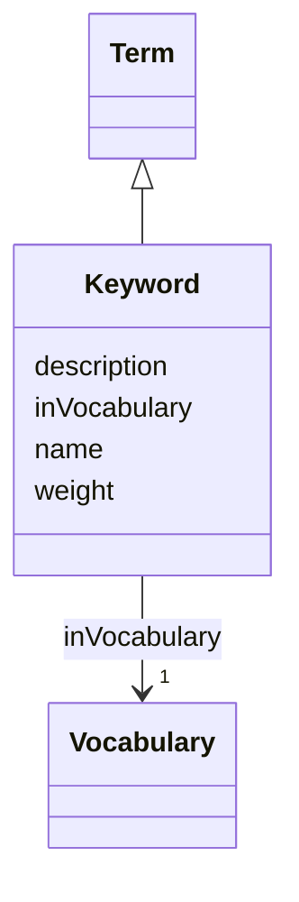

# Class: Keyword (Keyword)


_A term or phrase used to tag and categorize content_


URI: [EVORAO:Keyword](https://raw.githubusercontent.com/EVORA-project/evora-ontology/refs/heads/main/models/owl/evora_ontology.owl.ttl#Keyword)





## Inheritance
* [Resource](Resource.md)
    * [Term](Term.md)
        * **Keyword**


## Slots

| Name | Cardinality and Range | Description | Inheritance |
| ---  | --- | --- | --- |
| [name](name.md) | 1 <br/> [String](String.md) | The label that allows humans to identify the current item | [Term](Term.md) |
| [description](description.md) | 0..1 _recommended_ <br/> [String](String.md) | A short explanation of the characteristics, features, or nature of the curren... | [Term](Term.md) |
| [weight](weight.md) | 1 <br/> [Integer](Integer.md) | A numerical value indicating relative importance or priority, generally proce... | [Term](Term.md) |
| [inVocabulary](inVocabulary.md) | 1 <br/> [Vocabulary](Vocabulary.md) | Terms belong to a specific vocabulary | [Term](Term.md) |


## Usages

| used by | used in | type | used |
| ---  | --- | --- | --- |
| [ProductOrService](ProductOrService.md) | [keywords](keywords.md) | range | [Keyword](Keyword.md) |
| [Service](Service.md) | [keywords](keywords.md) | range | [Keyword](Keyword.md) |
| [Product](Product.md) | [keywords](keywords.md) | range | [Keyword](Keyword.md) |
| [Antibody](Antibody.md) | [keywords](keywords.md) | range | [Keyword](Keyword.md) |
| [Hybridoma](Hybridoma.md) | [keywords](keywords.md) | range | [Keyword](Keyword.md) |
| [Protein](Protein.md) | [keywords](keywords.md) | range | [Keyword](Keyword.md) |
| [NucleicAcid](NucleicAcid.md) | [keywords](keywords.md) | range | [Keyword](Keyword.md) |
| [DetectionKit](DetectionKit.md) | [keywords](keywords.md) | range | [Keyword](Keyword.md) |
| [Bundle](Bundle.md) | [keywords](keywords.md) | range | [Keyword](Keyword.md) |
| [Pathogen](Pathogen.md) | [keywords](keywords.md) | range | [Keyword](Keyword.md) |
| [Virus](Virus.md) | [keywords](keywords.md) | range | [Keyword](Keyword.md) |
| [Bacterium](Bacterium.md) | [keywords](keywords.md) | range | [Keyword](Keyword.md) |
| [Fungus](Fungus.md) | [keywords](keywords.md) | range | [Keyword](Keyword.md) |
| [Protozoan](Protozoan.md) | [keywords](keywords.md) | range | [Keyword](Keyword.md) |
| [Viroid](Viroid.md) | [keywords](keywords.md) | range | [Keyword](Keyword.md) |
| [Prion](Prion.md) | [keywords](keywords.md) | range | [Keyword](Keyword.md) |


## Identifier and Mapping Information


### Schema Source


* from schema: https://raw.githubusercontent.com/EVORA-project/evora-ontology/refs/heads/main/models/owl/evora_ontology.owl.ttl#


## Mappings

| Mapping Type | Mapped Value |
| ---  | ---  |
| self | EVORAO:Keyword |
| native | EVORAO:Keyword |
| close | wd:Q1128340, wd:Q1128340 |


## LinkML Source

<!-- TODO: investigate https://stackoverflow.com/questions/37606292/how-to-create-tabbed-code-blocks-in-mkdocs-or-sphinx -->

### Direct

<details>
```yaml
name: Keyword
description: A term or phrase used to tag and categorize content
title: Keyword
from_schema: https://raw.githubusercontent.com/EVORA-project/evora-ontology/refs/heads/main/models/owl/evora_ontology.owl.ttl#
close_mappings:
- wd:Q1128340
- wd:Q1128340
is_a: Term

```
</details>

### Induced

<details>
```yaml
name: Keyword
description: A term or phrase used to tag and categorize content
title: Keyword
from_schema: https://raw.githubusercontent.com/EVORA-project/evora-ontology/refs/heads/main/models/owl/evora_ontology.owl.ttl#
close_mappings:
- wd:Q1128340
- wd:Q1128340
is_a: Term
attributes:
  name:
    name: name
    description: The label that allows humans to identify the current item
    title: name
    comments:
    - 'The title of the item should be as short and descriptive as possible. E.g.
      for virus products it should basically be based on the following Pattern:

      ''Virus name'', ''virus host type'', ''collection year'', ''country of collection''
      ex ''suspected epidemiological origin'', ''genotype'', ''strain'', ''variant
      name or specific feature'
    from_schema: https://raw.githubusercontent.com/EVORA-project/evora-ontology/refs/heads/main/models/owl/evora_ontology.owl.ttl#
    exact_mappings:
    - dct:title
    close_mappings:
    - rdfs:label
    rank: 1000
    alias: name
    owner: Keyword
    domain_of:
    - Term
    - DataService
    - Catalogue
    - PersonOrOrganization
    - ProductOrService
    - File
    - ContactPoint
    - License
    - Certification
    range: string
    required: true
    multivalued: false
  description:
    name: description
    description: A short explanation of the characteristics, features, or nature of
      the current item
    title: description
    comments:
    - 'Describe this item in few lines. This description will serve as a summary to
      present the item.

      '
    from_schema: https://raw.githubusercontent.com/EVORA-project/evora-ontology/refs/heads/main/models/owl/evora_ontology.owl.ttl#
    exact_mappings:
    - dct:description
    rank: 1000
    alias: description
    owner: Keyword
    domain_of:
    - Term
    - DataService
    - Catalogue
    - PersonOrOrganization
    - ProductOrService
    - File
    - ContactPoint
    - License
    - Certification
    range: string
    required: false
    recommended: true
    multivalued: false
  weight:
    name: weight
    description: A numerical value indicating relative importance or priority, generally
      processed in ascending order. This weight helps prioritize content when organizing
      or processing data. Its value can be negative, with a default set to 0
    title: weight
    comments:
    - The lowest weighted Data providers are triggered first, this may be usefull
      to populate at first entities that are referenced by others (e.g. Version ahead
      of Rank ahead of Taxon)
    from_schema: https://raw.githubusercontent.com/EVORA-project/evora-ontology/refs/heads/main/models/owl/evora_ontology.owl.ttl#
    close_mappings:
    - adms:status
    rank: 1000
    ifabsent: int(0)
    alias: weight
    owner: Keyword
    domain_of:
    - Term
    - DataProvider
    range: integer
    required: true
    multivalued: false
  inVocabulary:
    name: inVocabulary
    description: Terms belong to a specific vocabulary
    title: in Vocabulary
    from_schema: https://raw.githubusercontent.com/EVORA-project/evora-ontology/refs/heads/main/models/owl/evora_ontology.owl.ttl#
    close_mappings:
    - wdp:P972
    rank: 1000
    alias: inVocabulary
    owner: Keyword
    domain_of:
    - Term
    range: Vocabulary
    required: true
    multivalued: false

```
</details>