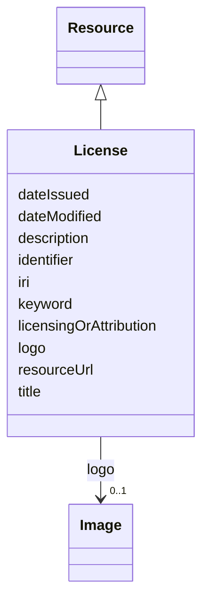

# Class: License (License) 


_The legal terms and conditions under which the subject can be used, shared, or distributed, indicating any restrictions or permissions._


URI: [EVORAO:License](https://w3id.org/evorao/License)





## Inheritance
* [Resource](Resource.md)
    * **License**


## Slots

| Name | Cardinality and Range | Description | Inheritance |
| ---  | --- | --- | --- |
| [title](title.md) | 1 <br/> [String](String.md) | A name given to the resource | direct |
| [description](description.md) | 0..1 _recommended_ <br/> [String](String.md) | A short explanation of the characteristics, features, or nature of the curren... | direct |
| [resourceUrl](resourceUrl.md) | 0..1 <br/> [Uri](Uri.md) | The web address or location where the details or content is stored and can be... | direct |
| [licensingOrAttribution](licensingOrAttribution.md) | 0..1 <br/> [String](String.md) | A text or html code that provides any related data sharing licence and/or att... | direct |
| [logo](logo.md) | 0..1 <br/> [Image](Image.md) | A path or URL to the related logo | direct |
| [keyword](keyword.md) | * <br/> [String](String.md) | A keyword or tag describing the resource | [Resource](Resource.md) |
| [dateIssued](dateIssued.md) | 0..1 <br/> [Datetime](Datetime.md) | Date of formal issuance (e | [Resource](Resource.md) |
| [dateModified](dateModified.md) | 0..1 <br/> [Datetime](Datetime.md) | Most recent date on which the resource was changed, updated or modified | [Resource](Resource.md) |
| [identifier](identifier.md) | * <br/> [String](String.md) | A unique identifier of the resource being described or cataloged | [Resource](Resource.md) |
| [iri](iri.md) | * <br/> [Uri](Uri.md) | International Resource Identifier (IRI) that uniquely identifies or refers to... | [Resource](Resource.md) |


## Usages

| used by | used in | type | used |
| ---  | --- | --- | --- |
| [DataProvider](DataProvider.md) | [license](license.md) | range | [License](License.md) |
| [File](File.md) | [license](license.md) | range | [License](License.md) |
| [Data](Data.md) | [license](license.md) | range | [License](License.md) |
| [Document](Document.md) | [license](license.md) | range | [License](License.md) |
| [Audio](Audio.md) | [license](license.md) | range | [License](License.md) |
| [Video](Video.md) | [license](license.md) | range | [License](License.md) |
| [Image](Image.md) | [license](license.md) | range | [License](License.md) |


## Identifier and Mapping Information


### Schema Source


* from schema: https://w3id.org/evorao/


## Mappings

| Mapping Type | Mapped Value |
| ---  | ---  |
| self | EVORAO:License |
| native | EVORAO:License |
| exact | dct:RightsStatement, dct:RightsStatement |
| close | wd:Q79719, dct:LicenseDocument, reproduceme:LicenseDocument, wd:Q79719, dct:LicenseDocument, reproduceme:LicenseDocument |


## LinkML Source

<!-- TODO: investigate https://stackoverflow.com/questions/37606292/how-to-create-tabbed-code-blocks-in-mkdocs-or-sphinx -->

### Direct

<details>
```yaml
name: License
description: The legal terms and conditions under which the subject can be used, shared,
  or distributed, indicating any restrictions or permissions.
title: License
from_schema: https://w3id.org/evorao/
exact_mappings:
- dct:RightsStatement
- dct:RightsStatement
close_mappings:
- wd:Q79719
- dct:LicenseDocument
- reproduceme:LicenseDocument
- wd:Q79719
- dct:LicenseDocument
- reproduceme:LicenseDocument
is_a: Resource
slots:
- title
- description
- resourceUrl
- licensingOrAttribution
- logo
slot_usage:
  title:
    name: title
    description: A name given to the resource.
    title: title
    comments:
    - The title of the item should be as short and descriptive as possible.
    - 'E.g. for virus products it should basically be based on the following Pattern:
      ''Virus name'', ''virus host type'', ''collection year'', ''country of collection''
      ex ''suspected epidemiological origin'', ''genotype'', ''strain'', ''variant
      name or specific feature.'
    exact_mappings:
    - schema:name
    - rdfs:label
    slot_uri: dct:title
    domain_of:
    - License
    - Dataset
    - DataService
    - Publication
    - Term
    - Certification
    - FundingSource
    range: string
    required: true
    multivalued: false
  description:
    name: description
    description: A short explanation of the characteristics, features, or nature of
      the current item.
    title: description
    comments:
    - Describe this item in few lines. This description will serve as a summary to
      present the resource.
    exact_mappings:
    - schema:description
    slot_uri: dct:description
    domain_of:
    - License
    - Dataset
    - DataService
    - Term
    - PersonOrOrganization
    - File
    - ContactPoint
    - Certification
    - FundingSource
    range: string
    required: false
    recommended: true
    multivalued: false
  resourceUrl:
    name: resourceUrl
    description: The web address or location where the details or content is stored
      and can be accessed or downloaded.
    title: resource URL
    exact_mappings:
    - dct:license
    broad_mappings:
    - schema:url
    is_a: iri
    domain_of:
    - License
    - Certification
    range: uri
    required: false
    multivalued: false
  licensingOrAttribution:
    name: licensingOrAttribution
    description: A text or html code that provides any related data sharing licence
      and/or attribution.
    title: licensing or attribution
    exact_mappings:
    - dct:rights
    close_mappings:
    - schema:license
    domain_of:
    - License
    range: string
    required: false
    multivalued: false
  logo:
    name: logo
    description: A path or URL to the related logo.
    title: logo
    domain_of:
    - License
    - PersonOrOrganization
    - Certification
    - FundingSource
    range: Image
    required: false
    multivalued: false

```
</details>

### Induced

<details>
```yaml
name: License
description: The legal terms and conditions under which the subject can be used, shared,
  or distributed, indicating any restrictions or permissions.
title: License
from_schema: https://w3id.org/evorao/
exact_mappings:
- dct:RightsStatement
- dct:RightsStatement
close_mappings:
- wd:Q79719
- dct:LicenseDocument
- reproduceme:LicenseDocument
- wd:Q79719
- dct:LicenseDocument
- reproduceme:LicenseDocument
is_a: Resource
slot_usage:
  title:
    name: title
    description: A name given to the resource.
    title: title
    comments:
    - The title of the item should be as short and descriptive as possible.
    - 'E.g. for virus products it should basically be based on the following Pattern:
      ''Virus name'', ''virus host type'', ''collection year'', ''country of collection''
      ex ''suspected epidemiological origin'', ''genotype'', ''strain'', ''variant
      name or specific feature.'
    exact_mappings:
    - schema:name
    - rdfs:label
    slot_uri: dct:title
    domain_of:
    - License
    - Dataset
    - DataService
    - Publication
    - Term
    - Certification
    - FundingSource
    range: string
    required: true
    multivalued: false
  description:
    name: description
    description: A short explanation of the characteristics, features, or nature of
      the current item.
    title: description
    comments:
    - Describe this item in few lines. This description will serve as a summary to
      present the resource.
    exact_mappings:
    - schema:description
    slot_uri: dct:description
    domain_of:
    - License
    - Dataset
    - DataService
    - Term
    - PersonOrOrganization
    - File
    - ContactPoint
    - Certification
    - FundingSource
    range: string
    required: false
    recommended: true
    multivalued: false
  resourceUrl:
    name: resourceUrl
    description: The web address or location where the details or content is stored
      and can be accessed or downloaded.
    title: resource URL
    exact_mappings:
    - dct:license
    broad_mappings:
    - schema:url
    is_a: iri
    domain_of:
    - License
    - Certification
    range: uri
    required: false
    multivalued: false
  licensingOrAttribution:
    name: licensingOrAttribution
    description: A text or html code that provides any related data sharing licence
      and/or attribution.
    title: licensing or attribution
    exact_mappings:
    - dct:rights
    close_mappings:
    - schema:license
    domain_of:
    - License
    range: string
    required: false
    multivalued: false
  logo:
    name: logo
    description: A path or URL to the related logo.
    title: logo
    domain_of:
    - License
    - PersonOrOrganization
    - Certification
    - FundingSource
    range: Image
    required: false
    multivalued: false
attributes:
  title:
    name: title
    description: A name given to the resource.
    title: title
    comments:
    - The title of the item should be as short and descriptive as possible.
    - 'E.g. for virus products it should basically be based on the following Pattern:
      ''Virus name'', ''virus host type'', ''collection year'', ''country of collection''
      ex ''suspected epidemiological origin'', ''genotype'', ''strain'', ''variant
      name or specific feature.'
    from_schema: https://w3id.org/evorao/
    exact_mappings:
    - schema:name
    - rdfs:label
    rank: 1000
    slot_uri: dct:title
    alias: title
    owner: License
    domain_of:
    - License
    - Dataset
    - DataService
    - Publication
    - Term
    - Certification
    - FundingSource
    range: string
    required: true
    multivalued: false
  description:
    name: description
    description: A short explanation of the characteristics, features, or nature of
      the current item.
    title: description
    comments:
    - Describe this item in few lines. This description will serve as a summary to
      present the resource.
    from_schema: https://w3id.org/evorao/
    exact_mappings:
    - schema:description
    rank: 1000
    slot_uri: dct:description
    alias: description
    owner: License
    domain_of:
    - License
    - Dataset
    - DataService
    - Term
    - PersonOrOrganization
    - File
    - ContactPoint
    - Certification
    - FundingSource
    range: string
    required: false
    recommended: true
    multivalued: false
  resourceUrl:
    name: resourceUrl
    description: The web address or location where the details or content is stored
      and can be accessed or downloaded.
    title: resource URL
    from_schema: https://w3id.org/evorao/
    exact_mappings:
    - dct:license
    broad_mappings:
    - schema:url
    rank: 1000
    is_a: iri
    alias: resourceUrl
    owner: License
    domain_of:
    - License
    - Certification
    range: uri
    required: false
    multivalued: false
  licensingOrAttribution:
    name: licensingOrAttribution
    description: A text or html code that provides any related data sharing licence
      and/or attribution.
    title: licensing or attribution
    from_schema: https://w3id.org/evorao/
    exact_mappings:
    - dct:rights
    close_mappings:
    - schema:license
    rank: 1000
    alias: licensingOrAttribution
    owner: License
    domain_of:
    - License
    range: string
    required: false
    multivalued: false
  logo:
    name: logo
    description: A path or URL to the related logo.
    title: logo
    from_schema: https://w3id.org/evorao/
    exact_mappings:
    - schema:logo
    rank: 1000
    alias: logo
    owner: License
    domain_of:
    - License
    - PersonOrOrganization
    - Certification
    - FundingSource
    range: Image
    required: false
    multivalued: false
  keyword:
    name: keyword
    description: A keyword or tag describing the resource.
    title: keyword
    from_schema: https://w3id.org/evorao/
    rank: 1000
    slot_uri: dcat:keyword
    alias: keyword
    owner: License
    domain_of:
    - Resource
    range: string
    required: false
    multivalued: true
  dateIssued:
    name: dateIssued
    description: Date of formal issuance (e.g., publication) of the resource.
    title: date issued
    comments:
    - encoded using the relevant ISO 8601 Date and Time compliant string [DATETIME].
    from_schema: https://w3id.org/evorao/
    exact_mappings:
    - sepio:0000051
    close_mappings:
    - schema:datePublished
    - schema:dateCreated
    rank: 1000
    slot_uri: dct:issued
    alias: dateIssued
    owner: License
    domain_of:
    - Resource
    range: datetime
    required: false
    multivalued: false
  dateModified:
    name: dateModified
    description: Most recent date on which the resource was changed, updated or modified.
    title: date modified
    comments:
    - encoded using the relevant ISO 8601 Date and Time compliant string [DATETIME].
    from_schema: https://w3id.org/evorao/
    exact_mappings:
    - sepio:0000036
    close_mappings:
    - schema:dateModified
    rank: 1000
    slot_uri: dct:modified
    alias: dateModified
    owner: License
    domain_of:
    - Resource
    range: datetime
    required: false
    multivalued: false
  identifier:
    name: identifier
    description: A unique identifier of the resource being described or cataloged.
    title: identifier
    comments:
    - The identifier is a text string which is assigned to the resource to provide
      an unambiguous reference within a particular context. Persistent identifiers
      should be provided as HTTP URIs.
    from_schema: https://w3id.org/evorao/
    exact_mappings:
    - schema:identifier
    rank: 1000
    slot_uri: dct:identifier
    alias: identifier
    owner: License
    domain_of:
    - Resource
    range: string
    required: false
    multivalued: true
  iri:
    name: iri
    description: International Resource Identifier (IRI) that uniquely identifies
      or refers to the resource. IRIs include URIs, and URIs include URLs.
    title: IRI
    comments:
    - An IRI is a global identifier standardized by IETF RFC 3987. It may or may not
      be resolvable on the web. IRIs include URIs, and URIs include URLs.
    from_schema: https://w3id.org/evorao/
    close_mappings:
    - biolink:iri
    related_mappings:
    - mi:url
    narrow_mappings:
    - schema:url
    rank: 1000
    is_a: identifier
    alias: iri
    owner: License
    domain_of:
    - Resource
    range: uri
    required: false
    multivalued: true

```
</details>