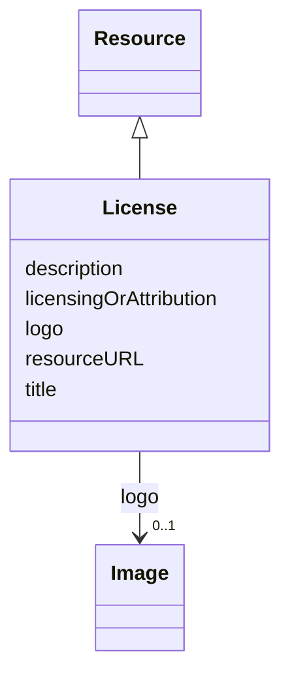

# Class: License (License) 


_The legal terms and conditions under which the subject can be used, shared, or distributed, indicating any restrictions or permissions_


URI: [EVORAO:License](https://w3id.org/evorao/License)





## Inheritance
* [Resource](Resource.md)
    * **License**


## Slots

| Name | Cardinality and Range | Description | Inheritance |
| ---  | --- | --- | --- |
| [title](title.md) | 1 <br/> [String](String.md) | A name given to the resource | direct |
| [description](description.md) | 0..1 _recommended_ <br/> [String](String.md) | A short explanation of the characteristics, features, or nature of the curren... | direct |
| [resourceURL](resourceURL.md) | 0..1 <br/> [Uri](Uri.md) | The web address or location where the details or content is stored and can be... | direct |
| [licensingOrAttribution](licensingOrAttribution.md) | 0..1 <br/> [String](String.md) | A text or html code that provides any related data sharing licence and/or att... | direct |
| [logo](logo.md) | 0..1 <br/> [Image](Image.md) | A path or URL to the related logo | direct |


## Usages

| used by | used in | type | used |
| ---  | --- | --- | --- |
| [DataProvider](DataProvider.md) | [license](license.md) | range | [License](License.md) |
| [File](File.md) | [license](license.md) | range | [License](License.md) |
| [Data](Data.md) | [license](license.md) | range | [License](License.md) |
| [Document](Document.md) | [license](license.md) | range | [License](License.md) |
| [Audio](Audio.md) | [license](license.md) | range | [License](License.md) |
| [Video](Video.md) | [license](license.md) | range | [License](License.md) |
| [Image](Image.md) | [license](license.md) | range | [License](License.md) |


## Identifier and Mapping Information


### Schema Source


* from schema: https://w3id.org/evorao/


## Mappings

| Mapping Type | Mapped Value |
| ---  | ---  |
| self | EVORAO:License |
| native | EVORAO:License |
| exact | dct:RightsStatement, dct:RightsStatement |
| close | wd:Q79719, dct:LicenseDocument, wd:Q79719, dct:LicenseDocument |


## LinkML Source

<!-- TODO: investigate https://stackoverflow.com/questions/37606292/how-to-create-tabbed-code-blocks-in-mkdocs-or-sphinx -->

### Direct

<details>
```yaml
name: License
description: The legal terms and conditions under which the subject can be used, shared,
  or distributed, indicating any restrictions or permissions
title: License
from_schema: https://w3id.org/evorao/
exact_mappings:
- dct:RightsStatement
- dct:RightsStatement
close_mappings:
- wd:Q79719
- dct:LicenseDocument
- wd:Q79719
- dct:LicenseDocument
is_a: Resource
slots:
- title
- description
- resourceURL
- licensingOrAttribution
- logo
slot_usage:
  title:
    name: title
    description: A name given to the resource
    title: title
    comments:
    - 'The title of the item should be as short and descriptive as possible. E.g.
      for virus products it should basically be based on the following Pattern:

      ''Virus name'', ''virus host type'', ''collection year'', ''country of collection''
      ex ''suspected epidemiological origin'', ''genotype'', ''strain'', ''variant
      name or specific feature'
    close_mappings:
    - rdfs:label
    slot_uri: dct:title
    domain_of:
    - License
    - Dataset
    - DataService
    - Publication
    - Term
    - Certification
    range: string
    required: true
    multivalued: false
  description:
    name: description
    description: A short explanation of the characteristics, features, or nature of
      the current item
    title: description
    comments:
    - 'Describe this item in few lines. This description will serve as a summary to
      present the resource.

      '
    slot_uri: dct:description
    domain_of:
    - License
    - Dataset
    - DataService
    - Term
    - PersonOrOrganization
    - File
    - ContactPoint
    - Certification
    range: string
    required: false
    recommended: true
    multivalued: false
  resourceURL:
    name: resourceURL
    description: The web address or location where the details or content is stored
      and can be accessed or downloaded.
    title: resource URL
    exact_mappings:
    - dct:license
    close_mappings:
    - schema:url
    domain_of:
    - License
    - Certification
    range: uri
    required: false
    multivalued: false
  licensingOrAttribution:
    name: licensingOrAttribution
    description: A text or html code that provides any related data sharing licence
      and/or attribution
    title: licensing or attribution
    exact_mappings:
    - dct:rights
    close_mappings:
    - schema:license
    domain_of:
    - License
    range: string
    required: false
    multivalued: false
  logo:
    name: logo
    description: A path or URL to the related logo
    title: logo
    domain_of:
    - License
    - PersonOrOrganization
    - Certification
    range: Image
    required: false
    multivalued: false

```
</details>

### Induced

<details>
```yaml
name: License
description: The legal terms and conditions under which the subject can be used, shared,
  or distributed, indicating any restrictions or permissions
title: License
from_schema: https://w3id.org/evorao/
exact_mappings:
- dct:RightsStatement
- dct:RightsStatement
close_mappings:
- wd:Q79719
- dct:LicenseDocument
- wd:Q79719
- dct:LicenseDocument
is_a: Resource
slot_usage:
  title:
    name: title
    description: A name given to the resource
    title: title
    comments:
    - 'The title of the item should be as short and descriptive as possible. E.g.
      for virus products it should basically be based on the following Pattern:

      ''Virus name'', ''virus host type'', ''collection year'', ''country of collection''
      ex ''suspected epidemiological origin'', ''genotype'', ''strain'', ''variant
      name or specific feature'
    close_mappings:
    - rdfs:label
    slot_uri: dct:title
    domain_of:
    - License
    - Dataset
    - DataService
    - Publication
    - Term
    - Certification
    range: string
    required: true
    multivalued: false
  description:
    name: description
    description: A short explanation of the characteristics, features, or nature of
      the current item
    title: description
    comments:
    - 'Describe this item in few lines. This description will serve as a summary to
      present the resource.

      '
    slot_uri: dct:description
    domain_of:
    - License
    - Dataset
    - DataService
    - Term
    - PersonOrOrganization
    - File
    - ContactPoint
    - Certification
    range: string
    required: false
    recommended: true
    multivalued: false
  resourceURL:
    name: resourceURL
    description: The web address or location where the details or content is stored
      and can be accessed or downloaded.
    title: resource URL
    exact_mappings:
    - dct:license
    close_mappings:
    - schema:url
    domain_of:
    - License
    - Certification
    range: uri
    required: false
    multivalued: false
  licensingOrAttribution:
    name: licensingOrAttribution
    description: A text or html code that provides any related data sharing licence
      and/or attribution
    title: licensing or attribution
    exact_mappings:
    - dct:rights
    close_mappings:
    - schema:license
    domain_of:
    - License
    range: string
    required: false
    multivalued: false
  logo:
    name: logo
    description: A path or URL to the related logo
    title: logo
    domain_of:
    - License
    - PersonOrOrganization
    - Certification
    range: Image
    required: false
    multivalued: false
attributes:
  title:
    name: title
    description: A name given to the resource
    title: title
    comments:
    - 'The title of the item should be as short and descriptive as possible. E.g.
      for virus products it should basically be based on the following Pattern:

      ''Virus name'', ''virus host type'', ''collection year'', ''country of collection''
      ex ''suspected epidemiological origin'', ''genotype'', ''strain'', ''variant
      name or specific feature'
    from_schema: https://w3id.org/evorao/
    close_mappings:
    - rdfs:label
    rank: 1000
    slot_uri: dct:title
    alias: title
    owner: License
    domain_of:
    - License
    - Dataset
    - DataService
    - Publication
    - Term
    - Certification
    range: string
    required: true
    multivalued: false
  description:
    name: description
    description: A short explanation of the characteristics, features, or nature of
      the current item
    title: description
    comments:
    - 'Describe this item in few lines. This description will serve as a summary to
      present the resource.

      '
    from_schema: https://w3id.org/evorao/
    rank: 1000
    slot_uri: dct:description
    alias: description
    owner: License
    domain_of:
    - License
    - Dataset
    - DataService
    - Term
    - PersonOrOrganization
    - File
    - ContactPoint
    - Certification
    range: string
    required: false
    recommended: true
    multivalued: false
  resourceURL:
    name: resourceURL
    description: The web address or location where the details or content is stored
      and can be accessed or downloaded.
    title: resource URL
    from_schema: https://w3id.org/evorao/
    exact_mappings:
    - dct:license
    close_mappings:
    - schema:url
    rank: 1000
    alias: resourceURL
    owner: License
    domain_of:
    - License
    - Certification
    range: uri
    required: false
    multivalued: false
  licensingOrAttribution:
    name: licensingOrAttribution
    description: A text or html code that provides any related data sharing licence
      and/or attribution
    title: licensing or attribution
    from_schema: https://w3id.org/evorao/
    exact_mappings:
    - dct:rights
    close_mappings:
    - schema:license
    rank: 1000
    alias: licensingOrAttribution
    owner: License
    domain_of:
    - License
    range: string
    required: false
    multivalued: false
  logo:
    name: logo
    description: A path or URL to the related logo
    title: logo
    from_schema: https://w3id.org/evorao/
    rank: 1000
    alias: logo
    owner: License
    domain_of:
    - License
    - PersonOrOrganization
    - Certification
    range: Image
    required: false
    multivalued: false

```
</details>