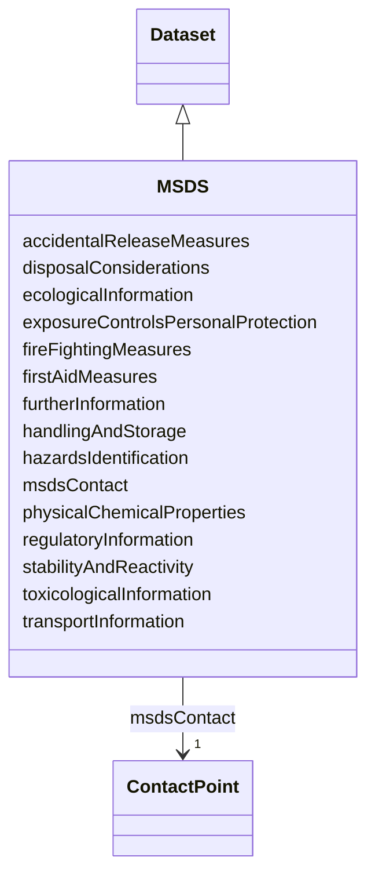

# Class: MSDS (MSDS)


_A Material Safety Data Sheet (MSDS) or Safety Data Sheet (SDS) is a standardized document that contains crucial occupational safety and health information related to the product_


URI: [EVORA:MSDS](https://raw.githubusercontent.com/EVORA-project/evora-ontology/refs/heads/main/models/owl/evora_ontology.owl.ttl#MSDS)





## Inheritance
* [Dataset](Dataset.md)
    * **MSDS**


## Slots

| Name | Cardinality and Range | Description | Inheritance |
| ---  | --- | --- | --- |
| [msdsContact](msdsContact.md) | 1 <br/> [ContactPoint](ContactPoint.md) | The designated contact point responsible for providing information related to... | direct |
| [physicalChemicalProperties](physicalChemicalProperties.md) | 0..1 <br/> [String](String.md) | Key characteristics of the product, such as physical state, appearance, solub... | direct |
| [hazardsIdentification](hazardsIdentification.md) | 0..1 <br/> [String](String.md) | Outlines the potential risks and dangers associated with handling the product... | direct |
| [firstAidMeasures](firstAidMeasures.md) | 0..1 <br/> [String](String.md) | Instructions on immediate actions to take in case of exposure to the product,... | direct |
| [fireFightingMeasures](fireFightingMeasures.md) | 0..1 <br/> [String](String.md) | Guidance on how to safely extinguish a fire involving the product, including ... | direct |
| [accidentalReleaseMeasures](accidentalReleaseMeasures.md) | 0..1 <br/> [String](String.md) | Guidelines for safely managing spills or leaks of the product, including cont... | direct |
| [handlingAndStorage](handlingAndStorage.md) | 0..1 <br/> [String](String.md) | Instructions on the safe handling practices and storage conditions for the pr... | direct |
| [exposureControlsPersonalProtection](exposureControlsPersonalProtection.md) | 0..1 <br/> [String](String.md) | Specifies measures to limit exposure to the product, including recommended en... | direct |
| [stabilityAndReactivity](stabilityAndReactivity.md) | 0..1 <br/> [String](String.md) | Describes the product’s stability under normal conditions and its potential t... | direct |
| [toxicologicalInformation](toxicologicalInformation.md) | 0..1 <br/> [String](String.md) | Details on the potential health effects of the product, including routes of e... | direct |
| [ecologicalInformation](ecologicalInformation.md) | 0..1 <br/> [String](String.md) | Details the potential environmental impact of the product, including its effe... | direct |
| [disposalConsiderations](disposalConsiderations.md) | 0..1 <br/> [String](String.md) | Guidance on the safe and environmentally responsible disposal of the product,... | direct |
| [transportInformation](transportInformation.md) | 0..1 <br/> [String](String.md) | Details the regulations and guidelines for safely transporting the product, i... | direct |
| [regulatoryInformation](regulatoryInformation.md) | 0..1 <br/> [String](String.md) | Lists applicable laws, regulations, and standards governing the product, incl... | direct |
| [furtherInformation](furtherInformation.md) | 0..1 <br/> [String](String.md) | Provides any additional details or clarifications not covered in other sectio... | direct |


## Usages

| used by | used in | type | used |
| ---  | --- | --- | --- |
| [Product](Product.md) | [materialSafetyDataSheet](materialSafetyDataSheet.md) | range | [MSDS](MSDS.md) |
| [Antibody](Antibody.md) | [materialSafetyDataSheet](materialSafetyDataSheet.md) | range | [MSDS](MSDS.md) |
| [Hybridoma](Hybridoma.md) | [materialSafetyDataSheet](materialSafetyDataSheet.md) | range | [MSDS](MSDS.md) |
| [Protein](Protein.md) | [materialSafetyDataSheet](materialSafetyDataSheet.md) | range | [MSDS](MSDS.md) |
| [NucleicAcid](NucleicAcid.md) | [materialSafetyDataSheet](materialSafetyDataSheet.md) | range | [MSDS](MSDS.md) |
| [DetectionKit](DetectionKit.md) | [materialSafetyDataSheet](materialSafetyDataSheet.md) | range | [MSDS](MSDS.md) |
| [Bundle](Bundle.md) | [materialSafetyDataSheet](materialSafetyDataSheet.md) | range | [MSDS](MSDS.md) |
| [Pathogen](Pathogen.md) | [materialSafetyDataSheet](materialSafetyDataSheet.md) | range | [MSDS](MSDS.md) |
| [Virus](Virus.md) | [materialSafetyDataSheet](materialSafetyDataSheet.md) | range | [MSDS](MSDS.md) |
| [Bacterium](Bacterium.md) | [materialSafetyDataSheet](materialSafetyDataSheet.md) | range | [MSDS](MSDS.md) |
| [Fungus](Fungus.md) | [materialSafetyDataSheet](materialSafetyDataSheet.md) | range | [MSDS](MSDS.md) |
| [Protozoan](Protozoan.md) | [materialSafetyDataSheet](materialSafetyDataSheet.md) | range | [MSDS](MSDS.md) |
| [Viroid](Viroid.md) | [materialSafetyDataSheet](materialSafetyDataSheet.md) | range | [MSDS](MSDS.md) |
| [Prion](Prion.md) | [materialSafetyDataSheet](materialSafetyDataSheet.md) | range | [MSDS](MSDS.md) |


## Aliases


* safety data sheet


## Identifier and Mapping Information


### Schema Source


* from schema: https://raw.githubusercontent.com/EVORA-project/evora-ontology/refs/heads/main/models/owl/evora_ontology.owl.ttl#


## Mappings

| Mapping Type | Mapped Value |
| ---  | ---  |
| self | EVORA:MSDS |
| native | EVORA:MSDS |
| close | wd:Q222067 |


## LinkML Source

<!-- TODO: investigate https://stackoverflow.com/questions/37606292/how-to-create-tabbed-code-blocks-in-mkdocs-or-sphinx -->

### Direct

<details>
```yaml
name: MSDS
description: A Material Safety Data Sheet (MSDS) or Safety Data Sheet (SDS) is a standardized
  document that contains crucial occupational safety and health information related
  to the product
title: MSDS
from_schema: https://raw.githubusercontent.com/EVORA-project/evora-ontology/refs/heads/main/models/owl/evora_ontology.owl.ttl#
aliases:
- safety data sheet
close_mappings:
- wd:Q222067
is_a: Dataset
slots:
- msdsContact
- physicalChemicalProperties
- hazardsIdentification
- firstAidMeasures
- fireFightingMeasures
- accidentalReleaseMeasures
- handlingAndStorage
- exposureControlsPersonalProtection
- stabilityAndReactivity
- toxicologicalInformation
- ecologicalInformation
- disposalConsiderations
- transportInformation
- regulatoryInformation
- furtherInformation
slot_usage:
  msdsContact:
    name: msdsContact
    description: The designated contact point responsible for providing information
      related to the safety, handling, and regulatory compliance of the biological
      product.
    title: MSDS contact
    exact_mappings:
    - dcat:contactPoint
    range: ContactPoint
    required: true
    multivalued: false
  physicalChemicalProperties:
    name: physicalChemicalProperties
    description: Key characteristics of the product, such as physical state, appearance,
      solubility, pH, chemical composition, and molecular weight, essential for safe
      handling and storage
    title: physical and chemical properties and information on ingredients
    range: string
    required: false
    multivalued: false
  hazardsIdentification:
    name: hazardsIdentification
    description: Outlines the potential risks and dangers associated with handling
      the product, including its physical, chemical, and health hazards. This section
      provides information on toxicity, flammability, reactivity, and other relevant
      risks for safe use.
    title: hazards identification
    range: string
    required: false
    multivalued: false
  firstAidMeasures:
    name: firstAidMeasures
    description: Instructions on immediate actions to take in case of exposure to
      the product, including inhalation, ingestion, skin, or eye contact. This section
      outlines steps to minimize harm before medical help is available.
    title: first aid measures
    range: string
    required: false
    multivalued: false
  fireFightingMeasures:
    name: fireFightingMeasures
    description: Guidance on how to safely extinguish a fire involving the product,
      including suitable extinguishing agents, special protective equipment for firefighters,
      and any specific hazards from combustion.
    title: fire fighting measures
    range: string
    required: false
    multivalued: false
  accidentalReleaseMeasures:
    name: accidentalReleaseMeasures
    description: Guidelines for safely managing spills or leaks of the product, including
      containment, cleanup procedures, and precautions to prevent harm to people,
      property, and the environment.
    title: accidental release measures
    range: string
    required: false
    multivalued: false
  handlingAndStorage:
    name: handlingAndStorage
    description: Instructions on the safe handling practices and storage conditions
      for the product, including precautions to prevent accidents, degradation, or
      contamination, as well as recommended temperature, humidity, and container requirements.
    title: handling and storage
    range: string
    required: false
    multivalued: false
  exposureControlsPersonalProtection:
    name: exposureControlsPersonalProtection
    description: Specifies measures to limit exposure to the product, including recommended
      engineering controls (e.g., ventilation) and personal protective equipment (PPE)
      such as gloves, masks, goggles, and clothing to ensure safe handling.
    title: exposure controls/personal protection
    range: string
    required: false
    multivalued: false
  stabilityAndReactivity:
    name: stabilityAndReactivity
    description: Describes the product’s stability under normal conditions and its
      potential to react with other substances. This section includes information
      on hazardous reactions, conditions to avoid, and incompatible materials that
      could cause degradation or dangerous reactions.
    title: stability and reactivity
    range: string
    required: false
    multivalued: false
  toxicologicalInformation:
    name: toxicologicalInformation
    description: Details on the potential health effects of the product, including
      routes of exposure (inhalation, ingestion, skin, eye contact), acute and chronic
      toxicity and symptoms of exposure
    title: toxicological information
    range: string
    required: false
    multivalued: false
  ecologicalInformation:
    name: ecologicalInformation
    description: Details the potential environmental impact of the product, including
      its effects on ecosystems, persistence, degradability, bioaccumulation potential,
      and toxicity to aquatic and terrestrial organisms.
    title: ecological information
    range: string
    required: false
    multivalued: false
  disposalConsiderations:
    name: disposalConsiderations
    description: Guidance on the safe and environmentally responsible disposal of
      the product, including recommended disposal methods, regulatory requirements,
      and precautions to avoid harm to people and the environment during disposal.
    title: disposal considerations
    range: string
    required: false
    multivalued: false
  transportInformation:
    name: transportInformation
    description: Details the regulations and guidelines for safely transporting the
      product, including classifications for road, air, sea, or rail transport, UN
      numbers, packaging requirements, and any special precautions to ensure safe
      transit.
    title: transport information
    range: string
    required: false
    multivalued: false
  regulatoryInformation:
    name: regulatoryInformation
    description: Lists applicable laws, regulations, and standards governing the product,
      including local, national, or international requirements for its handling, use,
      transportation, and disposal, ensuring compliance with legal obligations.
    title: regulatory information
    range: string
    required: false
    multivalued: false
  furtherInformation:
    name: furtherInformation
    description: Provides any additional details or clarifications not covered in
      other sections of the MSDS, such as references, supporting documents, or specific
      instructions for safe handling and use of the product.
    title: further information
    range: string
    required: false
    multivalued: false

```
</details>

### Induced

<details>
```yaml
name: MSDS
description: A Material Safety Data Sheet (MSDS) or Safety Data Sheet (SDS) is a standardized
  document that contains crucial occupational safety and health information related
  to the product
title: MSDS
from_schema: https://raw.githubusercontent.com/EVORA-project/evora-ontology/refs/heads/main/models/owl/evora_ontology.owl.ttl#
aliases:
- safety data sheet
close_mappings:
- wd:Q222067
is_a: Dataset
slot_usage:
  msdsContact:
    name: msdsContact
    description: The designated contact point responsible for providing information
      related to the safety, handling, and regulatory compliance of the biological
      product.
    title: MSDS contact
    exact_mappings:
    - dcat:contactPoint
    range: ContactPoint
    required: true
    multivalued: false
  physicalChemicalProperties:
    name: physicalChemicalProperties
    description: Key characteristics of the product, such as physical state, appearance,
      solubility, pH, chemical composition, and molecular weight, essential for safe
      handling and storage
    title: physical and chemical properties and information on ingredients
    range: string
    required: false
    multivalued: false
  hazardsIdentification:
    name: hazardsIdentification
    description: Outlines the potential risks and dangers associated with handling
      the product, including its physical, chemical, and health hazards. This section
      provides information on toxicity, flammability, reactivity, and other relevant
      risks for safe use.
    title: hazards identification
    range: string
    required: false
    multivalued: false
  firstAidMeasures:
    name: firstAidMeasures
    description: Instructions on immediate actions to take in case of exposure to
      the product, including inhalation, ingestion, skin, or eye contact. This section
      outlines steps to minimize harm before medical help is available.
    title: first aid measures
    range: string
    required: false
    multivalued: false
  fireFightingMeasures:
    name: fireFightingMeasures
    description: Guidance on how to safely extinguish a fire involving the product,
      including suitable extinguishing agents, special protective equipment for firefighters,
      and any specific hazards from combustion.
    title: fire fighting measures
    range: string
    required: false
    multivalued: false
  accidentalReleaseMeasures:
    name: accidentalReleaseMeasures
    description: Guidelines for safely managing spills or leaks of the product, including
      containment, cleanup procedures, and precautions to prevent harm to people,
      property, and the environment.
    title: accidental release measures
    range: string
    required: false
    multivalued: false
  handlingAndStorage:
    name: handlingAndStorage
    description: Instructions on the safe handling practices and storage conditions
      for the product, including precautions to prevent accidents, degradation, or
      contamination, as well as recommended temperature, humidity, and container requirements.
    title: handling and storage
    range: string
    required: false
    multivalued: false
  exposureControlsPersonalProtection:
    name: exposureControlsPersonalProtection
    description: Specifies measures to limit exposure to the product, including recommended
      engineering controls (e.g., ventilation) and personal protective equipment (PPE)
      such as gloves, masks, goggles, and clothing to ensure safe handling.
    title: exposure controls/personal protection
    range: string
    required: false
    multivalued: false
  stabilityAndReactivity:
    name: stabilityAndReactivity
    description: Describes the product’s stability under normal conditions and its
      potential to react with other substances. This section includes information
      on hazardous reactions, conditions to avoid, and incompatible materials that
      could cause degradation or dangerous reactions.
    title: stability and reactivity
    range: string
    required: false
    multivalued: false
  toxicologicalInformation:
    name: toxicologicalInformation
    description: Details on the potential health effects of the product, including
      routes of exposure (inhalation, ingestion, skin, eye contact), acute and chronic
      toxicity and symptoms of exposure
    title: toxicological information
    range: string
    required: false
    multivalued: false
  ecologicalInformation:
    name: ecologicalInformation
    description: Details the potential environmental impact of the product, including
      its effects on ecosystems, persistence, degradability, bioaccumulation potential,
      and toxicity to aquatic and terrestrial organisms.
    title: ecological information
    range: string
    required: false
    multivalued: false
  disposalConsiderations:
    name: disposalConsiderations
    description: Guidance on the safe and environmentally responsible disposal of
      the product, including recommended disposal methods, regulatory requirements,
      and precautions to avoid harm to people and the environment during disposal.
    title: disposal considerations
    range: string
    required: false
    multivalued: false
  transportInformation:
    name: transportInformation
    description: Details the regulations and guidelines for safely transporting the
      product, including classifications for road, air, sea, or rail transport, UN
      numbers, packaging requirements, and any special precautions to ensure safe
      transit.
    title: transport information
    range: string
    required: false
    multivalued: false
  regulatoryInformation:
    name: regulatoryInformation
    description: Lists applicable laws, regulations, and standards governing the product,
      including local, national, or international requirements for its handling, use,
      transportation, and disposal, ensuring compliance with legal obligations.
    title: regulatory information
    range: string
    required: false
    multivalued: false
  furtherInformation:
    name: furtherInformation
    description: Provides any additional details or clarifications not covered in
      other sections of the MSDS, such as references, supporting documents, or specific
      instructions for safe handling and use of the product.
    title: further information
    range: string
    required: false
    multivalued: false
attributes:
  msdsContact:
    name: msdsContact
    description: The designated contact point responsible for providing information
      related to the safety, handling, and regulatory compliance of the biological
      product.
    title: MSDS contact
    from_schema: https://raw.githubusercontent.com/EVORA-project/evora-ontology/refs/heads/main/models/owl/evora_ontology.owl.ttl#
    exact_mappings:
    - dcat:contactPoint
    rank: 1000
    alias: msdsContact
    owner: MSDS
    domain_of:
    - MSDS
    range: ContactPoint
    required: true
    multivalued: false
  physicalChemicalProperties:
    name: physicalChemicalProperties
    description: Key characteristics of the product, such as physical state, appearance,
      solubility, pH, chemical composition, and molecular weight, essential for safe
      handling and storage
    title: physical and chemical properties and information on ingredients
    from_schema: https://raw.githubusercontent.com/EVORA-project/evora-ontology/refs/heads/main/models/owl/evora_ontology.owl.ttl#
    rank: 1000
    alias: physicalChemicalProperties
    owner: MSDS
    domain_of:
    - MSDS
    range: string
    required: false
    multivalued: false
  hazardsIdentification:
    name: hazardsIdentification
    description: Outlines the potential risks and dangers associated with handling
      the product, including its physical, chemical, and health hazards. This section
      provides information on toxicity, flammability, reactivity, and other relevant
      risks for safe use.
    title: hazards identification
    from_schema: https://raw.githubusercontent.com/EVORA-project/evora-ontology/refs/heads/main/models/owl/evora_ontology.owl.ttl#
    rank: 1000
    alias: hazardsIdentification
    owner: MSDS
    domain_of:
    - MSDS
    range: string
    required: false
    multivalued: false
  firstAidMeasures:
    name: firstAidMeasures
    description: Instructions on immediate actions to take in case of exposure to
      the product, including inhalation, ingestion, skin, or eye contact. This section
      outlines steps to minimize harm before medical help is available.
    title: first aid measures
    from_schema: https://raw.githubusercontent.com/EVORA-project/evora-ontology/refs/heads/main/models/owl/evora_ontology.owl.ttl#
    rank: 1000
    alias: firstAidMeasures
    owner: MSDS
    domain_of:
    - MSDS
    range: string
    required: false
    multivalued: false
  fireFightingMeasures:
    name: fireFightingMeasures
    description: Guidance on how to safely extinguish a fire involving the product,
      including suitable extinguishing agents, special protective equipment for firefighters,
      and any specific hazards from combustion.
    title: fire fighting measures
    from_schema: https://raw.githubusercontent.com/EVORA-project/evora-ontology/refs/heads/main/models/owl/evora_ontology.owl.ttl#
    rank: 1000
    alias: fireFightingMeasures
    owner: MSDS
    domain_of:
    - MSDS
    range: string
    required: false
    multivalued: false
  accidentalReleaseMeasures:
    name: accidentalReleaseMeasures
    description: Guidelines for safely managing spills or leaks of the product, including
      containment, cleanup procedures, and precautions to prevent harm to people,
      property, and the environment.
    title: accidental release measures
    from_schema: https://raw.githubusercontent.com/EVORA-project/evora-ontology/refs/heads/main/models/owl/evora_ontology.owl.ttl#
    rank: 1000
    alias: accidentalReleaseMeasures
    owner: MSDS
    domain_of:
    - MSDS
    range: string
    required: false
    multivalued: false
  handlingAndStorage:
    name: handlingAndStorage
    description: Instructions on the safe handling practices and storage conditions
      for the product, including precautions to prevent accidents, degradation, or
      contamination, as well as recommended temperature, humidity, and container requirements.
    title: handling and storage
    from_schema: https://raw.githubusercontent.com/EVORA-project/evora-ontology/refs/heads/main/models/owl/evora_ontology.owl.ttl#
    rank: 1000
    alias: handlingAndStorage
    owner: MSDS
    domain_of:
    - MSDS
    range: string
    required: false
    multivalued: false
  exposureControlsPersonalProtection:
    name: exposureControlsPersonalProtection
    description: Specifies measures to limit exposure to the product, including recommended
      engineering controls (e.g., ventilation) and personal protective equipment (PPE)
      such as gloves, masks, goggles, and clothing to ensure safe handling.
    title: exposure controls/personal protection
    from_schema: https://raw.githubusercontent.com/EVORA-project/evora-ontology/refs/heads/main/models/owl/evora_ontology.owl.ttl#
    rank: 1000
    alias: exposureControlsPersonalProtection
    owner: MSDS
    domain_of:
    - MSDS
    range: string
    required: false
    multivalued: false
  stabilityAndReactivity:
    name: stabilityAndReactivity
    description: Describes the product’s stability under normal conditions and its
      potential to react with other substances. This section includes information
      on hazardous reactions, conditions to avoid, and incompatible materials that
      could cause degradation or dangerous reactions.
    title: stability and reactivity
    from_schema: https://raw.githubusercontent.com/EVORA-project/evora-ontology/refs/heads/main/models/owl/evora_ontology.owl.ttl#
    rank: 1000
    alias: stabilityAndReactivity
    owner: MSDS
    domain_of:
    - MSDS
    range: string
    required: false
    multivalued: false
  toxicologicalInformation:
    name: toxicologicalInformation
    description: Details on the potential health effects of the product, including
      routes of exposure (inhalation, ingestion, skin, eye contact), acute and chronic
      toxicity and symptoms of exposure
    title: toxicological information
    from_schema: https://raw.githubusercontent.com/EVORA-project/evora-ontology/refs/heads/main/models/owl/evora_ontology.owl.ttl#
    rank: 1000
    alias: toxicologicalInformation
    owner: MSDS
    domain_of:
    - MSDS
    range: string
    required: false
    multivalued: false
  ecologicalInformation:
    name: ecologicalInformation
    description: Details the potential environmental impact of the product, including
      its effects on ecosystems, persistence, degradability, bioaccumulation potential,
      and toxicity to aquatic and terrestrial organisms.
    title: ecological information
    from_schema: https://raw.githubusercontent.com/EVORA-project/evora-ontology/refs/heads/main/models/owl/evora_ontology.owl.ttl#
    rank: 1000
    alias: ecologicalInformation
    owner: MSDS
    domain_of:
    - MSDS
    range: string
    required: false
    multivalued: false
  disposalConsiderations:
    name: disposalConsiderations
    description: Guidance on the safe and environmentally responsible disposal of
      the product, including recommended disposal methods, regulatory requirements,
      and precautions to avoid harm to people and the environment during disposal.
    title: disposal considerations
    from_schema: https://raw.githubusercontent.com/EVORA-project/evora-ontology/refs/heads/main/models/owl/evora_ontology.owl.ttl#
    rank: 1000
    alias: disposalConsiderations
    owner: MSDS
    domain_of:
    - MSDS
    range: string
    required: false
    multivalued: false
  transportInformation:
    name: transportInformation
    description: Details the regulations and guidelines for safely transporting the
      product, including classifications for road, air, sea, or rail transport, UN
      numbers, packaging requirements, and any special precautions to ensure safe
      transit.
    title: transport information
    from_schema: https://raw.githubusercontent.com/EVORA-project/evora-ontology/refs/heads/main/models/owl/evora_ontology.owl.ttl#
    rank: 1000
    alias: transportInformation
    owner: MSDS
    domain_of:
    - MSDS
    range: string
    required: false
    multivalued: false
  regulatoryInformation:
    name: regulatoryInformation
    description: Lists applicable laws, regulations, and standards governing the product,
      including local, national, or international requirements for its handling, use,
      transportation, and disposal, ensuring compliance with legal obligations.
    title: regulatory information
    from_schema: https://raw.githubusercontent.com/EVORA-project/evora-ontology/refs/heads/main/models/owl/evora_ontology.owl.ttl#
    rank: 1000
    alias: regulatoryInformation
    owner: MSDS
    domain_of:
    - MSDS
    range: string
    required: false
    multivalued: false
  furtherInformation:
    name: furtherInformation
    description: Provides any additional details or clarifications not covered in
      other sections of the MSDS, such as references, supporting documents, or specific
      instructions for safe handling and use of the product.
    title: further information
    from_schema: https://raw.githubusercontent.com/EVORA-project/evora-ontology/refs/heads/main/models/owl/evora_ontology.owl.ttl#
    rank: 1000
    alias: furtherInformation
    owner: MSDS
    domain_of:
    - MSDS
    range: string
    required: false
    multivalued: false

```
</details>