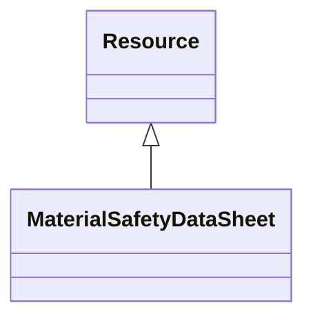

# Class: Material safety data sheet (MaterialSafetyDataSheet) 


_A Material Safety Data Sheet (MSDS) or Safety Data Sheet (SDS) is a standardized document that contains crucial occupational safety and health information related to the product_


URI: [EVORAO:MaterialSafetyDataSheet](https://w3id.org/evorao/MaterialSafetyDataSheet)





## Inheritance
* [Resource](Resource.md)
    * **MaterialSafetyDataSheet**


## Slots

| Name | Cardinality and Range | Description | Inheritance |
| ---  | --- | --- | --- |


## Identifier and Mapping Information


### Schema Source


* from schema: https://w3id.org/evorao/


## Mappings

| Mapping Type | Mapped Value |
| ---  | ---  |
| self | EVORAO:MaterialSafetyDataSheet |
| native | EVORAO:MaterialSafetyDataSheet |
| close | wd:Q222067, wd:Q222067 |


## LinkML Source

<!-- TODO: investigate https://stackoverflow.com/questions/37606292/how-to-create-tabbed-code-blocks-in-mkdocs-or-sphinx -->

### Direct

<details>
```yaml
name: MaterialSafetyDataSheet
description: A Material Safety Data Sheet (MSDS) or Safety Data Sheet (SDS) is a standardized
  document that contains crucial occupational safety and health information related
  to the product
title: Material safety data sheet
from_schema: https://w3id.org/evorao/
close_mappings:
- wd:Q222067
- wd:Q222067
is_a: Resource

```
</details>

### Induced

<details>
```yaml
name: MaterialSafetyDataSheet
description: A Material Safety Data Sheet (MSDS) or Safety Data Sheet (SDS) is a standardized
  document that contains crucial occupational safety and health information related
  to the product
title: Material safety data sheet
from_schema: https://w3id.org/evorao/
close_mappings:
- wd:Q222067
- wd:Q222067
is_a: Resource

```
</details>