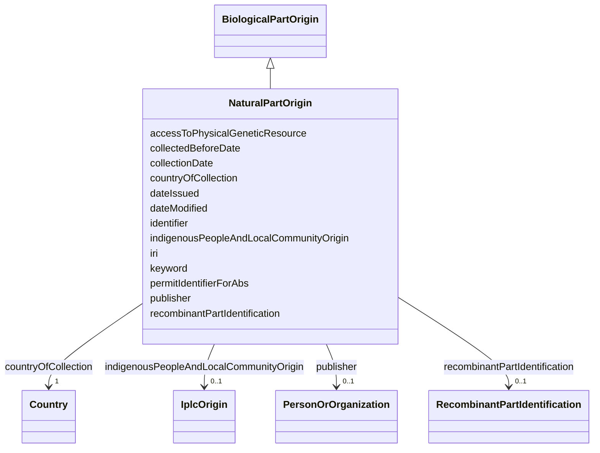

# Class: Natural part origin (NaturalPartOrigin) 


_Information on the origin of a natural part that composes the biological material._


URI: [EVORAO:NaturalPartOrigin](https://w3id.org/evorao/NaturalPartOrigin)





## Inheritance
* [Resource](Resource.md)
    * [BiologicalPartOrigin](BiologicalPartOrigin.md)
        * **NaturalPartOrigin**


## Slots

| Name | Cardinality and Range | Description | Inheritance |
| ---  | --- | --- | --- |
| [countryOfCollection](countryOfCollection.md) | 1 <br/> [Country](Country.md) | The geographical location where the sample was collected in situ | direct |
| [indigenousPeopleAndLocalCommunityOrigin](indigenousPeopleAndLocalCommunityOrigin.md) | 0..1 <br/> [IplcOrigin](IplcOrigin.md) | The specific IPLC area (Indigenous People and Local Communities) from which t... | direct |
| [collectionDate](collectionDate.md) | 1 <br/> [Datetime](Datetime.md) | The date when the sample was collected in situ | direct |
| [collectedBeforeDate](collectedBeforeDate.md) | 0..1 _recommended_ <br/> [Boolean](Boolean.md) | Set to TRUE if a proxy date for the collection date is used | direct |
| [permitIdentifierForAbs](permitIdentifierForAbs.md) | 0..1 <br/> [String](String.md) | Reference of the permit identifiers for access to the genetic resource, appli... | direct |
| [recombinantPartIdentification](recombinantPartIdentification.md) | 0..1 <br/> [RecombinantPartIdentification](RecombinantPartIdentification.md) | Identification of a recombinant part | [BiologicalPartOrigin](BiologicalPartOrigin.md) |
| [accessToPhysicalGeneticResource](accessToPhysicalGeneticResource.md) | 0..1 _recommended_ <br/> [Boolean](Boolean.md) | Indicate if the biological part was produced with access to a physical geneti... | [BiologicalPartOrigin](BiologicalPartOrigin.md) |
| [keyword](keyword.md) | * <br/> [String](String.md) | A keyword or tag describing the resource | [Resource](Resource.md) |
| [dateIssued](dateIssued.md) | 0..1 <br/> [Datetime](Datetime.md) | Date of formal issuance (e | [Resource](Resource.md) |
| [dateModified](dateModified.md) | 0..1 <br/> [Datetime](Datetime.md) | Most recent date on which the resource was changed, updated or modified | [Resource](Resource.md) |
| [identifier](identifier.md) | * <br/> [String](String.md) | A unique identifier of the resource being described or cataloged | [Resource](Resource.md) |
| [iri](iri.md) | * <br/> [Uri](Uri.md) | International Resource Identifier (IRI) that uniquely identifies or refers to... | [Resource](Resource.md) |
| [publisher](publisher.md) | 0..1 <br/> [PersonOrOrganization](PersonOrOrganization.md) | The entity responsible for making the resource available | [Resource](Resource.md) |


## Identifier and Mapping Information


### Schema Source


* from schema: https://w3id.org/evorao/


## Mappings

| Mapping Type | Mapped Value |
| ---  | ---  |
| self | EVORAO:NaturalPartOrigin |
| native | EVORAO:NaturalPartOrigin |
| broad | sepio:0000058, sepio:0000058 |
| related | ncit:C87913, ncit:C43581, ncit:C87913, ncit:C43581 |


## LinkML Source

<!-- TODO: investigate https://stackoverflow.com/questions/37606292/how-to-create-tabbed-code-blocks-in-mkdocs-or-sphinx -->

### Direct

<details>
```yaml
name: NaturalPartOrigin
description: Information on the origin of a natural part that composes the biological
  material.
title: Natural part origin
from_schema: https://w3id.org/evorao/
related_mappings:
- ncit:C87913
- ncit:C43581
- ncit:C87913
- ncit:C43581
broad_mappings:
- sepio:0000058
- sepio:0000058
is_a: BiologicalPartOrigin
slots:
- countryOfCollection
- indigenousPeopleAndLocalCommunityOrigin
- collectionDate
- collectedBeforeDate
- permitIdentifierForAbs
slot_usage:
  countryOfCollection:
    name: countryOfCollection
    description: The geographical location where the sample was collected in situ.
      Used for Nagoya/CBD; equivalent to 'country of origin'.
    title: country of collection
    close_mappings:
    - wdp:P495
    - hso:0000360
    - schema:countryOfOrigin
    related_mappings:
    - dwc:country
    - genepio:0000118
    broad_mappings:
    - dct:spatial
    domain_of:
    - NaturalPartOrigin
    range: Country
    required: true
    multivalued: false
  indigenousPeopleAndLocalCommunityOrigin:
    name: indigenousPeopleAndLocalCommunityOrigin
    description: The specific IPLC area (Indigenous People and Local Communities)
      from which this sample/element was sampled, if relevant.
    title: indigenous people and local community origin
    related_mappings:
    - mesh:D000081034
    - ncit:C41152
    domain_of:
    - NaturalPartOrigin
    range: IplcOrigin
    required: false
    multivalued: false
  collectionDate:
    name: collectionDate
    description: The date when the sample was collected in situ. If unknown/private,
      use a proxy date such as 'date received' and indicate this by setting to true
      the before date property.
    title: collection date
    related_mappings:
    - obib:0000714
    broad_mappings:
    - dct:date
    domain_of:
    - NaturalPartOrigin
    range: datetime
    required: true
    multivalued: false
  collectedBeforeDate:
    name: collectedBeforeDate
    description: Set to TRUE if a proxy date for the collection date is used.
    title: collected before date
    related_mappings:
    - sepio:0000105
    - ro:0002089
    ifabsent: 'false'
    domain_of:
    - NaturalPartOrigin
    range: boolean
    required: false
    recommended: true
    multivalued: false
  permitIdentifierForAbs:
    name: permitIdentifierForAbs
    description: Reference of the permit identifiers for access to the genetic resource,
      applicable if the genetic resource falls under Access and Benefit-Sharing (ABS)
      regulations.
    title: permit identifier for ABS
    domain_of:
    - NaturalPartOrigin
    required: false
    multivalued: false

```
</details>

### Induced

<details>
```yaml
name: NaturalPartOrigin
description: Information on the origin of a natural part that composes the biological
  material.
title: Natural part origin
from_schema: https://w3id.org/evorao/
related_mappings:
- ncit:C87913
- ncit:C43581
- ncit:C87913
- ncit:C43581
broad_mappings:
- sepio:0000058
- sepio:0000058
is_a: BiologicalPartOrigin
slot_usage:
  countryOfCollection:
    name: countryOfCollection
    description: The geographical location where the sample was collected in situ.
      Used for Nagoya/CBD; equivalent to 'country of origin'.
    title: country of collection
    close_mappings:
    - wdp:P495
    - hso:0000360
    - schema:countryOfOrigin
    related_mappings:
    - dwc:country
    - genepio:0000118
    broad_mappings:
    - dct:spatial
    domain_of:
    - NaturalPartOrigin
    range: Country
    required: true
    multivalued: false
  indigenousPeopleAndLocalCommunityOrigin:
    name: indigenousPeopleAndLocalCommunityOrigin
    description: The specific IPLC area (Indigenous People and Local Communities)
      from which this sample/element was sampled, if relevant.
    title: indigenous people and local community origin
    related_mappings:
    - mesh:D000081034
    - ncit:C41152
    domain_of:
    - NaturalPartOrigin
    range: IplcOrigin
    required: false
    multivalued: false
  collectionDate:
    name: collectionDate
    description: The date when the sample was collected in situ. If unknown/private,
      use a proxy date such as 'date received' and indicate this by setting to true
      the before date property.
    title: collection date
    related_mappings:
    - obib:0000714
    broad_mappings:
    - dct:date
    domain_of:
    - NaturalPartOrigin
    range: datetime
    required: true
    multivalued: false
  collectedBeforeDate:
    name: collectedBeforeDate
    description: Set to TRUE if a proxy date for the collection date is used.
    title: collected before date
    related_mappings:
    - sepio:0000105
    - ro:0002089
    ifabsent: 'false'
    domain_of:
    - NaturalPartOrigin
    range: boolean
    required: false
    recommended: true
    multivalued: false
  permitIdentifierForAbs:
    name: permitIdentifierForAbs
    description: Reference of the permit identifiers for access to the genetic resource,
      applicable if the genetic resource falls under Access and Benefit-Sharing (ABS)
      regulations.
    title: permit identifier for ABS
    domain_of:
    - NaturalPartOrigin
    required: false
    multivalued: false
attributes:
  countryOfCollection:
    name: countryOfCollection
    description: The geographical location where the sample was collected in situ.
      Used for Nagoya/CBD; equivalent to 'country of origin'.
    title: country of collection
    from_schema: https://w3id.org/evorao/
    close_mappings:
    - wdp:P495
    - hso:0000360
    - schema:countryOfOrigin
    related_mappings:
    - dwc:country
    - genepio:0000118
    broad_mappings:
    - dct:spatial
    rank: 1000
    alias: countryOfCollection
    owner: NaturalPartOrigin
    domain_of:
    - NaturalPartOrigin
    range: Country
    required: true
    multivalued: false
  indigenousPeopleAndLocalCommunityOrigin:
    name: indigenousPeopleAndLocalCommunityOrigin
    description: The specific IPLC area (Indigenous People and Local Communities)
      from which this sample/element was sampled, if relevant.
    title: indigenous people and local community origin
    from_schema: https://w3id.org/evorao/
    related_mappings:
    - mesh:D000081034
    - ncit:C41152
    rank: 1000
    alias: indigenousPeopleAndLocalCommunityOrigin
    owner: NaturalPartOrigin
    domain_of:
    - NaturalPartOrigin
    range: IplcOrigin
    required: false
    multivalued: false
  collectionDate:
    name: collectionDate
    description: The date when the sample was collected in situ. If unknown/private,
      use a proxy date such as 'date received' and indicate this by setting to true
      the before date property.
    title: collection date
    from_schema: https://w3id.org/evorao/
    related_mappings:
    - obib:0000714
    broad_mappings:
    - dct:date
    rank: 1000
    alias: collectionDate
    owner: NaturalPartOrigin
    domain_of:
    - NaturalPartOrigin
    range: datetime
    required: true
    multivalued: false
  collectedBeforeDate:
    name: collectedBeforeDate
    description: Set to TRUE if a proxy date for the collection date is used.
    title: collected before date
    from_schema: https://w3id.org/evorao/
    related_mappings:
    - sepio:0000105
    - ro:0002089
    rank: 1000
    ifabsent: 'false'
    alias: collectedBeforeDate
    owner: NaturalPartOrigin
    domain_of:
    - NaturalPartOrigin
    range: boolean
    required: false
    recommended: true
    multivalued: false
  permitIdentifierForAbs:
    name: permitIdentifierForAbs
    description: Reference of the permit identifiers for access to the genetic resource,
      applicable if the genetic resource falls under Access and Benefit-Sharing (ABS)
      regulations.
    title: permit identifier for ABS
    from_schema: https://w3id.org/evorao/
    rank: 1000
    alias: permitIdentifierForAbs
    owner: NaturalPartOrigin
    domain_of:
    - NaturalPartOrigin
    range: string
    required: false
    multivalued: false
  recombinantPartIdentification:
    name: recombinantPartIdentification
    description: Identification of a recombinant part.
    title: recombinant part identification
    comments:
    - Information not required if the current biological part constitutes the complete
      biological material.
    from_schema: https://w3id.org/evorao/
    rank: 1000
    alias: recombinantPartIdentification
    owner: NaturalPartOrigin
    domain_of:
    - BiologicalPartOrigin
    range: RecombinantPartIdentification
    required: false
    multivalued: false
  accessToPhysicalGeneticResource:
    name: accessToPhysicalGeneticResource
    description: Indicate if the biological part was produced with access to a physical
      genetic resource.
    title: access to physical genetic resource
    from_schema: https://w3id.org/evorao/
    rank: 1000
    alias: accessToPhysicalGeneticResource
    owner: NaturalPartOrigin
    domain_of:
    - BiologicalPartOrigin
    range: boolean
    required: false
    recommended: true
    multivalued: false
  keyword:
    name: keyword
    description: A keyword or tag describing the resource.
    title: keyword
    from_schema: https://w3id.org/evorao/
    rank: 1000
    slot_uri: dcat:keyword
    alias: keyword
    owner: NaturalPartOrigin
    domain_of:
    - Resource
    range: string
    required: false
    multivalued: true
  dateIssued:
    name: dateIssued
    description: Date of formal issuance (e.g., publication) of the resource.
    title: date issued
    comments:
    - encoded using the relevant ISO 8601 Date and Time compliant string [DATETIME].
    from_schema: https://w3id.org/evorao/
    exact_mappings:
    - sepio:0000051
    close_mappings:
    - schema:datePublished
    - schema:dateCreated
    rank: 1000
    slot_uri: dct:issued
    alias: dateIssued
    owner: NaturalPartOrigin
    domain_of:
    - Resource
    range: datetime
    required: false
    multivalued: false
  dateModified:
    name: dateModified
    description: Most recent date on which the resource was changed, updated or modified.
    title: date modified
    comments:
    - encoded using the relevant ISO 8601 Date and Time compliant string [DATETIME].
    from_schema: https://w3id.org/evorao/
    exact_mappings:
    - sepio:0000036
    close_mappings:
    - schema:dateModified
    rank: 1000
    slot_uri: dct:modified
    alias: dateModified
    owner: NaturalPartOrigin
    domain_of:
    - Resource
    range: datetime
    required: false
    multivalued: false
  identifier:
    name: identifier
    description: A unique identifier of the resource being described or cataloged.
    title: identifier
    comments:
    - The identifier is a text string which is assigned to the resource to provide
      an unambiguous reference within a particular context. Persistent identifiers
      should be provided as HTTP URIs.
    from_schema: https://w3id.org/evorao/
    exact_mappings:
    - schema:identifier
    rank: 1000
    slot_uri: dct:identifier
    alias: identifier
    owner: NaturalPartOrigin
    domain_of:
    - Resource
    range: string
    required: false
    multivalued: true
  iri:
    name: iri
    description: International Resource Identifier (IRI) that uniquely identifies
      or refers to the resource. IRIs include URIs, and URIs include URLs.
    title: IRI
    comments:
    - An IRI is a global identifier standardized by IETF RFC 3987. It may or may not
      be resolvable on the web. IRIs include URIs, and URIs include URLs.
    from_schema: https://w3id.org/evorao/
    close_mappings:
    - biolink:iri
    related_mappings:
    - mi:url
    narrow_mappings:
    - schema:url
    rank: 1000
    is_a: identifier
    alias: iri
    owner: NaturalPartOrigin
    domain_of:
    - Resource
    range: uri
    required: false
    multivalued: true
  publisher:
    name: publisher
    description: The entity responsible for making the resource available.
    title: publisher
    comments:
    - Resources of type foaf:Agent like EVORAO:PersonOrOrganization are recommended
      as values for this property.
    from_schema: https://w3id.org/evorao/
    rank: 1000
    slot_uri: dct:publisher
    alias: publisher
    owner: NaturalPartOrigin
    domain_of:
    - Resource
    range: PersonOrOrganization
    required: false
    multivalued: false

```
</details>