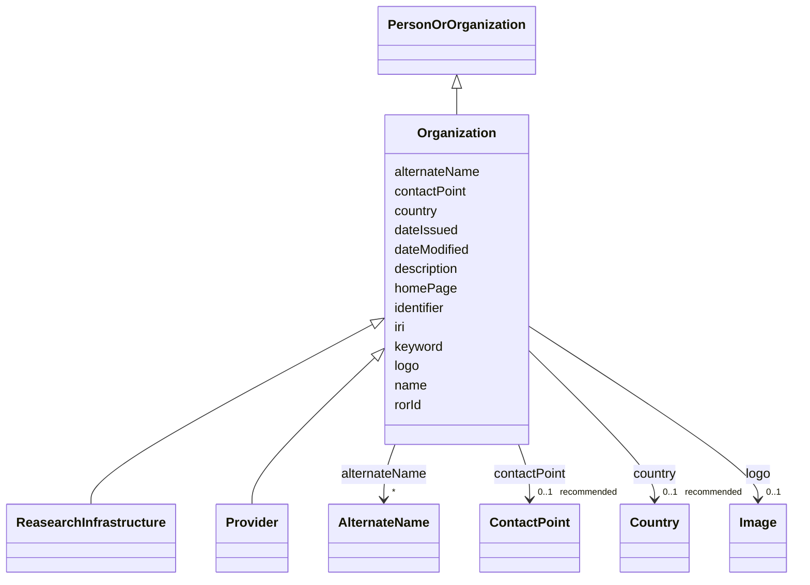

# Class: Organization (Organization) 


_A social entity established to meet needs or pursue specific goals._


URI: [foaf:Organization](http://xmlns.com/foaf/0.1/Organization)





## Inheritance
* [Resource](Resource.md)
    * [PersonOrOrganization](PersonOrOrganization.md)
        * **Organization**
            * [ReasearchInfrastructure](ReasearchInfrastructure.md)
            * [Provider](Provider.md)


## Slots

| Name | Cardinality and Range | Description | Inheritance |
| ---  | --- | --- | --- |
| [alternateName](alternateName.md) | * <br/> [AlternateName](AlternateName.md) | Any other name under which the entity can be known | direct |
| [country](country.md) | 0..1 _recommended_ <br/> [Country](Country.md) | The country of the organization | direct |
| [rorId](rorId.md) | 0..1 _recommended_ <br/> [String](String.md) | The corresponding organization's persistent identifier from the Research Orga... | direct |
| [name](name.md) | 1 <br/> [String](String.md) | A word or set of words used to identify and refer to an entity | [PersonOrOrganization](PersonOrOrganization.md) |
| [description](description.md) | 0..1 _recommended_ <br/> [String](String.md) | A short explanation of the characteristics, features, or nature of the curren... | [PersonOrOrganization](PersonOrOrganization.md) |
| [homePage](homePage.md) | 0..1 <br/> [Uri](Uri.md) | A web page that serves as the main or introductory page | [PersonOrOrganization](PersonOrOrganization.md) |
| [contactPoint](contactPoint.md) | 0..1 _recommended_ <br/> [ContactPoint](ContactPoint.md) | An information that allows someone to establish communication | [PersonOrOrganization](PersonOrOrganization.md) |
| [logo](logo.md) | 0..1 <br/> [Image](Image.md) | A path or URL to the related logo | [PersonOrOrganization](PersonOrOrganization.md) |
| [keyword](keyword.md) | * <br/> [String](String.md) | A keyword or tag describing the resource | [Resource](Resource.md) |
| [dateIssued](dateIssued.md) | 0..1 <br/> [Datetime](Datetime.md) | Date of formal issuance (e | [Resource](Resource.md) |
| [dateModified](dateModified.md) | 0..1 <br/> [Datetime](Datetime.md) | Most recent date on which the resource was changed, updated or modified | [Resource](Resource.md) |
| [identifier](identifier.md) | * <br/> [String](String.md) | A unique identifier of the resource being described or cataloged | [Resource](Resource.md) |
| [iri](iri.md) | * <br/> [Uri](Uri.md) | International Resource Identifier (IRI) that uniquely identifies or refers to... | [Resource](Resource.md) |


## Usages

| used by | used in | type | used |
| ---  | --- | --- | --- |
| [FundingSource](FundingSource.md) | [funder](funder.md) | range | [Organization](Organization.md) |


## Identifier and Mapping Information


### Schema Source


* from schema: https://w3id.org/evorao/


## Mappings

| Mapping Type | Mapped Value |
| ---  | ---  |
| self | foaf:Organization |
| native | EVORAO:Organization |
| exact | schema:Organization, vcard:Organization, schema:Organization, vcard:Organization |
| close | wd:Q43229, wd:Q43229 |


## LinkML Source

<!-- TODO: investigate https://stackoverflow.com/questions/37606292/how-to-create-tabbed-code-blocks-in-mkdocs-or-sphinx -->

### Direct

<details>
```yaml
name: Organization
description: A social entity established to meet needs or pursue specific goals.
title: Organization
from_schema: https://w3id.org/evorao/
exact_mappings:
- schema:Organization
- vcard:Organization
- schema:Organization
- vcard:Organization
close_mappings:
- wd:Q43229
- wd:Q43229
is_a: PersonOrOrganization
slots:
- alternateName
- country
- rorId
slot_usage:
  alternateName:
    name: alternateName
    description: Any other name under which the entity can be known.
    title: alternate name
    comments:
    - This includes previous names, acronyms, former taxonomic terms, and other variations.
    - This information can serve as keywords for search purposes and as a bridge with
      other projects that use different naming systems or taxonomies.
    exact_mappings:
    - schema:alternateName
    - dct:alternative
    - iao:0000118
    close_mappings:
    - wdp:P4970
    domain_of:
    - Organization
    - CommonName
    - AlternateName
    - Taxon
    - ClinicalGroup
    range: AlternateName
    required: false
    multivalued: true
  country:
    name: country
    description: The country of the organization.
    title: country
    domain_of:
    - Organization
    range: Country
    required: false
    recommended: true
    multivalued: false
  rorId:
    name: rorId
    description: The corresponding organization's persistent identifier from the Research
      Organization Registry (ROR).
    title: ROR iD
    exact_mappings:
    - wdp:P6782
    related_mappings:
    - dwc:institutionCode
    is_a: identifier
    domain_of:
    - Organization
    range: string
    required: false
    recommended: true
    multivalued: false
class_uri: foaf:Organization

```
</details>

### Induced

<details>
```yaml
name: Organization
description: A social entity established to meet needs or pursue specific goals.
title: Organization
from_schema: https://w3id.org/evorao/
exact_mappings:
- schema:Organization
- vcard:Organization
- schema:Organization
- vcard:Organization
close_mappings:
- wd:Q43229
- wd:Q43229
is_a: PersonOrOrganization
slot_usage:
  alternateName:
    name: alternateName
    description: Any other name under which the entity can be known.
    title: alternate name
    comments:
    - This includes previous names, acronyms, former taxonomic terms, and other variations.
    - This information can serve as keywords for search purposes and as a bridge with
      other projects that use different naming systems or taxonomies.
    exact_mappings:
    - schema:alternateName
    - dct:alternative
    - iao:0000118
    close_mappings:
    - wdp:P4970
    domain_of:
    - Organization
    - CommonName
    - AlternateName
    - Taxon
    - ClinicalGroup
    range: AlternateName
    required: false
    multivalued: true
  country:
    name: country
    description: The country of the organization.
    title: country
    domain_of:
    - Organization
    range: Country
    required: false
    recommended: true
    multivalued: false
  rorId:
    name: rorId
    description: The corresponding organization's persistent identifier from the Research
      Organization Registry (ROR).
    title: ROR iD
    exact_mappings:
    - wdp:P6782
    related_mappings:
    - dwc:institutionCode
    is_a: identifier
    domain_of:
    - Organization
    range: string
    required: false
    recommended: true
    multivalued: false
attributes:
  alternateName:
    name: alternateName
    description: Any other name under which the entity can be known.
    title: alternate name
    comments:
    - This includes previous names, acronyms, former taxonomic terms, and other variations.
    - This information can serve as keywords for search purposes and as a bridge with
      other projects that use different naming systems or taxonomies.
    from_schema: https://w3id.org/evorao/
    exact_mappings:
    - schema:alternateName
    - dct:alternative
    - iao:0000118
    close_mappings:
    - wdp:P4970
    rank: 1000
    alias: alternateName
    owner: Organization
    domain_of:
    - Organization
    - CommonName
    - AlternateName
    - Taxon
    - ClinicalGroup
    range: AlternateName
    required: false
    multivalued: true
  country:
    name: country
    description: The country of the organization.
    title: country
    from_schema: https://w3id.org/evorao/
    rank: 1000
    alias: country
    owner: Organization
    domain_of:
    - Organization
    range: Country
    required: false
    recommended: true
    multivalued: false
  rorId:
    name: rorId
    description: The corresponding organization's persistent identifier from the Research
      Organization Registry (ROR).
    title: ROR iD
    from_schema: https://w3id.org/evorao/
    exact_mappings:
    - wdp:P6782
    related_mappings:
    - dwc:institutionCode
    rank: 1000
    is_a: identifier
    alias: rorId
    owner: Organization
    domain_of:
    - Organization
    range: string
    required: false
    recommended: true
    multivalued: false
  name:
    name: name
    description: A word or set of words used to identify and refer to an entity.
    title: name
    from_schema: https://w3id.org/evorao/
    exact_mappings:
    - schema:name
    - vcard:fn
    close_mappings:
    - rdfs:label
    - dct:title
    rank: 1000
    slot_uri: foaf:name
    alias: name
    owner: Organization
    domain_of:
    - PersonOrOrganization
    - File
    - ContactPoint
    range: string
    required: true
    multivalued: false
  description:
    name: description
    description: A short explanation of the characteristics, features, or nature of
      the current item.
    title: description
    comments:
    - Describe this item in few lines. This description will serve as a summary to
      present the resource.
    from_schema: https://w3id.org/evorao/
    exact_mappings:
    - schema:description
    rank: 1000
    slot_uri: dct:description
    alias: description
    owner: Organization
    domain_of:
    - PersonOrOrganization
    - Dataset
    - DataService
    - Term
    - File
    - ContactPoint
    - License
    - Certification
    - FundingSource
    range: string
    required: false
    recommended: true
    multivalued: false
  homePage:
    name: homePage
    description: A web page that serves as the main or introductory page.
    title: home page
    from_schema: https://w3id.org/evorao/
    close_mappings:
    - swo:0004006
    rank: 1000
    slot_uri: foaf:homepage
    alias: homePage
    owner: Organization
    domain_of:
    - PersonOrOrganization
    range: uri
    required: false
    multivalued: false
  contactPoint:
    name: contactPoint
    description: An information that allows someone to establish communication.
    title: contact point
    from_schema: https://w3id.org/evorao/
    exact_mappings:
    - schema:contactPoint
    rank: 1000
    slot_uri: dcat:contactPoint
    alias: contactPoint
    owner: Organization
    domain_of:
    - PersonOrOrganization
    - ProductOrService
    range: ContactPoint
    required: false
    recommended: true
    multivalued: false
  logo:
    name: logo
    description: A path or URL to the related logo.
    title: logo
    from_schema: https://w3id.org/evorao/
    exact_mappings:
    - schema:logo
    rank: 1000
    alias: logo
    owner: Organization
    domain_of:
    - PersonOrOrganization
    - License
    - Certification
    - FundingSource
    range: Image
    required: false
    multivalued: false
  keyword:
    name: keyword
    description: A keyword or tag describing the resource.
    title: keyword
    from_schema: https://w3id.org/evorao/
    rank: 1000
    slot_uri: dcat:keyword
    alias: keyword
    owner: Organization
    domain_of:
    - Resource
    range: string
    required: false
    multivalued: true
  dateIssued:
    name: dateIssued
    description: Date of formal issuance (e.g., publication) of the resource.
    title: date issued
    comments:
    - encoded using the relevant ISO 8601 Date and Time compliant string [DATETIME].
    from_schema: https://w3id.org/evorao/
    exact_mappings:
    - sepio:0000051
    close_mappings:
    - schema:datePublished
    - schema:dateCreated
    rank: 1000
    slot_uri: dct:issued
    alias: dateIssued
    owner: Organization
    domain_of:
    - Resource
    range: datetime
    required: false
    multivalued: false
  dateModified:
    name: dateModified
    description: Most recent date on which the resource was changed, updated or modified.
    title: date modified
    comments:
    - encoded using the relevant ISO 8601 Date and Time compliant string [DATETIME].
    from_schema: https://w3id.org/evorao/
    exact_mappings:
    - sepio:0000036
    close_mappings:
    - schema:dateModified
    rank: 1000
    slot_uri: dct:modified
    alias: dateModified
    owner: Organization
    domain_of:
    - Resource
    range: datetime
    required: false
    multivalued: false
  identifier:
    name: identifier
    description: A unique identifier of the resource being described or cataloged.
    title: identifier
    comments:
    - The identifier is a text string which is assigned to the resource to provide
      an unambiguous reference within a particular context. Persistent identifiers
      should be provided as HTTP URIs.
    from_schema: https://w3id.org/evorao/
    exact_mappings:
    - schema:identifier
    rank: 1000
    slot_uri: dct:identifier
    alias: identifier
    owner: Organization
    domain_of:
    - Resource
    range: string
    required: false
    multivalued: true
  iri:
    name: iri
    description: International Resource Identifier (IRI) that uniquely identifies
      or refers to the resource. IRIs include URIs, and URIs include URLs.
    title: IRI
    comments:
    - An IRI is a global identifier standardized by IETF RFC 3987. It may or may not
      be resolvable on the web. IRIs include URIs, and URIs include URLs.
    from_schema: https://w3id.org/evorao/
    close_mappings:
    - biolink:iri
    related_mappings:
    - mi:url
    narrow_mappings:
    - schema:url
    rank: 1000
    is_a: identifier
    alias: iri
    owner: Organization
    domain_of:
    - Resource
    range: uri
    required: false
    multivalued: true
class_uri: foaf:Organization

```
</details>