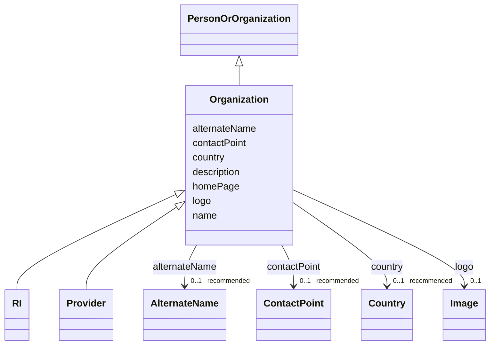

# Class: Organization (Organization)


_A social entity established to meet needs or pursue specific goals_


URI: [EVORAO:Organization](https://raw.githubusercontent.com/EVORA-project/evora-ontology/refs/heads/main/models/owl/evora_ontology.owl.ttl#Organization)





## Inheritance
* [Nameable](Nameable.md)
    * [PersonOrOrganization](PersonOrOrganization.md)
        * **Organization**
            * [RI](RI.md)
            * [Provider](Provider.md)


## Slots

| Name | Cardinality and Range | Description | Inheritance |
| ---  | --- | --- | --- |
| [alternateName](alternateName.md) | 0..1 _recommended_ <br/> [AlternateName](AlternateName.md) | An alternate name or acronym | direct |
| [country](country.md) | 0..1 _recommended_ <br/> [Country](Country.md) | The country of the organization | direct |
| [homePage](homePage.md) | 0..1 <br/> [String](String.md) | Refers to the degree of purity achieved for a protein sample | [PersonOrOrganization](PersonOrOrganization.md) |
| [contactPoint](contactPoint.md) | 0..1 _recommended_ <br/> [ContactPoint](ContactPoint.md) | An information that allows someone to establish communication | [PersonOrOrganization](PersonOrOrganization.md) |
| [logo](logo.md) | 0..1 <br/> [Image](Image.md) | A path or URL to the related logo | [PersonOrOrganization](PersonOrOrganization.md) |
| [name](name.md) | 1 <br/> [String](String.md) | The label that allows humans to identify the current item | [Nameable](Nameable.md) |
| [description](description.md) | 0..1 _recommended_ <br/> [String](String.md) | A short explanation of the characteristics, features, or nature of the curren... | [Nameable](Nameable.md) |


## Identifier and Mapping Information


### Schema Source


* from schema: https://raw.githubusercontent.com/EVORA-project/evora-ontology/refs/heads/main/models/owl/evora_ontology.owl.ttl#


## Mappings

| Mapping Type | Mapped Value |
| ---  | ---  |
| self | EVORAO:Organization |
| native | EVORAO:Organization |
| close | wd:Q43229, vcard:Organization |


## LinkML Source

<!-- TODO: investigate https://stackoverflow.com/questions/37606292/how-to-create-tabbed-code-blocks-in-mkdocs-or-sphinx -->

### Direct

<details>
```yaml
name: Organization
description: A social entity established to meet needs or pursue specific goals
title: Organization
from_schema: https://raw.githubusercontent.com/EVORA-project/evora-ontology/refs/heads/main/models/owl/evora_ontology.owl.ttl#
close_mappings:
- wd:Q43229
- vcard:Organization
is_a: PersonOrOrganization
slots:
- alternateName
- country
slot_usage:
  alternateName:
    name: alternateName
    description: An alternate name or acronym
    title: alternate name
    close_mappings:
    - dwc:institutionCode
    range: AlternateName
    required: false
    recommended: true
    multivalued: false
  country:
    name: country
    description: The country of the organization
    title: country
    range: Country
    required: false
    recommended: true
    multivalued: false

```
</details>

### Induced

<details>
```yaml
name: Organization
description: A social entity established to meet needs or pursue specific goals
title: Organization
from_schema: https://raw.githubusercontent.com/EVORA-project/evora-ontology/refs/heads/main/models/owl/evora_ontology.owl.ttl#
close_mappings:
- wd:Q43229
- vcard:Organization
is_a: PersonOrOrganization
slot_usage:
  alternateName:
    name: alternateName
    description: An alternate name or acronym
    title: alternate name
    close_mappings:
    - dwc:institutionCode
    range: AlternateName
    required: false
    recommended: true
    multivalued: false
  country:
    name: country
    description: The country of the organization
    title: country
    range: Country
    required: false
    recommended: true
    multivalued: false
attributes:
  alternateName:
    name: alternateName
    description: An alternate name or acronym
    title: alternate name
    from_schema: https://raw.githubusercontent.com/EVORA-project/evora-ontology/refs/heads/main/models/owl/evora_ontology.owl.ttl#
    close_mappings:
    - dwc:institutionCode
    rank: 1000
    alias: alternateName
    owner: Organization
    domain_of:
    - CommonName
    - AlternateName
    - Organization
    range: AlternateName
    required: false
    recommended: true
    multivalued: false
  country:
    name: country
    description: The country of the organization
    title: country
    from_schema: https://raw.githubusercontent.com/EVORA-project/evora-ontology/refs/heads/main/models/owl/evora_ontology.owl.ttl#
    rank: 1000
    alias: country
    owner: Organization
    domain_of:
    - Organization
    range: Country
    required: false
    recommended: true
    multivalued: false
  homePage:
    name: homePage
    description: Refers to the degree of purity achieved for a protein sample. Possible
      values include ">95%" (the protein is highly purified, with more than 95% purity)
      and "Unpurified expression host lysate or partly purified protein" (the protein
      is either unpurified and present in the host cell lysate or only partially purified).
    title: home page
    from_schema: https://raw.githubusercontent.com/EVORA-project/evora-ontology/refs/heads/main/models/owl/evora_ontology.owl.ttl#
    rank: 1000
    alias: homePage
    owner: Organization
    domain_of:
    - PersonOrOrganization
    range: string
    required: false
    multivalued: false
  contactPoint:
    name: contactPoint
    description: An information that allows someone to establish communication
    title: contact point
    from_schema: https://raw.githubusercontent.com/EVORA-project/evora-ontology/refs/heads/main/models/owl/evora_ontology.owl.ttl#
    exact_mappings:
    - dcat:contactPoint
    rank: 1000
    alias: contactPoint
    owner: Organization
    domain_of:
    - PersonOrOrganization
    - ProductOrService
    range: ContactPoint
    required: false
    recommended: true
    multivalued: false
  logo:
    name: logo
    description: A path or URL to the related logo
    title: logo
    from_schema: https://raw.githubusercontent.com/EVORA-project/evora-ontology/refs/heads/main/models/owl/evora_ontology.owl.ttl#
    rank: 1000
    alias: logo
    owner: Organization
    domain_of:
    - PersonOrOrganization
    - License
    - Certification
    range: Image
    required: false
    multivalued: false
  name:
    name: name
    description: The label that allows humans to identify the current item
    title: name
    comments:
    - 'The title of the item should be as short and descriptive as possible. E.g.
      for virus products it should basically be based on the following Pattern:

      "Virus name", "virus host type", "collection year", "country of collection"
      ex "suspected epidemiological origin", "genotype", "strain", "variant name or
      specific feature"'
    from_schema: https://raw.githubusercontent.com/EVORA-project/evora-ontology/refs/heads/main/models/owl/evora_ontology.owl.ttl#
    exact_mappings:
    - dct:title
    close_mappings:
    - rdfs:label
    rank: 1000
    alias: name
    owner: Organization
    domain_of:
    - Nameable
    range: string
    required: true
    multivalued: false
  description:
    name: description
    description: A short explanation of the characteristics, features, or nature of
      the current item
    title: description
    comments:
    - 'Describe this item in few lines. This description will serve as a summary to
      present the item.

      '
    from_schema: https://raw.githubusercontent.com/EVORA-project/evora-ontology/refs/heads/main/models/owl/evora_ontology.owl.ttl#
    exact_mappings:
    - dct:description
    rank: 1000
    alias: description
    owner: Organization
    domain_of:
    - Nameable
    range: string
    required: false
    recommended: true
    multivalued: false

```
</details>