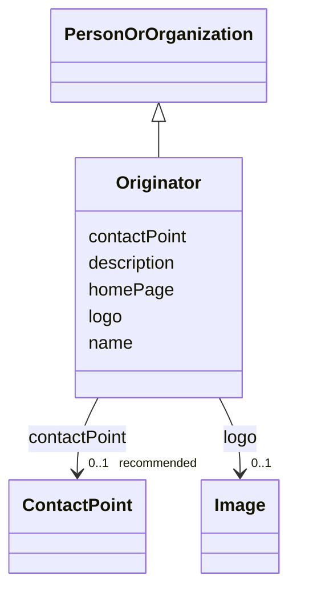

# Class: Originator (Originator)


_The individual or organization responsible for the original discovery, isolation, or creation of an item, providing information about the source or origin of the sample_


URI: [EVORAO:Originator](https://raw.githubusercontent.com/EVORA-project/evora-ontology/refs/heads/main/models/owl/evora_ontology.owl.ttl#Originator)





## Inheritance
* [Resource](Resource.md)
    * [PersonOrOrganization](PersonOrOrganization.md)
        * **Originator**


## Slots

| Name | Cardinality and Range | Description | Inheritance |
| ---  | --- | --- | --- |
| [name](name.md) | 1 <br/> [String](String.md) | The label that allows humans to identify the current item | [PersonOrOrganization](PersonOrOrganization.md) |
| [description](description.md) | 0..1 _recommended_ <br/> [String](String.md) | A short explanation of the characteristics, features, or nature of the curren... | [PersonOrOrganization](PersonOrOrganization.md) |
| [homePage](homePage.md) | 0..1 <br/> [Uri](Uri.md) | A web page that serves as the main or introductory page | [PersonOrOrganization](PersonOrOrganization.md) |
| [contactPoint](contactPoint.md) | 0..1 _recommended_ <br/> [ContactPoint](ContactPoint.md) | An information that allows someone to establish communication | [PersonOrOrganization](PersonOrOrganization.md) |
| [logo](logo.md) | 0..1 <br/> [Image](Image.md) | A path or URL to the related logo | [PersonOrOrganization](PersonOrOrganization.md) |


## Usages

| used by | used in | type | used |
| ---  | --- | --- | --- |
| [Product](Product.md) | [originator](originator.md) | range | [Originator](Originator.md) |
| [Antibody](Antibody.md) | [originator](originator.md) | range | [Originator](Originator.md) |
| [Hybridoma](Hybridoma.md) | [originator](originator.md) | range | [Originator](Originator.md) |
| [Protein](Protein.md) | [originator](originator.md) | range | [Originator](Originator.md) |
| [NucleicAcid](NucleicAcid.md) | [originator](originator.md) | range | [Originator](Originator.md) |
| [DetectionKit](DetectionKit.md) | [originator](originator.md) | range | [Originator](Originator.md) |
| [Bundle](Bundle.md) | [originator](originator.md) | range | [Originator](Originator.md) |
| [Pathogen](Pathogen.md) | [originator](originator.md) | range | [Originator](Originator.md) |
| [Virus](Virus.md) | [originator](originator.md) | range | [Originator](Originator.md) |
| [Bacterium](Bacterium.md) | [originator](originator.md) | range | [Originator](Originator.md) |
| [Fungus](Fungus.md) | [originator](originator.md) | range | [Originator](Originator.md) |
| [Protozoan](Protozoan.md) | [originator](originator.md) | range | [Originator](Originator.md) |
| [Viroid](Viroid.md) | [originator](originator.md) | range | [Originator](Originator.md) |
| [Prion](Prion.md) | [originator](originator.md) | range | [Originator](Originator.md) |


## Identifier and Mapping Information


### Schema Source


* from schema: https://raw.githubusercontent.com/EVORA-project/evora-ontology/refs/heads/main/models/owl/evora_ontology.owl.ttl#


## Mappings

| Mapping Type | Mapped Value |
| ---  | ---  |
| self | EVORAO:Originator |
| native | EVORAO:Originator |
| close | dct:ProvenanceStatement, dct:ProvenanceStatement |


## LinkML Source

<!-- TODO: investigate https://stackoverflow.com/questions/37606292/how-to-create-tabbed-code-blocks-in-mkdocs-or-sphinx -->

### Direct

<details>
```yaml
name: Originator
description: The individual or organization responsible for the original discovery,
  isolation, or creation of an item, providing information about the source or origin
  of the sample
title: Originator
from_schema: https://raw.githubusercontent.com/EVORA-project/evora-ontology/refs/heads/main/models/owl/evora_ontology.owl.ttl#
close_mappings:
- dct:ProvenanceStatement
- dct:ProvenanceStatement
is_a: PersonOrOrganization

```
</details>

### Induced

<details>
```yaml
name: Originator
description: The individual or organization responsible for the original discovery,
  isolation, or creation of an item, providing information about the source or origin
  of the sample
title: Originator
from_schema: https://raw.githubusercontent.com/EVORA-project/evora-ontology/refs/heads/main/models/owl/evora_ontology.owl.ttl#
close_mappings:
- dct:ProvenanceStatement
- dct:ProvenanceStatement
is_a: PersonOrOrganization
attributes:
  name:
    name: name
    description: The label that allows humans to identify the current item
    title: name
    comments:
    - 'The title of the item should be as short and descriptive as possible. E.g.
      for virus products it should basically be based on the following Pattern:

      ''Virus name'', ''virus host type'', ''collection year'', ''country of collection''
      ex ''suspected epidemiological origin'', ''genotype'', ''strain'', ''variant
      name or specific feature'
    from_schema: https://raw.githubusercontent.com/EVORA-project/evora-ontology/refs/heads/main/models/owl/evora_ontology.owl.ttl#
    exact_mappings:
    - dct:title
    close_mappings:
    - rdfs:label
    rank: 1000
    alias: name
    owner: Originator
    domain_of:
    - PersonOrOrganization
    - DataService
    - Catalogue
    - Term
    - ProductOrService
    - File
    - ContactPoint
    - License
    - Certification
    range: string
    required: true
    multivalued: false
  description:
    name: description
    description: A short explanation of the characteristics, features, or nature of
      the current item
    title: description
    comments:
    - 'Describe this item in few lines. This description will serve as a summary to
      present the item.

      '
    from_schema: https://raw.githubusercontent.com/EVORA-project/evora-ontology/refs/heads/main/models/owl/evora_ontology.owl.ttl#
    exact_mappings:
    - dct:description
    rank: 1000
    alias: description
    owner: Originator
    domain_of:
    - PersonOrOrganization
    - DataService
    - Catalogue
    - Term
    - ProductOrService
    - File
    - ContactPoint
    - License
    - Certification
    range: string
    required: false
    recommended: true
    multivalued: false
  homePage:
    name: homePage
    description: A web page that serves as the main or introductory page
    title: home page
    from_schema: https://raw.githubusercontent.com/EVORA-project/evora-ontology/refs/heads/main/models/owl/evora_ontology.owl.ttl#
    rank: 1000
    alias: homePage
    owner: Originator
    domain_of:
    - PersonOrOrganization
    range: uri
    required: false
    multivalued: false
  contactPoint:
    name: contactPoint
    description: An information that allows someone to establish communication
    title: contact point
    from_schema: https://raw.githubusercontent.com/EVORA-project/evora-ontology/refs/heads/main/models/owl/evora_ontology.owl.ttl#
    exact_mappings:
    - dcat:contactPoint
    rank: 1000
    alias: contactPoint
    owner: Originator
    domain_of:
    - PersonOrOrganization
    - ProductOrService
    range: ContactPoint
    required: false
    recommended: true
    multivalued: false
  logo:
    name: logo
    description: A path or URL to the related logo
    title: logo
    from_schema: https://raw.githubusercontent.com/EVORA-project/evora-ontology/refs/heads/main/models/owl/evora_ontology.owl.ttl#
    rank: 1000
    alias: logo
    owner: Originator
    domain_of:
    - PersonOrOrganization
    - License
    - Certification
    range: Image
    required: false
    multivalued: false

```
</details>