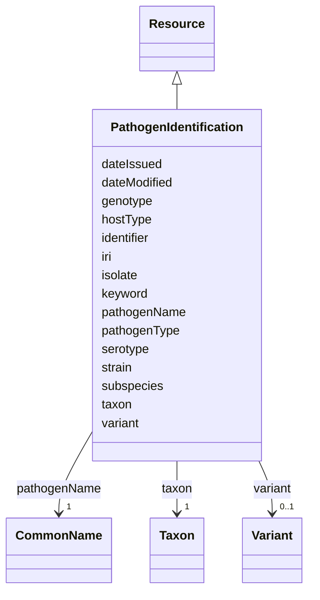

# Class: Pathogen identification (PathogenIdentification) 


_A collection of distinguishing information that enables the differentiation of a pathogen from another_


URI: [EVORAO:PathogenIdentification](https://w3id.org/evorao/PathogenIdentification)





## Inheritance
* [Resource](Resource.md)
    * **PathogenIdentification**


## Slots

| Name | Cardinality and Range | Description | Inheritance |
| ---  | --- | --- | --- |
| [taxon](taxon.md) | 1 <br/> [Taxon](Taxon.md) | Scientifically classified group or entity within the reference taxonomy | direct |
| [pathogenName](pathogenName.md) | 1 <br/> [CommonName](CommonName.md) | A pathogen common name or a name that describes a group of pathogens | direct |
| [pathogenType](pathogenType.md) | 1 <br/> [String](String.md) | Identification of the specific type of pathogen among the listed categories e | direct |
| [hostType](hostType.md) | * _recommended_ <br/> [String](String.md) | Indication of the possible host(s) for the identified pathogens among the lis... | direct |
| [subspecies](subspecies.md) | 0..1 <br/> [String](String.md) | The subspecies information differentiates closely related pathogens within a ... | direct |
| [strain](strain.md) | 0..1 _recommended_ <br/> [String](String.md) | Identifier given to a genetic variant within a single species | direct |
| [isolate](isolate.md) | 0..1 <br/> [String](String.md) | Identifier given to a pathogen that has been isolated from an infected host a... | direct |
| [genotype](genotype.md) | 0..1 <br/> [String](String.md) | Genotype information that identifies organisms that cluster in phylogenetic t... | direct |
| [serotype](serotype.md) | 0..1 <br/> [String](String.md) | Genetically related pathogens that group together based on serological relati... | direct |
| [variant](variant.md) | 0..1 <br/> [Variant](Variant.md) | An organism with one or more new mutations is referred to as a “variant” of t... | direct |
| [keyword](keyword.md) | * <br/> [String](String.md) | A keyword or tag describing the resource | [Resource](Resource.md) |
| [dateIssued](dateIssued.md) | 0..1 <br/> [Datetime](Datetime.md) | Date of formal issuance (e | [Resource](Resource.md) |
| [dateModified](dateModified.md) | 0..1 <br/> [Datetime](Datetime.md) | Most recent date on which the resource was changed, updated or modified | [Resource](Resource.md) |
| [identifier](identifier.md) | * <br/> [String](String.md) | A unique identifier of the resource being described or cataloged | [Resource](Resource.md) |
| [iri](iri.md) | * <br/> [Uri](Uri.md) | International Resource Identifier (IRI) that uniquely identifies or refers to... | [Resource](Resource.md) |


## Usages

| used by | used in | type | used |
| ---  | --- | --- | --- |
| [ProductOrService](ProductOrService.md) | [pathogenIdentification](pathogenIdentification.md) | range | [PathogenIdentification](PathogenIdentification.md) |
| [Service](Service.md) | [pathogenIdentification](pathogenIdentification.md) | range | [PathogenIdentification](PathogenIdentification.md) |
| [Product](Product.md) | [pathogenIdentification](pathogenIdentification.md) | range | [PathogenIdentification](PathogenIdentification.md) |
| [Antibody](Antibody.md) | [pathogenIdentification](pathogenIdentification.md) | range | [PathogenIdentification](PathogenIdentification.md) |
| [Hybridoma](Hybridoma.md) | [pathogenIdentification](pathogenIdentification.md) | range | [PathogenIdentification](PathogenIdentification.md) |
| [Protein](Protein.md) | [pathogenIdentification](pathogenIdentification.md) | range | [PathogenIdentification](PathogenIdentification.md) |
| [NucleicAcid](NucleicAcid.md) | [pathogenIdentification](pathogenIdentification.md) | range | [PathogenIdentification](PathogenIdentification.md) |
| [DetectionKit](DetectionKit.md) | [pathogenIdentification](pathogenIdentification.md) | range | [PathogenIdentification](PathogenIdentification.md) |
| [Bundle](Bundle.md) | [pathogenIdentification](pathogenIdentification.md) | range | [PathogenIdentification](PathogenIdentification.md) |
| [Pathogen](Pathogen.md) | [pathogenIdentification](pathogenIdentification.md) | range | [PathogenIdentification](PathogenIdentification.md) |
| [Virus](Virus.md) | [pathogenIdentification](pathogenIdentification.md) | range | [PathogenIdentification](PathogenIdentification.md) |
| [Bacterium](Bacterium.md) | [pathogenIdentification](pathogenIdentification.md) | range | [PathogenIdentification](PathogenIdentification.md) |
| [Fungus](Fungus.md) | [pathogenIdentification](pathogenIdentification.md) | range | [PathogenIdentification](PathogenIdentification.md) |
| [Protozoan](Protozoan.md) | [pathogenIdentification](pathogenIdentification.md) | range | [PathogenIdentification](PathogenIdentification.md) |
| [Viroid](Viroid.md) | [pathogenIdentification](pathogenIdentification.md) | range | [PathogenIdentification](PathogenIdentification.md) |
| [Prion](Prion.md) | [pathogenIdentification](pathogenIdentification.md) | range | [PathogenIdentification](PathogenIdentification.md) |


## Identifier and Mapping Information


### Schema Source


* from schema: https://w3id.org/evorao/


## Mappings

| Mapping Type | Mapped Value |
| ---  | ---  |
| self | EVORAO:PathogenIdentification |
| native | EVORAO:PathogenIdentification |
| broad | dwc:Identification, dwc:Identification |


## LinkML Source

<!-- TODO: investigate https://stackoverflow.com/questions/37606292/how-to-create-tabbed-code-blocks-in-mkdocs-or-sphinx -->

### Direct

<details>
```yaml
name: PathogenIdentification
description: A collection of distinguishing information that enables the differentiation
  of a pathogen from another
title: Pathogen identification
from_schema: https://w3id.org/evorao/
broad_mappings:
- dwc:Identification
- dwc:Identification
is_a: Resource
slots:
- taxon
- pathogenName
- pathogenType
- hostType
- subspecies
- strain
- isolate
- genotype
- serotype
- variant
slot_usage:
  taxon:
    name: taxon
    description: Scientifically classified group or entity within the reference taxonomy
    title: taxon
    comments:
    - The taxon of the highest rank known that can be used to classify a pathogen
      or group of pathogens (e.g viruses) in the reference taxonomy
    close_mappings:
    - schema:taxonomicRange
    - dwc:taxonID
    - dwc:toTaxon
    related_mappings:
    - dwc:Taxon
    domain_of:
    - PathogenIdentification
    - Taxonomy
    - ClinicalGroup
    range: Taxon
    required: true
    multivalued: false
  pathogenName:
    name: pathogenName
    description: A pathogen common name or a name that describes a group of pathogens
    title: pathogen name
    exact_mappings:
    - dwc:organismName
    domain_of:
    - PathogenIdentification
    range: CommonName
    required: true
    multivalued: false
  pathogenType:
    name: pathogenType
    description: Identification of the specific type of pathogen among the listed
      categories e.g. 'Virus','Viroid','Bacterium'...
    title: pathogen type
    exact_mappings:
    - schema:infectiousAgentClass
    close_mappings:
    - dwc:organismScope
    domain_of:
    - PathogenIdentification
    range: string
    required: true
    multivalued: false
  hostType:
    name: hostType
    description: Indication of the possible host(s) for the identified pathogens among
      the listed main categories
    title: host type
    domain_of:
    - PathogenIdentification
    range: string
    required: false
    recommended: true
    multivalued: true
  subspecies:
    name: subspecies
    description: The subspecies information differentiates closely related pathogens
      within a single species
    title: subspecies
    domain_of:
    - PathogenIdentification
    range: string
    required: false
    multivalued: false
  strain:
    name: strain
    description: Identifier given to a genetic variant within a single species
    title: strain
    domain_of:
    - PathogenIdentification
    range: string
    required: false
    recommended: true
    multivalued: false
  isolate:
    name: isolate
    description: Identifier given to a pathogen that has been isolated from an infected
      host and propagated in a laboratory culture. The isolate information may include
      an internal reference code from the laboratory that took the sample or performed
      the isolation, as well as details about the specific conditions of isolation,
      such as the name of the town, hospital, and type of host
    title: isolate
    domain_of:
    - PathogenIdentification
    range: string
    required: false
    multivalued: false
  genotype:
    name: genotype
    description: Genotype information that identifies organisms that cluster in phylogenetic
      trees, thus different clusters are distinct genotypes
    title: genotype
    close_mappings:
    - geno:0000222
    domain_of:
    - PathogenIdentification
    range: string
    required: false
    multivalued: false
  serotype:
    name: serotype
    description: Genetically related pathogens that group together based on serological
      relationships
    title: serotype
    domain_of:
    - PathogenIdentification
    range: string
    required: false
    multivalued: false
  variant:
    name: variant
    description: An organism with one or more new mutations is referred to as a “variant”
      of the original organism if not sufficiently different to be termed a distinct
      strain
    title: variant
    domain_of:
    - PathogenIdentification
    range: Variant
    required: false
    multivalued: false

```
</details>

### Induced

<details>
```yaml
name: PathogenIdentification
description: A collection of distinguishing information that enables the differentiation
  of a pathogen from another
title: Pathogen identification
from_schema: https://w3id.org/evorao/
broad_mappings:
- dwc:Identification
- dwc:Identification
is_a: Resource
slot_usage:
  taxon:
    name: taxon
    description: Scientifically classified group or entity within the reference taxonomy
    title: taxon
    comments:
    - The taxon of the highest rank known that can be used to classify a pathogen
      or group of pathogens (e.g viruses) in the reference taxonomy
    close_mappings:
    - schema:taxonomicRange
    - dwc:taxonID
    - dwc:toTaxon
    related_mappings:
    - dwc:Taxon
    domain_of:
    - PathogenIdentification
    - Taxonomy
    - ClinicalGroup
    range: Taxon
    required: true
    multivalued: false
  pathogenName:
    name: pathogenName
    description: A pathogen common name or a name that describes a group of pathogens
    title: pathogen name
    exact_mappings:
    - dwc:organismName
    domain_of:
    - PathogenIdentification
    range: CommonName
    required: true
    multivalued: false
  pathogenType:
    name: pathogenType
    description: Identification of the specific type of pathogen among the listed
      categories e.g. 'Virus','Viroid','Bacterium'...
    title: pathogen type
    exact_mappings:
    - schema:infectiousAgentClass
    close_mappings:
    - dwc:organismScope
    domain_of:
    - PathogenIdentification
    range: string
    required: true
    multivalued: false
  hostType:
    name: hostType
    description: Indication of the possible host(s) for the identified pathogens among
      the listed main categories
    title: host type
    domain_of:
    - PathogenIdentification
    range: string
    required: false
    recommended: true
    multivalued: true
  subspecies:
    name: subspecies
    description: The subspecies information differentiates closely related pathogens
      within a single species
    title: subspecies
    domain_of:
    - PathogenIdentification
    range: string
    required: false
    multivalued: false
  strain:
    name: strain
    description: Identifier given to a genetic variant within a single species
    title: strain
    domain_of:
    - PathogenIdentification
    range: string
    required: false
    recommended: true
    multivalued: false
  isolate:
    name: isolate
    description: Identifier given to a pathogen that has been isolated from an infected
      host and propagated in a laboratory culture. The isolate information may include
      an internal reference code from the laboratory that took the sample or performed
      the isolation, as well as details about the specific conditions of isolation,
      such as the name of the town, hospital, and type of host
    title: isolate
    domain_of:
    - PathogenIdentification
    range: string
    required: false
    multivalued: false
  genotype:
    name: genotype
    description: Genotype information that identifies organisms that cluster in phylogenetic
      trees, thus different clusters are distinct genotypes
    title: genotype
    close_mappings:
    - geno:0000222
    domain_of:
    - PathogenIdentification
    range: string
    required: false
    multivalued: false
  serotype:
    name: serotype
    description: Genetically related pathogens that group together based on serological
      relationships
    title: serotype
    domain_of:
    - PathogenIdentification
    range: string
    required: false
    multivalued: false
  variant:
    name: variant
    description: An organism with one or more new mutations is referred to as a “variant”
      of the original organism if not sufficiently different to be termed a distinct
      strain
    title: variant
    domain_of:
    - PathogenIdentification
    range: Variant
    required: false
    multivalued: false
attributes:
  taxon:
    name: taxon
    description: Scientifically classified group or entity within the reference taxonomy
    title: taxon
    comments:
    - The taxon of the highest rank known that can be used to classify a pathogen
      or group of pathogens (e.g viruses) in the reference taxonomy
    from_schema: https://w3id.org/evorao/
    close_mappings:
    - schema:taxonomicRange
    - dwc:taxonID
    - dwc:toTaxon
    related_mappings:
    - dwc:Taxon
    rank: 1000
    alias: taxon
    owner: PathogenIdentification
    domain_of:
    - PathogenIdentification
    - Taxonomy
    - ClinicalGroup
    range: Taxon
    required: true
    multivalued: false
  pathogenName:
    name: pathogenName
    description: A pathogen common name or a name that describes a group of pathogens
    title: pathogen name
    from_schema: https://w3id.org/evorao/
    exact_mappings:
    - dwc:organismName
    rank: 1000
    alias: pathogenName
    owner: PathogenIdentification
    domain_of:
    - PathogenIdentification
    range: CommonName
    required: true
    multivalued: false
  pathogenType:
    name: pathogenType
    description: Identification of the specific type of pathogen among the listed
      categories e.g. 'Virus','Viroid','Bacterium'...
    title: pathogen type
    from_schema: https://w3id.org/evorao/
    exact_mappings:
    - schema:infectiousAgentClass
    close_mappings:
    - dwc:organismScope
    rank: 1000
    alias: pathogenType
    owner: PathogenIdentification
    domain_of:
    - PathogenIdentification
    range: string
    required: true
    multivalued: false
    equals_string_in:
    - Virus
    - Bacterium
    - Fungus
    - Protozoan
    - Viroid
    - Prion
  hostType:
    name: hostType
    description: Indication of the possible host(s) for the identified pathogens among
      the listed main categories
    title: host type
    from_schema: https://w3id.org/evorao/
    rank: 1000
    alias: hostType
    owner: PathogenIdentification
    domain_of:
    - PathogenIdentification
    range: string
    required: false
    recommended: true
    multivalued: true
    equals_string_in:
    - Animal
    - Human
    - Plant
  subspecies:
    name: subspecies
    description: The subspecies information differentiates closely related pathogens
      within a single species
    title: subspecies
    from_schema: https://w3id.org/evorao/
    rank: 1000
    alias: subspecies
    owner: PathogenIdentification
    domain_of:
    - PathogenIdentification
    range: string
    required: false
    multivalued: false
  strain:
    name: strain
    description: Identifier given to a genetic variant within a single species
    title: strain
    from_schema: https://w3id.org/evorao/
    rank: 1000
    alias: strain
    owner: PathogenIdentification
    domain_of:
    - PathogenIdentification
    range: string
    required: false
    recommended: true
    multivalued: false
  isolate:
    name: isolate
    description: Identifier given to a pathogen that has been isolated from an infected
      host and propagated in a laboratory culture. The isolate information may include
      an internal reference code from the laboratory that took the sample or performed
      the isolation, as well as details about the specific conditions of isolation,
      such as the name of the town, hospital, and type of host
    title: isolate
    from_schema: https://w3id.org/evorao/
    rank: 1000
    alias: isolate
    owner: PathogenIdentification
    domain_of:
    - PathogenIdentification
    range: string
    required: false
    multivalued: false
  genotype:
    name: genotype
    description: Genotype information that identifies organisms that cluster in phylogenetic
      trees, thus different clusters are distinct genotypes
    title: genotype
    from_schema: https://w3id.org/evorao/
    close_mappings:
    - geno:0000222
    rank: 1000
    alias: genotype
    owner: PathogenIdentification
    domain_of:
    - PathogenIdentification
    range: string
    required: false
    multivalued: false
  serotype:
    name: serotype
    description: Genetically related pathogens that group together based on serological
      relationships
    title: serotype
    from_schema: https://w3id.org/evorao/
    rank: 1000
    alias: serotype
    owner: PathogenIdentification
    domain_of:
    - PathogenIdentification
    range: string
    required: false
    multivalued: false
  variant:
    name: variant
    description: An organism with one or more new mutations is referred to as a “variant”
      of the original organism if not sufficiently different to be termed a distinct
      strain
    title: variant
    from_schema: https://w3id.org/evorao/
    rank: 1000
    alias: variant
    owner: PathogenIdentification
    domain_of:
    - PathogenIdentification
    range: Variant
    required: false
    multivalued: false
  keyword:
    name: keyword
    description: A keyword or tag describing the resource
    title: keyword
    from_schema: https://w3id.org/evorao/
    rank: 1000
    slot_uri: dcat:keyword
    alias: keyword
    owner: PathogenIdentification
    domain_of:
    - Resource
    range: string
    required: false
    multivalued: true
  dateIssued:
    name: dateIssued
    description: Date of formal issuance (e.g., publication) of the resource
    title: date issued
    comments:
    - encoded using the relevant ISO 8601 Date and Time compliant string [DATETIME]
    from_schema: https://w3id.org/evorao/
    exact_mappings:
    - sepio:0000051
    close_mappings:
    - schema:datePublished
    - schema:dateCreated
    rank: 1000
    slot_uri: dct:issued
    alias: dateIssued
    owner: PathogenIdentification
    domain_of:
    - Resource
    range: datetime
    required: false
    multivalued: false
  dateModified:
    name: dateModified
    description: Most recent date on which the resource was changed, updated or modified
    title: date modified
    comments:
    - encoded using the relevant ISO 8601 Date and Time compliant string [DATETIME]
    from_schema: https://w3id.org/evorao/
    exact_mappings:
    - sepio:0000036
    close_mappings:
    - schema:dateModified
    rank: 1000
    slot_uri: dct:modified
    alias: dateModified
    owner: PathogenIdentification
    domain_of:
    - Resource
    range: datetime
    required: false
    multivalued: false
  identifier:
    name: identifier
    description: A unique identifier of the resource being described or cataloged
    title: identifier
    comments:
    - The identifier is a text string which is assigned to the resource to provide
      an unambiguous reference within a particular context. Persistent identifiers
      should be provided as HTTP URIs
    from_schema: https://w3id.org/evorao/
    exact_mappings:
    - schema:identifier
    rank: 1000
    slot_uri: dct:identifier
    alias: identifier
    owner: PathogenIdentification
    domain_of:
    - Resource
    range: string
    required: false
    multivalued: true
  iri:
    name: iri
    description: International Resource Identifier (IRI) that uniquely identifies
      or refers to the resource. IRIs include URIs, and URIs include URLs
    title: IRI
    comments:
    - An IRI is a global identifier standardized by IETF RFC 3987. It may or may not
      be resolvable on the web. IRIs include URIs, and URIs include URLs
    from_schema: https://w3id.org/evorao/
    rank: 1000
    is_a: identifier
    alias: iri
    owner: PathogenIdentification
    domain_of:
    - Resource
    range: uri
    required: false
    multivalued: true

```
</details>