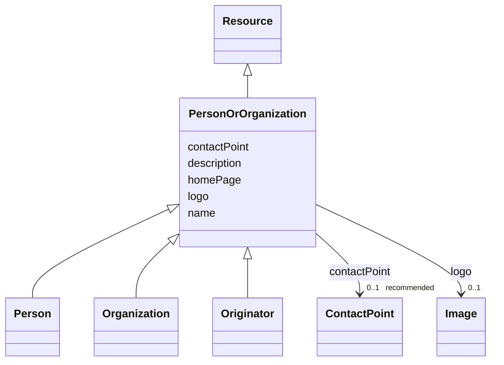

# Class: Person Or Organization (PersonOrOrganization) 


_A person or an organization_


URI: [foaf:Agent](http://xmlns.com/foaf/0.1/Agent)





## Inheritance
* [Resource](Resource.md)
    * **PersonOrOrganization**
        * [Person](Person.md)
        * [Organization](Organization.md)
        * [Originator](Originator.md)


## Slots

| Name | Cardinality and Range | Description | Inheritance |
| ---  | --- | --- | --- |
| [name](name.md) | 1 <br/> [String](String.md) | A word or set of words used to identify and refer to an entity | direct |
| [description](description.md) | 0..1 _recommended_ <br/> [String](String.md) | A short explanation of the characteristics, features, or nature of the curren... | direct |
| [homePage](homePage.md) | 0..1 <br/> [Uri](Uri.md) | A web page that serves as the main or introductory page | direct |
| [contactPoint](contactPoint.md) | 0..1 _recommended_ <br/> [ContactPoint](ContactPoint.md) | An information that allows someone to establish communication | direct |
| [logo](logo.md) | 0..1 <br/> [Image](Image.md) | A path or URL to the related logo | direct |


## Identifier and Mapping Information


### Schema Source


* from schema: https://w3id.org/evorao/


## Mappings

| Mapping Type | Mapped Value |
| ---  | ---  |
| self | foaf:Agent |
| native | EVORAO:PersonOrOrganization |
| exact | dct:Agent, dct:Agent |
| close | vcard:Agent, vcard:Agent |


## LinkML Source

<!-- TODO: investigate https://stackoverflow.com/questions/37606292/how-to-create-tabbed-code-blocks-in-mkdocs-or-sphinx -->

### Direct

<details>
```yaml
name: PersonOrOrganization
description: A person or an organization
title: Person Or Organization
from_schema: https://w3id.org/evorao/
exact_mappings:
- dct:Agent
- dct:Agent
close_mappings:
- vcard:Agent
- vcard:Agent
is_a: Resource
slots:
- name
- description
- homePage
- contactPoint
- logo
slot_usage:
  name:
    name: name
    description: A word or set of words used to identify and refer to an entity
    title: name
    exact_mappings:
    - schema:name
    close_mappings:
    - foaf:name
    - dct:title
    domain_of:
    - PersonOrOrganization
    - File
    - ContactPoint
    range: string
    required: true
    multivalued: false
  description:
    name: description
    description: A short explanation of the characteristics, features, or nature of
      the current item
    title: description
    comments:
    - 'Describe this item in few lines. This description will serve as a summary to
      present the resource.

      '
    slot_uri: dct:description
    domain_of:
    - PersonOrOrganization
    - Dataset
    - DataService
    - Term
    - File
    - ContactPoint
    - License
    - Certification
    range: string
    required: false
    recommended: true
    multivalued: false
  homePage:
    name: homePage
    description: A web page that serves as the main or introductory page
    title: home page
    domain_of:
    - PersonOrOrganization
    range: uri
    required: false
    multivalued: false
  contactPoint:
    name: contactPoint
    description: An information that allows someone to establish communication
    title: contact point
    exact_mappings:
    - dcat:contactPoint
    domain_of:
    - PersonOrOrganization
    - ProductOrService
    range: ContactPoint
    required: false
    recommended: true
    multivalued: false
  logo:
    name: logo
    description: A path or URL to the related logo
    title: logo
    domain_of:
    - PersonOrOrganization
    - License
    - Certification
    range: Image
    required: false
    multivalued: false
class_uri: foaf:Agent

```
</details>

### Induced

<details>
```yaml
name: PersonOrOrganization
description: A person or an organization
title: Person Or Organization
from_schema: https://w3id.org/evorao/
exact_mappings:
- dct:Agent
- dct:Agent
close_mappings:
- vcard:Agent
- vcard:Agent
is_a: Resource
slot_usage:
  name:
    name: name
    description: A word or set of words used to identify and refer to an entity
    title: name
    exact_mappings:
    - schema:name
    close_mappings:
    - foaf:name
    - dct:title
    domain_of:
    - PersonOrOrganization
    - File
    - ContactPoint
    range: string
    required: true
    multivalued: false
  description:
    name: description
    description: A short explanation of the characteristics, features, or nature of
      the current item
    title: description
    comments:
    - 'Describe this item in few lines. This description will serve as a summary to
      present the resource.

      '
    slot_uri: dct:description
    domain_of:
    - PersonOrOrganization
    - Dataset
    - DataService
    - Term
    - File
    - ContactPoint
    - License
    - Certification
    range: string
    required: false
    recommended: true
    multivalued: false
  homePage:
    name: homePage
    description: A web page that serves as the main or introductory page
    title: home page
    domain_of:
    - PersonOrOrganization
    range: uri
    required: false
    multivalued: false
  contactPoint:
    name: contactPoint
    description: An information that allows someone to establish communication
    title: contact point
    exact_mappings:
    - dcat:contactPoint
    domain_of:
    - PersonOrOrganization
    - ProductOrService
    range: ContactPoint
    required: false
    recommended: true
    multivalued: false
  logo:
    name: logo
    description: A path or URL to the related logo
    title: logo
    domain_of:
    - PersonOrOrganization
    - License
    - Certification
    range: Image
    required: false
    multivalued: false
attributes:
  name:
    name: name
    description: A word or set of words used to identify and refer to an entity
    title: name
    from_schema: https://w3id.org/evorao/
    exact_mappings:
    - schema:name
    close_mappings:
    - foaf:name
    - dct:title
    rank: 1000
    alias: name
    owner: PersonOrOrganization
    domain_of:
    - PersonOrOrganization
    - File
    - ContactPoint
    range: string
    required: true
    multivalued: false
  description:
    name: description
    description: A short explanation of the characteristics, features, or nature of
      the current item
    title: description
    comments:
    - 'Describe this item in few lines. This description will serve as a summary to
      present the resource.

      '
    from_schema: https://w3id.org/evorao/
    rank: 1000
    slot_uri: dct:description
    alias: description
    owner: PersonOrOrganization
    domain_of:
    - PersonOrOrganization
    - Dataset
    - DataService
    - Term
    - File
    - ContactPoint
    - License
    - Certification
    range: string
    required: false
    recommended: true
    multivalued: false
  homePage:
    name: homePage
    description: A web page that serves as the main or introductory page
    title: home page
    from_schema: https://w3id.org/evorao/
    rank: 1000
    alias: homePage
    owner: PersonOrOrganization
    domain_of:
    - PersonOrOrganization
    range: uri
    required: false
    multivalued: false
  contactPoint:
    name: contactPoint
    description: An information that allows someone to establish communication
    title: contact point
    from_schema: https://w3id.org/evorao/
    exact_mappings:
    - dcat:contactPoint
    rank: 1000
    alias: contactPoint
    owner: PersonOrOrganization
    domain_of:
    - PersonOrOrganization
    - ProductOrService
    range: ContactPoint
    required: false
    recommended: true
    multivalued: false
  logo:
    name: logo
    description: A path or URL to the related logo
    title: logo
    from_schema: https://w3id.org/evorao/
    rank: 1000
    alias: logo
    owner: PersonOrOrganization
    domain_of:
    - PersonOrOrganization
    - License
    - Certification
    range: Image
    required: false
    multivalued: false
class_uri: foaf:Agent

```
</details>