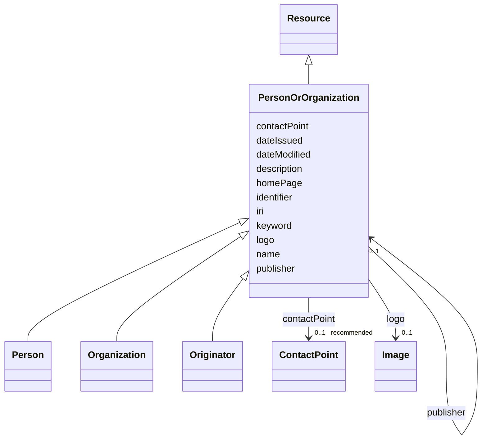

# Class: Person or organization (PersonOrOrganization) 


_A person or an organization._


URI: [foaf:Agent](http://xmlns.com/foaf/0.1/Agent)





## Inheritance
* [Resource](Resource.md)
    * **PersonOrOrganization**
        * [Person](Person.md)
        * [Organization](Organization.md)
        * [Originator](Originator.md)


## Slots

| Name | Cardinality and Range | Description | Inheritance |
| ---  | --- | --- | --- |
| [name](name.md) | 1 <br/> [String](String.md) | A word or set of words used to identify and refer to an entity | direct |
| [description](description.md) | 0..1 _recommended_ <br/> [String](String.md) | A short explanation of the characteristics, features, or nature of the curren... | direct |
| [homePage](homePage.md) | 0..1 <br/> [Uri](Uri.md) | A web page that serves as the main or introductory page | direct |
| [contactPoint](contactPoint.md) | 0..1 _recommended_ <br/> [ContactPoint](ContactPoint.md) | An information that allows someone to establish communication | direct |
| [logo](logo.md) | 0..1 <br/> [Image](Image.md) | A path or URL to the related logo | direct |
| [keyword](keyword.md) | * <br/> [String](String.md) | A keyword or tag describing the resource | [Resource](Resource.md) |
| [dateIssued](dateIssued.md) | 0..1 <br/> [Datetime](Datetime.md) | Date of formal issuance (e | [Resource](Resource.md) |
| [dateModified](dateModified.md) | 0..1 <br/> [Datetime](Datetime.md) | Most recent date on which the resource was changed, updated or modified | [Resource](Resource.md) |
| [identifier](identifier.md) | * <br/> [String](String.md) | A unique identifier of the resource being described or cataloged | [Resource](Resource.md) |
| [iri](iri.md) | * <br/> [Uri](Uri.md) | International Resource Identifier (IRI) that uniquely identifies or refers to... | [Resource](Resource.md) |
| [publisher](publisher.md) | 0..1 <br/> [PersonOrOrganization](PersonOrOrganization.md) | The entity responsible for making the resource available | [Resource](Resource.md) |


## Usages

| used by | used in | type | used |
| ---  | --- | --- | --- |
| [Resource](Resource.md) | [publisher](publisher.md) | range | [PersonOrOrganization](PersonOrOrganization.md) |
| [Dataset](Dataset.md) | [publisher](publisher.md) | range | [PersonOrOrganization](PersonOrOrganization.md) |
| [DataService](DataService.md) | [publisher](publisher.md) | range | [PersonOrOrganization](PersonOrOrganization.md) |
| [Version](Version.md) | [publisher](publisher.md) | range | [PersonOrOrganization](PersonOrOrganization.md) |
| [Catalogue](Catalogue.md) | [publisher](publisher.md) | range | [PersonOrOrganization](PersonOrOrganization.md) |
| [Taxonomy](Taxonomy.md) | [publisher](publisher.md) | range | [PersonOrOrganization](PersonOrOrganization.md) |
| [DataProvider](DataProvider.md) | [publisher](publisher.md) | range | [PersonOrOrganization](PersonOrOrganization.md) |
| [PathogenIdentification](PathogenIdentification.md) | [publisher](publisher.md) | range | [PersonOrOrganization](PersonOrOrganization.md) |
| [Publication](Publication.md) | [publisher](publisher.md) | range | [PersonOrOrganization](PersonOrOrganization.md) |
| [Vocabulary](Vocabulary.md) | [publisher](publisher.md) | range | [PersonOrOrganization](PersonOrOrganization.md) |
| [Term](Term.md) | [publisher](publisher.md) | range | [PersonOrOrganization](PersonOrOrganization.md) |
| [CommonName](CommonName.md) | [publisher](publisher.md) | range | [PersonOrOrganization](PersonOrOrganization.md) |
| [VirusName](VirusName.md) | [publisher](publisher.md) | range | [PersonOrOrganization](PersonOrOrganization.md) |
| [AlternateName](AlternateName.md) | [publisher](publisher.md) | range | [PersonOrOrganization](PersonOrOrganization.md) |
| [RiskGroup](RiskGroup.md) | [publisher](publisher.md) | range | [PersonOrOrganization](PersonOrOrganization.md) |
| [BiosafetyLevel](BiosafetyLevel.md) | [publisher](publisher.md) | range | [PersonOrOrganization](PersonOrOrganization.md) |
| [Doi](Doi.md) | [publisher](publisher.md) | range | [PersonOrOrganization](PersonOrOrganization.md) |
| [Journal](Journal.md) | [publisher](publisher.md) | range | [PersonOrOrganization](PersonOrOrganization.md) |
| [PdbReference](PdbReference.md) | [publisher](publisher.md) | range | [PersonOrOrganization](PersonOrOrganization.md) |
| [Keyword](Keyword.md) | [publisher](publisher.md) | range | [PersonOrOrganization](PersonOrOrganization.md) |
| [TagSequence](TagSequence.md) | [publisher](publisher.md) | range | [PersonOrOrganization](PersonOrOrganization.md) |
| [SpecialFeature](SpecialFeature.md) | [publisher](publisher.md) | range | [PersonOrOrganization](PersonOrOrganization.md) |
| [ExpressionVector](ExpressionVector.md) | [publisher](publisher.md) | range | [PersonOrOrganization](PersonOrOrganization.md) |
| [PlasmidSelection](PlasmidSelection.md) | [publisher](publisher.md) | range | [PersonOrOrganization](PersonOrOrganization.md) |
| [PropagationHost](PropagationHost.md) | [publisher](publisher.md) | range | [PersonOrOrganization](PersonOrOrganization.md) |
| [TransmissionMethod](TransmissionMethod.md) | [publisher](publisher.md) | range | [PersonOrOrganization](PersonOrOrganization.md) |
| [ProductionCellLine](ProductionCellLine.md) | [publisher](publisher.md) | range | [PersonOrOrganization](PersonOrOrganization.md) |
| [ProductCategory](ProductCategory.md) | [publisher](publisher.md) | range | [PersonOrOrganization](PersonOrOrganization.md) |
| [IsolationHost](IsolationHost.md) | [publisher](publisher.md) | range | [PersonOrOrganization](PersonOrOrganization.md) |
| [GeographicalOrigin](GeographicalOrigin.md) | [publisher](publisher.md) | range | [PersonOrOrganization](PersonOrOrganization.md) |
| [IplcOrigin](IplcOrigin.md) | [publisher](publisher.md) | range | [PersonOrOrganization](PersonOrOrganization.md) |
| [Country](Country.md) | [publisher](publisher.md) | range | [PersonOrOrganization](PersonOrOrganization.md) |
| [IataClassification](IataClassification.md) | [publisher](publisher.md) | range | [PersonOrOrganization](PersonOrOrganization.md) |
| [Variant](Variant.md) | [publisher](publisher.md) | range | [PersonOrOrganization](PersonOrOrganization.md) |
| [TaxonomicRank](TaxonomicRank.md) | [publisher](publisher.md) | range | [PersonOrOrganization](PersonOrOrganization.md) |
| [Taxon](Taxon.md) | [publisher](publisher.md) | range | [PersonOrOrganization](PersonOrOrganization.md) |
| [ClinicalGroup](ClinicalGroup.md) | [publisher](publisher.md) | range | [PersonOrOrganization](PersonOrOrganization.md) |
| [ExternalRelatedReference](ExternalRelatedReference.md) | [publisher](publisher.md) | range | [PersonOrOrganization](PersonOrOrganization.md) |
| [Sequence](Sequence.md) | [publisher](publisher.md) | range | [PersonOrOrganization](PersonOrOrganization.md) |
| [SequenceReference](SequenceReference.md) | [publisher](publisher.md) | range | [PersonOrOrganization](PersonOrOrganization.md) |
| [PersonOrOrganization](PersonOrOrganization.md) | [publisher](publisher.md) | range | [PersonOrOrganization](PersonOrOrganization.md) |
| [Person](Person.md) | [publisher](publisher.md) | range | [PersonOrOrganization](PersonOrOrganization.md) |
| [Organization](Organization.md) | [publisher](publisher.md) | range | [PersonOrOrganization](PersonOrOrganization.md) |
| [ResearchInfrastructure](ResearchInfrastructure.md) | [publisher](publisher.md) | range | [PersonOrOrganization](PersonOrOrganization.md) |
| [Provider](Provider.md) | [publisher](publisher.md) | range | [PersonOrOrganization](PersonOrOrganization.md) |
| [Originator](Originator.md) | [publisher](publisher.md) | range | [PersonOrOrganization](PersonOrOrganization.md) |
| [BiologicalMaterialOrigin](BiologicalMaterialOrigin.md) | [publisher](publisher.md) | range | [PersonOrOrganization](PersonOrOrganization.md) |
| [BiologicalPartOrigin](BiologicalPartOrigin.md) | [publisher](publisher.md) | range | [PersonOrOrganization](PersonOrOrganization.md) |
| [NaturalPartOrigin](NaturalPartOrigin.md) | [publisher](publisher.md) | range | [PersonOrOrganization](PersonOrOrganization.md) |
| [SyntheticPartOrigin](SyntheticPartOrigin.md) | [publisher](publisher.md) | range | [PersonOrOrganization](PersonOrOrganization.md) |
| [RecombinantPartIdentification](RecombinantPartIdentification.md) | [publisher](publisher.md) | range | [PersonOrOrganization](PersonOrOrganization.md) |
| [Collection](Collection.md) | [publisher](publisher.md) | range | [PersonOrOrganization](PersonOrOrganization.md) |
| [ProductOrService](ProductOrService.md) | [publisher](publisher.md) | range | [PersonOrOrganization](PersonOrOrganization.md) |
| [Service](Service.md) | [publisher](publisher.md) | range | [PersonOrOrganization](PersonOrOrganization.md) |
| [Product](Product.md) | [publisher](publisher.md) | range | [PersonOrOrganization](PersonOrOrganization.md) |
| [Antibody](Antibody.md) | [publisher](publisher.md) | range | [PersonOrOrganization](PersonOrOrganization.md) |
| [Hybridoma](Hybridoma.md) | [publisher](publisher.md) | range | [PersonOrOrganization](PersonOrOrganization.md) |
| [Protein](Protein.md) | [publisher](publisher.md) | range | [PersonOrOrganization](PersonOrOrganization.md) |
| [NucleicAcid](NucleicAcid.md) | [publisher](publisher.md) | range | [PersonOrOrganization](PersonOrOrganization.md) |
| [DetectionKit](DetectionKit.md) | [publisher](publisher.md) | range | [PersonOrOrganization](PersonOrOrganization.md) |
| [Bundle](Bundle.md) | [publisher](publisher.md) | range | [PersonOrOrganization](PersonOrOrganization.md) |
| [Pathogen](Pathogen.md) | [publisher](publisher.md) | range | [PersonOrOrganization](PersonOrOrganization.md) |
| [Virus](Virus.md) | [publisher](publisher.md) | range | [PersonOrOrganization](PersonOrOrganization.md) |
| [Bacterium](Bacterium.md) | [publisher](publisher.md) | range | [PersonOrOrganization](PersonOrOrganization.md) |
| [Fungus](Fungus.md) | [publisher](publisher.md) | range | [PersonOrOrganization](PersonOrOrganization.md) |
| [Protozoan](Protozoan.md) | [publisher](publisher.md) | range | [PersonOrOrganization](PersonOrOrganization.md) |
| [Viroid](Viroid.md) | [publisher](publisher.md) | range | [PersonOrOrganization](PersonOrOrganization.md) |
| [Prion](Prion.md) | [publisher](publisher.md) | range | [PersonOrOrganization](PersonOrOrganization.md) |
| [MaterialSafetyDataSheet](MaterialSafetyDataSheet.md) | [publisher](publisher.md) | range | [PersonOrOrganization](PersonOrOrganization.md) |
| [File](File.md) | [publisher](publisher.md) | range | [PersonOrOrganization](PersonOrOrganization.md) |
| [Data](Data.md) | [publisher](publisher.md) | range | [PersonOrOrganization](PersonOrOrganization.md) |
| [Document](Document.md) | [publisher](publisher.md) | range | [PersonOrOrganization](PersonOrOrganization.md) |
| [Audio](Audio.md) | [publisher](publisher.md) | range | [PersonOrOrganization](PersonOrOrganization.md) |
| [Video](Video.md) | [publisher](publisher.md) | range | [PersonOrOrganization](PersonOrOrganization.md) |
| [Image](Image.md) | [publisher](publisher.md) | range | [PersonOrOrganization](PersonOrOrganization.md) |
| [ContactPoint](ContactPoint.md) | [publisher](publisher.md) | range | [PersonOrOrganization](PersonOrOrganization.md) |
| [License](License.md) | [publisher](publisher.md) | range | [PersonOrOrganization](PersonOrOrganization.md) |
| [Certification](Certification.md) | [publisher](publisher.md) | range | [PersonOrOrganization](PersonOrOrganization.md) |
| [FundingSource](FundingSource.md) | [publisher](publisher.md) | range | [PersonOrOrganization](PersonOrOrganization.md) |


## Identifier and Mapping Information


### Schema Source


* from schema: https://w3id.org/evorao/


## Mappings

| Mapping Type | Mapped Value |
| ---  | ---  |
| self | foaf:Agent |
| native | EVORAO:PersonOrOrganization |
| exact | dct:Agent, prov:Agent, dct:Agent, prov:Agent |
| close | vcard:Agent, vcard:Agent |


## LinkML Source

<!-- TODO: investigate https://stackoverflow.com/questions/37606292/how-to-create-tabbed-code-blocks-in-mkdocs-or-sphinx -->

### Direct

<details>
```yaml
name: PersonOrOrganization
description: A person or an organization.
title: Person or organization
from_schema: https://w3id.org/evorao/
exact_mappings:
- dct:Agent
- prov:Agent
- dct:Agent
- prov:Agent
close_mappings:
- vcard:Agent
- vcard:Agent
is_a: Resource
slots:
- name
- description
- homePage
- contactPoint
- logo
slot_usage:
  name:
    name: name
    description: A word or set of words used to identify and refer to an entity.
    title: name
    exact_mappings:
    - schema:name
    - vcard:fn
    close_mappings:
    - rdfs:label
    - dct:title
    slot_uri: foaf:name
    domain_of:
    - PersonOrOrganization
    - File
    - ContactPoint
    range: string
    required: true
    multivalued: false
  description:
    name: description
    description: A short explanation of the characteristics, features, or nature of
      the current item.
    title: description
    comments:
    - Describe this item in few lines. This description will serve as a summary to
      present the resource.
    exact_mappings:
    - schema:description
    slot_uri: dct:description
    domain_of:
    - PersonOrOrganization
    - Dataset
    - DataService
    - Term
    - File
    - ContactPoint
    - License
    - Certification
    - FundingSource
    range: string
    required: false
    recommended: true
    multivalued: false
  homePage:
    name: homePage
    description: A web page that serves as the main or introductory page.
    title: home page
    close_mappings:
    - swo:0004006
    is_a: iri
    slot_uri: foaf:homepage
    domain_of:
    - PersonOrOrganization
    range: uri
    required: false
    multivalued: false
  contactPoint:
    name: contactPoint
    description: An information that allows someone to establish communication.
    title: contact point
    exact_mappings:
    - schema:contactPoint
    slot_uri: dcat:contactPoint
    domain_of:
    - PersonOrOrganization
    - ProductOrService
    range: ContactPoint
    required: false
    recommended: true
    multivalued: false
  logo:
    name: logo
    description: A path or URL to the related logo.
    title: logo
    exact_mappings:
    - schema:logo
    domain_of:
    - PersonOrOrganization
    - License
    - Certification
    - FundingSource
    range: Image
    required: false
    multivalued: false
class_uri: foaf:Agent

```
</details>

### Induced

<details>
```yaml
name: PersonOrOrganization
description: A person or an organization.
title: Person or organization
from_schema: https://w3id.org/evorao/
exact_mappings:
- dct:Agent
- prov:Agent
- dct:Agent
- prov:Agent
close_mappings:
- vcard:Agent
- vcard:Agent
is_a: Resource
slot_usage:
  name:
    name: name
    description: A word or set of words used to identify and refer to an entity.
    title: name
    exact_mappings:
    - schema:name
    - vcard:fn
    close_mappings:
    - rdfs:label
    - dct:title
    slot_uri: foaf:name
    domain_of:
    - PersonOrOrganization
    - File
    - ContactPoint
    range: string
    required: true
    multivalued: false
  description:
    name: description
    description: A short explanation of the characteristics, features, or nature of
      the current item.
    title: description
    comments:
    - Describe this item in few lines. This description will serve as a summary to
      present the resource.
    exact_mappings:
    - schema:description
    slot_uri: dct:description
    domain_of:
    - PersonOrOrganization
    - Dataset
    - DataService
    - Term
    - File
    - ContactPoint
    - License
    - Certification
    - FundingSource
    range: string
    required: false
    recommended: true
    multivalued: false
  homePage:
    name: homePage
    description: A web page that serves as the main or introductory page.
    title: home page
    close_mappings:
    - swo:0004006
    is_a: iri
    slot_uri: foaf:homepage
    domain_of:
    - PersonOrOrganization
    range: uri
    required: false
    multivalued: false
  contactPoint:
    name: contactPoint
    description: An information that allows someone to establish communication.
    title: contact point
    exact_mappings:
    - schema:contactPoint
    slot_uri: dcat:contactPoint
    domain_of:
    - PersonOrOrganization
    - ProductOrService
    range: ContactPoint
    required: false
    recommended: true
    multivalued: false
  logo:
    name: logo
    description: A path or URL to the related logo.
    title: logo
    exact_mappings:
    - schema:logo
    domain_of:
    - PersonOrOrganization
    - License
    - Certification
    - FundingSource
    range: Image
    required: false
    multivalued: false
attributes:
  name:
    name: name
    description: A word or set of words used to identify and refer to an entity.
    title: name
    from_schema: https://w3id.org/evorao/
    exact_mappings:
    - schema:name
    - vcard:fn
    close_mappings:
    - rdfs:label
    - dct:title
    rank: 1000
    slot_uri: foaf:name
    alias: name
    owner: PersonOrOrganization
    domain_of:
    - PersonOrOrganization
    - File
    - ContactPoint
    range: string
    required: true
    multivalued: false
  description:
    name: description
    description: A short explanation of the characteristics, features, or nature of
      the current item.
    title: description
    comments:
    - Describe this item in few lines. This description will serve as a summary to
      present the resource.
    from_schema: https://w3id.org/evorao/
    exact_mappings:
    - schema:description
    rank: 1000
    slot_uri: dct:description
    alias: description
    owner: PersonOrOrganization
    domain_of:
    - PersonOrOrganization
    - Dataset
    - DataService
    - Term
    - File
    - ContactPoint
    - License
    - Certification
    - FundingSource
    range: string
    required: false
    recommended: true
    multivalued: false
  homePage:
    name: homePage
    description: A web page that serves as the main or introductory page.
    title: home page
    from_schema: https://w3id.org/evorao/
    close_mappings:
    - swo:0004006
    rank: 1000
    is_a: iri
    slot_uri: foaf:homepage
    alias: homePage
    owner: PersonOrOrganization
    domain_of:
    - PersonOrOrganization
    range: uri
    required: false
    multivalued: false
  contactPoint:
    name: contactPoint
    description: An information that allows someone to establish communication.
    title: contact point
    from_schema: https://w3id.org/evorao/
    exact_mappings:
    - schema:contactPoint
    rank: 1000
    slot_uri: dcat:contactPoint
    alias: contactPoint
    owner: PersonOrOrganization
    domain_of:
    - PersonOrOrganization
    - ProductOrService
    range: ContactPoint
    required: false
    recommended: true
    multivalued: false
  logo:
    name: logo
    description: A path or URL to the related logo.
    title: logo
    from_schema: https://w3id.org/evorao/
    exact_mappings:
    - schema:logo
    rank: 1000
    alias: logo
    owner: PersonOrOrganization
    domain_of:
    - PersonOrOrganization
    - License
    - Certification
    - FundingSource
    range: Image
    required: false
    multivalued: false
  keyword:
    name: keyword
    description: A keyword or tag describing the resource.
    title: keyword
    from_schema: https://w3id.org/evorao/
    rank: 1000
    slot_uri: dcat:keyword
    alias: keyword
    owner: PersonOrOrganization
    domain_of:
    - Resource
    range: string
    required: false
    multivalued: true
  dateIssued:
    name: dateIssued
    description: Date of formal issuance (e.g., publication) of the resource.
    title: date issued
    comments:
    - encoded using the relevant ISO 8601 Date and Time compliant string [DATETIME].
    from_schema: https://w3id.org/evorao/
    exact_mappings:
    - sepio:0000051
    close_mappings:
    - schema:datePublished
    - schema:dateCreated
    rank: 1000
    slot_uri: dct:issued
    alias: dateIssued
    owner: PersonOrOrganization
    domain_of:
    - Resource
    range: datetime
    required: false
    multivalued: false
  dateModified:
    name: dateModified
    description: Most recent date on which the resource was changed, updated or modified.
    title: date modified
    comments:
    - encoded using the relevant ISO 8601 Date and Time compliant string [DATETIME].
    from_schema: https://w3id.org/evorao/
    exact_mappings:
    - sepio:0000036
    close_mappings:
    - schema:dateModified
    rank: 1000
    slot_uri: dct:modified
    alias: dateModified
    owner: PersonOrOrganization
    domain_of:
    - Resource
    range: datetime
    required: false
    multivalued: false
  identifier:
    name: identifier
    description: A unique identifier of the resource being described or cataloged.
    title: identifier
    comments:
    - The identifier is a text string which is assigned to the resource to provide
      an unambiguous reference within a particular context. Persistent identifiers
      should be provided as HTTP URIs.
    from_schema: https://w3id.org/evorao/
    exact_mappings:
    - schema:identifier
    rank: 1000
    slot_uri: dct:identifier
    alias: identifier
    owner: PersonOrOrganization
    domain_of:
    - Resource
    range: string
    required: false
    multivalued: true
  iri:
    name: iri
    description: International Resource Identifier (IRI) that uniquely identifies
      or refers to the resource. IRIs include URIs, and URIs include URLs.
    title: IRI
    comments:
    - An IRI is a global identifier standardized by IETF RFC 3987. It may or may not
      be resolvable on the web. IRIs include URIs, and URIs include URLs.
    from_schema: https://w3id.org/evorao/
    close_mappings:
    - biolink:iri
    related_mappings:
    - mi:url
    narrow_mappings:
    - schema:url
    rank: 1000
    is_a: identifier
    alias: iri
    owner: PersonOrOrganization
    domain_of:
    - Resource
    range: uri
    required: false
    multivalued: true
  publisher:
    name: publisher
    description: The entity responsible for making the resource available.
    title: publisher
    comments:
    - Resources of type foaf:Agent like EVORAO:PersonOrOrganization are recommended
      as values for this property.
    from_schema: https://w3id.org/evorao/
    rank: 1000
    slot_uri: dct:publisher
    alias: publisher
    owner: PersonOrOrganization
    domain_of:
    - Resource
    range: PersonOrOrganization
    required: false
    multivalued: false
class_uri: foaf:Agent

```
</details>