# Class: Product (Product)


_A product_


URI: [EVORA:Product](https://raw.githubusercontent.com/EVORA-project/evora-ontology/refs/heads/main/models/owl/evora_ontology.owl.ttl#Product)

```mermaid
 classDiagram
    class Product
    click Product href "../Product"
      ProductOrService <|-- Product
        click ProductOrService href "../ProductOrService"
      

      Product <|-- Antibody
        click Antibody href "../Antibody"
      Product <|-- Protein
        click Protein href "../Protein"
      Product <|-- NucleicAcid
        click NucleicAcid href "../NucleicAcid"
      Product <|-- DetectionKit
        click DetectionKit href "../DetectionKit"
      Product <|-- Bundle
        click Bundle href "../Bundle"
      Product <|-- Pathogen
        click Pathogen href "../Pathogen"
      
      
      Product : accessPointURL
        
      Product : additionalCategory
        
          
    
    
    Product --> "*" ProductCategory : additionalCategory
    click ProductCategory href "../ProductCategory"

        
      Product : availability
        
      Product : biosafetyRestrictions
        
      Product : canItBeUsedToProduceGMO
        
      Product : category
        
          
    
    
    Product --> "1" ProductCategory : category
    click ProductCategory href "../ProductCategory"

        
      Product : certification
        
          
    
    
    Product --> "*" Certification : certification
    click Certification href "../Certification"

        
      Product : collection
        
          
    
    
    Product --> "1..*" Collection : collection
    click Collection href "../Collection"

        
      Product : complementaryDocument
        
          
    
    
    Product --> "*" Document : complementaryDocument
    click Document href "../Document"

        
      Product : contactPoint
        
          
    
    
    Product --> "0..1" ContactPoint : contactPoint
    click ContactPoint href "../ContactPoint"

        
      Product : description
        
      Product : externalRelatedReference
        
          
    
    
    Product --> "*" ExternalRelatedReference : externalRelatedReference
    click ExternalRelatedReference href "../ExternalRelatedReference"

        
      Product : hasIATAClassification
        
          
    
    
    Product --> "1" IATAClassification : hasIATAClassification
    click IATAClassification href "../IATAClassification"

        
      Product : internalReference
        
      Product : keywords
        
          
    
    
    Product --> "1..*" Keyword : keywords
    click Keyword href "../Keyword"

        
      Product : materialSafetyDataSheet
        
          
    
    
    Product --> "0..1" MSDS : materialSafetyDataSheet
    click MSDS href "../MSDS"

        
      Product : name
        
      Product : note
        
      Product : originator
        
          
    
    
    Product --> "0..1" Originator : originator
    click Originator href "../Originator"

        
      Product : pathogenIdentification
        
          
    
    
    Product --> "1..*" PathogenIdentification : pathogenIdentification
    click PathogenIdentification href "../PathogenIdentification"

        
      Product : productPicture
        
          
    
    
    Product --> "*" Image : productPicture
    click Image href "../Image"

        
      Product : provider
        
          
    
    
    Product --> "1" Provider : provider
    click Provider href "../Provider"

        
      Product : qualityGrading
        
      Product : refSKU
        
      Product : relatedDOI
        
          
    
    
    Product --> "*" DOI : relatedDOI
    click DOI href "../DOI"

        
      Product : riskGroup
        
          
    
    
    Product --> "0..1" RiskGroup : riskGroup
    click RiskGroup href "../RiskGroup"

        
      Product : shippingConditions
        
      Product : storageConditions
        
      Product : technicalRecommendation
        
      Product : thirdPartyDistributionConsent
        
      Product : unitCost
        
      Product : unitDefinition
        
      Product : usageRestrictions
        
      
```





## Inheritance
* [Nameable](Nameable.md)
    * [NamedDataset](NamedDataset.md)
        * [ProductOrService](ProductOrService.md)
            * **Product**
                * [Antibody](Antibody.md)
                * [Protein](Protein.md)
                * [NucleicAcid](NucleicAcid.md)
                * [DetectionKit](DetectionKit.md)
                * [Bundle](Bundle.md)
                * [Pathogen](Pathogen.md)


## Slots

| Name | Cardinality and Range | Description | Inheritance |
| ---  | --- | --- | --- |
| [hasIATAClassification](hasIATAClassification.md) | 1 <br/> [IATAClassification](IATAClassification.md) | The corresponding International Air Transport Association (IATA)'s category f... | direct |
| [shippingConditions](shippingConditions.md) | 1 <br/> [String](String.md) | Specification of the terms and parameters for transporting | direct |
| [materialSafetyDataSheet](materialSafetyDataSheet.md) | 0..1 <br/> [MSDS](MSDS.md) | A Material Safety Data Sheet (MSDS) or Safety Data Sheet (SDS) is a standardi... | direct |
| [originator](originator.md) | 0..1 <br/> [Originator](Originator.md) | The individual or organization responsible for the original discovery, isolat... | direct |
| [storageConditions](storageConditions.md) | 1 <br/> [String](String.md) | Specifies the conditions under which the product has to be stored to maintain... | direct |
| [thirdPartyDistributionConsent](thirdPartyDistributionConsent.md) | 0..1 <br/> [Boolean](Boolean.md) | Indicates whether the biological material can be distributed without restrict... | direct |
| [usageRestrictions](usageRestrictions.md) | 0..1 <br/> [String](String.md) | Specifies any limitations or conditions on the use of the biological material... | direct |
| [accessPointURL](accessPointURL.md) | 1 <br/> [Uri](Uri.md) | The URL that permits to access to the product/service detailed description pa... | [ProductOrService](ProductOrService.md) |
| [refSKU](refSKU.md) | 1 <br/> [String](String.md) | The reference or the stock keeping unit of the service or item provided in th... | [ProductOrService](ProductOrService.md) |
| [unitDefinition](unitDefinition.md) | 0..1 <br/> [String](String.md) | A short description of what will be delivered by ordering one unit of this it... | [ProductOrService](ProductOrService.md) |
| [category](category.md) | 1 <br/> [ProductCategory](ProductCategory.md) | The main category of the service or product | [ProductOrService](ProductOrService.md) |
| [additionalCategory](additionalCategory.md) | * <br/> [ProductCategory](ProductCategory.md) | Any category apart from its main category in which this product or service ca... | [ProductOrService](ProductOrService.md) |
| [unitCost](unitCost.md) | 1 <br/> [String](String.md) | The cost per access for one unit as defined by the unit definition | [ProductOrService](ProductOrService.md) |
| [qualityGrading](qualityGrading.md) | 0..1 <br/> [String](String.md) | Information that permits to assess the quality level of what will be provided | [ProductOrService](ProductOrService.md) |
| [pathogenIdentification](pathogenIdentification.md) | 1..* <br/> [PathogenIdentification](PathogenIdentification.md) | The identification of the pathogen or group of pathogens (e | [ProductOrService](ProductOrService.md) |
| [relatedDOI](relatedDOI.md) | * <br/> [DOI](DOI.md) | Any DOI that can be related | [ProductOrService](ProductOrService.md) |
| [riskGroup](riskGroup.md) | 0..1 <br/> [RiskGroup](RiskGroup.md) | The highest risk group related to this resource | [ProductOrService](ProductOrService.md) |
| [biosafetyRestrictions](biosafetyRestrictions.md) | 0..1 <br/> [String](String.md) | Information about guidelines and regulations designed to prevent the exposure... | [ProductOrService](ProductOrService.md) |
| [canItBeUsedToProduceGMO](canItBeUsedToProduceGMO.md) | 0..1 <br/> [Boolean](Boolean.md) | Indicates if the current service or product can be used to produce GMO | [ProductOrService](ProductOrService.md) |
| [provider](provider.md) | 1 <br/> [Provider](Provider.md) | A provider of this product or service, as a specific organization | [ProductOrService](ProductOrService.md) |
| [collection](collection.md) | 1..* <br/> [Collection](Collection.md) | The collection(s) to which belongs this item | [ProductOrService](ProductOrService.md) |
| [keywords](keywords.md) | 1..* <br/> [Keyword](Keyword.md) | List of terms used to tag and categorize this Item | [ProductOrService](ProductOrService.md) |
| [availability](availability.md) | 1 <br/> [String](String.md) | The state or condition in which this item is accessible and ready for use or ... | [ProductOrService](ProductOrService.md) |
| [complementaryDocument](complementaryDocument.md) | * <br/> [Document](Document.md) | Any complementary document that can be related to this Item | [ProductOrService](ProductOrService.md) |
| [technicalRecommendation](technicalRecommendation.md) | 0..1 <br/> [String](String.md) | Expert advice or guidelines provided to ensure the optimal use, performance, ... | [ProductOrService](ProductOrService.md) |
| [productPicture](productPicture.md) | * <br/> [Image](Image.md) | A picture that can represent the item | [ProductOrService](ProductOrService.md) |
| [externalRelatedReference](externalRelatedReference.md) | * <br/> [ExternalRelatedReference](ExternalRelatedReference.md) | A reference that permits to retrieve another related item from an external pr... | [ProductOrService](ProductOrService.md) |
| [certification](certification.md) | * <br/> [Certification](Certification.md) | Any certification related to the current product or service; e | [ProductOrService](ProductOrService.md) |
| [internalReference](internalReference.md) | 0..1 <br/> [String](String.md) | Any reference or indication to be used for local retrieval purpose | [ProductOrService](ProductOrService.md) |
| [note](note.md) | 0..1 <br/> [String](String.md) | An aditional information as a textual comment | [ProductOrService](ProductOrService.md) |
| [contactPoint](contactPoint.md) | 0..1 <br/> [ContactPoint](ContactPoint.md) | An information that allows someone to establish communication | [ProductOrService](ProductOrService.md) |
| [name](name.md) | 1 <br/> [String](String.md) | The label that allows humans to identify the current item | [Nameable](Nameable.md) |
| [description](description.md) | 0..1 <br/> [String](String.md) | A short explanation of the characteristics, features, or nature of the curren... | [Nameable](Nameable.md) |


## Usages

| used by | used in | type | used |
| ---  | --- | --- | --- |
| [Bundle](Bundle.md) | [productsOfTheBundle](productsOfTheBundle.md) | range | [Product](Product.md) |


## Aliases


* product


## Identifier and Mapping Information


### Schema Source


* from schema: https://raw.githubusercontent.com/EVORA-project/evora-ontology/refs/heads/main/models/owl/evora_ontology.owl.ttl#


## Mappings

| Mapping Type | Mapped Value |
| ---  | ---  |
| self | EVORA:Product |
| native | EVORA:Product |
| close | wd:Q2424752 |


## LinkML Source

<!-- TODO: investigate https://stackoverflow.com/questions/37606292/how-to-create-tabbed-code-blocks-in-mkdocs-or-sphinx -->

### Direct

<details>
```yaml
name: Product
description: A product
title: Product
from_schema: https://raw.githubusercontent.com/EVORA-project/evora-ontology/refs/heads/main/models/owl/evora_ontology.owl.ttl#
aliases:
- product
close_mappings:
- wd:Q2424752
is_a: ProductOrService
slots:
- hasIATAClassification
- shippingConditions
- materialSafetyDataSheet
- originator
- storageConditions
- thirdPartyDistributionConsent
- usageRestrictions
slot_usage:
  hasIATAClassification:
    name: hasIATAClassification
    description: The corresponding International Air Transport Association (IATA)'s
      category for this Product
    title: IATA classification
    range: IATAClassification
    required: true
    multivalued: false
  shippingConditions:
    name: shippingConditions
    description: 'Specification of the terms and parameters for transporting

      '
    title: shipping conditions
    range: string
    required: true
    multivalued: false
  materialSafetyDataSheet:
    name: materialSafetyDataSheet
    description: A Material Safety Data Sheet (MSDS) or Safety Data Sheet (SDS) is
      a standardized document that contains crucial occupational safety and health
      information related to the product
    title: material safety data sheet
    comments:
    - The MSD  is a document that provides detailed information about the properties,
      hazards, handling, storage, and emergency procedures related to the use of a
      chemical or substance
    range: MSDS
    required: false
    multivalued: false
  originator:
    name: originator
    description: The individual or organization responsible for the original discovery,
      isolation, or creation of an item, providing information about the source or
      origin of the sample
    title: originator
    range: Originator
    required: false
    multivalued: false
  storageConditions:
    name: storageConditions
    description: Specifies the conditions under which the product has to be stored
      to maintain stability and integrity, such as temperature, buffer, and other
      environmental factors.
    title: storage conditions
    comments:
    - e.g, could be a xsd:string in enumeration ("Freeze Dried", "Liquid Nitrogen",
      "Viral Storage Medium -20C", "Viral Storage Medium -80C", "Living plant material
      (>= +4°C)", "Gas Phase", "Ethanol -20C", "Ethanol -80C", "Dried")
    range: string
    required: true
    multivalued: false
  thirdPartyDistributionConsent:
    name: thirdPartyDistributionConsent
    description: Indicates whether the biological material can be distributed without
      restriction to third parties, as indicated by the ABS permit, in case an ABS
      permit is required
    title: third party distribution consent
    range: boolean
    required: false
    multivalued: false
  usageRestrictions:
    name: usageRestrictions
    description: Specifies any limitations or conditions on the use of the biological
      material, including restrictions on research, commercial use, or distribution,
      considering any potential concerns about the related genetic material
    title: usage restrictions
    range: string
    required: false
    multivalued: false

```
</details>

### Induced

<details>
```yaml
name: Product
description: A product
title: Product
from_schema: https://raw.githubusercontent.com/EVORA-project/evora-ontology/refs/heads/main/models/owl/evora_ontology.owl.ttl#
aliases:
- product
close_mappings:
- wd:Q2424752
is_a: ProductOrService
slot_usage:
  hasIATAClassification:
    name: hasIATAClassification
    description: The corresponding International Air Transport Association (IATA)'s
      category for this Product
    title: IATA classification
    range: IATAClassification
    required: true
    multivalued: false
  shippingConditions:
    name: shippingConditions
    description: 'Specification of the terms and parameters for transporting

      '
    title: shipping conditions
    range: string
    required: true
    multivalued: false
  materialSafetyDataSheet:
    name: materialSafetyDataSheet
    description: A Material Safety Data Sheet (MSDS) or Safety Data Sheet (SDS) is
      a standardized document that contains crucial occupational safety and health
      information related to the product
    title: material safety data sheet
    comments:
    - The MSD  is a document that provides detailed information about the properties,
      hazards, handling, storage, and emergency procedures related to the use of a
      chemical or substance
    range: MSDS
    required: false
    multivalued: false
  originator:
    name: originator
    description: The individual or organization responsible for the original discovery,
      isolation, or creation of an item, providing information about the source or
      origin of the sample
    title: originator
    range: Originator
    required: false
    multivalued: false
  storageConditions:
    name: storageConditions
    description: Specifies the conditions under which the product has to be stored
      to maintain stability and integrity, such as temperature, buffer, and other
      environmental factors.
    title: storage conditions
    comments:
    - e.g, could be a xsd:string in enumeration ("Freeze Dried", "Liquid Nitrogen",
      "Viral Storage Medium -20C", "Viral Storage Medium -80C", "Living plant material
      (>= +4°C)", "Gas Phase", "Ethanol -20C", "Ethanol -80C", "Dried")
    range: string
    required: true
    multivalued: false
  thirdPartyDistributionConsent:
    name: thirdPartyDistributionConsent
    description: Indicates whether the biological material can be distributed without
      restriction to third parties, as indicated by the ABS permit, in case an ABS
      permit is required
    title: third party distribution consent
    range: boolean
    required: false
    multivalued: false
  usageRestrictions:
    name: usageRestrictions
    description: Specifies any limitations or conditions on the use of the biological
      material, including restrictions on research, commercial use, or distribution,
      considering any potential concerns about the related genetic material
    title: usage restrictions
    range: string
    required: false
    multivalued: false
attributes:
  hasIATAClassification:
    name: hasIATAClassification
    description: The corresponding International Air Transport Association (IATA)'s
      category for this Product
    title: IATA classification
    from_schema: https://raw.githubusercontent.com/EVORA-project/evora-ontology/refs/heads/main/models/owl/evora_ontology.owl.ttl#
    rank: 1000
    alias: hasIATAClassification
    owner: Product
    domain_of:
    - Product
    range: IATAClassification
    required: true
    multivalued: false
  shippingConditions:
    name: shippingConditions
    description: 'Specification of the terms and parameters for transporting

      '
    title: shipping conditions
    from_schema: https://raw.githubusercontent.com/EVORA-project/evora-ontology/refs/heads/main/models/owl/evora_ontology.owl.ttl#
    rank: 1000
    alias: shippingConditions
    owner: Product
    domain_of:
    - Product
    range: string
    required: true
    multivalued: false
  materialSafetyDataSheet:
    name: materialSafetyDataSheet
    description: A Material Safety Data Sheet (MSDS) or Safety Data Sheet (SDS) is
      a standardized document that contains crucial occupational safety and health
      information related to the product
    title: material safety data sheet
    comments:
    - The MSD  is a document that provides detailed information about the properties,
      hazards, handling, storage, and emergency procedures related to the use of a
      chemical or substance
    from_schema: https://raw.githubusercontent.com/EVORA-project/evora-ontology/refs/heads/main/models/owl/evora_ontology.owl.ttl#
    rank: 1000
    alias: materialSafetyDataSheet
    owner: Product
    domain_of:
    - Product
    range: MSDS
    required: false
    multivalued: false
  originator:
    name: originator
    description: The individual or organization responsible for the original discovery,
      isolation, or creation of an item, providing information about the source or
      origin of the sample
    title: originator
    from_schema: https://raw.githubusercontent.com/EVORA-project/evora-ontology/refs/heads/main/models/owl/evora_ontology.owl.ttl#
    rank: 1000
    alias: originator
    owner: Product
    domain_of:
    - Product
    range: Originator
    required: false
    multivalued: false
  storageConditions:
    name: storageConditions
    description: Specifies the conditions under which the product has to be stored
      to maintain stability and integrity, such as temperature, buffer, and other
      environmental factors.
    title: storage conditions
    comments:
    - e.g, could be a xsd:string in enumeration ("Freeze Dried", "Liquid Nitrogen",
      "Viral Storage Medium -20C", "Viral Storage Medium -80C", "Living plant material
      (>= +4°C)", "Gas Phase", "Ethanol -20C", "Ethanol -80C", "Dried")
    from_schema: https://raw.githubusercontent.com/EVORA-project/evora-ontology/refs/heads/main/models/owl/evora_ontology.owl.ttl#
    rank: 1000
    alias: storageConditions
    owner: Product
    domain_of:
    - Product
    range: string
    required: true
    multivalued: false
  thirdPartyDistributionConsent:
    name: thirdPartyDistributionConsent
    description: Indicates whether the biological material can be distributed without
      restriction to third parties, as indicated by the ABS permit, in case an ABS
      permit is required
    title: third party distribution consent
    from_schema: https://raw.githubusercontent.com/EVORA-project/evora-ontology/refs/heads/main/models/owl/evora_ontology.owl.ttl#
    rank: 1000
    alias: thirdPartyDistributionConsent
    owner: Product
    domain_of:
    - Product
    range: boolean
    required: false
    multivalued: false
  usageRestrictions:
    name: usageRestrictions
    description: Specifies any limitations or conditions on the use of the biological
      material, including restrictions on research, commercial use, or distribution,
      considering any potential concerns about the related genetic material
    title: usage restrictions
    from_schema: https://raw.githubusercontent.com/EVORA-project/evora-ontology/refs/heads/main/models/owl/evora_ontology.owl.ttl#
    rank: 1000
    alias: usageRestrictions
    owner: Product
    domain_of:
    - Product
    range: string
    required: false
    multivalued: false
  accessPointURL:
    name: accessPointURL
    description: The URL that permits to access to the product/service detailed description
      page on the provider's website and/or allows to place an order about it or at
      least describe the process to place an order/enquiry
    title: access point URL
    from_schema: https://raw.githubusercontent.com/EVORA-project/evora-ontology/refs/heads/main/models/owl/evora_ontology.owl.ttl#
    exact_mappings:
    - dcat:landingPage
    rank: 1000
    alias: accessPointURL
    owner: Product
    domain_of:
    - ProductOrService
    range: uri
    required: true
    multivalued: false
  refSKU:
    name: refSKU
    description: The reference or the stock keeping unit of the service or item provided
      in the provider's catalogue
    title: ref-SKU
    from_schema: https://raw.githubusercontent.com/EVORA-project/evora-ontology/refs/heads/main/models/owl/evora_ontology.owl.ttl#
    exact_mappings:
    - dct:identifier
    rank: 1000
    alias: refSKU
    owner: Product
    domain_of:
    - ProductOrService
    range: string
    required: true
    multivalued: false
  unitDefinition:
    name: unitDefinition
    description: A short description of what will be delivered by ordering one unit
      of this item
    title: unit definition
    comments:
    - 'The description of what will be delivered to the end-user (e.g.: packaging,
      quantity...)'
    from_schema: https://raw.githubusercontent.com/EVORA-project/evora-ontology/refs/heads/main/models/owl/evora_ontology.owl.ttl#
    rank: 1000
    alias: unitDefinition
    owner: Product
    domain_of:
    - ProductOrService
    range: string
    required: false
    multivalued: false
  category:
    name: category
    description: The main category of the service or product
    title: category
    from_schema: https://raw.githubusercontent.com/EVORA-project/evora-ontology/refs/heads/main/models/owl/evora_ontology.owl.ttl#
    exact_mappings:
    - dcat:theme
    rank: 1000
    alias: category
    owner: Product
    domain_of:
    - ProductOrService
    range: ProductCategory
    required: true
    multivalued: false
  additionalCategory:
    name: additionalCategory
    description: Any category apart from its main category in which this product or
      service can fit
    title: additional category
    from_schema: https://raw.githubusercontent.com/EVORA-project/evora-ontology/refs/heads/main/models/owl/evora_ontology.owl.ttl#
    exact_mappings:
    - dcat:theme
    rank: 1000
    alias: additionalCategory
    owner: Product
    domain_of:
    - ProductOrService
    range: ProductCategory
    required: false
    multivalued: true
  unitCost:
    name: unitCost
    description: The cost per access for one unit as defined by the unit definition
    title: unit cost
    comments:
    - The cost per access may not be defined or be specific to a request, so it has
      to be a xsd:string instead of an xsd:float as initialy suggested to permit description
      of cost as conditional to what is requested
    from_schema: https://raw.githubusercontent.com/EVORA-project/evora-ontology/refs/heads/main/models/owl/evora_ontology.owl.ttl#
    rank: 1000
    ifabsent: string(on request)
    alias: unitCost
    owner: Product
    domain_of:
    - ProductOrService
    range: string
    required: true
    multivalued: false
  qualityGrading:
    name: qualityGrading
    description: Information that permits to assess the quality level of what will
      be provided
    title: quality grading
    from_schema: https://raw.githubusercontent.com/EVORA-project/evora-ontology/refs/heads/main/models/owl/evora_ontology.owl.ttl#
    rank: 1000
    alias: qualityGrading
    owner: Product
    domain_of:
    - ProductOrService
    range: string
    required: false
    multivalued: false
  pathogenIdentification:
    name: pathogenIdentification
    description: The identification of the pathogen or group of pathogens (e.g; name,
      taxon identification, etc.) related to the current item.
    title: pathogen identification
    comments:
    - 'The pathogen identification contains information about name and taxon but in
      some cases(e.g: FAIRSHARING) there may have no direct pathogen related but simply
      a taxonomic information .... the default value should be the root of virology:
      Viruses'
    from_schema: https://raw.githubusercontent.com/EVORA-project/evora-ontology/refs/heads/main/models/owl/evora_ontology.owl.ttl#
    rank: 1000
    alias: pathogenIdentification
    owner: Product
    domain_of:
    - ProductOrService
    range: PathogenIdentification
    required: true
    multivalued: true
  relatedDOI:
    name: relatedDOI
    description: Any DOI that can be related
    title: DOI
    from_schema: https://raw.githubusercontent.com/EVORA-project/evora-ontology/refs/heads/main/models/owl/evora_ontology.owl.ttl#
    aliases:
    - DOI
    close_mappings:
    - wdp:P356
    rank: 1000
    alias: relatedDOI
    owner: Product
    domain_of:
    - Publication
    - ProductOrService
    range: DOI
    required: false
    multivalued: true
  riskGroup:
    name: riskGroup
    description: The highest risk group related to this resource. The risk group of
      a biological agent guiding its initial handling in labs according to the risk
      group classification defined by the WHO laboratory biosafety manual
    title: risk group
    from_schema: https://raw.githubusercontent.com/EVORA-project/evora-ontology/refs/heads/main/models/owl/evora_ontology.owl.ttl#
    aliases:
    - risk group
    close_mappings:
    - wdp:P12663
    rank: 1000
    alias: riskGroup
    owner: Product
    domain_of:
    - ProductOrService
    range: RiskGroup
    required: false
    multivalued: false
  biosafetyRestrictions:
    name: biosafetyRestrictions
    description: Information about guidelines and regulations designed to prevent
      the exposure to or release of potentially harmful biological agents. It thereby
      contributes to protecting people and the environment from biohazards while accessing
      this product or service
    title: biosafety restrictions
    from_schema: https://raw.githubusercontent.com/EVORA-project/evora-ontology/refs/heads/main/models/owl/evora_ontology.owl.ttl#
    rank: 1000
    alias: biosafetyRestrictions
    owner: Product
    domain_of:
    - ProductOrService
    range: string
    required: false
    multivalued: false
  canItBeUsedToProduceGMO:
    name: canItBeUsedToProduceGMO
    description: Indicates if the current service or product can be used to produce
      GMO
    title: can it be used to produce GMO
    comments:
    - Set to TRUE if it can produce GMO
    from_schema: https://raw.githubusercontent.com/EVORA-project/evora-ontology/refs/heads/main/models/owl/evora_ontology.owl.ttl#
    rank: 1000
    alias: canItBeUsedToProduceGMO
    owner: Product
    domain_of:
    - ProductOrService
    range: boolean
    required: false
    multivalued: false
  provider:
    name: provider
    description: A provider of this product or service, as a specific organization
    title: provider
    from_schema: https://raw.githubusercontent.com/EVORA-project/evora-ontology/refs/heads/main/models/owl/evora_ontology.owl.ttl#
    rank: 1000
    alias: provider
    owner: Product
    domain_of:
    - ProductOrService
    range: Provider
    required: true
    multivalued: false
  collection:
    name: collection
    description: The collection(s) to which belongs this item
    title: collection
    from_schema: https://raw.githubusercontent.com/EVORA-project/evora-ontology/refs/heads/main/models/owl/evora_ontology.owl.ttl#
    aliases:
    - catalog
    rank: 1000
    alias: collection
    owner: Product
    domain_of:
    - ProductOrService
    range: Collection
    required: true
    multivalued: true
  keywords:
    name: keywords
    description: List of terms used to tag and categorize this Item
    title: keywords
    from_schema: https://raw.githubusercontent.com/EVORA-project/evora-ontology/refs/heads/main/models/owl/evora_ontology.owl.ttl#
    exact_mappings:
    - dcat:keyword
    rank: 1000
    alias: keywords
    owner: Product
    domain_of:
    - ProductOrService
    range: Keyword
    required: true
    multivalued: true
  availability:
    name: availability
    description: The state or condition in which this item is accessible and ready
      for use or can be obtained
    title: availability
    comments:
    - Possible availabilities may differ from a project to another
    from_schema: https://raw.githubusercontent.com/EVORA-project/evora-ontology/refs/heads/main/models/owl/evora_ontology.owl.ttl#
    rank: 1000
    ifabsent: string(on request)
    alias: availability
    owner: Product
    domain_of:
    - ProductOrService
    range: string
    required: true
    multivalued: false
  complementaryDocument:
    name: complementaryDocument
    description: Any complementary document that can be related to this Item
    title: complementary document
    from_schema: https://raw.githubusercontent.com/EVORA-project/evora-ontology/refs/heads/main/models/owl/evora_ontology.owl.ttl#
    rank: 1000
    alias: complementaryDocument
    owner: Product
    domain_of:
    - ProductOrService
    - Bundle
    range: Document
    required: false
    multivalued: true
  technicalRecommendation:
    name: technicalRecommendation
    description: Expert advice or guidelines provided to ensure the optimal use, performance,
      and maintenance of what is provided, including best practices, troubleshooting
      tips, and procedural instructions
    title: technical recommendation
    from_schema: https://raw.githubusercontent.com/EVORA-project/evora-ontology/refs/heads/main/models/owl/evora_ontology.owl.ttl#
    rank: 1000
    alias: technicalRecommendation
    owner: Product
    domain_of:
    - ProductOrService
    range: string
    required: false
    multivalued: false
  productPicture:
    name: productPicture
    description: A picture that can represent the item
    title: product picture
    from_schema: https://raw.githubusercontent.com/EVORA-project/evora-ontology/refs/heads/main/models/owl/evora_ontology.owl.ttl#
    rank: 1000
    alias: productPicture
    owner: Product
    domain_of:
    - ProductOrService
    range: Image
    required: false
    multivalued: true
  externalRelatedReference:
    name: externalRelatedReference
    description: A reference that permits to retrieve another related item from an
      external provider
    title: external related reference
    from_schema: https://raw.githubusercontent.com/EVORA-project/evora-ontology/refs/heads/main/models/owl/evora_ontology.owl.ttl#
    rank: 1000
    alias: externalRelatedReference
    owner: Product
    domain_of:
    - ProductOrService
    range: ExternalRelatedReference
    required: false
    multivalued: true
  certification:
    name: certification
    description: Any certification related to the current product or service; e.g.,
      ISO certification
    title: certification
    from_schema: https://raw.githubusercontent.com/EVORA-project/evora-ontology/refs/heads/main/models/owl/evora_ontology.owl.ttl#
    close_mappings:
    - dct:conformsTo
    rank: 1000
    alias: certification
    owner: Product
    domain_of:
    - ProductOrService
    range: Certification
    required: false
    multivalued: true
  internalReference:
    name: internalReference
    description: Any reference or indication to be used for local retrieval purpose
    title: internal reference
    from_schema: https://raw.githubusercontent.com/EVORA-project/evora-ontology/refs/heads/main/models/owl/evora_ontology.owl.ttl#
    rank: 1000
    alias: internalReference
    owner: Product
    domain_of:
    - ProductOrService
    range: string
    required: false
    multivalued: false
  note:
    name: note
    description: An aditional information as a textual comment
    title: note
    from_schema: https://raw.githubusercontent.com/EVORA-project/evora-ontology/refs/heads/main/models/owl/evora_ontology.owl.ttl#
    rank: 1000
    alias: note
    owner: Product
    domain_of:
    - ProductOrService
    range: string
    required: false
    multivalued: false
  contactPoint:
    name: contactPoint
    description: An information that allows someone to establish communication
    title: contact point
    from_schema: https://raw.githubusercontent.com/EVORA-project/evora-ontology/refs/heads/main/models/owl/evora_ontology.owl.ttl#
    exact_mappings:
    - dcat:contactPoint
    rank: 1000
    alias: contactPoint
    owner: Product
    domain_of:
    - PersonOrOrganization
    - ProductOrService
    range: ContactPoint
    required: false
    multivalued: false
  name:
    name: name
    description: The label that allows humans to identify the current item
    title: name
    comments:
    - 'The title of the item should be as short and descriptive as possible. E.g.
      for virus products it should basically be based on the following Pattern:

      "Virus name", "virus host type", "collection year", "country of collection"
      ex "suspected epidemiological origin", "genotype", "strain", "variant name or
      specific feature"'
    from_schema: https://raw.githubusercontent.com/EVORA-project/evora-ontology/refs/heads/main/models/owl/evora_ontology.owl.ttl#
    exact_mappings:
    - dct:title
    close_mappings:
    - rdfs:label
    rank: 1000
    alias: name
    owner: Product
    domain_of:
    - Nameable
    range: string
    required: true
    multivalued: false
  description:
    name: description
    description: A short explanation of the characteristics, features, or nature of
      the current item
    title: description
    comments:
    - 'Describe this item in few lines. This description will serve as a summary to
      present the item.

      '
    from_schema: https://raw.githubusercontent.com/EVORA-project/evora-ontology/refs/heads/main/models/owl/evora_ontology.owl.ttl#
    exact_mappings:
    - dct:description
    rank: 1000
    alias: description
    owner: Product
    domain_of:
    - Nameable
    range: string
    required: false
    multivalued: false

```
</details>