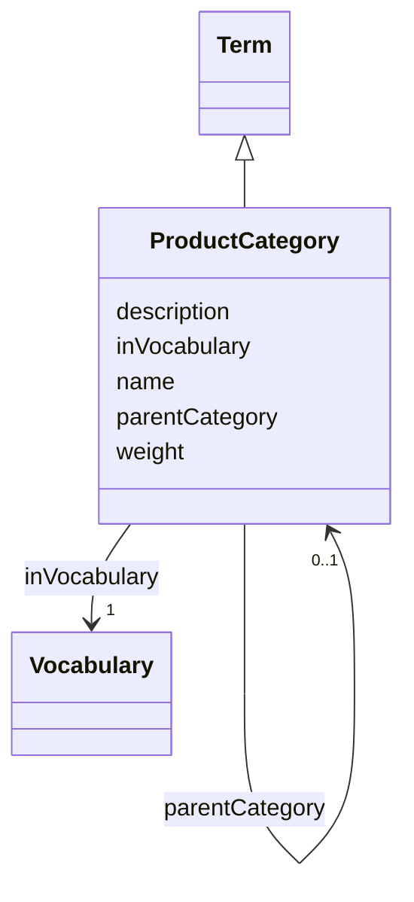

# Class: Product category (ProductCategory)


_A term used to classify a group of products that share common characteristics or functions, which helps in their organization_


URI: [EVORAO:ProductCategory](https://raw.githubusercontent.com/EVORA-project/evora-ontology/refs/heads/main/models/owl/evora_ontology.owl.ttl#ProductCategory)





## Inheritance
* [Nameable](Nameable.md)
    * [NamedDataset](NamedDataset.md)
        * [Term](Term.md)
            * **ProductCategory**


## Slots

| Name | Cardinality and Range | Description | Inheritance |
| ---  | --- | --- | --- |
| [parentCategory](parentCategory.md) | 0..1 <br/> [ProductCategory](ProductCategory.md) | An overarching category that encompasses the current category within a hierar... | direct |
| [weight](weight.md) | 1 <br/> [Integer](Integer.md) | A numerical value indicating relative importance or priority, generally proce... | [Term](Term.md) |
| [inVocabulary](inVocabulary.md) | 1 <br/> [Vocabulary](Vocabulary.md) | Terms belong to a specific vocabulary | [Term](Term.md) |
| [name](name.md) | 1 <br/> [String](String.md) | The label that allows humans to identify the current item | [Nameable](Nameable.md) |
| [description](description.md) | 0..1 _recommended_ <br/> [String](String.md) | A short explanation of the characteristics, features, or nature of the curren... | [Nameable](Nameable.md) |


## Usages

| used by | used in | type | used |
| ---  | --- | --- | --- |
| [ProductCategory](ProductCategory.md) | [parentCategory](parentCategory.md) | range | [ProductCategory](ProductCategory.md) |
| [ProductOrService](ProductOrService.md) | [category](category.md) | range | [ProductCategory](ProductCategory.md) |
| [ProductOrService](ProductOrService.md) | [additionalCategory](additionalCategory.md) | range | [ProductCategory](ProductCategory.md) |
| [Service](Service.md) | [category](category.md) | range | [ProductCategory](ProductCategory.md) |
| [Service](Service.md) | [additionalCategory](additionalCategory.md) | range | [ProductCategory](ProductCategory.md) |
| [Product](Product.md) | [category](category.md) | range | [ProductCategory](ProductCategory.md) |
| [Product](Product.md) | [additionalCategory](additionalCategory.md) | range | [ProductCategory](ProductCategory.md) |
| [Antibody](Antibody.md) | [category](category.md) | range | [ProductCategory](ProductCategory.md) |
| [Antibody](Antibody.md) | [additionalCategory](additionalCategory.md) | range | [ProductCategory](ProductCategory.md) |
| [Hybridoma](Hybridoma.md) | [category](category.md) | range | [ProductCategory](ProductCategory.md) |
| [Hybridoma](Hybridoma.md) | [additionalCategory](additionalCategory.md) | range | [ProductCategory](ProductCategory.md) |
| [Protein](Protein.md) | [category](category.md) | range | [ProductCategory](ProductCategory.md) |
| [Protein](Protein.md) | [additionalCategory](additionalCategory.md) | range | [ProductCategory](ProductCategory.md) |
| [NucleicAcid](NucleicAcid.md) | [category](category.md) | range | [ProductCategory](ProductCategory.md) |
| [NucleicAcid](NucleicAcid.md) | [additionalCategory](additionalCategory.md) | range | [ProductCategory](ProductCategory.md) |
| [DetectionKit](DetectionKit.md) | [category](category.md) | range | [ProductCategory](ProductCategory.md) |
| [DetectionKit](DetectionKit.md) | [additionalCategory](additionalCategory.md) | range | [ProductCategory](ProductCategory.md) |
| [Bundle](Bundle.md) | [category](category.md) | range | [ProductCategory](ProductCategory.md) |
| [Bundle](Bundle.md) | [additionalCategory](additionalCategory.md) | range | [ProductCategory](ProductCategory.md) |
| [Pathogen](Pathogen.md) | [category](category.md) | range | [ProductCategory](ProductCategory.md) |
| [Pathogen](Pathogen.md) | [additionalCategory](additionalCategory.md) | range | [ProductCategory](ProductCategory.md) |
| [Virus](Virus.md) | [category](category.md) | range | [ProductCategory](ProductCategory.md) |
| [Virus](Virus.md) | [additionalCategory](additionalCategory.md) | range | [ProductCategory](ProductCategory.md) |
| [Bacterium](Bacterium.md) | [category](category.md) | range | [ProductCategory](ProductCategory.md) |
| [Bacterium](Bacterium.md) | [additionalCategory](additionalCategory.md) | range | [ProductCategory](ProductCategory.md) |
| [Fungus](Fungus.md) | [category](category.md) | range | [ProductCategory](ProductCategory.md) |
| [Fungus](Fungus.md) | [additionalCategory](additionalCategory.md) | range | [ProductCategory](ProductCategory.md) |
| [Protozoan](Protozoan.md) | [category](category.md) | range | [ProductCategory](ProductCategory.md) |
| [Protozoan](Protozoan.md) | [additionalCategory](additionalCategory.md) | range | [ProductCategory](ProductCategory.md) |
| [Viroid](Viroid.md) | [category](category.md) | range | [ProductCategory](ProductCategory.md) |
| [Viroid](Viroid.md) | [additionalCategory](additionalCategory.md) | range | [ProductCategory](ProductCategory.md) |
| [Prion](Prion.md) | [category](category.md) | range | [ProductCategory](ProductCategory.md) |
| [Prion](Prion.md) | [additionalCategory](additionalCategory.md) | range | [ProductCategory](ProductCategory.md) |


## Identifier and Mapping Information


### Schema Source


* from schema: https://raw.githubusercontent.com/EVORA-project/evora-ontology/refs/heads/main/models/owl/evora_ontology.owl.ttl#


## Mappings

| Mapping Type | Mapped Value |
| ---  | ---  |
| self | EVORAO:ProductCategory |
| native | EVORAO:ProductCategory |
| close | wd:Q63981612 |


## LinkML Source

<!-- TODO: investigate https://stackoverflow.com/questions/37606292/how-to-create-tabbed-code-blocks-in-mkdocs-or-sphinx -->

### Direct

<details>
```yaml
name: ProductCategory
description: A term used to classify a group of products that share common characteristics
  or functions, which helps in their organization
title: Product category
from_schema: https://raw.githubusercontent.com/EVORA-project/evora-ontology/refs/heads/main/models/owl/evora_ontology.owl.ttl#
close_mappings:
- wd:Q63981612
is_a: Term
slots:
- parentCategory
slot_usage:
  parentCategory:
    name: parentCategory
    description: An overarching category that encompasses the current category within
      a hierarchical classification system. It serves as the top-level classification,
      organizing related subcategories under its umbrella to create a structured and
      logical order.
    title: parent category
    range: ProductCategory
    required: false
    multivalued: false

```
</details>

### Induced

<details>
```yaml
name: ProductCategory
description: A term used to classify a group of products that share common characteristics
  or functions, which helps in their organization
title: Product category
from_schema: https://raw.githubusercontent.com/EVORA-project/evora-ontology/refs/heads/main/models/owl/evora_ontology.owl.ttl#
close_mappings:
- wd:Q63981612
is_a: Term
slot_usage:
  parentCategory:
    name: parentCategory
    description: An overarching category that encompasses the current category within
      a hierarchical classification system. It serves as the top-level classification,
      organizing related subcategories under its umbrella to create a structured and
      logical order.
    title: parent category
    range: ProductCategory
    required: false
    multivalued: false
attributes:
  parentCategory:
    name: parentCategory
    description: An overarching category that encompasses the current category within
      a hierarchical classification system. It serves as the top-level classification,
      organizing related subcategories under its umbrella to create a structured and
      logical order.
    title: parent category
    from_schema: https://raw.githubusercontent.com/EVORA-project/evora-ontology/refs/heads/main/models/owl/evora_ontology.owl.ttl#
    rank: 1000
    alias: parentCategory
    owner: ProductCategory
    domain_of:
    - ProductCategory
    range: ProductCategory
    required: false
    multivalued: false
  weight:
    name: weight
    description: A numerical value indicating relative importance or priority, generally
      processed in ascending order. This weight helps prioritize content when organizing
      or processing data. Its value can be negative, with a default set to 0
    title: weight
    from_schema: https://raw.githubusercontent.com/EVORA-project/evora-ontology/refs/heads/main/models/owl/evora_ontology.owl.ttl#
    close_mappings:
    - adms:status
    rank: 1000
    ifabsent: int(0)
    alias: weight
    owner: ProductCategory
    domain_of:
    - DataProvider
    - Term
    range: integer
    required: true
    multivalued: false
  inVocabulary:
    name: inVocabulary
    description: Terms belong to a specific vocabulary
    title: in Vocabulary
    from_schema: https://raw.githubusercontent.com/EVORA-project/evora-ontology/refs/heads/main/models/owl/evora_ontology.owl.ttl#
    close_mappings:
    - wdp:P972
    rank: 1000
    alias: inVocabulary
    owner: ProductCategory
    domain_of:
    - Term
    range: Vocabulary
    required: true
    multivalued: false
  name:
    name: name
    description: The label that allows humans to identify the current item
    title: name
    comments:
    - 'The title of the item should be as short and descriptive as possible. E.g.
      for virus products it should basically be based on the following Pattern:

      "Virus name", "virus host type", "collection year", "country of collection"
      ex "suspected epidemiological origin", "genotype", "strain", "variant name or
      specific feature"'
    from_schema: https://raw.githubusercontent.com/EVORA-project/evora-ontology/refs/heads/main/models/owl/evora_ontology.owl.ttl#
    exact_mappings:
    - dct:title
    close_mappings:
    - rdfs:label
    rank: 1000
    alias: name
    owner: ProductCategory
    domain_of:
    - Nameable
    range: string
    required: true
    multivalued: false
  description:
    name: description
    description: A short explanation of the characteristics, features, or nature of
      the current item
    title: description
    comments:
    - 'Describe this item in few lines. This description will serve as a summary to
      present the item.

      '
    from_schema: https://raw.githubusercontent.com/EVORA-project/evora-ontology/refs/heads/main/models/owl/evora_ontology.owl.ttl#
    exact_mappings:
    - dct:description
    rank: 1000
    alias: description
    owner: ProductCategory
    domain_of:
    - Nameable
    range: string
    required: false
    recommended: true
    multivalued: false

```
</details>